# 锁定并删除不良培训数据

> 原文：<https://towardsdatascience.com/targeting-and-removing-bad-training-data-8ccdac5e7cc3?source=collection_archive---------9----------------------->

## [实践教程](https://towardsdatascience.com/tagged/hands-on-tutorials)，[用 fast.ai 对宠物安全植物进行分类](https://towardsdatascience.com/tagged/petsafe-plants-fastai)

## 糟糕的形象阻碍了我们吗？

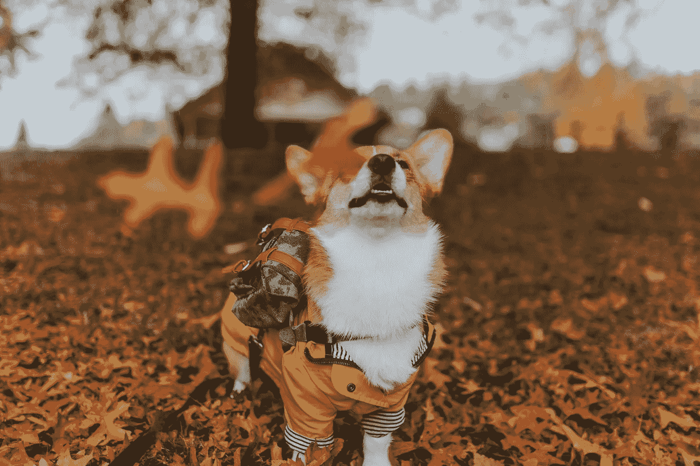

照片由[科尔·凯斯特](https://unsplash.com/@coleito)从 [Unsplash](https://unsplash.com) 拍摄。

在[第 1 部分:建立一个图像数据库](https://kenichinakanishi.medium.com/creating-a-plant-pet-toxicity-classifier-a29587f3f04c)中，我们已经在网上搜集了关于植物及其对宠物的毒性的信息，对照第二个数据库交叉引用了这些字段，然后最终通过 Google Images 下载了每个类别的独特图像。

在[第 2 部分:利用受控随机性进行训练](https://kenichinakanishi.medium.com/creating-a-plant-pet-toxicity-classifier-13b8ba6289e6)中，我们使用新的 fast.ai 框架训练神经网络，以基于图片识别植物的种类。我们实现了一种在 NumPy、PyTorch 和 random 包中播种随机性的方法，以及在单独的训练运行中将图像标记为训练或验证样本的灵活方法。这有助于我们更公平地比较改变分类器其他方面的影响。

因为我们发现，我们的许多图像对我们的分类器的准确性有不利影响，因为我们的谷歌图像搜索结果的相关性越来越小，出现了像图画、图表和事实表这样的东西。这些将坏的训练样本放入我们的池中，使我们的模型在做我们想要它做的事情方面更差(根据自然照片对植物进行分类。)我们希望删除这些文件，但是手动检查 500 多个文件夹中的 150 个文件是一项非常艰巨的任务。用代码自动完成这项任务或者集中于最后的手工清理是一种更明智的做法。

> **此处的主要目标将是检查我们如何能够尝试专门针对不利于训练的图像(例如，错误标记或类的坏例子)。)并测量它们的去除对整体训练准确度的影响。**

所有相关代码都可以在我的 [Github repo](https://github.com/kenichinakanishi/houseplant_classifier) 中找到。

# 目录

1.  [用 fast.ai 分类解释](https://medium.com/p/8ccdac5e7cc3#207f)
2.  [使用光学字符识别进行过滤](https://medium.com/p/8ccdac5e7cc3#26dd)
3.  [使用色调分布过滤](https://medium.com/p/8ccdac5e7cc3#eb3f)
4.  [自动清理图像](https://medium.com/p/8ccdac5e7cc3#1570)
5.  [手动清理和训练结果](https://medium.com/p/8ccdac5e7cc3#1021)

# 1.利用 fast.ai 进行分类解释

fast.ai 内置了一系列有用的解释方法，用于分类问题，例如我们正在处理的问题。为了使用它们，我们首先重新创建一个学习者，并在使用`ClassificationInterpretation.from_learner`准备解释类之前加载我们想要查看的保存状态。

这里我们使用一个在[第 2 部分:可控随机性训练](/creating-a-plant-pet-toxicity-classifier-13b8ba6289e6)中创建和训练的学习器，它接受整个数据集，每个类 150 张图像。

准备口译。

fast.ai 为我们提供了一种简单的方法，现在可以用`interp.plot_confusion_matrix()`生成混淆矩阵，或者用`interp.most_confused()`查看最常相互混淆的类。然而，有这么多的类(这里我们有超过 500 个类)，由于 RAM 的限制，我们会使试图生成如此密集的混淆矩阵的内核崩溃。幸运的是，fast.ai 有一个有用的`interp.plot_top_losses()`功能，可以向我们展示一些最让模型吃惊的图像(导致最大的损失)。

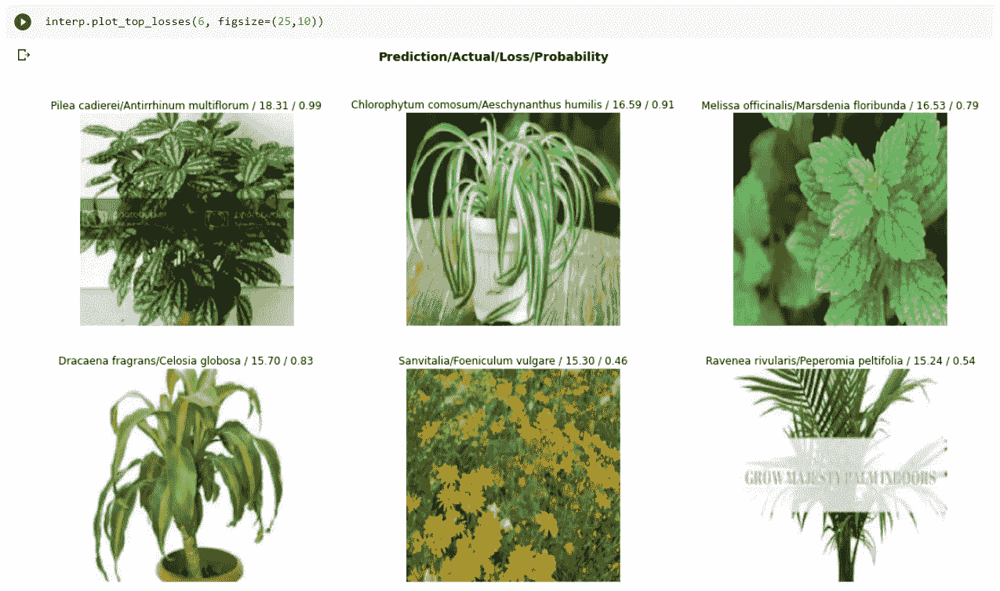

plot_top_losses 向我们展示了学习者最自信的错误。从谷歌图片中抓取这些图片，大多数时候是因为图片标签不正确。

我们可以看到，这些图像标签中有许多是不正确的，这表明数据集的一个主要问题是图像的错误标签。详细说明每个类别的 F1 分数的分类报告可以帮助我们识别模型正在努力解决的类别。

使用`interp.print_classification_report()`将打印出分类报告。为了操作数据，我们应该用 Jupyter 的魔法命令拦截它，并将输入读回到数据帧中进行解释。

捕获分类报告的输出。

将捕获的输出分配给一个变量，并解析成一个数据帧。

有了这个`class_report`数据框，我们可以一目了然地看到哪个班级的问题最多，并且可以更仔细地查看其文件夹中的图像。

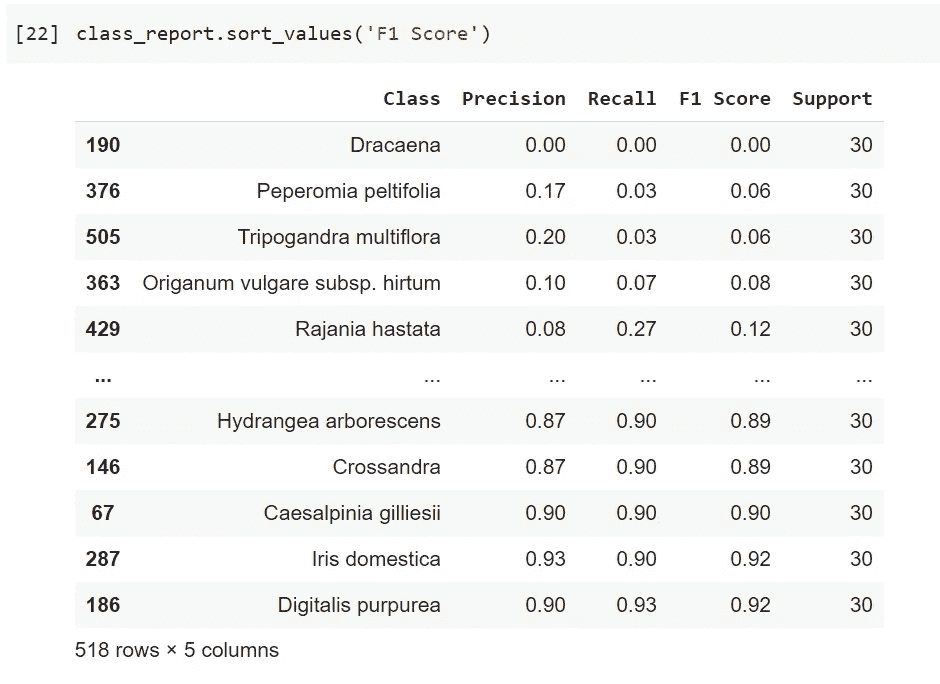

按 F1 分数排序的班级。

绘制 F1 分数如何变化的图表也可以让我们了解这个问题的规模。

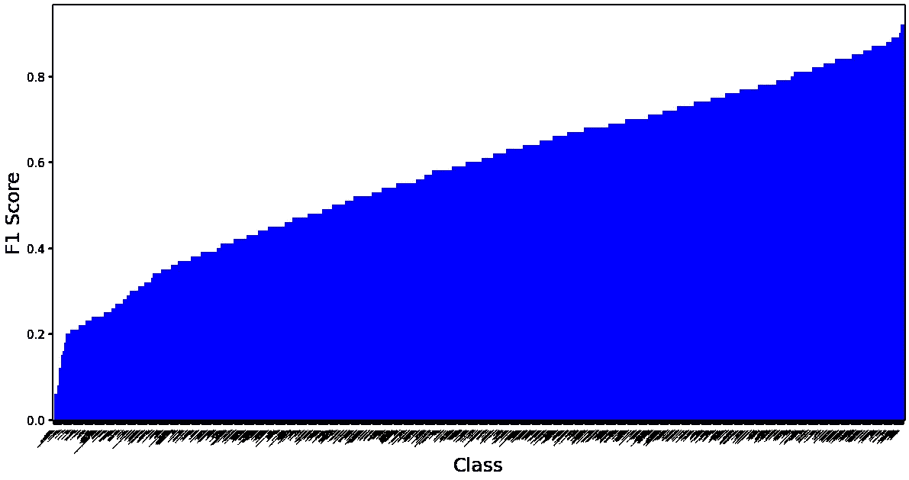

500 多个级别中每个级别的 F1 分数差异。

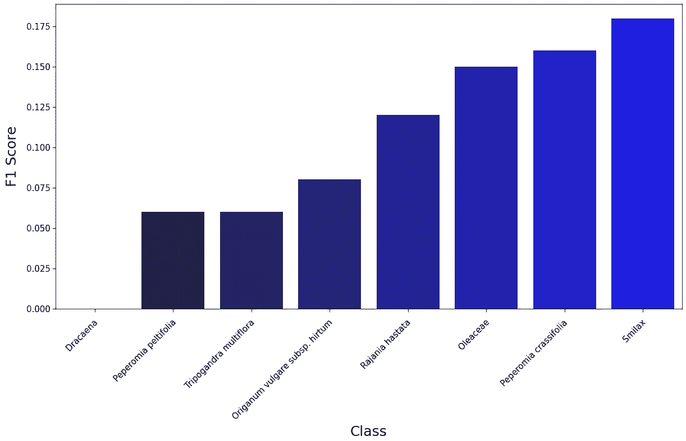

8 个最低得分等级的 F1 得分变化。

有趣的是，大约 8 个班级的 F1 分数急剧下降。让我们快速查看一个图像文件夹，以评估在训练分类器时哪些类型的图像可能会导致这些问题。

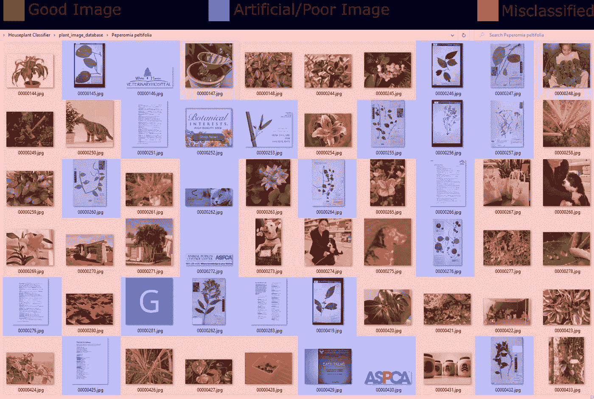

Peperomia peltifolia 班级的最后 60 幅图像样本，该班级是 F1 分数最差的班级之一。

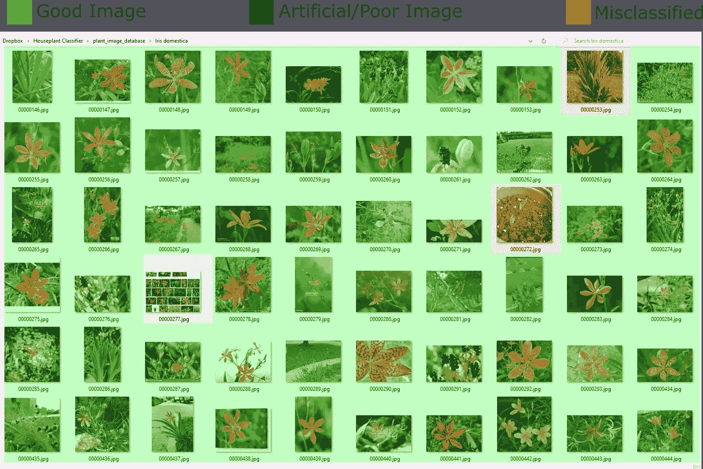

来自 Iris domestica 班级(F1 分数最高的班级)的最后 60 幅图像的样本。

本质上，我们寻找的是与我们想象的用户用来识别特定植物的图像类型有显著差异的图像。在 *Peperomia peltifolia* 文件夹中的图像中散布着许多带有人工成分的图像(文本和/或图纸)以及许多分类错误或不相关的图像(科学图纸、种子样本)。这是由于谷歌图片搜索结果的相关性下降，因为越来越多的图片是从一个单一的查询中收集的。自然拥有更多可用搜索结果的类别较少受到这种趋势的影响(见 *Iris domestica* 图片)。

基于这一调查，我们可以得出两点结论:

1.  **错误分类的图像是最大损失的来源。这并不令人惊讶，需要进一步关注。每个班级的 F1 分数稍后会给我们一个好主意，让我们知道该看哪些文件夹。**
2.  **人工图像是不好的训练样本，应该过滤掉。**这些种类的图像与我们想象的用户用来识别给定植物的图像种类有本质上的不同。

让我们首先尝试用一些自动化过程来解决第二个问题。

# 2.使用光学字符识别进行过滤

第一步过滤将使用光学字符识别(OCR)来尝试在我们的每个文档中查找文本。考虑到最有可能出现的文本与图像所呈现的植物名称有关，文本可能会出现某种形式的数据泄漏。除此之外，在我们想象的用例中(从自然图片中识别植物)，文本不太可能出现在任何图像中。

Tesseract 是 OCR 可用的开源软件，易于实现。在这里，我们使用它们的`image_to_string`功能来检查用枕头打开后的图像。因为我们稍后需要查看整个图像文件夹，所以我们添加了一个简单的子句，告诉函数在返回找到的文本(如果有的话)之前，是否需要使用 Pillow 来打开图像。

> 在配置 Tesseract 时，PSM 会参考页面分割模式，该模式会影响 Tesseract 如何将图像分割成文本和文字行。我们在这里使用全自动分段(- psm 3)和默认的 OCR 引擎模式(- oem 3)。

由于许多图像沿框架的顶部或底部边缘包含一些文本，我们希望能够裁剪图像并重新检查文本是否仍然存在，从而使我们能够保留尽可能多的图像。如果失败，我们将简单地从数据集中删除图像(从而删除坏的训练示例)。

按图像总大小的给定百分比裁剪图像的顶部和底部。

现在，我们将`optical_character_recognition`和`crop_image`函数合并成一个函数，我们可以用它来遍历一个图像文件夹来搜索文本，并有选择地尝试裁剪(这里是 10%)图像的顶部和底部，看看这是否会删除文本，如果成功，则替换图像。因此，我们可以直接编辑和保留任何图像，只需少量的裁剪就可以轻松修复。

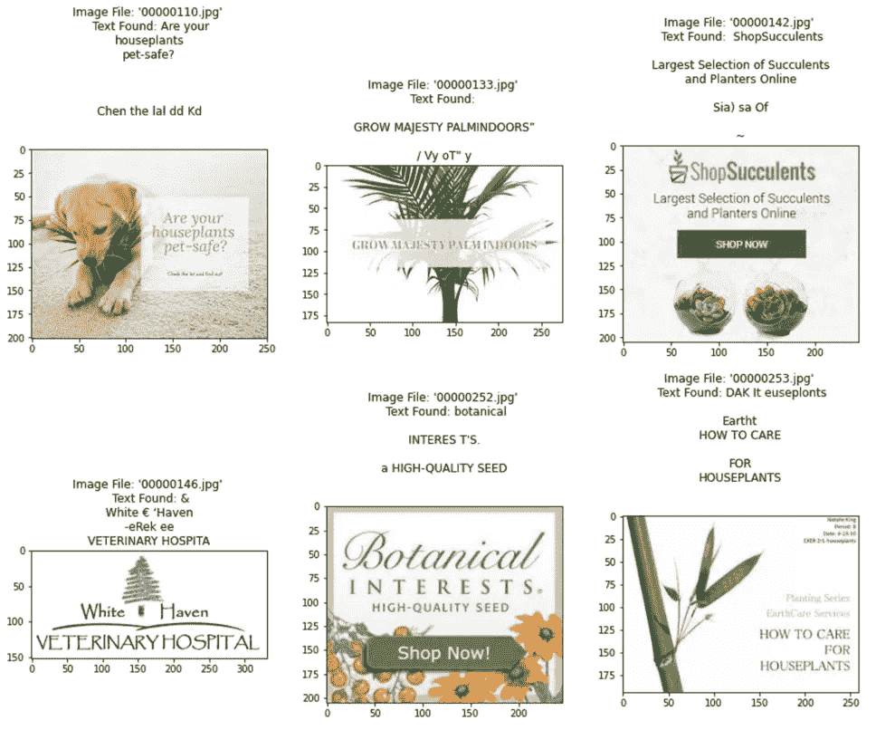

使用 PyTesseract OCR 在 Peperomia Peltifolia 文件夹上找到的示例图像和相关文本。这些图像可以被过滤掉，以改善我们的分类器的结果。

在这一阶段，我们将 OCR 过程的结果保存到数据帧中，供以后检查和处理。这样做是因为虽然过滤器捕捉到的许多图像可以被过滤掉而没有太大的后果，但是由于树叶、树枝和/或空白的排列，有大量完全没有文本的图像呈现为假阳性。

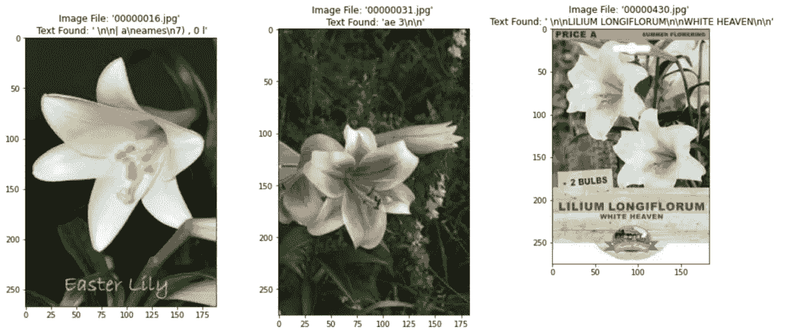

真阳性、假阳性和可裁剪图像的例子。

不幸的是，使用 OCR 检查图像没有考虑到图像在其他方面是人工的，这导致我们分析色调分布。

# 3.使用色调分布过滤

每幅图像都由许多色调组成，这些色调可以在一系列色调和亮度之间变化。我们可以利用这一点来创建关于每个图像色调分布的量化指标，并尝试识别图像之间不利于训练分类器的任何共性。

首先，让我们来看看神经网络将如何“看到”我们的图像。我们可以用 PIL 展开一幅图像，并把它转换成张量。

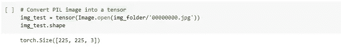

这表明每个图像只是一个单一的张量，有三个通道——红色、蓝色和绿色，按此顺序存储。我们可以分离出一个通道，并通过将其转换为彩色数据帧来进一步观察:

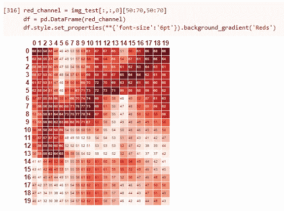

沿着这一思路思考，我们可以识别出具有大块颜色且变化很小的图像，就像通常在具有人工创建的元素(如文本或图画)的图像中看到的那样。让我们通过获取图像中每个像素的色调和亮度(从转换到 HLS)并绘制 z 轴作为给定(色调和亮度)对中存在的像素总数来准备一些图像统计图。

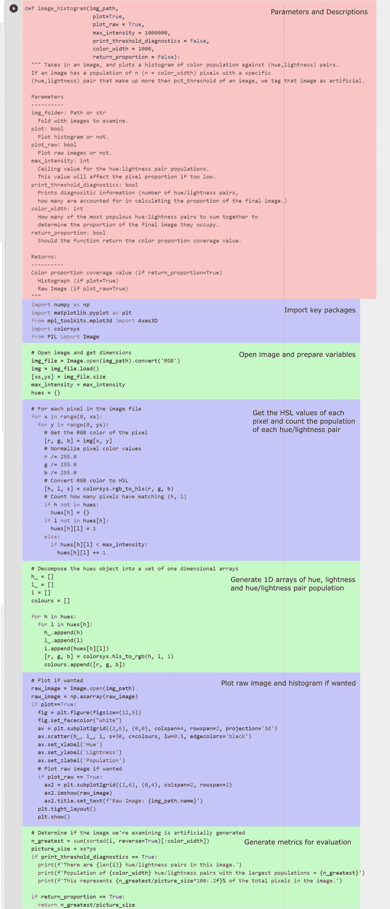

[从像素 HSL 值生成图像直方图的代码。](https://gist.github.com/kenichinakanishi/4327cff12ddc51f44903c07f384ce8d0)

使用上面的`image_histogram`函数，我们可以检查每张图像的色调分布，并沿着每张原始图像绘制出来。直方图显示了具有给定色调/亮度对的每个像素的数量。例如，在下图中，我们可以看到直方图中最密集的像素是较浅的绿色和黄色，这在真实图像中得到了很好的反映。

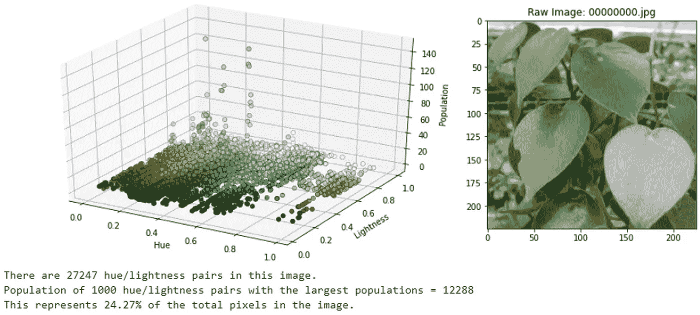

色调和亮度值均匀分布的自然照片。

总的来说，我们看到自然的照片在像素与像素之间的色调和亮度上会有细微的抖动，这些抖动被捕捉并编码到图像中。这导致色调-明度群体更加平坦且分布更加均匀，具有相对较大数量的色调-明度配对(大约 2 万到 3 万)。

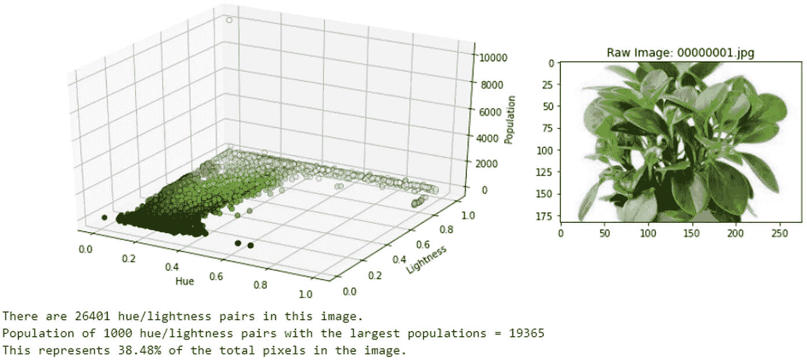

即使在拥有人工增白背景的自然图像中，色调-明度群体也是均匀分布的。

尽管这些图像看起来主要是绿色，但自然照片中细微的颜色变化会阻止任何特定的颜色阴影代表太大比例的像素。在上面的图像中，1000 个最密集(最强烈)的色调-亮度配对代表不到 40%的图像，即使在具有人工增白背景的图像中也是如此。

另一方面，当用颜色填充一个区域时，具有计算机生成元素的图像特别挑选出色调-明度对，导致给定色调-明度对的人为高群体密度。此外，人工图像可能只包含 1000 个独特的色调-亮度配对，与自然图像中常见的 2 万到 3 万个相差甚远。

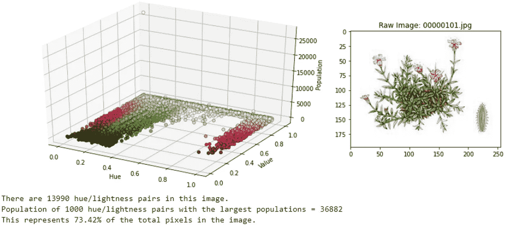

一个人工图像，即使有一个梯度，将拥有相当少的变化，色调和亮度。

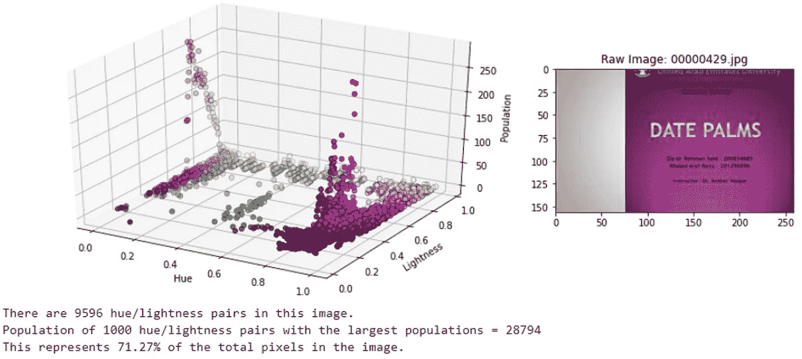

绘画也一样，在色调和亮度上显示较少的变化。

`image_histogram`函数还计算一些简单的度量，我们可以使用这些度量稍后将图像标记为人工的(用于检查和稍后的移除)。也就是说，我们计算存在的色调-明度配对的数量，取一些(`color_width`)最多的配对，并计算它们所代表的图像的比例。从上面可以看出，那些具有人工成分的图像将有较大比例的图像由相对较少的色调/亮度对组成。让我们利用这一特性将图像标记为具有人工颜色分布！

这里的关键参数是`color_width`和`threshold`。如果给定的数量(`color_width`)最密集的色调/亮度配对代表整个图像的超过`threshold`的比例，我们将该图像标记为在由该函数返回的数据帧中具有人工颜色分布。基于我们数据集的经验实验，我们使用 1000 对和 70%的阈值来检测人工图像，但这些值将根据您正在处理的图像类型而变化。

# 4.自动化图像清理

## 4.1.标记图像

现在我们有了一些有用的指标(文本的存在和色调分布)，可以用来判断一幅图像是否是人工的。

结合 OCR 和色调分布分析来标记人工图像。

该功能旨在做两件事:

**如果没有检测到文本:**如果给定数量(`color_width`)最密集的色调/亮度配对代表整个图像的超过`threshold`比例，即具有过浅的色调分布，则将图像标记为具有人为色调分布。这里我们用的是`color_width` =1000 对和一个 70% `threshold`。

**如果检测到文本:**如前所述，仅使用 OCR 来识别不良训练样本的主要问题是经常出现误报。为了过滤掉这些，我们使用`find_artifical_colors`函数来准备一个数据帧，该数据帧包含由所有图像的`color_width`最密集的色调/亮度对所表示的像素比例(通过将`return_all`设置为真)。然后我们运行`find_artifical_text`并将结果内部连接到一个包含颜色比例数据的数据帧中。

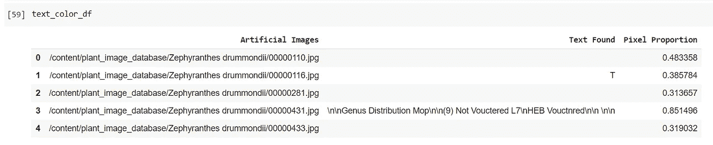

内联`find_artifical_colors and find_artifical_text.`输出的结果

这使我们能够根据颜色比例对这些图像进行阈值处理，与那些没有文本的图像处于不同的级别。直观上，与添加了文本的图像(通常具有单一字体颜色)相比，错误检测到文本的图像将具有明显更分散的色调分布。在经验实验之后，我们得出一个 50%的阈值水平，这个水平可以很好地从我们的`find_artifical_text`函数中去除任何假阳性。然后，假设检测到文本，在图像被标记为人工之前，我们需要一个较低的 50%的`text_threshold`。这允许自然图像逃脱标记，同时仍然捕获大多数具有文本的图像。这里使用的`text_threshold`将决定我们在试图剔除误报时有多积极。

以下是(a)来自 OCR 的不再被过滤掉的假阳性，和(b)真阳性的例子，都来自于 *Zephyranthes drummondii* 图像的文件夹。

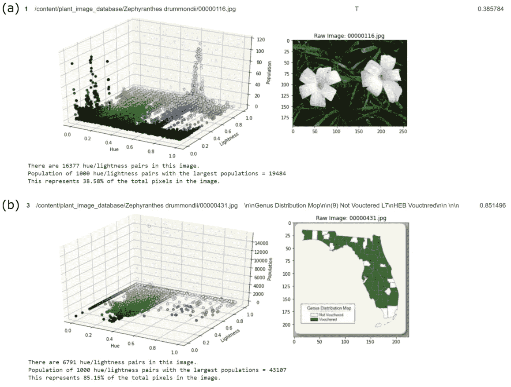

西风东渐的光学字符识别结果。(A)错误地检测到字母 T 的假阳性。(b)真正的阳性。

## 4.2.删除图像

现在我们已经选择了图像标记的参数，我们可以遍历每个文件夹，找到人造图像并使用`Path.unlink()`删除它们。

# 4.用自动清理的数据集训练我们的分类器

现在，我们可以使用本系列第 2 部分中准备的学习器将我们的新数据集与原始数据集进行比较:[可控随机性训练](/creating-a-plant-pet-toxicity-classifier-13b8ba6289e6)。在使用导入并使用所讨论的代码创建学习器之后，我们可以比较训练的结果，同时保持来自训练/验证、图像增强和批处理的随机性不变。

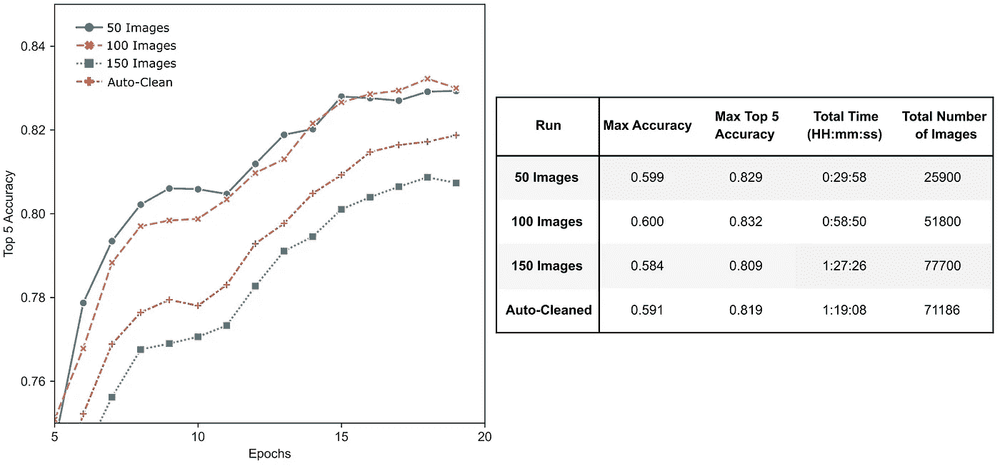

使用不同数量的图像比较训练的准确性。

在这里，我们看到这里详细描述的自动图像清理过程已经从数据集中移除了 6000 多幅图像，将前 5 名的精度从 0.809 提高到 0.819。这表明我们确实(大体上)移除了作为每个类的差训练样本的图像。但是，结果仍然比简单地使用数据集中的前 50 或 100 幅图像要差！

检查 F1 分数在所有班级的分布揭示了一些有趣的事情。虽然 F1 分数总体上有所提高，但 F1 分数最低的班级实际上表现不如以前。

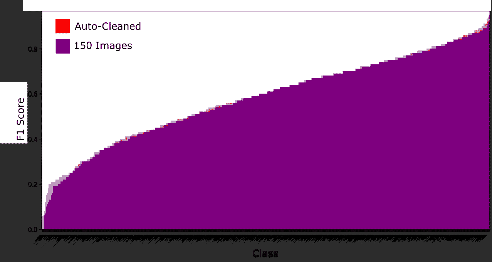

比较所有班级 F1 分数的变化。

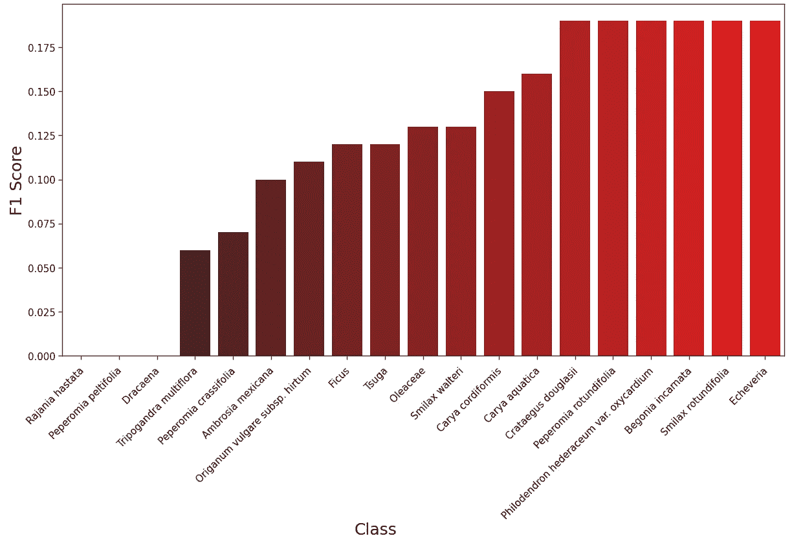

在自动清理不良训练示例后 F1 分数最低的类。请注意，Peperomia peltifolia 的 F1 得分已经下降到 0，而它以前是 0.06。

让我们仔细看看 *Peperomia peltifolia* 文件夹，弄清楚到底是怎么回事。

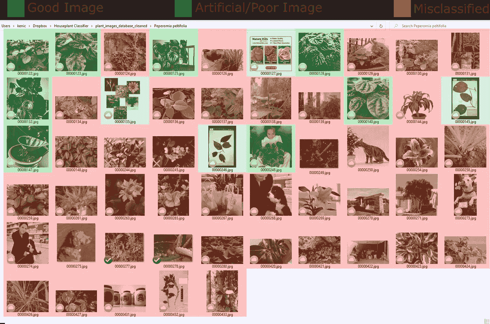

自动清理后 Peperomia peltifolia 类的最后 55 幅图像的样本。大多数人工/差的图像已经被自动去除，而许多错误分类的图像仍然存在。

看起来清理过程进行得相对较好，大多数图像是人为的/不良的训练样本，已经从文件夹中删除。然而，该过程不能识别和移除任何错误分类的图像。这导致该类别的 F1 分数总体降低，因为被移除的图像实际上具有许多相似性，而许多剩余的图像被错误分类并且具有很少或没有相似性。

在这一点上，提高我们的准确性的最好方法是通过一点点手动清理来专注于移除这些错误分类的图像。

# 5.手动清理和训练结果

我们不想为了删除分类错误的图片而查看每个文件夹。解决这个问题的更有效的方法是将我们的努力集中在问题最多的班级上。正如我们在这篇文章的第一部分所探讨的那样(用 fast.ai 进行[分类解释)，我们可以通过查看总体最高损失以及 F1 分数最低的类别来做到这一点。通过打开这些文件夹并删除我们认为是错误分类或较差训练样本的图像，我们可以快速提高分类器的性能。](https://medium.com/p/8ccdac5e7cc3#207f)

我已经使用这种方法执行了许多手动清理步骤，然后每次都将这些数据集输入到相同的训练过程中，以查看我们的分类器如何改进。

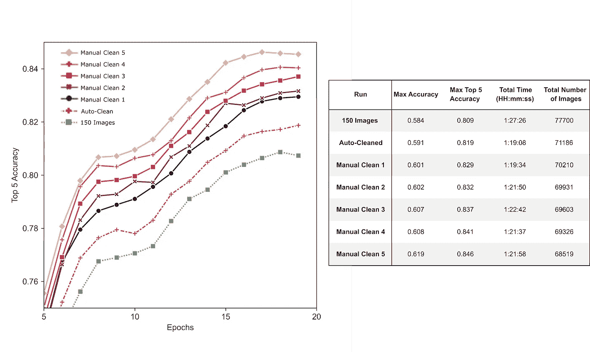

经过几个手动清洗步骤后，分类准确度有所提高。

正如我们所看到的，每次我们删除几百张图像时，我们的分类器的性能都会显著提高，尽管每次只删除总数据集的 0.5%左右。

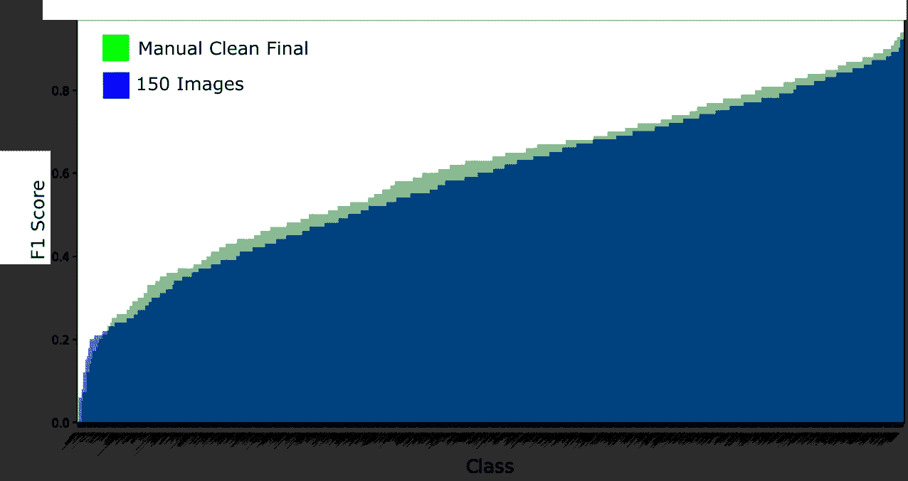

经过多轮手动图像清理后 F1 分数的最终分布。

检查 F1 分数的分布表明，F1 分数总体上有所提高，同样，分布末端的几个班级除外。

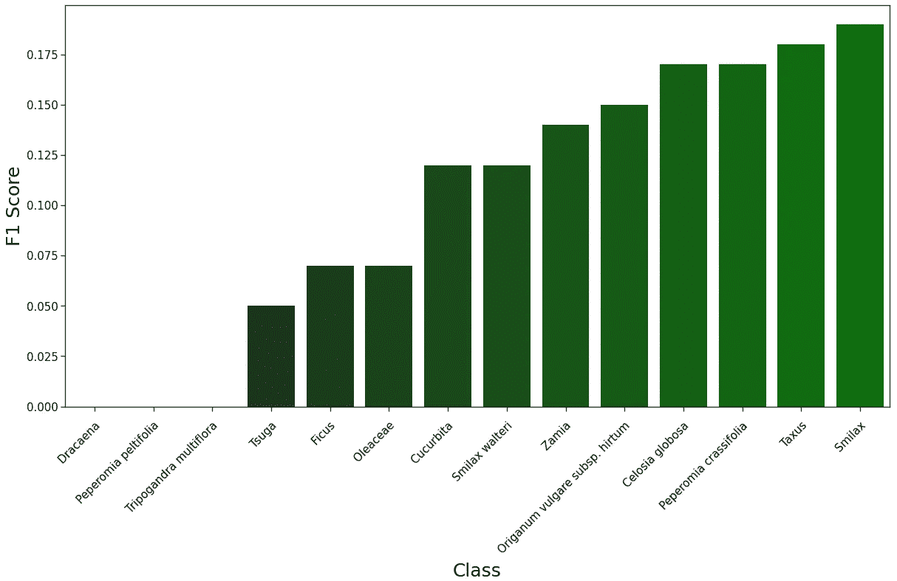

然而，一些班级的 F1 分数仍然很低。

这些分类是最难分类的，因为它们通常指的是更高的分类(*龙血树*对*香龙血树*)或非常具体的物种(*盾叶胡椒树*对*胡椒树*)。我们可以寻求改善这些类的性能的一种方法是出去专门为每个类收集高质量的训练图像，以使网络更容易区分相似的物种。目前，这不会影响我们对给定植物物种的毒性进行分类的目标，所以我们现在不会太担心它。

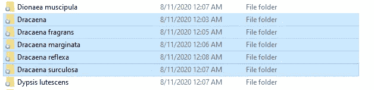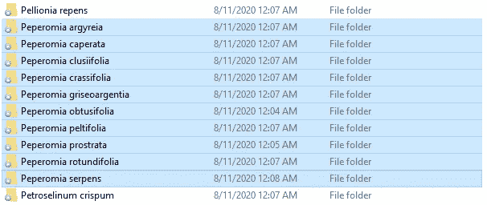

太好了！我们使用基线架构(ResNet34)通过自动(使用 OCR 和色调分布分析)和指导手动方式清理数据集，改善了训练结果。

接下来，我们将使用这个精炼的数据集，并基于我们在[第 2 部分:受控随机性训练](/creating-a-plant-pet-toxicity-classifier-13b8ba6289e6)中创建的学习者。请尽快加入我的[第 4 部分:探索 fast.ai 中的卷积神经网络架构](https://kenichinakanishi.medium.com/exploring-convolutional-neural-network-architectures-with-fast-ai-de4757eeeebf)，我们将比较网络架构变化的原因、方式和影响。