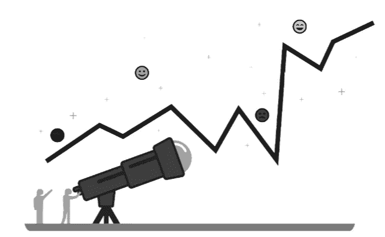
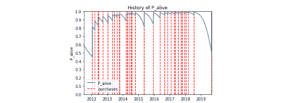
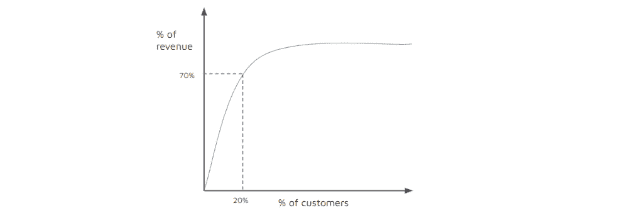

# 塔罗牌，水晶球和算命先生？当你预测成功时，你需要的只是终生价值。

> 原文：<https://towardsdatascience.com/tarot-cards-crystal-balls-and-fortune-tellers-c997c2e32c3a?source=collection_archive---------65----------------------->

资料来源:FAVPNG

## 我们的客户将来会花多少钱？在本文中，我们使用预测模型来了解未来的客户行为。

# 摘要

*   在使用 [RFM 评分](https://medium.com/@surajpabari/you-thought-finding-toilet-paper-was-hard-how-about-finding-your-most-valuable-customers-part-1-2c0f6aaf786d)对我们的客户进行细分和[获得巨大的结果](https://medium.com/@surajpabari/how-lifetime-value-is-like-a-relationship-you-live-you-learn-you-grow-d681b7830cb2)之后，我们可能想要建立一个更复杂的模型来超越“分数”,并在对我们的客户进行细分时获得更精细的数据点。
*   为了做到这一点，我们可以建立一个预测模型来提供更完整的客户终身价值视图，使用历史客户行为来预测预期购买量、预期订单价值、总支出和流失可能性。
*   这些数据可用于细分我们的客户，我们可以针对每个细分市场优化我们的战略，以推动长期收入增长
*   我们还可以建立模型来了解某些客户属性(如年龄、性别、购买的产品)和网站行为(来源、在网站上的时间、访问的页面)如何影响客户价值，从而使我们能够调整我们的战略，更多地关注可能具有更高终身价值的客户。
*   这个数据也可以用来预测新客户的 LTV。

# 语境

如果你到目前为止一直在关注这个系列([第一部分](https://medium.com/@surajpabari/you-thought-finding-toilet-paper-was-hard-how-about-finding-your-most-valuable-customers-part-1-2c0f6aaf786d)和[第二部分](https://medium.com/@surajpabari/how-lifetime-value-is-like-a-relationship-you-live-you-learn-you-grow-d681b7830cb2))，你应该了解衡量生命价值的重要性，你甚至可能已经尝试过为自己的企业计算 RFM 分数。现在，您已经为 LTV 之旅的下一阶段做好了准备:构建预测模型。然而，在你进入本质之前，记住“大的闪亮的东西”的问题。当考虑构建一个更复杂的模型时，重要的是确定并同意您可以使用该模型采取的关键行动，每个行动都应该对核心业务 KPI 产生影响。模型/报告不是项目的输出，而只是达到目的的一种手段。

# 构建预测生命周期价值模型

让我们假设你已经完成了[基本的 RFM 分割](https://www.linkedin.com/pulse/you-thought-finding-toilet-paper-hard-how-your-most-valuable-pabari/)，并且发现这个模型有点限制性。例如，您会注意到购买超过五次的客户更有可能再次购买，但购买少于五件商品的客户永远不会再次购买，并且该模型没有考虑这些细微差别。在这种情况下，你可能需要寻找你友好的邻居数据伙伴，这样你就可以找到一种方法来获得对未来支出的更准确预测。

我们上周讨论的 RFM 模型是历史模型的一个例子。它假设如果某人在过去有很高的近期价值、频率和货币价值，他们在未来也会有很高的价值，这在很多情况下是一个很好的代理。但是，wt 为什么不具体建模 R、F、M 如何影响客户价值？这就是预测模型发挥作用的地方。为了开发这些模型，我们查看了客户行为的历史数据，并对近期、频率和货币价值如何影响该期间的总体客户支出进行了建模，并使用这些数据来预测未来的终身价值。与构建宽泛的 R、F 和 M 桶相比，这提供了对未来客户价值的更准确理解，因为它考虑了特定的业务细微差别。

为了建立这个模型，我们从生存曲线开始。这种类型的曲线在历史上被用于生物学，预测病毒随时间存活的可能性，但我们将使用它来了解客户在一段时间内与您的企业保持联系的可能性。下面的曲线是单个客户的生存曲线示例，y 轴代表客户“活着”的可能性，垂直线代表客户购买。当顾客进行购买时，他们活着的可能性增加到 100%，然后随着时间的推移而减少，直到他们进行另一次购买；请注意，随着每次额外购买，这种可能性以较慢的速度下降(梯度不太陡),因为假设他们的忠诚度在增加。

*图 6:生存曲线*

为了建立这个模型，我们还需要建立一个“负二项分布”曲线模型(NBD ),以预测客户可能的购买数量。当我们将预期购买量乘以平均订单价值的估计值时，我们得到了 LTV:我们预测客户在给定时间段内将花费的金额。一旦你有了 LTV，你就可以画出这条美丽的曲线，这一定会给你的团队留下深刻印象。它告诉我们，20%的客户创造了 70%的未来收入。再一次，我们必须记得问:从这种洞察力中我们能采取什么行动？

*图 7:显示客户和 LTV 分布的 LTV 曲线*

# 利用预测模型细分您的客户

使用您的奇特模型，您现在有了一组新的数据点:预期购买量、预期订单价值以及最重要的预测 LTV。该模型还将输出另一个称为 P(Alive)的指标，显示客户流失的概率。您可以采取的措施与[上一篇文章](https://www.linkedin.com/pulse/how-lifetime-value-like-relationship-you-live-learn-grow-suraj-pabari/)中提到的措施相同:将数据分段！然而，现在您可以有一个更准确的数据集来用于您的细分:例如，您可以创建一个消费超过 200 美元的高 LTV 客户群。或者，您可以使用 P(存活)指标来划分“高风险客户”,即具有中高 LTV 和高 P(存活)的客户。在整个过程中，将这些行动放在首位，因为模型不会推动结果，但数据驱动的行动会！

# 了解哪些特性推动高生命周期价值

最后一个想法真的让橡胶上路了…

假设您知道客户的 LTV，但现在您想更多地了解不同的客户。他们年纪大还是小？男的还是女的？他们第一次购买时是买电子产品还是化妆品？根据这些见解，你可能会采取什么行动？想象一下，你知道购买电子产品的客户可能是高价值客户。你可以瞄准电子网站，花更多的钱为电子产品做广告。，知道这些客户从长远来看很可能会花更多的钱。

这就是您的数据合作伙伴再次发挥作用的地方。他们将以符合隐私的方式聚合所有数据，一边是功能，另一边是终身价值。例如，我们知道，一个 25 岁的男性第一次买了一个胡须修剪器，他的 LTV 很高。但是一个 55 岁的女性购买化妆品的 LTV 值很低。然后，他们将建立一个模型，找出每个特征和 LTV 之间的关系，以回答一个非常重要的问题:什么类型的客户可能有更高的 LTV？然后，我们可以个性化和锁定新客户，这些客户可能对您的业务有更高的长期价值。

您甚至可以使用这些数据来预测新客户的终身价值。如果一个 25 岁的男性访问你的网站并购买了一个胡须修剪器，你应该根据当前有类似行为的顾客的行为，了解他们在一段时间内会花多少钱。因此，在这个旅程的最后阶段，我们可以预测客户收购后的 LTV。然而，我们经常受到在销售点收集的数据的限制，因此这样的模型可能没有足够高的准确性来使用。我们已经在收集更多数据的行业中成功地使用了这种类型的模型，比如银行业。在这个特定的用例中，我们可以根据用户的第一笔投资(他们设立了什么类型的账户)来预测他们一生中会投资多少？是什么类型的投资？他们投资了哪些产品？他们还使用了其他什么投资选择？)

# 与 LTV 一起从数据走向决策

希望这些例子告诉你，LTV 不是一个时髦词，而是一种新的思维方式。通过这个系列，我们展示了一些使用基于细分的 LTV 模型的简单方法:利用对历史客户行为的详细了解来预测未来的行为，并对您的客户进行细分。然后，您可以根据客户群采取适当的行动，为您的公司带来长期结果。

请在评论中分享一些反馈:你是如何使用预测 LTV 模式的？你学到了什么？