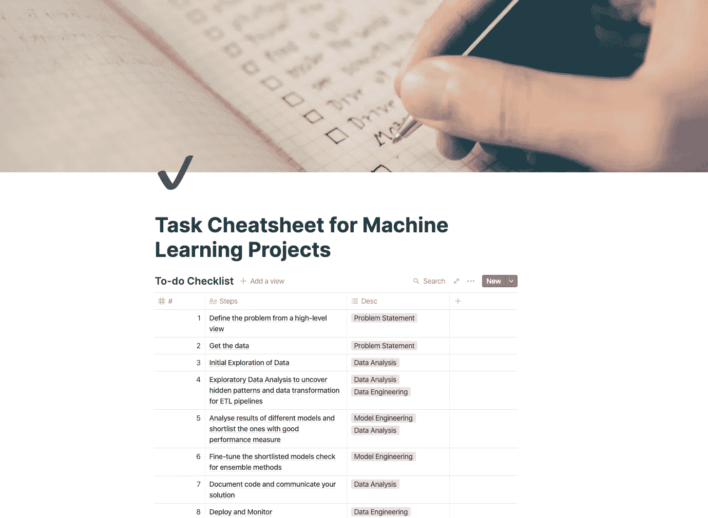

# 几乎每个机器学习项目的任务清单

> 原文：<https://towardsdatascience.com/task-cheatsheet-for-almost-every-machine-learning-project-d0946861c6d0?source=collection_archive---------1----------------------->

## 构建端到端 ML 项目的任务清单

当我在为你们所有人创建一系列[有价值的项目](/how-to-build-an-effective-data-science-portfolio-56d19b885aa8)时，我想到了记录我从某人那里学到的或者在工作中开发的实践。

在这篇博客中，我记录了我在进行端到端 ML 项目时一直参考的任务清单。

> 为什么我需要一份清单？

因为你需要处理项目中的许多元素(争论、准备、问题、模型、微调等)。)，很容易忘记事情。

它会引导您完成接下来的步骤，并督促您检查每个任务是否都已成功执行。

有时，我们很难找到起点，清单帮助你从正确的来源获得正确的信息(数据),以便建立关系和发现相关的见解。

让项目的每个部分都经历一个检查范例是一个最佳实践。

正如**阿图尔·加万德**在他的书《清单宣言》中所说，

> 我们所知的数量和复杂性已经超出了我们个人正确、安全或可靠地提供其益处的能力。

所以，让我带你浏览一下这份简明扼要的行动清单，它将减少你的工作量，提高你的产出…

# 机器学习项目清单

这些是你在几乎每个 ML 项目中必须执行的 8-10 个步骤。一些步骤可以按顺序交替执行。

## 1.从高层次的角度定义问题

这是为了理解和阐明问题的业务逻辑。它应该告诉你:

*   问题的性质(监督/非监督、分类/回归)，
*   您可以开发的解决方案类型
*   你应该用什么标准来衡量绩效？
*   机器学习是解决这个问题的正确方法吗？
*   解决问题的手动方法。
*   问题的固有假设

## 2.识别数据源并获取数据

在大多数情况下，如果您有数据，并且想要定义围绕它的问题以更好地利用传入的数据，则可以在第一步之前执行这一步。

根据您的问题的定义，您需要确定数据的来源，可以是数据库、数据仓库、传感器等。对于要在生产中部署的应用程序，这一步应该通过开发数据管道来保持传入数据流入系统，从而实现自动化。

*   列出你需要的数据来源和数量。
*   检查空间是否会成为问题。
*   检查你是否被授权为你的目的使用数据。
*   获取数据并将其转换成可行的格式。
*   检查数据类型(文本、分类、数字、时间序列、图像)
*   为了最终测试的目的，把它的一个样品放在一边。

## 3.数据的初步探索

在这一步，你要研究影响你的结果/预测/目标的所有特征。如果您有大量的数据，那么在这一步中对其进行采样，以使分析更易于管理。
要遵循的步骤:

*   使用 jupyter 笔记本，因为它们提供了一个简单直观的界面来研究数据。
*   确定目标变量
*   确定特征的类型(分类、数字、文本等。)
*   分析特征之间的相关性。
*   添加一些数据可视化，以便于解释每个特征对目标变量的影响。
*   记录你的发现。

## [4。探索性数据分析准备数据](/hitchhikers-guide-to-exploratory-data-analysis-6e8d896d3f7e?source=---------28------------------)

是时候通过定义数据转换、清理、特征选择/工程和缩放的函数来执行上一步的发现了。

*   编写函数来转换数据，并自动处理即将到来的数据批次。
*   编写函数来清理数据(输入缺失值和处理异常值)
*   编写用于选择和设计要素的函数-删除冗余要素、要素的格式转换以及其他数学变换。
*   特征缩放-标准化特征。

## **5。开发一个基线模型，然后探索其他模型，列出最佳模型**

创建一个非常基本的模型，作为所有其他复杂机器学习模型的基线。步骤清单:

*   使用默认参数训练一些常用的 ML 模型，如朴素贝叶斯、线性回归、SVM 等。
*   测量并比较每个模型与基线和所有其他模型的性能。
*   对每个模型采用 *N* 折叠交叉验证，并计算 *N* 折叠上性能指标的平均值和标准偏差。
*   研究对目标影响最大的特征。
*   分析模型在预测时产生的错误类型。
*   以不同的方式设计特征。
*   重复上述步骤几次(反复试验),以确保我们以正确的格式使用了正确的功能。
*   根据他们的性能指标列出最佳模特名单。

## 6.微调你的入围模型，并检查整体方法

这需要成为你接近最终解决方案的关键步骤之一。主要步骤应包括:

*   使用交叉验证的超参数调整。
*   使用自动调整方法，如随机搜索或网格搜索，为您的最佳型号找出最佳配置。
*   测试集成方法，如投票分类器等。
*   用尽可能多的数据测试模型。
*   一旦最终确定，开始时使用我们放在一边的看不见的测试样本来检查过度拟合或欠拟合。

## 7.记录代码并传达您的解决方案

交流的过程是多方面的。你需要记住所有现有的和潜在的利益相关者。因此，主要步骤包括:

*   记录代码以及您在整个项目中的方法和旅程。
*   创建一个类似于 voila 的仪表板或一个具有接近自我解释的可视化的有洞察力的演示。
*   写一篇博客/报告，记录你是如何分析特性、测试不同的转换等的。记录你的学习(失败和成功的技巧)
*   以主要成果和未来范围(如果有)结束

## 8.在生产中部署您的模型，Monitor！

如果您的项目需要在实时数据上测试部署，您应该创建一个 web 应用程序或 REST API，以便在所有平台(web、android、iOS)上使用。主要步骤(因项目而异)包括:

*   将最终训练好的模型保存到 h5 或 pickle 文件中。
*   使用 web 服务服务您的模型，您可以使用 Flask 来开发这些 web 服务。
*   连接输入数据源并设置 ETL 管道。
*   使用 pipenv、docker/Kubernetes 管理依赖关系(基于扩展需求)
*   您可以使用 AWS、Azure 或 Google 云平台来部署您的服务。
*   监控实时数据的性能，或者让人们将您的模型与他们的数据结合使用。

注意:清单可以根据项目的复杂程度进行调整。

# [数据科学与哈什特](https://www.youtube.com/c/DataSciencewithHarshit?sub_confirmation=1)

通过这个渠道，我计划推出几个覆盖整个数据科学领域的[系列](/hitchhikers-guide-to-learning-data-science-2cc3d963b1a2?source=---------8------------------)。以下是你应该订阅[频道](https://www.youtube.com/channel/UCH-xwLTKQaABNs2QmGxK2bQ)的原因:

*   这些系列将涵盖每个主题和子主题的所有必需/要求的高质量教程，如 [Python 数据科学基础](/python-fundamentals-for-data-science-6c7f9901e1c8?source=---------5------------------)。
*   解释了为什么我们在 ML 和深度学习中这样做的数学和推导。
*   [与谷歌、微软、亚马逊等公司的数据科学家和工程师以及大数据驱动型公司的首席执行官的播客](https://www.youtube.com/watch?v=a2pkZCleJwM&t=2s)。
*   [项目和说明](/building-covid-19-analysis-dashboard-using-python-and-voila-ee091f65dcbb?source=---------2------------------)实施到目前为止所学的主题。了解新的认证、训练营以及破解这些认证的资源，如谷歌的 [**TensorFlow 开发者证书考试。**](https://youtu.be/yapSsspJzAw)