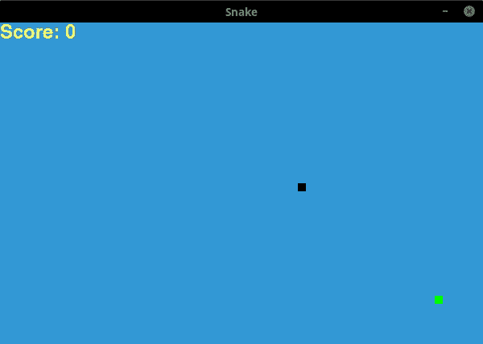
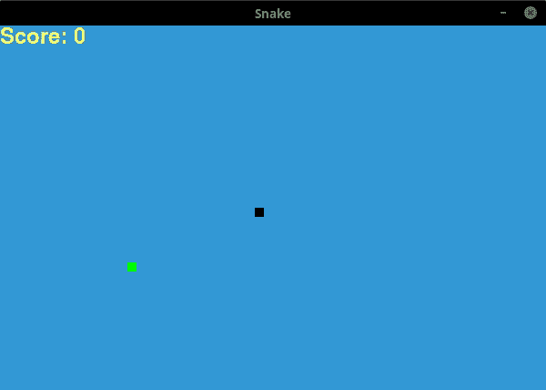
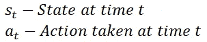
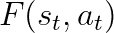
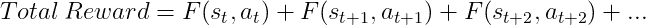
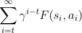
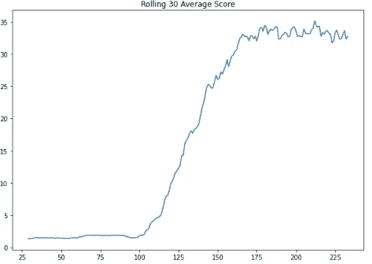
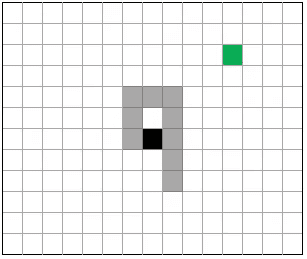

# 用 Q-Learning 教电脑玩蛇

> 原文：<https://towardsdatascience.com/teaching-a-computer-how-to-play-snake-with-q-learning-93d0a316ddc0?source=collection_archive---------23----------------------->

## 用一个蛇的游戏探索强化学习

在 [Unsplash](https://unsplash.com?utm_source=medium&utm_medium=referral) 上由 [Franck V.](https://unsplash.com/@franckinjapan?utm_source=medium&utm_medium=referral) 拍摄的照片

我最近看了《T4》AlphaGo——电影，这是一部关于 DeepMind 的 alpha go 的纪录片。AlphaGo 是一个玩围棋的人工智能，纪录片详细描述了它与 Lee Sedol 比赛前的故事。当 IBM 的“深蓝”在 1997 年击败国际象棋大师加里·卡斯帕罗夫时，全世界的围棋选手都认为这在围棋上是不可能的。20 年后，谷歌的人工智能击败了世界上有史以来最好的围棋选手之一。据信，它采用的一些策略非常有创意，围棋专家正在研究这些策略。我发现这一切都很迷人。

虽然我无法构建这样的人工智能，但我想探索强化学习。我决定了贪吃蛇这个游戏(一个简单多了的游戏！)而且没用多长时间就得到一些相当不错的结果。我的代码通过 [Github](https://github.com/jl4r1991/SnakeQlearning) 完整共享。

# 什么是 Q-Learning？

质量学习，或 Q 学习，类似于训练一只狗。我们第一次把我的狗带回家时，它还是一只小狗。她不知道任何技巧。她不知道不要咬我们的鞋子。最重要的是，她没受过如厕训练。但是她喜欢零食。这给了我们一个激励她的方法。每次她按命令坐下或摇摇她的爪子，我们就给她一份礼物。如果她咬了我们的鞋子…嗯，真的没什么，她只是没有得到奖励。然而，随着时间的推移，当她需要出去上厕所时，她甚至学会了踩我们的脚。

Q-learning 是一种强化学习方法，它通过奖励良好行为和惩罚不良行为来教会学习代理如何执行任务。以蛇为例，靠近食物是有益的。离开屏幕是不好的。在游戏中的每一点，代理人都会选择预期报酬最高的行动。

# 那看起来像什么？

一开始，蛇不知道如何吃食物，也不太“有目的”。它也倾向于以与现在相反的方向前进，然后立刻撞到尾巴而死去。但是代理学习如何玩游戏并不需要很长时间。不到 30 局就玩的相当不错了。

培训:

图片/GIF 作者

100 场比赛后:

图片/GIF 作者

让我们看看我们是如何到达那里的。

# 游戏引擎

在这篇文章中，我们将更多地关注学习代理而不是游戏。也就是说，我们仍然需要一个游戏引擎。我发现 Edureka 的这个教程以 Snake 为例，很好地介绍了 Pygame。我对代码做了一些小的修改，使它能够与学习代理交互，它已经准备好了。谢谢 Edureka！

# 游戏状态

我们需要一种方法来定义当前的游戏状态。我们想用一种方式来定义它，我们可以代表游戏的所有可能的状态，或者至少是游戏的关键部分。我将我的状态定义为以下各项的组合:

*   食物的水平方向——蛇现在是在食物的左边还是右边？
*   垂直方向——蛇现在是在食物的上面还是下面？
*   相邻(左、右、上、下)方格中有墙或尾巴吗？

这让我们对博弈做了一点概括，博弈的状态空间相当小。

作者图片

因为蛇的左边有直接的危险，而食物在蛇的上方和右边，所以所有 3 个场景都由相同的状态表示。

# 贝尔曼方程

我们使用贝尔曼方程来计算一个行动的总期望回报，并将信息存储在一个 *Q 表*中。

在时间 *t* ，我们有以下状态和动作:

在这种状态下，我们对该行为的回报可以表示为:

当我们采取一个行动时，我们转换到下一个状态，在那里我们可以选择另一个行动来获得另一个奖励。除了眼前的奖励，我们还想向前看，看看未来是否会有更大的奖励。这对于像国际象棋这样的游戏来说尤其重要，因为代理人必须提前考虑好几个步骤。然后我们可以说在时间 *t* 的总期望回报是:

然后我们引入了不耐烦的概念——现在的奖励比以后的奖励好。也就是说，我们降低了未来的回报。折扣系数是一个介于 0 和 1 之间的数字。这个因素越大，我们给予未来奖励的权重就越大。

和简化，我们得到:

在代理人玩第一个游戏之前，它不知道任何行动的预期回报是什么。所以我们从全零的 Q 表开始。当代理进行游戏时，它会观察每个动作 *a* 的奖励值，从而了解哪个 *a* 最适合每个状态 *s* 。

# 选择操作

在每个给定的状态下，代理查看 Q 表，并采取具有最高预期回报的行动。这里的要点是，蛇应该如何行动没有预先定义的逻辑。完全是从数据中学习来的。

但是这里还有其他的东西——一种叫做***ε贪婪*** 的技术。大多数时候，它遵循 Q 表。但如果有一条尚未探索的道路通向更高的回报呢？这是开发(基于我们目前所知的最佳选择)和探索(寻找潜在的更好选择)之间的权衡。在培训阶段，我们告诉代理偶尔随机选择一个动作。在这种情况下，10%的时间。我们称之为 10%ε。

# 更新 Q 表

每次移动后，我们将使用贝尔曼方程更新我们的 Q 表。如果蛇靠近了食物，或者吃了食物，它会得到一个肯定的奖励。如果蛇撞到了自己的尾巴或墙壁，或者已经远离食物，它将获得负奖励。请注意历史列表的反向列表，它允许很容易地计算贝尔曼方程。

# 研究结果

我们还想知道分数是否随着时间的推移而增加，或者是否已经稳定下来。因此，我们在每场比赛后输出分数，并绘制滚动的 30 个分数。我们在 100 场比赛后禁用 epsilon，看看它的表现如何。

作者图片

我们看到分数不断增加，直到大约 150 场比赛时才趋于平稳。下一节将详细介绍这一点。

# 警告

在我的 Q-Learning 实现中，我的代理永远不会玩一个完美的游戏。除了躲避眼前的危险，它总是向食物靠近。但是我们知道这并不总是有效的。

作者图片

在这种情况下，蛇应该向下移动，绕过它的尾巴。相反，它会向上移动并被卡住。我需要改变状态空间，以一种能捕捉到它并从中学习的方式。

# 结束语

我很惊讶 Q-Learning 的实现是如此简单，如此有效。但是正如我们在上面看到的，它显然有它的缺点。有更复杂的强化学习方法，可以更好地处理更复杂的游戏。不久的某一天，我希望能够建造一个会下棋的人工智能。

完整的代码可以在我的 Github 上的[这里](https://github.com/jl4r1991/SnakeQlearning)找到。如果你对我如何改进我的代码或学习代理有任何想法，请分享！