# 教人工智能学习人类如何高效规划

> 原文：<https://towardsdatascience.com/teaching-ai-to-learn-how-humans-plan-efficiently-1d031c8727b?source=collection_archive---------32----------------------->

## 利用强化学习构建层次发现的认知模型

图片由[艾萨克](https://unsplash.com/@isaacmsmith)在 [Unsplash](https://unsplash.com/photos/6EnTPvPPL6I) 上拍摄

人类的计划是分等级的。无论是计划像做饭这样简单的事情，还是像出国旅行这样复杂的事情，我们通常都是从我们想要实现的目标的粗略构想开始(“去印度，然后回国”)。然后，这个草图被逐步细化为一系列详细的子目标(“预订机票”、“打包行李”)、子子目标等等，直到比最初计划复杂得多的身体运动的实际序列。

> 有效的计划需要了解抽象的高层概念，这些概念构成了层次计划的本质。然而，人类如何学习这些抽象概念仍然是个谜。

在这里，我们展示了人类自发形成如此高层次的概念的方式，这种方式允许他们在给定任务、奖励和环境结构的情况下有效地进行规划。我们还表明，这种行为与潜在计算的形式模型一致，从而将这些发现建立在已建立的计算原则基础上，并将它们与以前的分层规划研究联系起来。

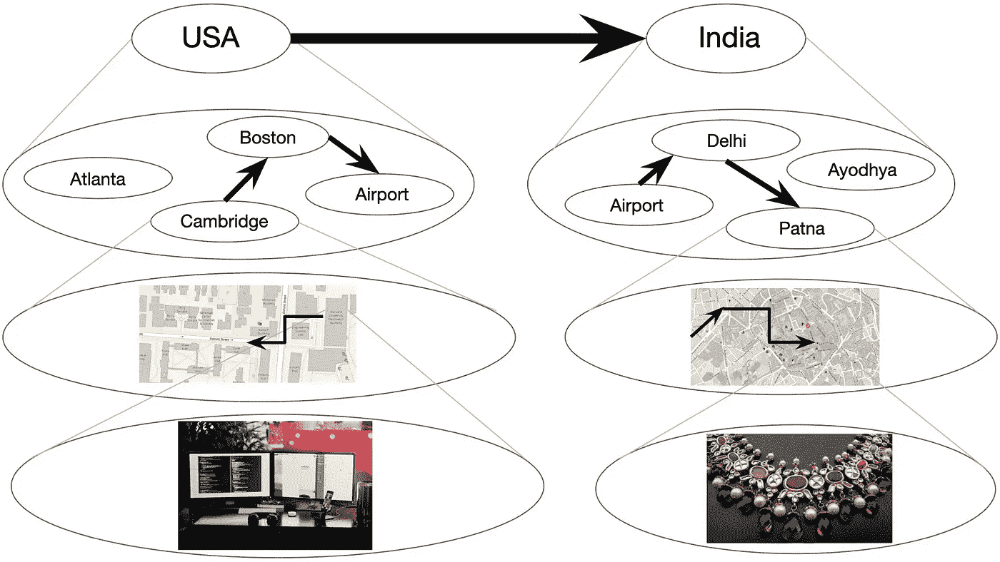

分层规划的例子[6]

上图描述了一个分层规划的例子，即某人可能计划如何从他们在剑桥的办公室去印度巴特那购买一件梦幻婚纱。圆圈代表状态，箭头代表在状态之间转换的动作。每个状态代表较低层的一组状态。较粗的箭头表示较高级状态之间的转换，这通常是首先想到的。

# 贝叶斯观点

当应用于计算智能代理时，分层规划可以实现具有高级规划能力的模型。通过为特定环境的结构假设一个生成过程，可以从贝叶斯观点对分层表示进行建模。关于这个问题的现有工作包括开发一种计算框架，用于在一组关于层级的简化假设下获取层级表示，即，模拟人们如何在他们对无奖励环境的心理表示中创建状态簇，以便于规划。

> 在这项工作中，我们贡献了一个层次发现的贝叶斯认知模型，该模型结合了聚类和奖励的知识来预测聚类的形成，并将该模型与从人类获得的数据进行比较。

我们分析了静态和动态奖励机制的情况，发现人类将关于奖励的信息归纳到高水平的集群中，并使用关于奖励的信息来创建集群，并且奖励归纳和基于奖励的集群形成可以通过我们提出的模型来预测。

# 理论背景

心理学和神经科学结合的一个关键领域是对人类行为与指定行为的正式理解。我们问:

> 当人类代理面临完成某项任务时，他们所采用的计划和方法是什么？人类如何发现有用的抽象？

鉴于人类和动物适应新环境的独特能力，这一点尤其有趣。以前关于动物学习的文献表明，这种灵活性源于目标的分层表示，这种表示允许将复杂的任务分解为低级的子程序，这些子程序可以扩展到各种环境中。

## 组块

***分块*** 的过程发生在动作被缝合在一起成为时间上延伸的动作序列以实现遥远的目标的时候。组块通常是学习从目标导向系统转移到习惯系统的结果，习惯系统以刻板的方式执行动作。

从计算的角度来看，这种分层表示允许代理在开放循环中快速执行动作，每当遇到已知问题时重用熟悉的动作序列，通过调整已建立的动作序列来更快地学习，以解决以前看到的问题，并在更长的时间范围内进行规划。代理不需要关心与目标实现相关的微小任务，例如，去商店的目标被分解为离开家、步行和进入商店，而不是起床、向前移动左脚、然后移动右脚等。

## 分层强化学习

代理人应该如何做出有益的决策是强化学习的主题。分层强化学习(HRL)已经成为代表分层学习和规划的主流框架。在对 HRL 建模的研究中，围绕模型构建的潜在方法提出了几种想法。

我们关注人们自发地将他们的环境组织成约束规划的状态集群。这种分层规划在时间和记忆上比天真的或*扁平的*规划更有效率，后者包括低层次的行动，与人们有限的工作记忆容量相一致【3】。

在下图中，粗节点和粗边表示为了计算计划，它们都必须被考虑并保存在短期内存中，灰色箭头表示集群成员。我们观察到，在低层图 *G* 中，计划如何从状态 *s* 到状态 *g* 至少需要与实际执行计划一样多的步骤(上图)，引入高层图 *H* 缓解了这个问题，降低了计算成本(中图)，扩展层次递归进一步减少了计划中涉及的时间和内存(下图)。

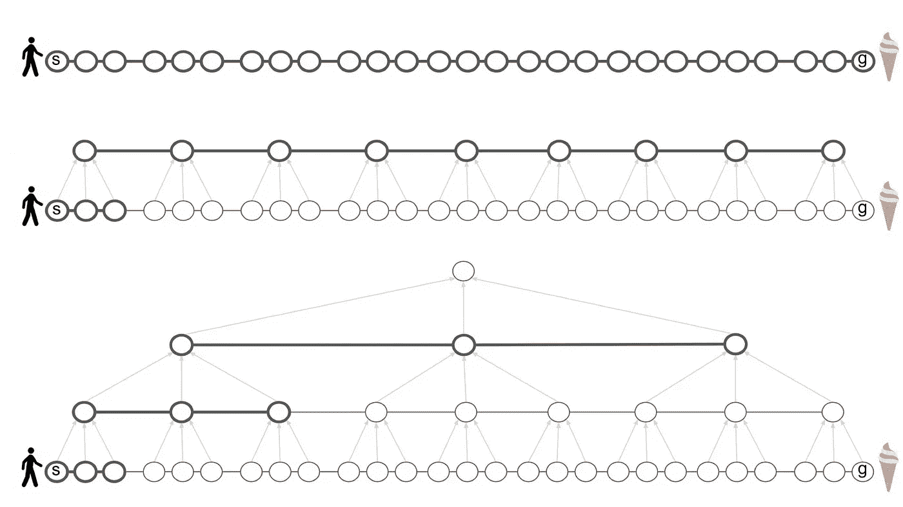

分层表示降低了规划的计算成本[6]

Solway 等人提供了最佳层次的正式定义，但他们没有说明大脑可能如何发现它[2]。我们假设一个最优的层次结构依赖于环境的结构，包括图形结构和环境的可观察特征的分布，特别是奖励。

# 模型

我们假设代理用图来表示他们的环境，其中节点是环境中的状态，边是状态之间的转换。状态和转换可能是抽象的，也可能是具体的，就像地铁站和它们之间的火车线路一样。

## 结构

我们将可观察环境表示为图 *G* = ( *V* ， *E* )，将潜在层级表示为 *H* 。 *G* 和 *H* 都是未加权的无向图。 *H* 由集群组成，其中 *G* 中的每个低级节点恰好属于一个集群，并且 ***桥接*** 或高级边连接这些集群。只有在某些 *v* 、*V’*、 *V* 之间存在边，使得 *v* 、 *k* 和*V’*、*k’*之间存在桥，即*V*、*k*和、*k’*中的每个高级边

在下图中，颜色表示簇分配。规划时会考虑黑边，而规划者会忽略灰边。粗边对应于跨簇的过渡。群集 *w* 和 *z* 之间的转换通过一个桥来完成。

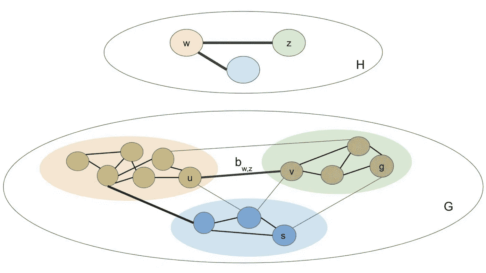

示例高级图表(上图)和低级图表(下图)[6]

在添加奖励之前，学习算法在给定以下约束的情况下发现最佳层级:

*   小集群
*   集群内的密集连接
*   集群间的稀疏连接

然而，我们不希望集群太小——在极端情况下，每个节点都是它自己的集群，这会使层次变得无用。此外，虽然我们希望集群之间的连接稀疏，但是我们希望维护集群之间的桥，以便保留底层图形的属性。

我们使用离散时间随机中国餐馆过程(CRP)作为聚类的先验。层次的发现可以通过反转生成模型来获得层次的后验概率 *H* 来完成。[6]中正式提出的生成模型会生成这样的层次结构。

## 奖励

在图 *G* 的上下文中，奖励可以被解释为顶点的可观察特征。因为人们经常根据可观察的特征进行聚类，所以对奖励诱导的聚类进行建模是合理的[5]。此外，我们假设每个州提供随机确定的奖励，并且代理的目标是最大化总奖励[8]。

因为我们假设集群会产生回报，所以我们将每个集群建模为具有平均回报。该群集中的每个节点具有从以平均群集回报为中心的分布中提取的平均回报。最后，每个观察到的奖励是从以该节点的平均奖励为中心的分布中抽取的。在[1]中提供了正式的讨论。

为了简化推论，我们先假设奖励是不变的， ***静态*** 。我们将可以在具有固定概率的观察值之间变化的奖励标记为 ***动态*** 。

我们进行了两个实验来测试我们关于人类行为的假设，并了解我们的模型可以预测到的程度。特别是，我们研究了集群在多大程度上推动了关于奖励的推论，以及奖励在多大程度上推动了集群的形成。对于每个实验，我们收集人类数据，并将其与模型的预测进行比较。

# 集群会带来回报

第一个实验的目标是了解奖励如何在州集群中推广。我们测试了图形结构是否驱动集群的形成，以及人们是否将在一个节点观察到的奖励推广到该节点所属的集群。

## 设置

该实验是通过要求 32 名人类受试者选择下一个要访问的节点来进行的，如以下场景中所指定的。参与者被随机呈现下图或其翻转版本，以确保不会引入利手或图形结构的偏见。我们预测参与者会选择与位于较大集群中的标记节点相邻的节点，即第一种情况下蓝色节点左侧的灰色节点，第二种情况下蓝色节点右侧的灰色节点。

向参与者展示了以下任务和相关图表:

> 您在一个由多个独立矿井和隧道组成的大型金矿中工作。矿井的布局如下图所示(每个圆圈代表一个矿井，每条线代表一个隧道)。你按日计酬，当天发现的每克黄金可获得 10 美元的报酬。你每天只挖一个矿，并记录当天矿产出的黄金数量(以克计)。在过去的几个月里，你已经发现，平均来说，每个矿每天生产大约 15 克黄金。昨天，你挖了下图中的蓝色矿，得到了 30 克黄金。今天你会挖两个阴影中的哪一个？请圈出您选择的矿山。

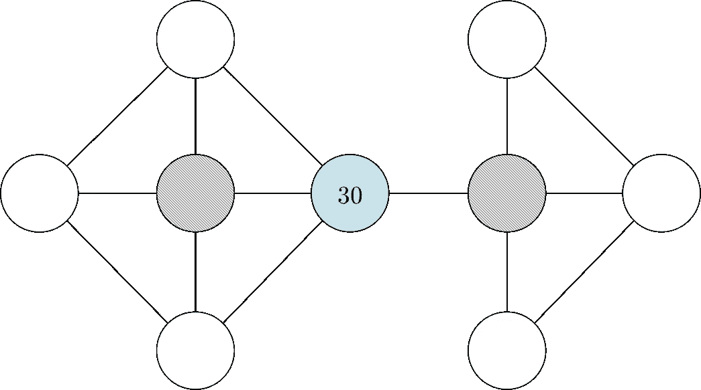

向与会者展示的地雷图[1]

我们希望大多数参与者能够自动识别以下聚类，用桃色和淡紫色的节点来表示不同的聚类，并根据这些聚类来决定选择哪个矿。假设参与者会选择桃红色的节点，而不是淡紫色的，因为标签为 30 的节点，比平均奖励大得多，在桃红色的群中。

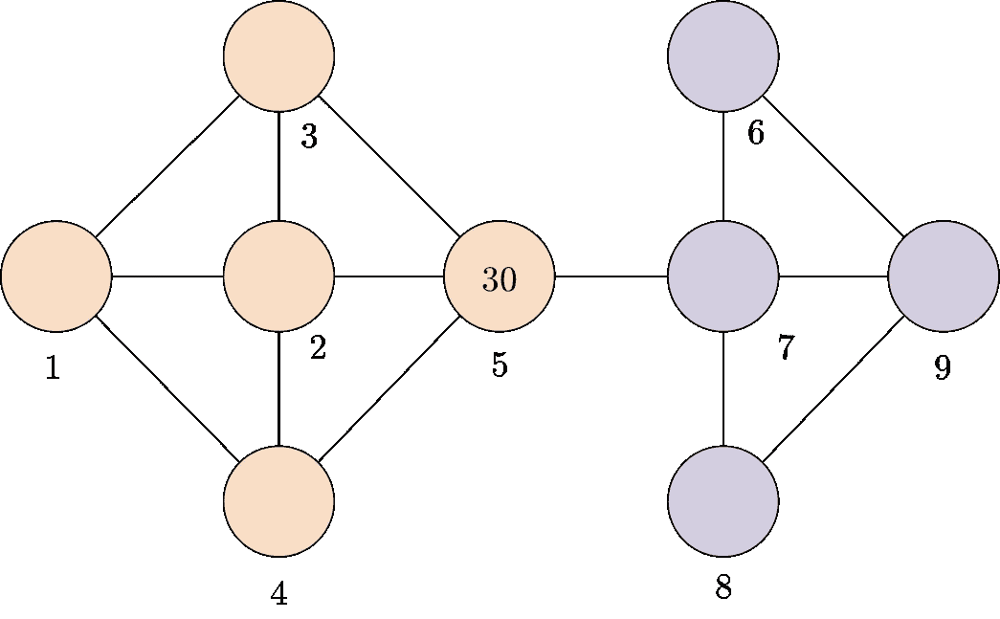

向参与者展示的地雷图，显示了可能的集群[1]

## 推理

我们使用 Metropolis-within-Gibbs 抽样[4]对 *H* 进行近似贝叶斯推断，该抽样通过从其后部抽样来更新 *H* 的每个分量，在单个 Metropolis-Hastings 步骤中以所有其他分量为条件。我们采用高斯随机游走作为连续成分的建议分布，并采用条件 CRP 先验作为聚类分配的建议分布[7]。该方法可以解释为相对于由后验概率定义的效用函数的随机爬山。

## 结果

人类组和模拟组各有 32 名参与者。模型输出的前三个分类如下所示(左图)。所有前三个结果都是相同的，表明该模型以高置信度识别了有色分组。参与者的结果以及静态奖励模型的结果在下面的条形图(右图)中可视化，描绘了选择接下来访问节点 2 的人类和模拟受试者的比例。黑色实线表示平均值，黑色虚线表示 2.5 和 97.5 个百分点。

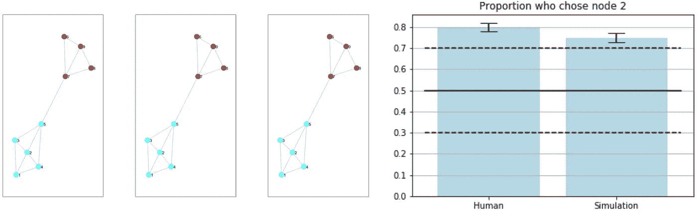

集群内奖励泛化实验的结果[1]

下表中列出的*p*-值是通过右尾二项式检验计算的，其中空值被假设为选择左侧或右侧灰色节点的二项式分布。显著性水平为 0.05，并且人体实验结果和建模结果都具有统计学显著性。

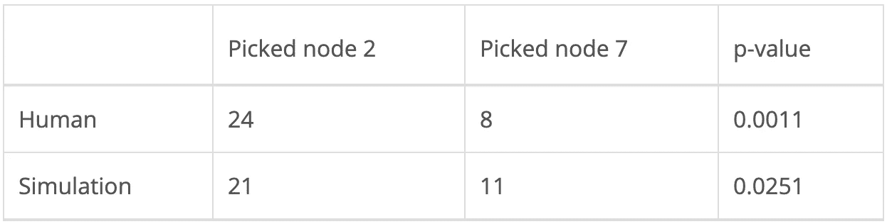

人类采取的行动和静态奖励模型[1]

# 奖励诱导集群

在第二个实验中，目标是确定奖励是否会导致集群。我们预测，具有相同回报的相邻节点将聚集在一起，即使仅图的结构不会导致聚集。

回想一下索尔维等人。al 表明，人们更喜欢跨越最少等级界限的路径[2]。因此，在两条完全相同的路径之间，选择一条路径的唯一原因是它跨越的层次边界更少。对此，一个可能的反驳理由是，人们会选择回报更高的道路。然而，在我们下面详述的设置中，奖励仅在目标状态下给予，而不是在所采取的路径上累计。此外，奖励的数量在不同的试验中有所不同。因此，人们不太可能因为某条路径上的节点有更高的回报而偏爱这条路径。

## 设置

这个实验是使用亚马逊土耳其机器人在网上进行的。参与者被告知以下任务背景:

> 假设你是一名矿工，在一个由隧道连接的金矿网络中工作。每个矿每天都会产出一定数量的黄金(点数)。在每一天，你的工作是从一个起始矿导航到一个目标矿，并从目标矿收集点。在某些日子里，你可以自由选择任何你喜欢的矿。在那些日子里，你应该试着挑选能产生最多点数的矿。在其他日子里，只有一个矿井可用。该矿的点将以绿色书写，其他矿将以灰色显示。在那些日子里，你应该导航到可用的矿井。每个矿的分都会写在上面。当前矿井将以粗边框突出显示。您可以使用箭头键(上、下、左、右)在地雷之间导航。一旦到达目标矿，按空格键收集积分，第二天开始。这项实验将进行 100 天。

下图(左图)展示给了参与者。与之前的实验一样，为了控制潜在的左右不对称，参与者被随机分配了图中所示的配置或同一图表的水平翻转版本。还描绘了预期诱导的集群，其中节点被编号以供参考(右图)。

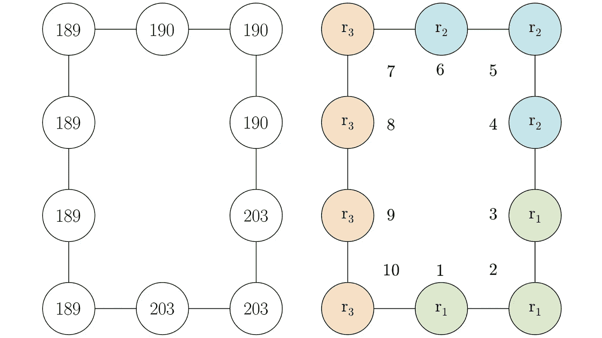

向 MTurk 参与者展示的地雷图(左)，显示了可能的集群(右)[1]

我们将第一种情况称为 ***自由选择*** ，第二种情况称为 ***固定选择*** ，在第一种情况下，参与者可以自由选择任意一个矿。参与者每次试验都会得到金钱奖励，以阻止随机反应。

在每次试验中，奖励值以 0.2 的概率变化。新的奖励是从区间[0，300]中统一随机抽取的。然而，奖励的分组在试验中保持不变:节点 1、2 和 3 总是有一个奖励值，节点 4、5 和 6 有不同的奖励值，节点 7、8、9 和 10 有第三个奖励值。

前 99 次试验允许参与者开发一个集群层次。最后一项试验作为测试试验，要求参与者从节点 6 导航到节点 1。假设奖励诱导了上面所示的集群，我们预测更多的参与者会选择穿过节点 5 的路径，它只穿过一个集群边界，而不是穿过节点 7 的路径，它穿过两个集群边界。

## 推理

我们对固定选择案例建模，假设所有 100 次试验中的任务都与呈现给参与者的第 100 次试验相同，即测试试验。首先，我们假设静态奖励，在所有试验中奖励保持不变。接下来，我们假设动态奖励，每次试验的奖励都会改变。

与之前的实验相反，在之前的实验中，参与者选择单个节点，模型预测该节点，这个实验关注的是参与者选择的从开始节点到目标节点的完整路径的第二个节点。因此，为了将该模型与人类数据进行比较，我们使用了广度优先搜索的变体，以下称为分层 BFS，来预测从起始节点(节点 6)到目标(节点 1)的路径。

***静态奖励。*** 对于每个受试者，我们使用 Metropolis-within-Gibbs 抽样从后验进行抽样，并选择最可能的层级，即具有最高后验概率的层级。然后，我们使用分层 BFS 首先查找集群之间的路径，然后查找集群内节点之间的路径。

***动态奖励。*** 对于动态奖励，我们采用在线推断。对于每个模拟参与者，我们允许每次试验的取样只进行 10 步。然后，我们保存了层次结构，并添加了关于修改后的奖励的信息。接下来，我们允许采样再次进行，从保存的层次结构开始。就像在人体实验中一样，在每次试验的开始，奖励有 0.2 的概率被重新随机分配到新的值，尽管奖励在组内总是相等的。这种推断方法模拟了人类参与者在多次试验过程中可能如何累积学习。为了这个实验的目的，我们假设人们一次只记住一个层次，而不是并行更新多个层次。我们还修改了对数后验概率来惩罚断开的聚类，因为这种聚类在这种类型的推断下变得更加常见。

## 结果

人类组和两个模拟组各有 95 名参与者。零假设由相等数量的参与者选择通过节点 5 和通过节点 7 的路径来表示，因为在没有任何其他信息的情况下，并且给定两条路径长度相等，参与者同样可能选择任一条。

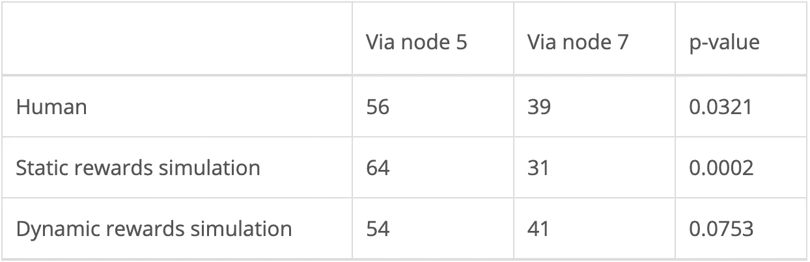

人类采取的行动以及静态和动态奖励模型[1]

如上表所示，人体实验和静态奖励模型的结果在α = 0.05 时具有统计学意义。此外，如下所示，人体实验的结果处于以 0.5 为中心的正态分布的第 90 个百分位数中，这是假定零假设的预期比例。在该图中，我们包括由静态奖励模型(第一行)、在不相连组件之间形成集群的静态奖励模型(第二行)和动态奖励模型(第三行)识别的集群。

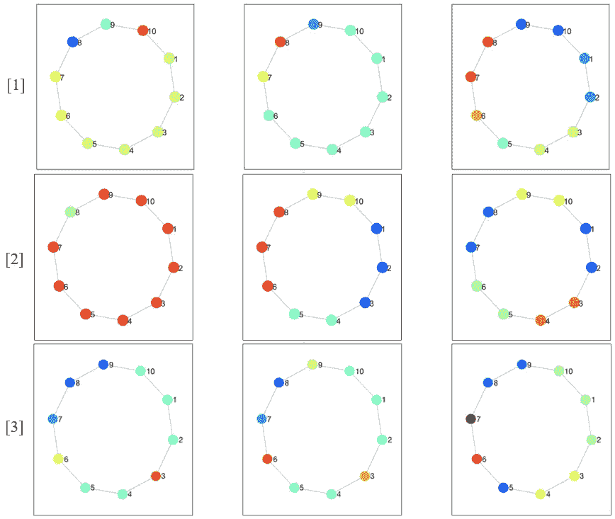

通过模拟确定的集群[1]

***静态奖励。*** 我们使用 1000 次 Metropolis-with-Gibbs 采样迭代来生成每个样本，burnin 和 lag 各为 1。静态奖励下的模拟当然倾向于通过节点 5 的路径，达到统计上显著的水平。此外，由于其目的是模拟人类行为，鉴于人类数据也具有统计显著性(0.0321 < α = 0.05)，该结果是有意义的。

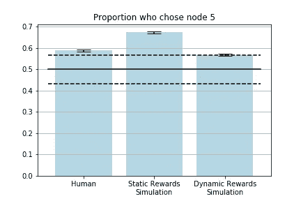

人类和模拟实验对象的选择[1]

***动态奖励。*** 为了模拟人类试验，我们进行了 100 次试验，每一次都用 10 次 Metropolis-within-Gibbs 迭代从后验样本中进行采样。burnin 和 lag 再次设置为 1。在线推断方法似乎比静态奖励模型更好地模拟了人类数据，即使动态奖励模型下的模拟参与者组比静态奖励模型下的模拟参与者组离假设更远。与静态奖励模型下的 64 名模拟参与者(18.5%的差异)相比，动态奖励模型下的 56 名人类参与者和 54 名模拟参与者选择通过节点 5(3.4%的差异)。

上面的条形图显示了所选路径的第二个节点是节点 5 的人类和模拟受试者的比例。黑色实线表示假设为零时的预期比例，黑色虚线表示第 10 和第 90 个百分点。

# 结论

人类似乎自发地将环境组织成支持分层规划的状态集群，使他们能够通过在不同抽象层次上将问题分解成子问题来解决挑战性问题。人们经常依靠这种层次分明的演示来完成大大小小的任务——从计划一天的生活，到组织婚礼，再到获得博士学位——通常第一次尝试就能成功。

> 我们已经表明，一个最佳的层次结构不仅取决于图的结构，而且还取决于环境的可观察特征，即奖励的分配。

我们建立了分层贝叶斯模型，以了解集群如何诱导静态奖励以及静态和动态奖励如何诱导集群，并发现大多数结果在我们的模型捕捉人类行为的紧密程度方面具有统计学意义。所有模拟和实验的所有数据和代码文件都可以在 GitHub 存储库中找到，链接[这里](https://github.com/agnikumar/chunking)。我们希望提出的模型，以及[最近的论文](https://journals.plos.org/ploscompbiol/article?id=10.1371/journal.pcbi.1007594&rev=2)中的相关结果，为未来研究铺平道路，以调查支持分层规划的基本认知能力的神经算法。

# 参考

[1] A. Kumar 和 S. Yagati，[麻省理工学院](http://www.mit.edu/afs/athena.mit.edu/user/a/g/agnik/www/assets/files/hierarchical_rl.pdf)【2018】奖励泛化和基于奖励的层级发现

[2] A. Solway，C. Diuk，n . Cordova，D. Yee，a .巴尔托，Y. Niv 和 M. Botvinick，[最优行为层次](http://alm.plos.org/works/doi.org/10.1371/journal.pcbi.1003779?source_id=twitter) (2014)，PLOS 计算生物学

[3] G .米勒，[神奇的数字 7 加或减 2:我们处理信息能力的一些限制](https://psycnet.apa.org/record/1957-02914-001) (1956)，《心理评论》

[4] G. Roberts 和 J. Rosenthal，[自适应 MCMC 的示例](https://www.tandfonline.com/doi/abs/10.1198/jcgs.2009.06134) (2009)，《计算和图形统计杂志》

[5] J .巴拉格尔、h .斯皮尔斯、d .哈萨比斯和 c .萨默菲尔德，[虚拟地铁网络中分层规划的神经机制](https://www.researchgate.net/publication/303357683_Neural_Mechanisms_of_Hierarchical_Planning_in_a_Virtual_Subway_Network) (2016)，神经元

[6] M. Tomov，S. Yagati，A. Kumar，W. Yang 和 S. Gershman，[发现有效规划的分层表示](https://journals.plos.org/ploscompbiol/article?id=10.1371/journal.pcbi.1007594&rev=2) (2020)，计算生物学

[7] R. Neal，[狄利克雷过程混合模型的马尔可夫链抽样方法](https://amstat.tandfonline.com/doi/abs/10.1080/10618600.2000.10474879) (2000)，计算与图形统计杂志

[8] R .萨顿和 a .巴尔托，[强化学习:导论](https://web.stanford.edu/class/psych209/Readings/SuttonBartoIPRLBook2ndEd.pdf) (2018)，麻省理工学院出版社