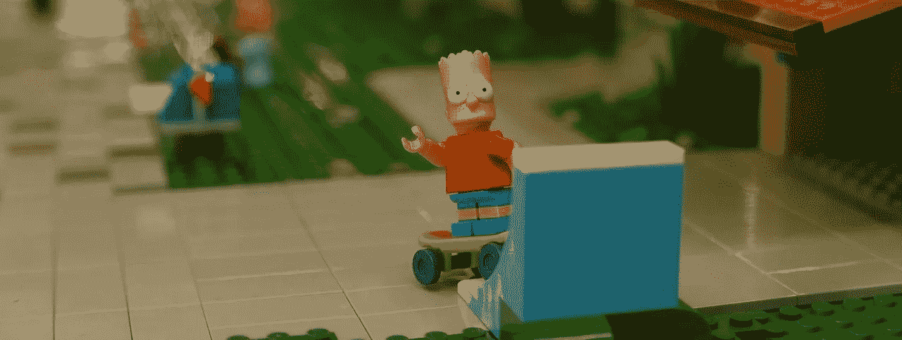
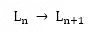
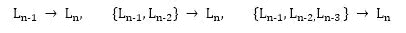

# 教巴特说唱:微调拥抱脸的巴特模型

> 原文：<https://towardsdatascience.com/teaching-bart-to-rap-fine-tuning-hugging-faces-bart-model-41749d38f3ef?source=collection_archive---------16----------------------->

## 我教巴特说唱，作为学习如何调整令人难以置信的强大拥抱脸变形金刚模型的过程的一部分。

图片由来自 Pixabay 的 Krystyna Kaleniewicz 提供

在过去几年中，迁移学习为人工智能提供了一个难以想象的福音，在计算机视觉领域以及最近的 NLP 领域掀起了波澜，研究人员发现，在语言建模任务中训练的模型可以很容易(快速而廉价地)适用于其他任务。从从业者的角度来看，除了大量的新发现——在[Arvix](https://arxiv.org/)——[拥抱脸](https://huggingface.co/transformers/)上很容易获得——已经开发出难以置信的易用 API，允许任何人通过几行代码访问这些最新的开发。

尽管人们可以很容易地使用拥抱脸 API 进行即时推理和通过命令行风格的参数进行微调，但我在尝试微调 [BART 模型](https://arxiv.org/abs/1910.13461)时遇到了一点困难。我的目标是在我的硕士论文中使用它，我花了大量的时间编写代码来微调模型，因为我在这个过程中卡住了。然而，一旦我设法克服了这一点，我就对这种模式的力量感到惊讶。

**TL；DR:查看这里的微调代码*****和这里的噪声代码*****。****

**本文将简要概述如何微调 BART 模型，代码相当自由地借用了 Hugging Face 的 finetuning.py 脚本。然而，这将允许对如何试验模型有更多的控制。我已经使用 [PyTorch Lightning](https://pytorch-lightning.readthedocs.io/en/latest/) 来处理训练，如果你是新手，我鼓励你熟悉它。实现非常简单，也许能够简化您的一些项目。虽然我在这里教过 BART 说唱，但这真的只是一个方便(而且好玩！)seq2seq 关于如何微调模型的示例。**

**只是快速概述一下我在培训过程中遇到的困难。我的模型的损失在每一批中都在快速下降，然而模型正在学习生成空白句子。很长一段时间，我都想不通为什么会这样。事实证明，在将令牌输入解码器之前，您需要手动将令牌向右移位，但是您必须将未移位的令牌传递给 loss 函数。**

**所以，事不宜迟，这就是教巴特说唱的方法。**

# **训练集**

**我从这个 GitHub repo 中找到了一组很棒的歌词。作者解释了他们如何使用 Genius python API 来抓取歌词，但我只是下载了已经被抓取的歌词。然后我快速旋转了一个笔记本([这里](https://colab.research.google.com/drive/1n45bHMFw5dSTEUxcGYrQxhApPaltqGsS))，在那里我创建了一组歌词，下一行歌词对，比如:**

****

**这里 L(n)表示行“n”，L(n+1)表示下一行，而->表示这些行在训练数据中是成对的。我还做了少量的额外处理，以确保歌曲不会相互渗透，并且在训练对中，一行诗后面不会跟着一行合唱，反之亦然。我还删除了许多重复的线，因为没有这样做导致模型经常只是生成相同的线，一遍又一遍地重复(由于数据中的线->重复线对的重要部分)。**

**从这里，我输入了数据。因为 BART 被训练为去噪自动编码器，所以我认为最好将噪声数据传递到模型中进行训练。不过，我不确定这是否有必要。我用<mask>标记替换了 25%的数据，但是，我排除了歌词的最后一个单词被添加到替换池中，因为这个单词在支持押韵方案中起着至关重要的作用。</mask>**

**我还尝试以这样一种方式设置训练集，即一行可以不仅仅通过前一行来预测。这样做是希望在生成期间，模型能够在四行诗中有更大的一致性。具体地，如上所述，如果 L(n)表示训练集中的第 n 条线，则它被设置为:**

****

**然而，在这样做的时候，我发现尽管训练样本的数量显著增加(很明显)，但是模型正在学习从数据集中复制输出行。我因此放弃了这个版本的训练数据。**

# **培训**

**训练相对简单(在我解决了直线下降的损失问题之后)。我使用 PyTorch Lightning 来简化模型的训练、加载和保存过程。我还使用“bart-base”作为预训练模型，因为我之前在 Google Colab 上使用“bart-large”时遇到了一些 GPU 内存问题。我训练了大约 10 个时期的模型。代码可在[这里](https://colab.research.google.com/drive/1Cy27V-7qqYatqMA7fEqG2kgMySZXw9I4?usp=sharing&pli=1)获得。**

# **生成文本**

**在生成文本时，我做了两件事。首先，我向 generate_text()方法(该方法使用了 BartForConditionalGeneration generate()方法)中输入了一个种子行，并自动回归生成了 k 个新行；其次，我用 25%-35%的噪声标记对每一行进行噪声处理。我发现像这样对标记进行噪声处理通常会给模型的输出带来更多的变化。最后，我对我能得到的结果感到非常惊讶。玩起来还挺上瘾的。这是一首我认为可以出现在歌曲中的四行诗(不是布可夫斯基，但是嘿)——第一行是我的:**

> **你和我永远在城市的灯光下巡游**
> 
> **我希望你和你的兄弟们永远不会看到这些闪光**
> 
> **我永远闪耀在城市的灯光下**
> 
> **但是你永远不能改变你发光的方式**

# **关于改进的想法**

**添加更长范围的歌词以供生成——尽管我用更长的引导歌词(两行和三行引导到目标行)创建更多训练数据的实验并不成功，但可能有一种方法可以改善这一点，例如，在句子中添加<sep>标记。</sep>**

**我认为观察巴特如何与不同类型的音乐合作也是很有趣的，比如乡村音乐或朋克摇滚。我还认为，如果在训练模型时不干扰源代码，看看会发生什么会很有趣。虽然，据我回忆，从[原始 BART 论文](https://arxiv.org/abs/1910.13461)来看，在训练模型时所有的数据都有噪声，但我不确定不去噪声数据是否有效。**

**最后，时不时地，当一个非常棒的行出现时，我会手动搜索训练数据，看看模型是只是复制它还是生成文本。大部分时间它都在生成文本，但是添加一个类似 BLEU 的度量来判断模型是抄袭还是“原创”会很有帮助。**

# **最后的想法**

**当使用预先调整的模型时，现在有很多选择，特别是拥抱脸正在做的伟大工作，使最新和最棒的模型民主化。BART 在 seq2seq 任务的广泛范围内显示出了很大的前景，并且已经花了一些时间来更好地了解该模型，我非常希望看到其他的可能性。**