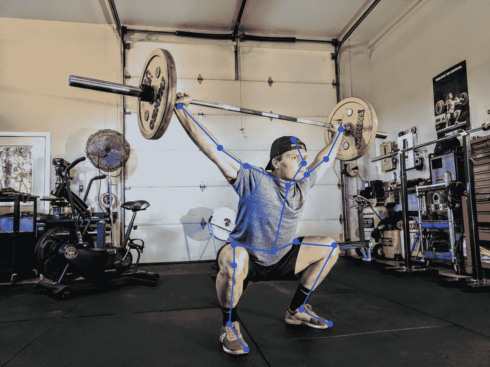
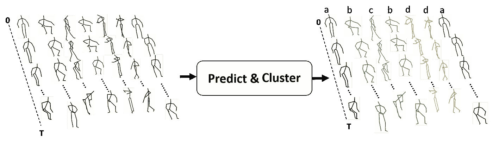

# 教计算机识别视频中的人类动作

> 原文：<https://towardsdatascience.com/teaching-computers-to-recognize-human-actions-in-videos-81b2e2d62768?source=collection_archive---------31----------------------->

## 预测和聚类:基于无监督骨架的动作识别

作者:伊莱·什利泽曼

照片由[布鲁斯·马尔斯](https://unsplash.com/@brucemars?utm_source=medium&utm_medium=referral)在 [Unsplash](https://unsplash.com?utm_source=medium&utm_medium=referral) 上拍摄

对于人类来说，仅仅通过观看视频来识别人们用身体做出的各种动作是一项自然而简单的任务。例如，大多数人可以很容易地识别出一个主题，比如，“*来回跳跃*，或者“*用脚击球*”。即使视频素材中显示的对象发生变化或从不同的视角录制，这也很容易识别。**如果我们希望计算机系统或游戏机(如 Xbox、PlayStation 或类似设备)也能做到这一点，会怎么样？这可能吗？**

对于一个人工系统来说，这个看似基本的任务并不像人类那样自然，它需要几层人工智能能力，例如(I)知道哪个*****特征***在做决定时跟踪，以及(ii)命名或标记特定动作的 ***能力。*****

**关于(I)，视觉感知和计算机视觉的研究表明，至少对于人体来说，关节的 3D 坐标，即 ***骨架特征*** 足以识别不同的动作。此外，当前的鲁棒算法能够使用几乎任何视频源镜头实时跟踪这些特征，例如 OpenPose [1]。**

****

**Sam Sabourin 在标有骨骼特征的 Unsplash 上的照片**

**关于(ii)，教导计算机系统使用这些特征在点的集合和动作之间进行 ***预测关联*** 证明是比仅仅单独选择所述特征更具挑战性的任务。这是因为系统被期望将特征序列分组到“类”中，并且随后将这些与相应动作的名称相关联。**

****

**基于骨架的动作识别:点(时间序列)集合和动作之间的预测关联**

**现有的深度学习系统试图通过一个称为“**监督学习**”的过程来学习这种类型的关联，其中系统从几个给定的例子中学习，每个例子都有对它所代表的动作的解释。这种技术在每一步都需要相机和深度输入(RGB+D)。虽然监督动作识别已经显示出有希望的进步，但是它依赖于大量序列的注释，并且每次考虑另一个主题、观点或新动作时都需要重新进行。**

****

**由[雷蒙德·拉斯姆森](https://unsplash.com/@raymondrasmusson?utm_source=medium&utm_medium=referral)在 [Unsplash](https://unsplash.com?utm_source=medium&utm_medium=referral) 上拍摄的照片**

**因此，特别有趣的是，相反，创造试图模仿人类感知能力的系统，这些系统学会以一种不受监督的方式进行这些关联。**

**在我们最近名为“[预测&聚类:无监督的基于骨架的动作识别](http://openaccess.thecvf.com/content_CVPR_2020/html/Su_PREDICT__CLUSTER_Unsupervised_Skeleton_Based_Action_Recognition_CVPR_2020_paper.html)”[2]的研究中，我们开发了这样一个无监督系统。我们已经提出，系统将学习如何通过**‘编码器-解码器’**学习来**预测**序列，而不是教计算机将序列与它们的动作进行分类。这种系统是完全无人监督的，并且仅通过输入来操作，而不需要在任何阶段对动作进行标记。**

****

**预测和聚类:基于无监督骨架的动作识别**

**特别地，编码器-解码器神经网络系统学习将每个序列编码成代码，解码器将使用该代码来生成完全相同的序列。原来，在**学习编码然后解码**的过程中，Seq2Seq 深度神经网络**将序列**自组织成截然不同的**簇**。我们开发了一种方法来确保学习是最优的(通过固定解码器的权重或状态)，以便创建这样的组织，并开发了工具来读取该组织，以将每个集群与一个动作相关联。**

****

**预测和聚类示意图**

**我们能够获得动作识别结果，**优于**之前的无监督和有监督方法。我们的发现为使用任何特征输入的任何类型动作的新型学习铺平了道路。这可能包括从识别飞虫飞行模式的行为到识别互联网活动中的恶意行为。**

**有关更多信息，请参见下面的概述视频和[2]中的论文。**

**带着和[刘秀龙](https://medium.com/@liuxiulong1995)。**

# **参考**

**[1]打开姿势:[https://github.com/CMU-Perceptual-Computing-Lab/openpose](https://github.com/CMU-Perceptual-Computing-Lab/openpose)**

**[2]苏、昆、刘秀龙和伊莱·什利泽曼。"预测和聚类:基于无监督骨架的动作识别."*IEEE/CVF 计算机视觉和模式识别会议论文集*。2020.**