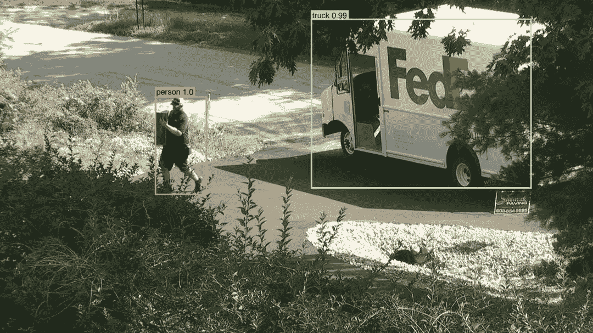
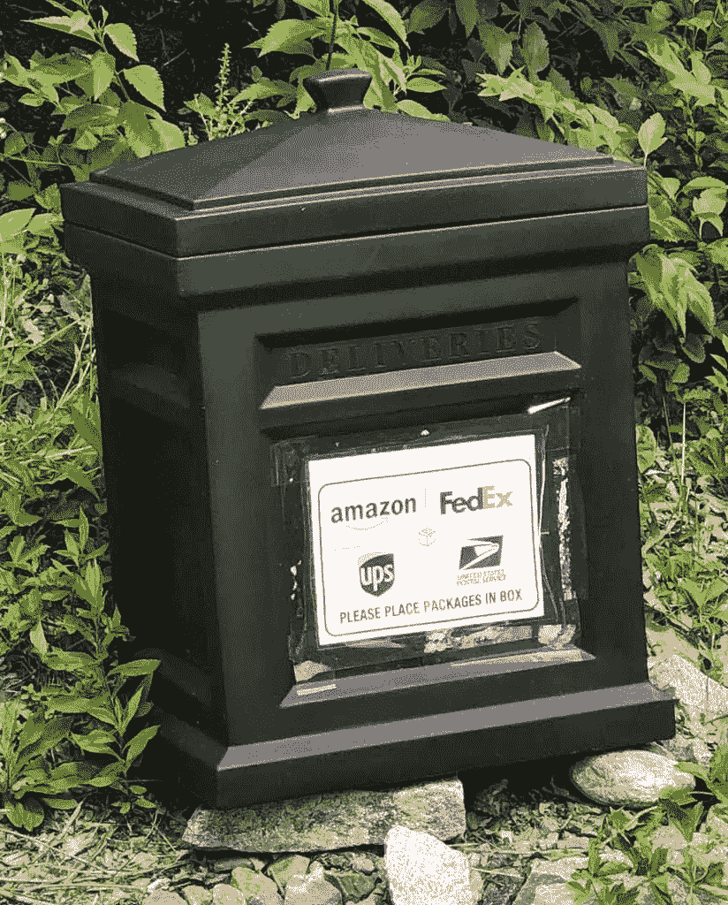
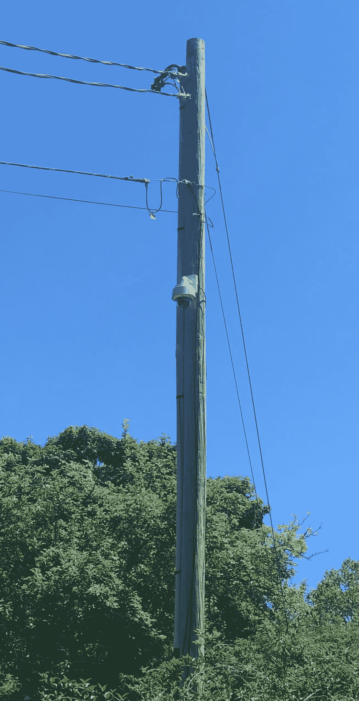
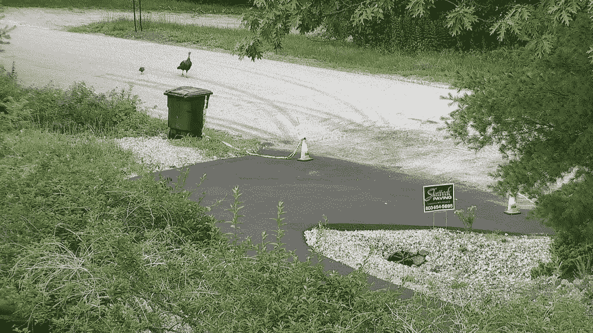
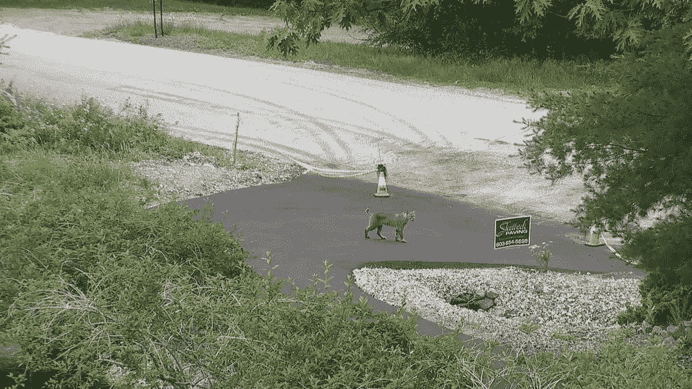
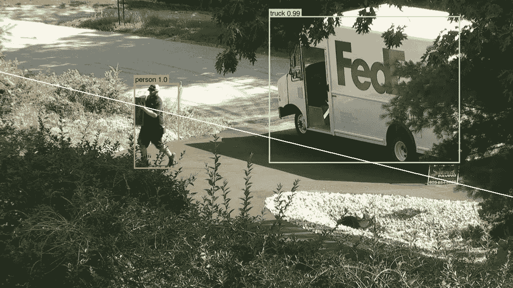
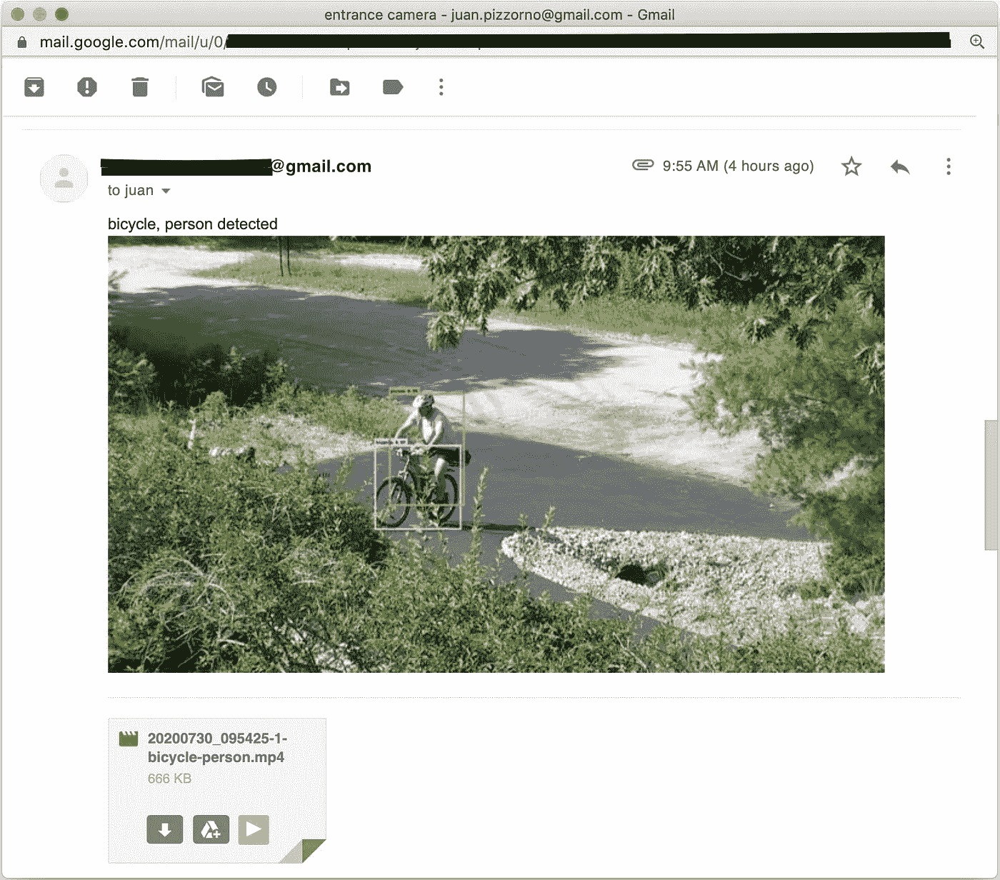
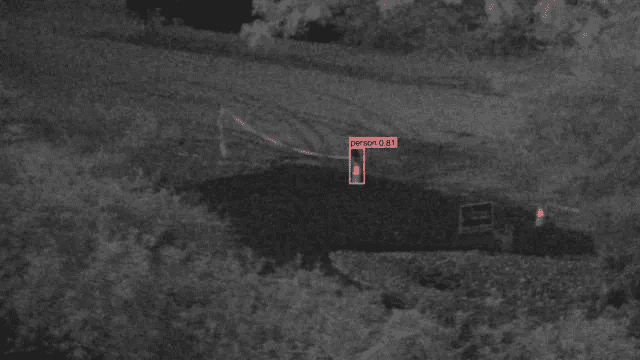
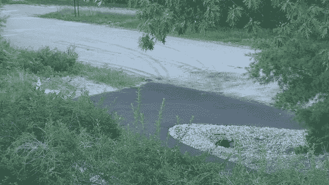

# 向旧相机传授新技巧

> 原文：<https://towardsdatascience.com/teaching-new-tricks-to-an-old-camera-5ab37f4a4406?source=collection_archive---------45----------------------->

## 旧相机+ Python + OpenCV + TF/Keras + YOLOv3



(图片由作者提供)

住在乡下，我很幸运，对于许多食物，我可以步行到当地的农场。不过，对于大多数其他东西，我的家人都在网上购物。今年，我们相当长的车道真的需要重新铺设，这意味着在两个月内，任何送货或其他重型卡车都不能在上面行驶。我们在车道的尽头放了一个送货箱，但从我们的房子里看不到它，所以为了方便和安全，我们真的想在上面装一个摄像头。



(图片由作者提供)

# 设置

我认为安装相机的一个好地方是车道旁现有的电线杆(在房产内)，它距离房子不到 100 米(328 英尺)，距离盒子大约 50 米(164 英尺)；接下来的问题是如何最好地为 it 带来动力和连接。有很多方法可以做到这一点，从电池、太阳能电池和电池网络到无线电链路和电缆。为了降低成本，我想到了放在地下室里的一台用了 10 年左右的[“机场级”相机](https://www.axis.com/en-us/products/axis-q6035-e)。



(图片由作者提供)

电线杆在 [PoE](https://en.wikipedia.org/wiki/Power_over_Ethernet) 范围内，所以运行它我只需要一些直埋电缆。我可以用最少的成本解决投递箱通知问题，将相机投入使用，并使用一些深度学习来获得一个现代探测器…这是一个太好的项目了，不能错过！

在汗流浃背地爬了一整天的电线杆，埋好、布线、固定和压接电缆之后，我把相机装了起来，开始拍摄。沿着阻力最小的路径，也为了看看我能学到什么，我决定让相机通过网络持续记录到 Linux 系统上，并在那里使用我不久前编写的 [YOLO v3/v4 对象检测器](https://github.com/jaltmayerpizzorno/d2k)来处理它。我很想在相机上运行推理，但它的 CPU ( [一个定制芯片](https://en.wikipedia.org/wiki/ETRAX_CRIS))和存储很小，而且没有用于[加速器](https://coral.withgoogle.com/products/accelerator)的 USB 端口。

# 记录和处理

虽然功能非常丰富，但这款相机太老了，有些东西很难使用。例如，它有一个运动检测功能，但需要浏览器中的 Java 小程序支持才能轻松配置……[对，没错](https://www.java.com/en/download/faq/chrome.xml)。它可以记录到网络附加存储，但只能使用 [SMBv1](https://en.wikipedia.org/wiki/Server_Message_Block) 协议。在我的系统上安装 samba 是一个`sudo apt install samba`的问题，但它需要一些更严肃的研究来找到`/etc/samba/smb.conf`中需要的“[咒语](https://en.wikipedia.org/wiki/Incantation)，所以它会说 SMBv1:

```
min protocol = NT1
ntlm auth = ntlmv1-permitted
```

通过记录到 Linux 系统，我可以轻松地访问数据(不需要研究它在相机上处理的 API)，在我调整代码和神经网络时随意重新处理数据的能力，以及长期存档。我使用 OpenCV 来读取文件并创建小片段，然后包含在通知中。

不过，对文件进行检测确实引入了一点延迟:记录是以一分钟为单位进行的，直到完成才进行处理；除此之外，还有几秒钟时间让脚本注意到有一个新文件，几秒钟时间让它运行推理，几秒钟时间让它发出任何通知。总之，从检测到事件到发出通知可能需要大约一分半钟。我认为这已经足够好了，但另一个选择是使用相机和 OpenCV 都支持的 [RTSP 流](https://en.wikipedia.org/wiki/Real_Time_Streaming_Protocol)来处理视频。

# 无关检测

摄像机对车道入口的观察也包括一些道路，你不会相信一条安静的乡村道路有多少…直到你得到每条道路的通知。不仅仅是汽车和卡车，还有早上 5 点遛狗的邻居，一个火鸡家庭或(防滑转向)山猫经过。



火鸡家族；山猫(作者图片)

在我的例子中，“进”和“出”之间的边界是一条直线，这使得道路很容易被忽略:



(图片由作者提供)

我还过滤掉了除少数检测类之外的所有检测类:我使用了使用 COCO 数据集训练的[原始 YOLOv3](https://pjreddie.com/darknet/yolo/) 权重，其中包括“牙刷”、“斑马”和“消防栓”等类。实际上，任何这样的检测都是假阳性。

由于相机是 [PTZ](https://en.wikipedia.org/wiki/Pan%E2%80%93tilt%E2%80%93zoom_camera) ，一开始我雄心勃勃地想训练一个神经网络来识别它指向哪里，并调整相关的检测区域。我可能还是会尝试，但是现在更简单的是不要改变方向。

# 通知

对于通知，鉴于我之前的工作，最简单的方法似乎是给我自己发电子邮件，凭证来自 JSON 文件，这样它们就不在代码中了。

对于每个检测序列，我包括一个小的 MP4 剪辑和一个相应的高分辨率的“代表性”图像。通常我只需要图像，但也在我的手机上播放的剪辑可以帮助理解正在发生的事情，例如当有人决定在入口处转身时。我使用边框中面积最大的框架作为“代表性”图像。



(图片由作者提供)

# 表演

该相机被设置为以 15 FPS 的速度录制 1080p 视频。在我的 Linux 系统上，使用一个`[tf.data](https://www.tensorflow.org/guide/data)`管道并且只使用 CPU，我可以以大约 4 FPS 的速度处理它，所以我需要它更快。事实上，要快得多，这样即使被打断也能赶上。一些选项包括:

*   使用 GPU，但我希望它保持自由，用于其他 ML 任务。此外，我的 GPU 只能让我达到大约 15 FPS
*   使用更小/更快的网络。这里有如此多的选择…我尝试了`yolov3-tiny`，但不喜欢准确性的损失。我试过 OpenCV 的`[readNetFromDarkne](https://docs.opencv.org/3.4/d6/d0f/group__dnn.html#gafde362956af949cce087f3f25c6aff0d)t`，但它实际上比我的实现要慢一点。我还没有尝试过 MobileNet SSD 或者其他来自 [TensorFlow 对象检测 API](https://tensorflow-object-detection-api-tutorial.readthedocs.io/en/latest/) 的东西；
*   使用 TensorFlow Lite 或其他优化工具进行推理。我在运行转换后的 TF Lite 模型时遇到了问题(它丢弃了核心)。我试图转换到 CoreML(在 mac 上运行)，但转换一直失败。总的来说，我的脚本在这一点上已经足够好了，所以我没有花时间去充分研究；
*   将数据推到云中并在那里处理，但我试图降低成本，不喜欢带宽的损失。不，这是一个 edge ML 项目；
*   降低我正在录制的帧速率。我想要一个相对较高的帧速率来存档(这样我就可以，比如，放大车牌；通常一帧是模糊的，但下一帧更好)，因此需要生成单独的数据流用于检测。我没有尝试，因为下一个选项对我来说本质上是一样的:
*   搜索检测时跳过帧。这个相对明显的选项是我主要做的:我实际上每一两秒钟只看一帧。它并不完美，但事实证明它不会错过太多，在 15 帧/秒的速度下，它给了我…鼓声…我跳过的每一秒都有 15 倍的提升。

总而言之，在我的 4.5 GHz Intel i9–10900 x，32GB RAM Linux 系统上，我可以在不到 10 秒的时间内处理一分钟的片段，如果我让它使用 GPU，甚至更短。

我没有真正评估这个准确性，但确实遇到了一些假阳性…如果我决定长期运行这个系统，我可能会微调它以避免这些。



圆锥和涵洞被检测为“人”(图片由作者提供)

# 未来的工作

车道又可以开了，投递箱也不见了……话虽如此，我提到的大部分没有完成的事情都可以成为项目。我可能会试着在相机本身或者树莓 Pi 或者 T2 Arduino 上运行一些东西。使用相机的 PTZ 来跟踪检测也很酷。

# 代码

在下面，但是你也可以[在 GitHub](https://gist.github.com/jaltmayerpizzorno/935b021acdb3b562031f374b7deddfea) 上查看。

使用风险自担！我通常开发代码[测试驱动](https://en.wikipedia.org/wiki/Test-driven_development)，但是我在这里做了很多实验，并没有将这个项目视为 TDD。

尽情享受吧！