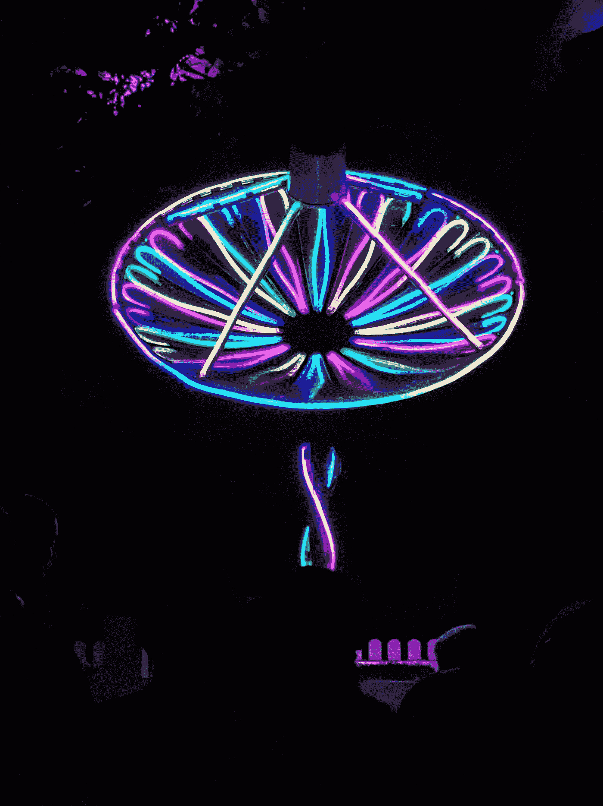
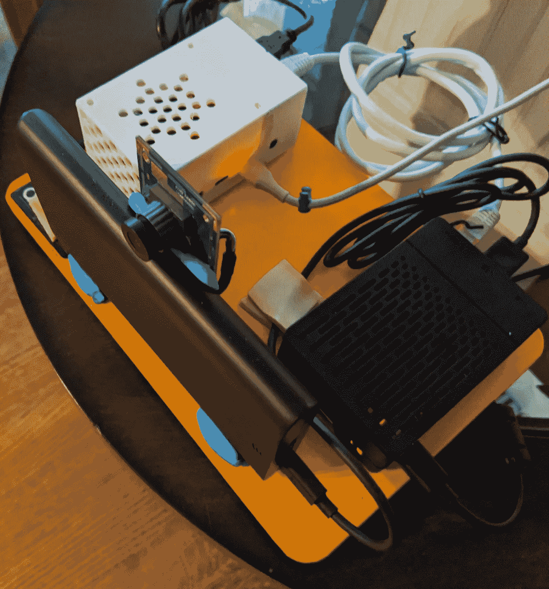
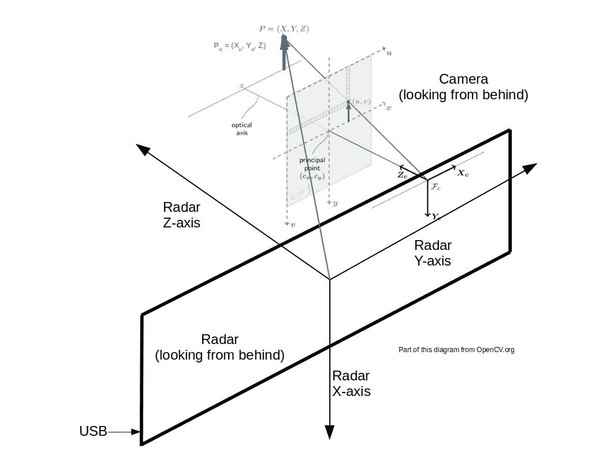
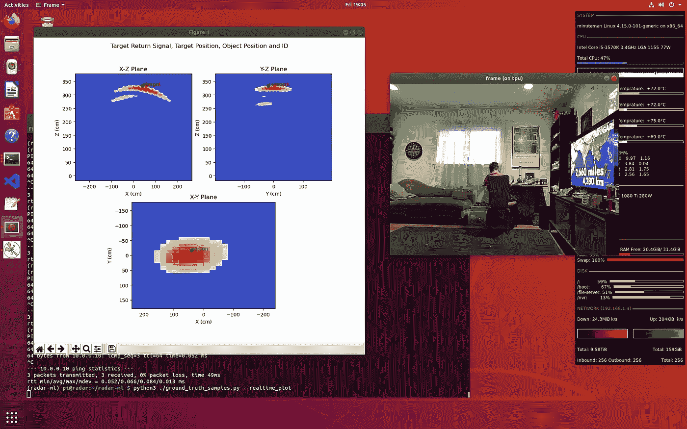
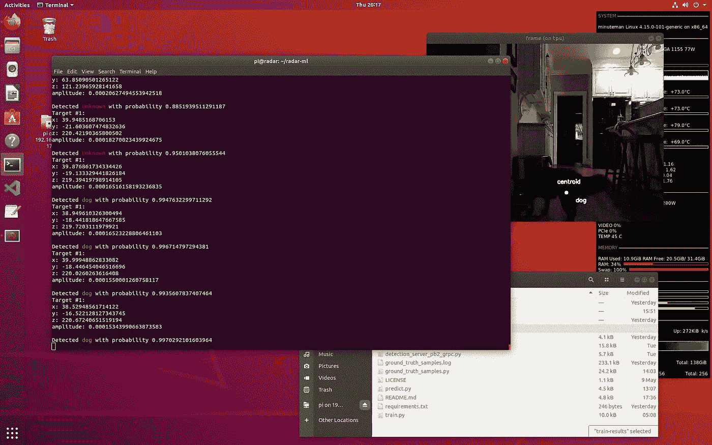

# 教雷达了解家

> 原文：<https://towardsdatascience.com/teaching-radar-to-understand-the-home-ee78e7e4a0be?source=collection_archive---------44----------------------->

## 使用自我监督学习为基于雷达的人体、宠物和物体检测生成数据集

詹姆斯·斯隆在 [Unsplash](https://unsplash.com?utm_source=medium&utm_medium=referral) 上的照片

# 介绍

计算机视觉利用商用相机、计算和机器学习算法，已经彻底改变了视频跟踪、对象检测和人脸识别。这为企业及其客户创造了巨大的价值，同时也带来了对隐私和个人信息控制的担忧。

对家庭环境中的人和物进行基于雷达的识别和定位相对于计算机视觉具有一定的优势，包括增加用户隐私、低功耗、零光操作和更灵活的传感器放置。与视觉系统相比，它确实有一些缺点。例如，雷达通常没有大多数基于摄像机的系统的分辨率，因此可能难以区分具有非常相似特征的物体。此外，虽然随着汽车和工业应用的增长，雷达的成本正在迅速下降，但它通常仍比长期以来依赖于移动电话单位体积的相机更昂贵。这些因素减缓了它在消费者应用中的采用。但更重要的是，能够用于训练或微调机器学习模型的雷达数据集非常少。这与计算机视觉数据集和模型的普遍存在形成了鲜明的对比。

在本文中，您将了解如何使用低功耗毫米波雷达精确检测人、宠物和物体，以及如何利用传统的基于摄像机的物体检测，利用自我监督学习来生成基于雷达的检测模型。自监督学习是自主监督学习。这是一种表示学习方法，消除了人类标记数据的需要[1]。

使用自我监督学习、训练和使用基于雷达的对象检测模型来收集数据的步骤如下。

1.  安排一个摄像头和一个雷达传感器来共享环境的公共视图。
2.  运行雷达和基于摄像机的对象检测系统来收集环境中目标的信息。
3.  当雷达在与目标探测器相同的空间点感测目标时，从雷达创建地面实况观测。
4.  根据这些观察结果训练一个机器学习模型，例如支持向量机(SVM ),并检查它对于您的应用是否具有可接受的精度。
5.  使用训练好的机器学习模型来预测新雷达目标的身份。

[Vayyar 的](https://vayyar.com/)雷达芯片采用 [Walabot](https://api.walabot.com/) 参考设计，鉴于其灵活性和广泛的可用性，是开发这些解决方案的绝佳选择。在谷歌的 Coral [边缘张量处理单元(TPU)](https://coral.ai/) 上运行的对象检测模型是另一个很好的选择，因为它可以比雷达扫描目标的速度快很多倍。

您可以在 [radar-ml](https://github.com/goruck/radar-ml) 找到关于该项目中使用的软件和硬件的更多详细信息。

# 培训设置

下面是为此项目创建的培训设置的照片。Walabot 雷达安装在前方水平位置，摄像头位于其顶部中央。白色盒子包含通过 USB 连接到相机的谷歌珊瑚边缘 TPU，黑色盒子包含通过另一个 USB 连接到雷达的树莓 Pi 4。

显示雷达、摄像机、TPU 和树莓派的训练设置

TPU 在 grpc 上运行实时对象检测服务器，Raspberry Pi 上的客户端与该服务器通信。对象检测服务器代码可以在[这里](https://github.com/goruck/detection_server)找到。Raspberry Pi 处理确定探测到的雷达目标是否与 TPU 探测到的物体相同所需的处理，以建立地面实况。Pi 和 TPU 通过专用的以太网链路进行通信，以最大限度地减少延迟，这对于准确确定雷达目标是否与探测到的物体相同至关重要。Pi 还使用训练好的模型对新的雷达目标进行预测，并用于将雷达目标数据的模型与地面实况进行拟合。

# 雷达和摄像机坐标系统

下图显示了雷达(XR，YR，YZ)、相机(XC、YC、ZC)、图像(x，y)和像素(u，v)坐标系。雷达被用作参照系。摄像机应放置在雷达装置的顶部中间，可以水平或垂直安装(USB 连接器用作参考，参见 Walabot 文档)。这确保了相机的光学 z 轴与雷达的 z 轴对齐，并且可以确定相机轴和雷达轴之间的固定偏移(这些被称为相机外部参数)。此外，你应该确保相机的视角与雷达的[区域](https://api.walabot.com/_features.html#_arena)紧密匹配，该区域在 Python 模块 [common.py](https://github.com/goruck/radar-ml/blob/master/common.py) 中定义。

雷达和摄像机坐标系之间的关系

理解这些关系对于将像素系统中的二维点(实际上是从相机中读取的)转换为雷达的参考系是很重要的。相机系统中的点以蓝色显示为 P(X，Y，Z)，雷达系统中的对应点以绿色显示为 PR(XR，YR，Z)。请注意，在两个系统中，Z 是相同的，因为雷达的 Z 轴与相机的光学 Z 轴对齐，图像平面尽可能靠近雷达 z = 0。关于如何进行坐标转换，请参见下一节。

摄像机可以放置在它与雷达共享一个点的视图的任何地方，只要摄像机的外部参数是已知的，以便它的视图可以旋转并转换到雷达的参考系中。如这里所做的，将相机放置在雷达单元的顶部中心极大地简化了坐标系的转换，但是能够使用任意放置的相机进行传感器的自我监督学习在生成数据时会非常有效。

您必须首先校准相机，以确定其内在参数(x 和 y 焦点和主点)并校正失真。固有参数用于将图像坐标转换为雷达坐标。你可以使用 [OpenCV](https://opencv-python-tutroals.readthedocs.io/en/latest/py_tutorials/py_calib3d/py_calibration/py_calibration.html) 来很容易地进行摄像机校准，这个项目中就使用了它。

参见参考文献[5]、[6]和[7]，了解更多关于相机和世界坐标系以及相机内部和外部参数的信息。

# 数据收集和建立基础事实

本节描述如何从雷达收集目标样本，以及如何建立地面实况(即目标识别)。雷达在一次扫描中可能会探测到多个目标，因此定位是这个过程的一部分。这里的一个关键挑战是实时地将三维雷达图像准确地转换成二维摄像机图像，因为人和宠物可以在场景中快速移动。因为雷达图像是三维的，所以可以使用目标的三个正交视图来生成数据集。选择要包含在数据集中的视图和每个视图的分辨率是模型复杂性、大小和准确性之间的权衡。

您可以使用 Python 模块 [ground_truth_samples.py](https://github.com/goruck/radar-ml/blob/master/ground_truth_samples.py) 通过从[对象检测服务器](https://github.com/goruck/detection_server)收集的基于摄像机的观察来处理真实雷达样本。这些观察结果以被检测对象的边界框及其标签的质心坐标的形式从服务器返回。服务器有大约 20 毫秒的*和*推理延迟。这与 200 毫秒的雷达扫描速率(是竞技场大小和分辨率的函数)相比是很小的。这个 1:10 的比例被设计成最小化雷达感测到的和摄像机看到的之间的跟踪误差。

质心坐标通过下面所示的函数转换为雷达参照系，然后计算每个雷达目标和转换后的质心坐标之间的距离度量。

将坐标从相机转换到雷达系统的功能

如果距离小于阈值，则宣布匹配，并且雷达目标的返回信号和标签被存储为观察值。

下面的代码片段显示了主循环的简化版本，它为单次雷达扫描执行这些操作。

雷达观测地面真实码的简化主回路

您可以配置 [ground_truth_samples.py](https://github.com/goruck/radar-ml/blob/master/ground_truth_samples.py) 来实时可视化地面实况过程，以确保其正常工作。下面的屏幕截图显示了一个可视化示例。您可以在左侧窗口中看到，在雷达三维目标回波信号强度的三个二维投影中的每一个投影中，检测到的目标(绿点)的质心都靠近目标中心(红点)。右侧窗口显示基于摄像机的对象检测器的视图。

地面真实可视化

# 模型训练和结果

您可以使用 Python 模块 [train.py](https://github.com/goruck/radar-ml/blob/master/train.py) 在雷达样本上训练 SVM 或逻辑回归模型。样本被缩放到[0，1]范围，类别被平衡，然后使用分层的 5 重交叉验证器来拟合模型。对拟合的模型进行校准、精度评估、序列化并保存到磁盘中。

从雷达可以获得目标回波信号的三个正交视图。您可以将这些视为三维目标信号在雷达的 X-Y 平面、X-Z 平面和 Y-Z 平面上的二维投影。这些中的任何一个或它们的任何组合都可以用作观察值。使用所有这三种方法将产生最佳精度，但是数据集(每个样本约 10k float32)和产生的 SVM 模型(1.5k 训练样本约 10MB)可能很大，尤其是在雷达扫描分辨率很高的情况下。选择最佳组合是一个训练超参数，可在 [train.py](https://github.com/goruck/radar-ml/blob/master/train.py) 中配置。

使用所有投影运行的训练结果如下所示。

使用所有预测对训练结果建模

仅使用 X-Y 投影的训练结果非常相似。与全投影情况相比，存在相对较小的降级。但模型训练时间和模型大小(约 10MB vs 1.6MB)差远了。使用所有视图进行训练似乎不值得，至少对于这个特定的数据集是如此。

最近训练的模型(使用所有投影)和数据集可以在[这里](https://drive.google.com/drive/folders/1y8twF6puPXvedXhsFhff45HlMawgHzcS?usp=sharing)找到。这个模型有“人”、“狗”和“猫”的标签。您可以轻松地将这些名称对应起来，以适合自己的家庭。该模型具有 10，011 个要素的输入向量，由来自 Y-Z 投影平面的 5，457 个要素、来自 X-Z 平面的 3，872 个要素和来自 X-Y 平面的 682 个要素组成。每个平面上的特征数量是雷达场大小和分辨率的函数，默认的训练场产生这些数量。

# 做预测

Python 模块 [predict.py](https://github.com/goruck/radar-ml/blob/master/predict.py) 用于说明如何使用训练好的模型对新的雷达样本进行预测。您可以使用不同于用于训练的雷达预测竞技场，因为预测模块会根据需要自动调整观测值。但是，您应该确保雷达阈值、过滤器类型和配置文件与用于训练的相似。此外，需要从训练中使用的相同正交平面构建观测值。

预测示例如下所示。

你可以使用这个模块和训练好的模型在你自己的 Walabot 雷达装置上运行预测。

# 结论

基于雷达的感知比基于视觉的方法有一些优势，包括增加用户隐私和零光操作，但很少有合适的数据集来训练机器学习模型。利用传统的计算机视觉，自我监督学习可以有效地用于生成这些数据集。使用中等大小的数据集和浅层机器学习模型，如支持在低成本计算机上进行推理的支持向量机，可以实现基于雷达的高目标检测精度。这些高精度模型支持客户家中的许多应用，包括入住和入侵检测，并且可以扩展到检测坠落等事故。

使用自我监督学习、训练和使用基于雷达的对象检测模型来收集数据的步骤如下。

1.  安排一个摄像头和一个雷达传感器来共享环境的公共视图。
2.  运行雷达和基于摄像机的对象检测系统来收集环境中目标的信息。
3.  当雷达在与目标探测器相同的空间点感测目标时，从雷达创建地面实况观测。
4.  根据这些观察结果训练一个机器学习模型，如 SVM，并检查它对于您的应用程序是否具有可接受的准确性。
5.  使用训练好的机器学习模型来预测新雷达目标的身份。

# 参考

这项工作受到参考文献[2]、[3]和[4]的启发。

1.自我监督学习让我们更接近自主学习

2.[基于雷达的实时人体活动识别](https://www.google.com/url?sa=t&rct=j&q=&esrc=s&source=web&cd=&cad=rja&uact=8&ved=2ahUKEwi8i9e-h9jpAhXLup4KHRsdCNMQFjABegQIBhAB&url=http%3A%2F%2Fcardinalscholar.bsu.edu%2Fbitstream%2Fhandle%2F123456789%2F201689%2FGuoH_2019-2_BODY.pdf%3Fsequence%3D1&usg=AOvVaw2Ps7ptIYpZGBYPnMQyPArp)

3.[采用多对多编码器/解码器模式的实时穿墙姿态成像](https://www.google.com/url?sa=t&rct=j&q=&esrc=s&source=web&cd=&cad=rja&uact=8&ved=2ahUKEwi_19iHiNjpAhXIi54KHUy1A_4QFjABegQIBxAB&url=https%3A%2F%2Farxiv.org%2Fpdf%2F1904.00739&usg=AOvVaw05g69S1Wbh3JwGiKmQPeH8)

4.[使用射频雷达感应对工作表面进行不引人注目的活动识别和位置估计](https://dl.acm.org/doi/fullHtml/10.1145/3241383)

5.[摄像机校准和三维重建](https://docs.opencv.org/2.4/modules/calib3d/doc/camera_calibration_and_3d_reconstruction.html)

6.[摄像机校准](http://homepages.inf.ed.ac.uk/rbf/CVonline/LOCAL_COPIES/OWENS/LECT9/node2.html)

7.[几何摄像机参数](https://www.cse.unr.edu/~bebis/CS791E/Notes/CameraParameters.pdf)