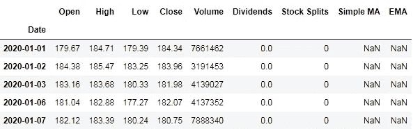
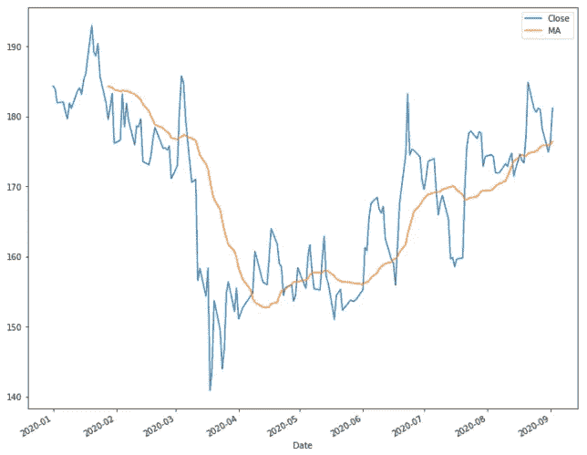
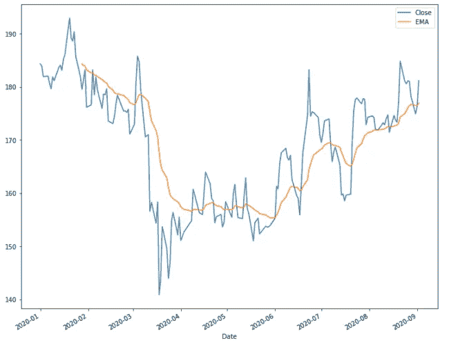
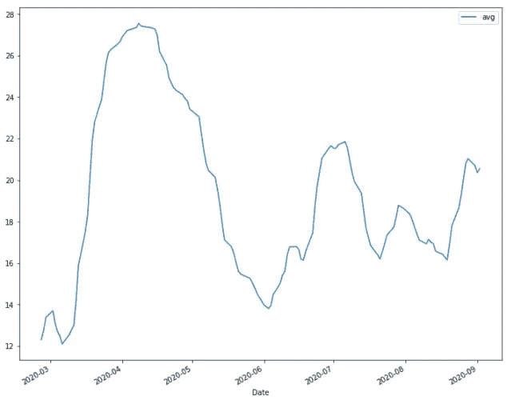
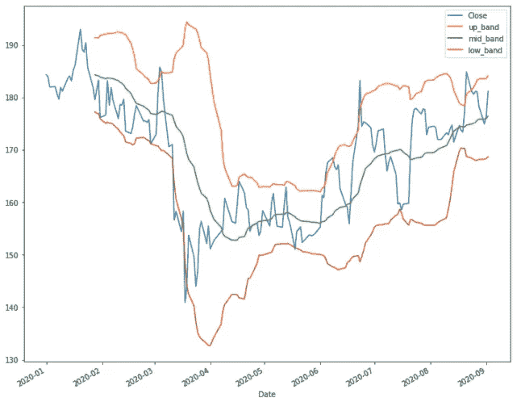
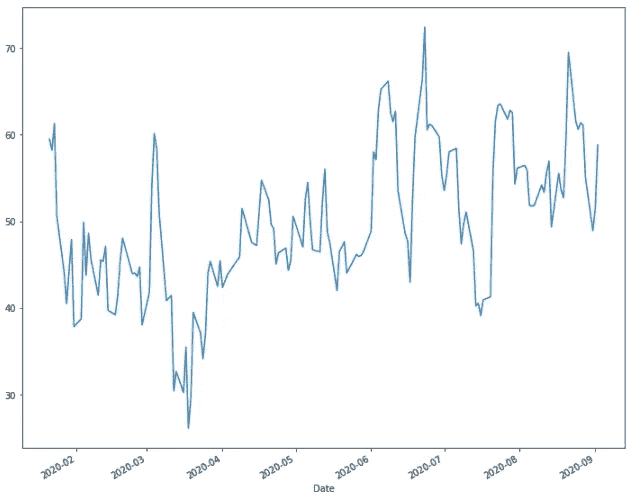

# 使用 TA-Lib 对股票进行技术分析

> 原文：<https://towardsdatascience.com/technical-analysis-of-stocks-using-ta-lib-305614165051?source=collection_archive---------7----------------------->

## 技术分析 python 库


杰森·布里斯科在 [Unsplash](https://unsplash.com?utm_source=medium&utm_medium=referral) 上的照片

技术性能指标是对不同的股票参数如成交量、价格等进行的数学计算。它们帮助我们识别一只股票在特定时间内遵循或将遵循的不同模式。这些性能指标通常使用图表和图形来可视化。

TA-Lib 是一个开源 python 库，用于分析股票市场的历史数据，如股价、成交量等。为了预测未来的价格或市场方向，以便我们能够相应地进行投资。

Ta-Lib 包含大量用于研究市场的技术指标。我们可以将大量的指标可视化，以便决定我们未来的战略。在本文中，我们将探讨如何使用 TA-Lib 创建不同的技术指标。

# **安装 Ta-Lib Python 库**

Ta-lib 安装不同于其他 python 库，因为它不能使用 pip install 直接安装。正式上市。首先，我们需要访问[链接](https://www.lfd.uci.edu/~gohlke/pythonlibs/#ta-lib)，根据我们的 windows 版本下载 Ta-Lib 的 whl 文件。之后，我们可以使用 pip install 安装它，如下所示。

```
pip install <filename.whl>
```

# **导入所需的库**

我们将致力于股票数据的技术分析，因此我们将导入数据库，除此之外，我们还需要导入一个 python 库来下载历史股票数据，以及将数据加载到数据框架中。我们还将使用 matplotlib 进行可视化。

```
import yfinance as yf
import talib as ta
import pandas as pd
import matplotlib.pyplot as plt
```

# **加载数据**

我们将下载印度 NSE 上市公司“Powergrid Corporation”的历史数据。对于下载，我们将融资，然后使用 pandas 将下载的数据存储到数据帧中。

```
power = yf.Ticker("POWERGRID.NS")
df = power.history(start="2020-01-01", end='2020-09-04')
df.head()
```



请求期间的库存数据

# **使用 Ta-Lib 创建技术指标**

现在我们将开始使用 Ta-Lib 创建不同的技术指标。虽然有大量的技术指标，但我们只分析其中最重要的或者专业人士使用频率高的指标。

1.  **简单移动平均线**

简单移动平均线(SMA)通过该范围内的周期数来计算选定范围内收盘价的平均值。

```
df['MA'] = ta.SMA(df['Close'],20)
df[['Close','MA']].plot(figsize=(12,12))
plt.show()
```



简单移动平均线

2.**指数移动平均**

指数移动平均线(EMA)是一种移动平均线(MA ),它对最近的数据点赋予更大的权重和重要性。也就是说，它通常被称为指数加权移动平均线。

```
df['EMA'] = ta.EMA(df['Close'], timeperiod = 20)
df[['Close','EMA']].plot(figsize=(12,10))
plt.show()
```



指数移动平均值

3.**平均定向运动指数(动量指标)**

ADX 可以用来帮助衡量趋势的整体强度。ADX 指标是不断扩大的价格区间值的平均值。

```
df['avg'] = ta.ADX(df['High'],df['Low'], df['Close'], timeperiod=20)
df[['avg']].plot(figsize=(12,10))
```



ADX 动量指示器

4.**布林线**

布林线是一种统计图表，使用约翰·布林格提出的公式方法来描述金融工具或商品的价格和波动性。

```
df['up_band'], df['mid_band'], df['low_band'] =   
                         ta.BBANDS(df['Close'], timeperiod =20)df[['Close','up_band','mid_band','low_band']].plot(figsize=  
                                   (12,10))
plt.show()
```



布林线

**5。相对强度指数**

相对强弱指数是一种用于金融市场分析的技术指标。它旨在根据最近一个交易周期的收盘价来绘制股票或市场当前和历史的强弱。

```
df['Relative'] = ta.RSI(df['Close'],14)
df['Relative'].plot(figsize=(12,10))
plt.show()
```



相对强度指示器

这些是一些最常用的技术指标，我们可以用它们来可视化和分析市场趋势和未来预测

# **结论:**

在本文中，我们看到了如何使用 whl 文件安装 Ta-Lib。之后，我们看到了如何使用 yfinace 加载数据并将其存储到 dataframe 中。然后我们使用这些数据进行技术分析，并使用 Ta-Lib 创建不同的技术指标。这只是对基本指标的介绍，在 Ta-Lib 下还定义了更多的指标，我们可以探索这些指标。

[](/downloading-stock-data-and-representing-it-visually-6433f7938f98) [## 下载股票数据并直观地展示出来

### 使用 YFinance 和 Plotly 库进行股票数据分析

towardsdatascience.com](/downloading-stock-data-and-representing-it-visually-6433f7938f98) [](https://medium.com/analytics-vidhya/using-plotly-for-building-candlestick-chart-for-the-stock-market-analysis-5305b48a5f75) [## 使用 Plotly 构建蜡烛图:用于股票市场分析。

### 理解股票市场运动的一个非常重要的图表。

medium.com](https://medium.com/analytics-vidhya/using-plotly-for-building-candlestick-chart-for-the-stock-market-analysis-5305b48a5f75) [](/automating-machine-learning-a486d365e423) [## 自动化机器学习

### 使用 H2O 汽车公司自动化机器学习

towardsdatascience.com](/automating-machine-learning-a486d365e423) 

# 在你走之前

***感谢*** *的阅读！如果你想与我取得联系，请随时通过 hmix13@gmail.com 联系我或我的* [***LinkedIn 个人资料*** *。*](https://www.linkedin.com/in/himanshusharmads/) *您还可以查看我的*[*G****ithub***](https://github.com/hmix13/)**关于数据科学不同项目的简介。**