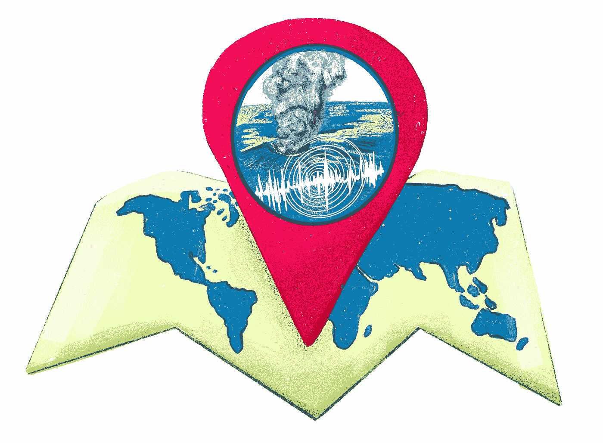
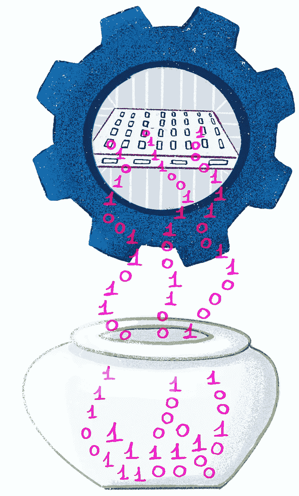
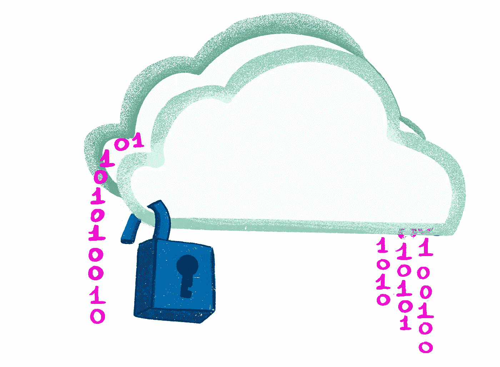

# 重工业中人工智能面临的技术挑战

> 原文：<https://towardsdatascience.com/technical-challenges-for-ai-in-heavy-industry-7a77a5563e8c?source=collection_archive---------56----------------------->

## 以及如何克服它们

插图由乔万娜·孔福尔蒂制作

决定已经做出了。我们正在寻找的公司已经决定实施新的数字战略，以节省成本并为未来的竞争业务奠定基础。在人工智能和工业物联网(IIoT)的帮助下，新 CEO 致力于数字化变革。在重工业中，有许多挑战需要考虑。我们在此调查的示例性矿业公司面临着许多工业部门的企业在进行数字化时面临的相同问题。

# **工业部门的初步情况**

大多数公司都在努力吸引和保留合适的技术能力。这不仅影响到新系统的投资和新技术的采购，还影响到新的高潜力人才的聘用。毕业生进入这些行业的主要障碍是过时的专有技术，这需要耗时且昂贵的培训，并限制了未来的就业前景。结果，就业市场停滞不前，老一辈是唯一知道特定系统如何工作的人。

此外，传统工业工程文化盛行，这与计算机科学氛围截然不同。在机械和电子工程中，专利和秘密是需要保护的核心价值。在数据驱动的公司中，许多有价值的工具被共享，甚至在开源许可下免费赠送。从他们的角度来看，共享的好处超过了整个行业将数据保存在孤岛中的问题。他们通过其他独特的商业模式和专业知识赚钱。

人工智能的使用带来的结果与预期有很大的不同。很难收获某个过程 50%的改进，因为大多数度量已经很高了。可尝试的东西简直不多。这是因为物理定律是不变的，标准的优化方法已经到位，进一步的设备现代化是昂贵的。因此，2%的优化对公司来说是一个重大进步，可以通过实施人工智能解决方案来实现。

# **对其他行业的怀疑**

工业领域的一个常见说法是，它是独一无二的，与所有其他行业都非常不同。“你不能在这里这样做！”是一句经常听到的名言。重工业独立于真正的工程杰作的可理解的骄傲，实际上与其他工业有许多共同之处。重工业公司也以同样的方式优化他们的业务。即使在其他行业，安全问题较低，高商业价值不像重工业那样面临严重风险，但基本的经济原则仍然适用。

人工智能和数据科学方法在其他行业进行了测试，并取得了非凡的成果。这些技术节省了资金，并开启了新的商业机会。在旅程开始时，他们还面临着必须克服的巨大技术问题。当你看看 15 年前的[亚马逊](https://edition.cnn.com/interactive/2018/10/business/amazon-history-timeline/index.html)并检查 AWS 系统时，它们是弯曲的和临时拼凑的。无论如何都不适合关注安全的行业。但是现在，这些全球安装的系统显示出前所未见的可靠性。

数据的性质可能也是一个问题。它在处理和分析方面相当复杂，因为工业部门具有以高频率为特征的机器生成的数据，并且是以全自动的方式创建的。一方面，机器学习算法可以在拥有大量数据的情况下得到更好的训练。另一方面，公司必须克服非常具体的数据科学挑战和限制，同时缺乏处理此类数据的技能。

插图由[乔凡娜·孔福尔蒂](https://www.giocillustrations.com/)制作

# **重工业新技术的挑战**

当一位首席执行官希望在偏远和恶劣的环境中应用人工智能和物联网解决方案时，有一些独特的现实需要注意。矿山和其他生产设施可能位于交通不便的偏远地区。油田可能在海上，只能通过船运或空运才能到达。天气条件通常很差。网络和互联网接入在带宽和可靠性方面受到限制。恶劣的环境带来了特殊的挑战和限制。它们可以创造一个爆炸性的环境，产生气体和振动，或者处于水下或地下的高温或低温环境中。

更值得注意的是重工业使用的机器和系统。这些昂贵的设置是为了长期维持和活跃而创建的。通常，系统会随着时间的推移而增长。矿山或其他设施具有异构的机器园区和设置，并且它们没有协调的基础设施。这些机器不是用来连接互联网的。它们被设计成提供大量用于规划和控制的本地数据。这些系统大多需要实时控制。他们没有专门的接口来提取数据用于更一般的目的。

现有机器的一些技术要求也适用于新的 IIoT 和人工智能应用。它们需要能够在没有光源或没有电网的情况下工作，必须能够承受振动并且可靠。这些应用程序应该不会对生命造成威胁，并且能够应对各种各样的辍学和中断。

# **收集所需数据的问题**

答人工智能系统需要高质量和高完整性的正确数据集来创建有价值的预测和优化操作。那么，如何着手设置新的传感器，改装旧机来获取这些数据呢？如何从现有系统中提取数据流，如何清理现有的数据流？虽然数字双胞胎对大规模制造和昂贵产品的设计很有吸引力，但在制造设施之外推广这项技术可能会更难。重工业在许多不同的配置下运行，它们使用来自不同供应商的设备。因此，需要一种适合 IIoT 的技术。

可用技术的一个例子是 IIoT 供应商 [relayr](https://relayr.io) 。该公司开发了巧克力棒形式的传感器来改装各种机器。它们被慕尼黑再保险公司以 3 亿美元的价格收购，并转型为[设备即服务](http://www.valvemagazine.com/web-only/categories/trends-forecasts/10355-equipment-as-a-service-extending-the-subscription-model-to-industrial-equipment.html)解决方案提供商。然而，这些新技术的问题仍然是系统集成。客户仍然需要证明所提供的技术是否符合需求，是否可以集成到现有的流程中。

插图由[乔万娜·孔福尔蒂](https://www.giocillustrations.com/)制作

经常发生的情况是，所需的数据来自过程控制和 mes 系统，而这些系统最初并不是为了分析的目的。过时的归档系统通常以不合适的格式存储数据。与此同时，信息的结构化和系统化程度很低。有时，由于某些人的参与，数据可能不准确。在一定程度上了解和理解该过程对于解释所有这些障碍是至关重要的。

# **向机器学习单元传输数据的问题**

很多技术流程需要实时决策和控制。在现货市场交易、时间紧迫的采购或事故处理中，业务流程需要快速决策。如何为传感器持续供电，以传输电网覆盖范围之外的孤立资产的状况和性能的关键任务数据？如何在没有现有移动网络的情况下传输所有需要的数据？如何在可能在最意想不到的时刻崩溃的不可靠网络中做出可靠的决策？

这些问题对于由工程师建造和运营的工业公司来说并不陌生。在数据工程中，传统工程中使用的原则同样适用。只是要达到的目标不一样。在这里，不间断的数据流是一个优先事项。实现这种高质量数据流的方法是不同的。传统工程师和软件/系统工程师有[非常不同的培训和理念](https://www.theatlantic.com/technology/archive/2015/11/programmers-should-not-call-themselves-engineers/414271/)。这里有一些需要克服的文化差异。

有时，一些包含关键信息的数据可能会延迟很长时间才能到达系统。例如，实验室的分析结果几个小时后才为人所知。一些错误也会随着时间的推移而积累。如果一些传感器损坏，仍然需要确定一个模式并考虑它们，恢复丢失的数据。即使在生产使用中，模型也需要能够实时运行，并在并非过程的所有参数都精确已知的情况下返回建议或预测。需要使用许多技巧来重建和进行虚拟测量，以确保机器学习模型是可靠的，即使公司在不确定的条件下运营。

# **应对挑战的解决方案**

建立物联网基础设施的主要问题之一是电力供应。如今，随着低功耗 IIoT 设备的快速发展，很容易找到现成的组件作为起点。需要在获取的能量和快速发展的 IIoT 应用所需的数据量之间进行折衷。对于连接需求，新兴的边缘计算解决方案有助于克服这一问题。IIoT 和自动驾驶汽车依赖于设备本身内置的计算能力，而不是网络的带宽和接入。

专业工程师总是工业公司的起源。他们在使用数字和进行实验方面经验丰富。通过这种方式，选择成功标准、为模型定义特性或者设计 A/B 测试的过程变得更加容易。没有必要解释为什么在上线之前要进行测试。工程师习惯于根据数据而不是直觉做出决定。

# **数据共享和保护**

一旦建立了物理基础设施，就必须讨论数据处理。数据具有金钱上的但无形的价值，公司不想与他人分享。公司看到了通过分享数据见解失去竞争优势的风险。有人担心数据可能会交叉污染。共享数据的好处，尤其是在供应链集成的情况下，往往超过对数据保护不足的担忧。利用更多可用数据的人工智能流程改进可以为整个行业以及单个公司带来更多价值。这种方法已经在许多其他部门得到了证明。这个数据池改善了人工智能系统的学习结果，从而改善了运营模式并降低了运营成本。对数据可能因网络攻击而丢失的担忧仍然存在，这影响了总体上共享数据的意愿，在云中也不起作用。安全和隐私是物联网项目面临的最大技术挑战。据 Gartner 称，这是由于缺乏熟练员工、复杂的供应商环境和不成熟的标准。

插图由[乔万娜·孔福尔蒂](https://www.giocillustrations.com/)制作

尽管有这些顾虑，创新还是被培养起来了，新产品的想法也出现了。在更广泛的基础上测试想法加速了开发，并被给定行业内的大量公司所接受。风险被分担了，每个企业的开发工作量也减少了。共享数据是匿名的，所以无法追溯到数据所有者。研究主导的倡议应该关注[差别私有决策森林算法](https://pdfs.semanticscholar.org/4328/0d6344a83290544304198d8087c28bfd4161.pdf)。这些算法最大限度地减少了对给定数据的查询次数。因此需要的计算能力更少，并且这些单独查询的敏感度更低。我们还看到，公司越来越开放地与原始设备制造商(OEM)交换数据，因为这对运营商来说更有利可图(例如，在飞机发动机的制造中)。

# **业务视角和范围**

T 何全行业都在说，“什么东西都太贵了！一切都太复杂了！”不再有效。有很好的方法来开始数字化转型，并将有价值的 AI 和 IIoT 应用集成到每个公司。然而，有一些障碍需要克服。重工业中的旧机器和旧系统面临的具体挑战需要得到解决。首席信息官和其他数字传教士必须从业务回报和技术可行性的角度(从绝对值和回报期两个方面)对组织内的机会进行优先排序。全球研究和咨询公司 [Gartner 建议](https://www.gartner.com/en/information-technology/insights/internet-of-things)大多数 AI 和 IIoT 项目应该在不到一年的时间内实现财务回报。

作为开始，采矿公司的首席执行官可以启动第一个项目和试验阶段。启动项目不一定需要高水平的技能、人力资源或现金支出。第一步可能包括使用开源工具构建人工智能解决方案。根据经验和概念验证，该项目可以迅速扩大规模，为整个公司带来即时价值。然而，有时技术概念验证并不能说服管理层在 IIoT 上花钱，因此考虑分配一些时间通过 IIoT 实施来证明价值。这也可能是一种选择，即接触现有的 AI IIoT 解决方案供应商，并与可靠的合作伙伴一起进入兔子洞。

插图由[乔万娜·孔福尔蒂](https://www.giocillustrations.com/)制作