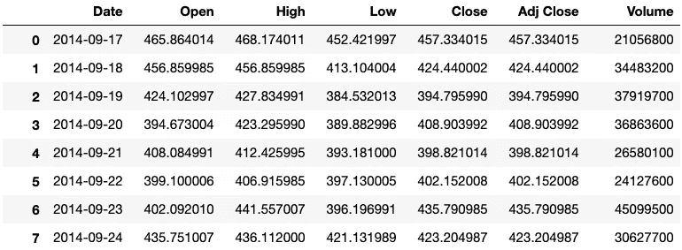
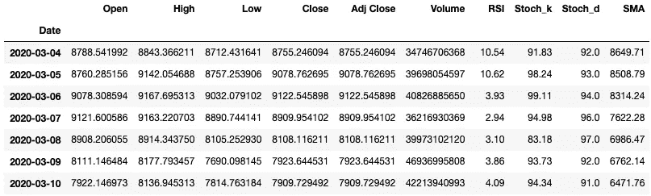
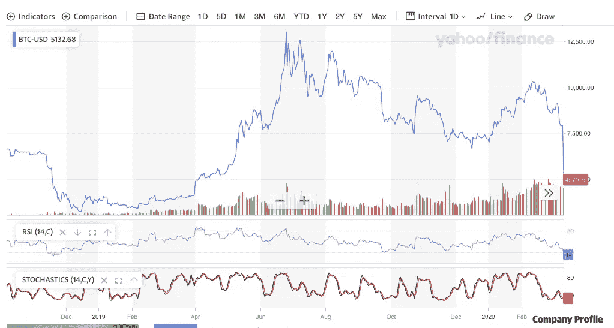
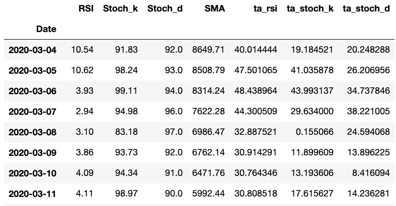

# 我是如何为比特币的技术指标编码的

> 原文：<https://towardsdatascience.com/technical-indicators-on-bitcoin-using-python-c392b4a33810?source=collection_archive---------10----------------------->

## 使用 Python 创建比特币技术指标


阿列克西·里斯在 [Unsplash](https://unsplash.com?utm_source=medium&utm_medium=referral) 上的照片

谈到交易，有很多种技术可以用来寻找最佳投资时机。有些人可以看看财务状况，看看幕后是否有价值。其他人可能会看每日新闻，观察它如何影响当前价格。另一组可能实际上观察过去的价格变动，并试图辨别可能的模式来确定未来的价格变动。

**技术分析**关注观察过去价格和运动来预测未来价格的群体。通过利用技术分析，我们可以从一个元素的价格历史中得出许多不同的模式。过去半个世纪发展起来的数学公式已经被用来从股票的价格和交易量历史中推导出新的价值。这些公式的返回值就是我们所说的*技术指标*。

在交易比特币这种资源的时候，除了它的价格历史和成交量，没有太多可以分析的。如果你看一下它的 [*雅虎财经页面*](https://finance.yahoo.com/quote/BTC-USD/) 并与任何一只 [*随机股票的页面*](https://finance.yahoo.com/quote/AAPL?p=AAPL) 进行比较，你会发现它少了一些财务信息。这是因为比特币不是公司而是货币。比特币没有*资产负债表*、*损益表*、*等等*。

在没有基本面信息的情况下，我们可以在交易比特币时利用技术指标。如果我们想要向交易算法或机器学习预测模型添加更多变量，那么我们可以向数据集引入更多特征(*技术指标*)，而不是通常的价格和交易量历史。当利用机器学习模型时，这种策略可能有助于预测未来价格。

接下来，我们将利用 Python 的多个库，用 Python 编写这些技术指标。

> 在这里注册一个中级会员，可以无限制地访问和支持像我这样的内容！在你的支持下，我赚了一小部分会费。谢谢！

# 技术指标

我们将尝试的技术指标有:

*   [相对强度指数](https://school.stockcharts.com/doku.php?id=technical_indicators:relative_strength_index_rsi)
*   [随机振荡器](https://www.investopedia.com/terms/s/stochasticoscillator.asp)
*   [简单移动平均线](https://www.investopedia.com/terms/s/sma.asp)

这些指标看起来很简单，我们可以开发一个函数来创建新的值和特性，并将其引入到我们的数据集中。

为了开发这些功能，让我们首先导入必要的库，同时[下载比特币](https://finance.yahoo.com/quote/BTC-USD/history?p=BTC-USD)的最新价格历史。价格历史的另一个选项是使用金融数据 API，如 [**EOD 历史数据**](https://eodhistoricaldata.com/r/?ref=31CX3ILN) 。注册是免费的，你可以获得大量的金融数据。*披露:我通过上面的链接从任何购买中赚取一小笔佣金。*

```
import pandas as pd
import _pickle as pickle
import numpy as np
import matplotlib as plt
plt.style.use('bmh')df = pd.read_csv('BTC-USD.csv')
```

运行这段代码时，请看一下熊猫数据帧:



显示 BTC 价格和交易量历史的数据框架

之后的另一个步骤是将索引转换成日期时间格式。这是一个简单的过程，只需要几行代码:

```
# Datetime conversion
df['Date'] = pd.to_datetime(df.Date)# Setting the index
df.set_index('Date', inplace=True)
```

通过运行这些代码行，可视化该数据集中的任何列或要素将变得更加容易。

## 为指标编码

有了可供我们操作的数据，让我们从编写一些简单的函数开始，这些函数将给出我们需要的技术指标值。(*这些指标的公式可以在技术指标*的链接中找到)。

一旦我们在适当的列上运行这些函数，我们将从这些技术指标中获得一组新的特性。



不错！我们能够成功地进行特征工程，并将这些新数据引入到我们的数据集中。

# 检查我们的数据或值

但是，我们如何验证这些值呢？嗯，有在线查看的选项，例如带有指标的股票图表，它会向我们显示特定时间的正确值。一种选择是将我们的价值观与雅虎财务图表进行比较。



雅虎财经为 BTC 制作的图表

当我们将我们的技术指标值与图表进行比较时，我们可以看到并不匹配。可能是函数有问题，或者我们漏了一些计算。不管怎样，我们的功能并没有像我们希望的那样运行。

我们将何去何从？我们可以回去试着修改我们的代码，或者我们可以尝试一种更实际的方法。这种方法将使用已经为我们编写和提供的技术分析库。大多数时候，使用 Python 库进行这类计算比我们自己编写函数要好。

我们将使用的库简单地称为— ***ta*** 。您可以单击下面的链接，了解如何开始使用该库的说明:

 [## 欢迎来到 Python 文档中的技术分析库！-技术分析库在…

### 这是一个金融时间序列数据集(开盘、收盘、盘高、盘低、成交量)的技术分析库。你可以用它…

python.readthedocs.io 中的技术分析库](https://technical-analysis-library-in-python.readthedocs.io/en/latest/) 

这里提供的函数比我们创建的函数更加通用，所以让我们使用它们。

```
# Importing Library
import ta# TA's RSI
df['ta_rsi'] = ta.momentum.rsi(df.Close)# TA's Stochastic Oscillator
df['ta_stoch_k'] = ta.momentum.stoch(df.High, df.Low, df.Close)
df['ta_stoch_d'] = ta.momentum.stoch_signal(df.High, df.Low, df.Close)
```

运行上述代码后，我们将得到下面的数据框架:



我们的价值观与助教图书馆的价值观相比

我们可以看到，我们创造的价值与 TA 的价值有很大的不同。我们还可以用雅虎财经的图表再次检查这些值的有效性，并看到它们确实匹配。

# 结论

在尝试创建我们自己的技术指标函数之后，我们发现了一个更好的方法，那就是导入一个技术分析库。一般来说，最好使用 Python 库，而不是你自己编写的函数，因为它们通常比我们可能编码的任何东西都要优化得多。该库还为我们提供了添加更多指示器的选项，而不是试图自己编码。最后，我们能够练习编码出一些简单的算法和函数，尽管它们没有我们希望的那么精确。

一旦我们构建了这个充满新功能和价值的新数据框架，我们现在就可以将这些额外的数据输入到机器学习模型中。这些数据是易于理解的熊猫格式，可用于潜在的时间序列预测模型。希望我们可以通过使用这些额外的技术指标来改善预测结果。

[*在 Twitter 上关注我:@_Marco_Santos_*](https://twitter.com/_Marco_Santos_)

# 资源

[](https://github.com/marcosan93/BTC-Forecaster) [## 马克桑 93/BTC-预报员

### 使用机器和深度学习模型预测 BTC 的未来价格-Marcos an 93/BTC-预测者

github.com](https://github.com/marcosan93/BTC-Forecaster)  [## 欢迎来到 Python 文档中的技术分析库！-技术分析库在…

### 这是一个金融时间序列数据集(开盘、收盘、盘高、盘低、成交量)的技术分析库。你可以用它…

python.readthedocs.io 中的技术分析库](https://technical-analysis-library-in-python.readthedocs.io/en/latest/)