# Python 中交易的技术模式识别

> 原文：<https://towardsdatascience.com/technical-pattern-recognition-for-trading-in-python-63770aab422f?source=collection_archive---------8----------------------->

## 回溯测试一些奇特的技术模式并评估它们的性能

***注来自《走向数据科学》的编辑:*** *虽然我们允许独立作者根据我们的* [*规则和指导方针*](/questions-96667b06af5) *发表文章，但我们不认可每个作者的贡献。你不应该在没有寻求专业建议的情况下依赖一个作者的作品。详见我们的* [*读者术语*](/readers-terms-b5d780a700a4) *。*

我刚刚出版了一本新书《Python 中的*新技术指标》。它对复杂的交易策略进行了更完整的描述和补充，Github 页面致力于不断更新代码。如果你对此感兴趣，请随时访问下面的链接，或者如果你喜欢购买 PDF 版本，你可以在 Linkedin 上联系我。*

*[](https://www.amazon.com/gp/product/B09919GQ22/ref=as_li_tl?ie=UTF8&camp=1789&creative=9325&creativeASIN=B09919GQ22&linkCode=as2&tag=sofien-20&linkId=bc5df3f6ab0f3af2df79641c56b949ba) [## 交易策略之书

### 亚马逊网站:交易策略之书(9798532885707): Kaabar，Sofien:书籍

www.amazon.com](https://www.amazon.com/gp/product/B09919GQ22/ref=as_li_tl?ie=UTF8&camp=1789&creative=9325&creativeASIN=B09919GQ22&linkCode=as2&tag=sofien-20&linkId=bc5df3f6ab0f3af2df79641c56b949ba)* 

*模式识别是搜索和识别具有近似相似结果的循环模式。这意味着当我们设法找到一个模式，我们有一个预期的结果，我们希望看到并通过我们的交易采取行动。例如，头肩顶形态是典型的技术形态，预示着趋势即将反转。文献对这一著名构型的预测能力有不同看法。在本文中，我们将讨论一些奇特的*目标*模式。我说客观是因为它们有清晰的规则，不像经典的模式，如头肩底和双顶底。我们将讨论由 Tom Demark 创建的三种相关模式:*

*   ***TD 微分。***
*   ***TD 反向差速器。***
*   ***TD 反微分。***

*关于其他技术交易模式的更多信息，请查看下面的文章，这篇文章展示了 Waldo 配置，并对其中一些进行了回溯测试:*

*[](https://medium.com/@kaabar.sofien/wheres-waldo-67f73baa0929) [## 沃尔多在哪？

### 著名的技术分析师 Tom Demark 创造了许多成功的指标和模式。在他众多的…

medium.com](https://medium.com/@kaabar.sofien/wheres-waldo-67f73baa0929)* 

*TD 差分组已创建(或发现？)以便找到短期反转或延续。他们应该通过给我们一个额外的信念因素来帮助确认我们的偏见。例如，假设你预期美元兑加元在未来几周将会升值。你有自己的交易理由，你发现在更高的时间框架内有一些模式似乎证实了你的想法。这肯定会让你在交易时更舒服。下面是触发三种不同模式的条件汇总表。*

*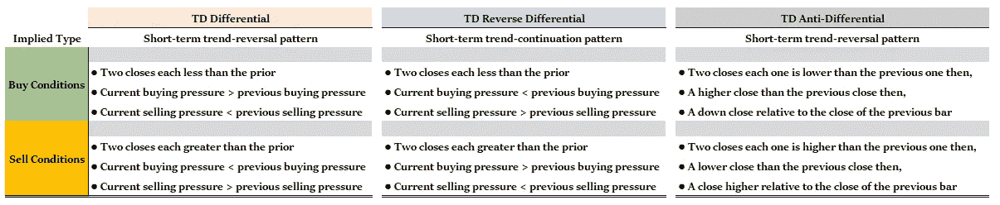*

*三种价格模式的条件摘要。(图片由作者提供)*

*在我们开始单独介绍这些模式之前，我们需要从差异群体的角度来理解买卖压力的概念。为了计算购买压力，我们使用以下公式:*

*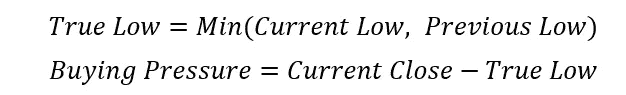*

*为了计算卖出压力，我们使用以下公式:*

*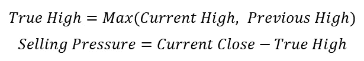*

*现在，我们将逐一介绍它们，首先展示一个真实的例子，然后用 python 编写一个搜索它们的函数，最后我们将创建基于模式的交易策略。值得注意的是，我们将回测 M5 棒线的非常短期的范围(从 2019 年 11 月开始)，每笔交易的买卖价差为 0.1 点子(因此，每轮成本为 0.2 英镑)。*

# *TD 差分模式*

*这种模式试图寻找短期趋势反转；因此，它可以被看作是小幅调整和盘整的预测指标。下面是一个 TD 差异模式的蜡烛图的例子。*

*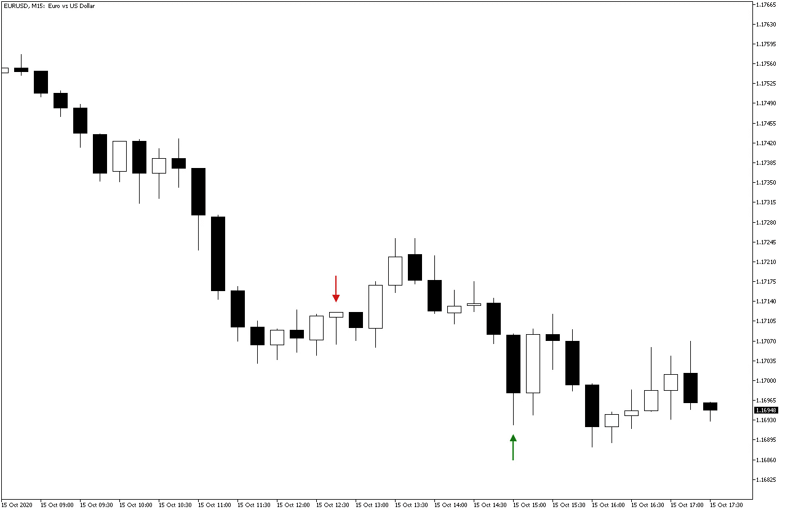*

*该模式的示例。注意反应的短期趋势。(图片由作者提供)*

*如果我们想用 Python 编写条件代码，我们可以有一个类似于下面的函数:*

*买入(做多)触发器:*

*   ***两次收盘各比先前少。***
*   ***当前买入压力>前期买入压力。***
*   ***当前卖压<前期卖压。***

*卖出(做空)触发器:*

*   ***两次收盘各大于前一次。***
*   ***当前买入压力<前期买入压力。***
*   ***当前卖压>前期卖压。***

```
*def TD_differential(Data, true_low, true_high, buy, sell):
    for i in range(len(Data)):

        # True low
        Data[i, true_low] = min(Data[i, 2], Data[i - 1, 3])
        Data[i, true_low] = Data[i, 3] - Data[i, true_low]

        # True high  
        Data[i, true_high] = max(Data[i, 1], Data[i - 1, 3])
        Data[i, true_high] = Data[i, 3] - Data[i, true_high]

        # TD Differential
        if Data[i, 3] < Data[i - 1, 3] and Data[i - 1, 3] < Data[i - 2, 3] and \
           Data[i, true_low] > Data[i - 1, true_low] and Data[i, true_high] < Data[i - 1, true_high]: 
               Data[i, buy] = 1if Data[i, 3] > Data[i - 1, 3] and Data[i - 1, 3] > Data[i - 2, 3] and \
           Data[i, true_low] < Data[i - 1, true_low] and Data[i, true_high] > Data[i - 1, true_high]: 
               Data[i, sell] = -1*
```

*现在，让我们在尊重风险管理系统的同时回测这个策略，这个系统使用 ATR 来设置目标止损和止盈订单。我发现，通过使用 4 倍 ATR 的止损点和 1 倍 ATR 的目标点，算法可以产生最佳的利润(无论是正的还是负的)。很明显，这明显违反了基本的风险回报比规则，然而，请记住，这是一个系统化的策略，以牺牲风险回报比为代价，寻求命中率的最大化。*

****提醒:*** *风险回报比(或回报风险比)衡量平均来说，你愿意承担的每一个风险，你期望得到多少回报。例如，你想以 100 美元买入一只股票，你的目标是 110 美元，你的止损单是 95 美元。你的风险回报比是多少？很明显，你是在拿 5 美元冒险来获得 10 美元，因此 10/5 = 2.0。因此，你的风险报酬率是 2。通常建议比值始终高于 1.0，最佳值为 2.0。在这种情况下，如果你交易相等的数量(大小),并用你预期收入的一半冒险，你只需要 33.33%的命中率就能达到盈亏平衡。一个好的风险回报比将减轻追求高命中率的压力。**

*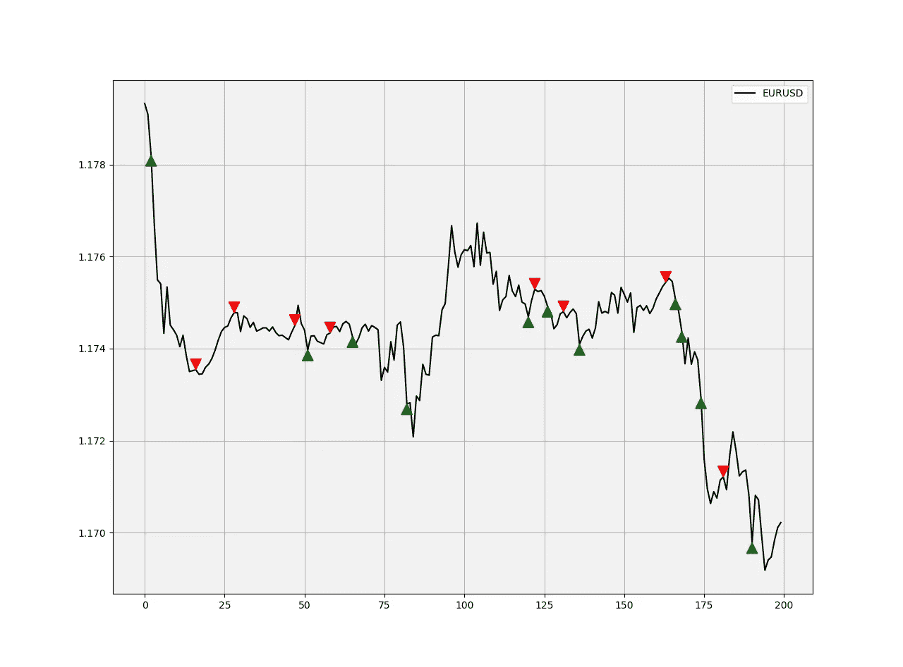*

*欧元兑美元-道指差异模式的信号图示例。(图片由作者提供)*

*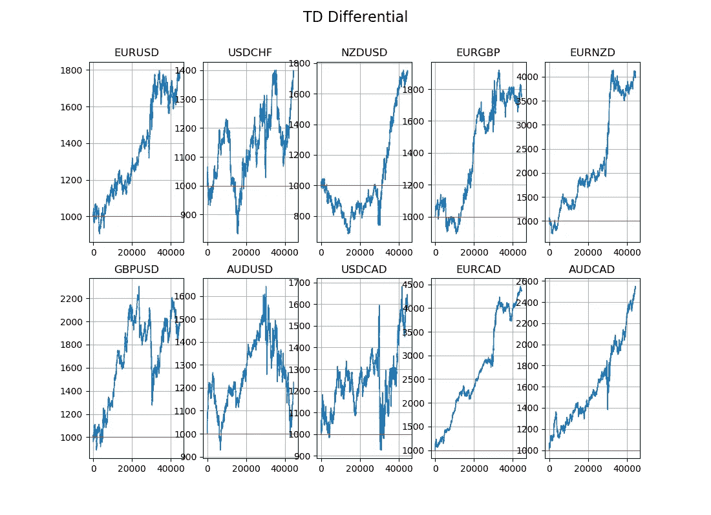*

*10 种主要货币对的 TD 差异策略的权益曲线。(图片由作者提供)*

*看起来它在澳元和欧元上运行良好，但在一些中期表现不佳。此外，除了澳元兑美元、GBPUSD 元和美元兑加元之外，股票曲线的总体趋势是向上的。对于只基于一种模式的策略来说，如果我们添加其他元素，它确实会显示出一些潜力。如果我们看一下荣誉奖，澳元兑加元的表现指标还不错，命中率高达 69.72%，预期每笔交易为 0.44 美元。*

*如果你也对更多的技术指标和使用 Python 创建策略感兴趣，那么我关于技术指标的畅销书可能会让你感兴趣:*

*[](https://www.amazon.com/gp/product/B08WZL1PNL/ref=as_li_tl?ie=UTF8&camp=1789&creative=9325&creativeASIN=B08WZL1PNL&linkCode=as2&tag=sofien-20&linkId=e3cb9716bb6a07cf6c8b9fb585412b07) [## Python 中的新技术指标

### 亚马逊网站:Python 中的新技术指标:9798711128861: Kaabar，Sofien 先生:书籍

www.amazon.com](https://www.amazon.com/gp/product/B08WZL1PNL/ref=as_li_tl?ie=UTF8&camp=1789&creative=9325&creativeASIN=B08WZL1PNL&linkCode=as2&tag=sofien-20&linkId=e3cb9716bb6a07cf6c8b9fb585412b07)* 

# *TD 反向差分模式*

*这种模式寻求短期趋势的延续；因此，它可以被视为一个趋势何时足够强劲以继续下去的预测器。这是有用的，因为我们知道，趋势是我们的朋友，通过加入另一个朋友，我们可能有更多的机会制定有利可图的策略。让我们检查条件以及如何编码:*

**

*该模式的示例。(图片由作者提供)*

*买入(做多)触发器:*

*   ***两次收盘各不到前一次。***
*   ***当前买入压力<前期买入压力。***
*   ***当前卖压>之前卖压***

*卖出(做空)触发器:*

*   ***两次收盘各大于前一次。***
*   ***当前买入压力>前期买入压力。***
*   ***当前卖压<之前卖压***

```
*def TD_reverse_differential(Data, true_low, true_high, buy, sell):
    for i in range(len(Data)):

        # True low
        Data[i, true_low] = min(Data[i, 2], Data[i - 1, 3])
        Data[i, true_low] = Data[i, 3] - Data[i, true_low]

        # True high  
        Data[i, true_high] = max(Data[i, 1], Data[i - 1, 3])
        Data[i, true_high] = Data[i, 3] - Data[i, true_high]

        # TD Differential
        if Data[i, 3] < Data[i - 1, 3] and Data[i - 1, 3] < Data[i - 2, 3] and \
           Data[i, true_low] < Data[i - 1, true_low] and Data[i, true_high] > Data[i - 1, true_high]: 
               Data[i, buy] = 1if Data[i, 3] > Data[i - 1, 3] and Data[i - 1, 3] > Data[i - 2, 3] and \
           Data[i, true_low] > Data[i - 1, true_low] and Data[i, true_high] < Data[i - 1, true_high]: 
               Data[i, sell] = -1*
```

*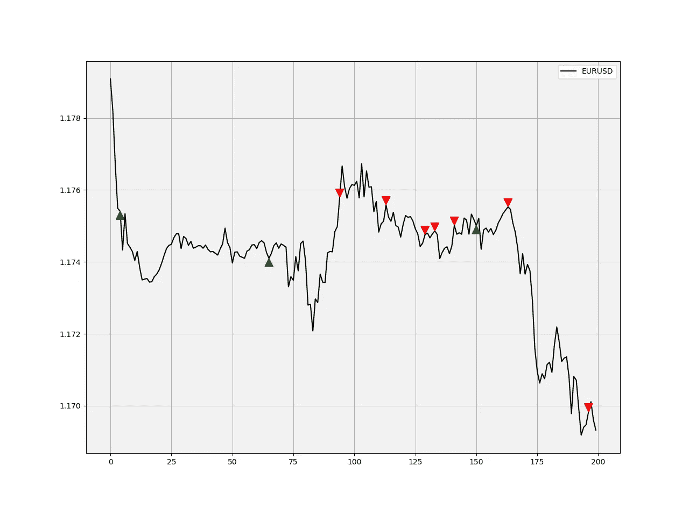*

*欧元兑美元-道指反向差异模式的信号图示例。(图片由作者提供)*

*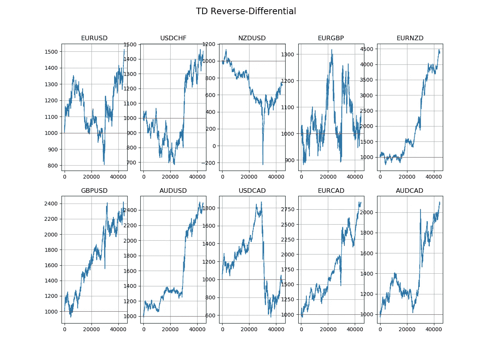*

*TD 反向差异策略在 10 种主要货币对上的权益曲线。(图片由作者提供)*

*看起来它在 GBPUSD 和欧元上运行良好，但在一些中期表现不佳。权益曲线的总体趋势没有第一种模式那么令人印象深刻。如果我们看看一些荣誉提名，GBPUSD 的表现指标也不算太差，命中率高达 67.28%，预期每笔交易为**0.34 美元**。*

# *TD 反差分模式*

*这种模式也试图寻找短期趋势反转，因此，它可以被视为预测小的修正和巩固。它类似于 TD 差分模式。以下是 Python 函数遵循的条件。*

*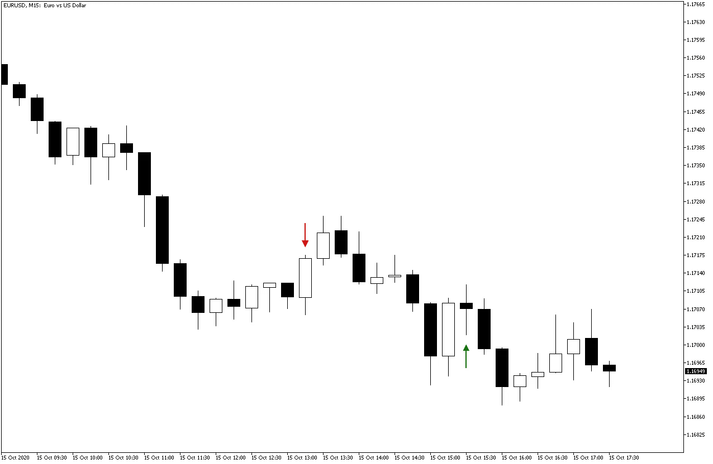*

*该模式的示例。(图片由作者提供)*

*买入(做多)触发器:*

*   ***两次关闭，每次都比前一次低，***
*   ***一个比前一个收盘价更高的收盘价，然后***
*   ***相对于前一根棒线的收盘价的较低收盘价。***

*卖出(做空)触发器:*

*   ***两次关闭时每一次都比前一次高，***
*   ***比前一个收盘价低的收盘价，***
*   ***相对于前一根棒线的收盘价而言更高的收盘价。***

```
*def TD_anti_differential(Data, true_low, true_high, buy, sell):
    for i in range(len(Data)):

        if Data[i, 3] < Data[i - 1, 3] and Data[i - 1, 3] > Data[i - 2, 3] and \
           Data[i - 2, 3] < Data[i - 3, 3] and Data[i - 3, 3] < Data[i - 4, 3]: 
               Data[i, buy] = 1if Data[i, 3] > Data[i - 1, 3] and Data[i - 1, 3] < Data[i - 2, 3] and \
           Data[i - 2, 3] > Data[i - 3, 3] and Data[i - 3, 3] > Data[i - 4, 3]: 
               Data[i, sell] = -1*
```

*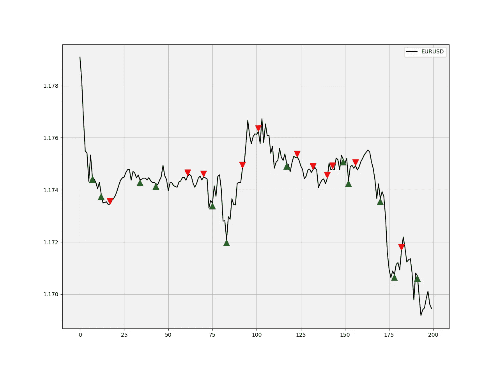*

*欧元兑美元-道指反差异模式的信号图示例。(图片由作者提供)*

*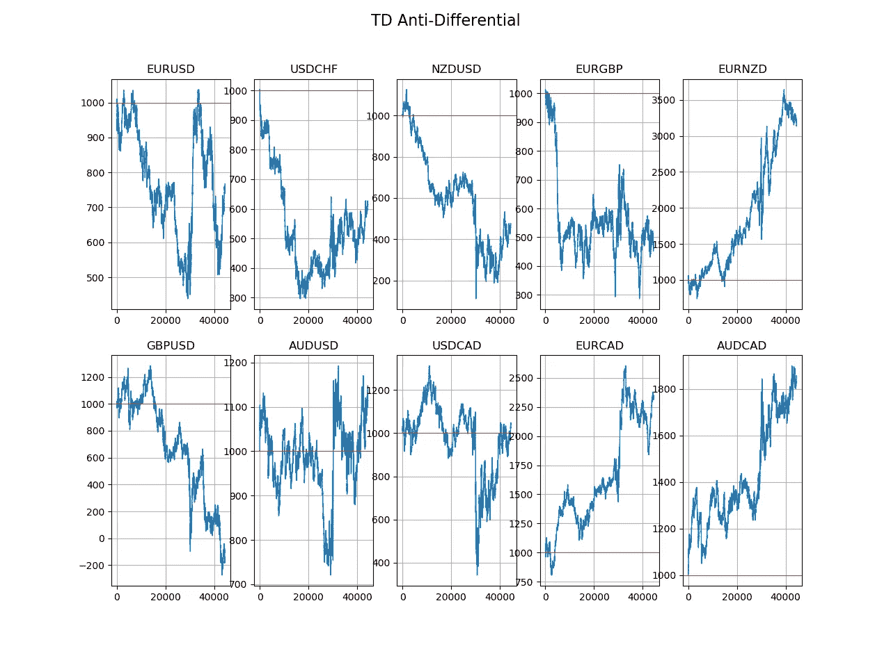*

*TD 反差异策略对 10 种主要货币对的权益曲线。(图片由作者提供)*

*看起来远不如前两个策略给人的印象深刻。权益曲线的总体趋势是混合的。如果我们看看一些荣誉提名，欧元兑新西兰元的表现指标也不算太差，命中率最高为 **64.45%** ，预期每笔交易为**0.38 美元**。*

*请记住，我们有如此高命中率的原因是我们在回溯测试开始时强加的糟糕的风险回报比。目标在 1x ATR，止损在 4x ATR，命中率需要足够高，以补偿更大的损失。*

# *结论*

*我总是对模式着迷，因为我相信我们的世界包含一些可预测的结果，尽管从噪音中提取信号极其困难，但我们面对未来所能做的就是做好准备，准备到底是什么？它预测可能发生的情况，以便我们在它们到来时做好准备。在 [***《后验之书》***](https://www.amazon.com/dp/B089CWQWF8) 中，我讨论了更多关于烛台的图案，揭开了关于烛台图案的一些主流知识。*

*我总是建议你做适当的回溯测试，了解任何与交易相关的风险。例如，上述结果并不具有很强的指示性，因为我们使用的价差非常具有竞争力，可能被认为很难在零售交易领域持续获得。然而，有了机构买卖价差，就有可能降低成本，比如系统的中频策略开始盈利。*

**

*图片来自 [Pixabay](https://pixabay.com/?utm_source=link-attribution&utm_medium=referral&utm_campaign=image&utm_content=1181864) 的 [msandersmusic](https://pixabay.com/users/msandersmusic-1972097/?utm_source=link-attribution&utm_medium=referral&utm_campaign=image&utm_content=1181864)*