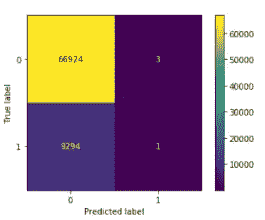
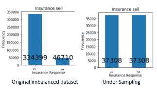

# 用于处理不平衡分类数据集的技术

> 原文：<https://towardsdatascience.com/techniques-for-handling-imbalanced-classification-datasets-5ee58b0b5e7a?source=collection_archive---------31----------------------->

## 了解处理结构化数据的不平衡分类数据集的常用技术

***在本文中，您将了解不平衡数据集以及分类数据集不平衡时出现的问题。了解常用技术，如过采样、欠采样、生成合成数据以处理不平衡数据集，最后，将所有概念应用于不平衡数据集。***


在 [Unsplash](https://unsplash.com/s/photos/balance?utm_source=unsplash&utm_medium=referral&utm_content=creditCopyText) 上 [Azzedine Rouichi](https://unsplash.com/@rouichi?utm_source=unsplash&utm_medium=referral&utm_content=creditCopyText) 的照片

> 不平衡数据集是指一个类与其他类相比具有不成比例的观测值。数据集中的每个类并不具有相等的表示，不平衡会导致偏斜的类分布。

*你必须运行分类算法来区分良性肿瘤和癌性肿瘤。良性肿瘤有 20，000 个观察值，而癌性肿瘤只有 100 个观察值；这导致数据集不平衡。*

*当观察结果的预测是良性时，不平衡数据集的影响是可见的，而它实际上是导致假阴性的癌性肿瘤。*

精确度是分类最常见的性能度量，但避免使用精确度作为性能度量，因为它可能会产生误导，尤其是在不平衡数据集的情况下。当我们在数据集中有不成比例的类表示时，模型可能会预测所有预测的大多数类的值，并实现高分类准确性，也称为**准确性悖论。**

为了确保一个模型在现实世界中运行良好，需要将假阳性和假阴性保持在最低限度。精确度有助于计算假阳性的成本，而回忆有助于理解假阴性的成本。因此，精确度、召回率和 F1 值是衡量模型性能的更好指标。


作者图片

## 处理不平衡数据集的常用技术

1.  **成本敏感训练**通过惩罚机器学习算法来考虑少数类的错误分类成本。这个想法是为了最小化分类的成本。
2.  **欠采样或下采样多数类**其中多数类的观察值被随机移除，以减少其对机器学习算法的影响
3.  **过采样或上采样，少数类**随机复制少数类的观察值，以增加对机器学习算法的影响
4.  **使用 SMOTE(合成少数民族过采样技术)为少数民族类创建合成数据。** SMOTE 从少数类中随机抽取样本，找到其最近的 k 个邻居，然后在随机选取的数据点与其最近的 k 个邻居之间选择一个点，生成合成数据。


SMOTE 使用最近的 k-邻居生成合成数据(图片由作者提供)

您将利用保险交叉销售的不平衡[数据集](https://www.kaggle.com/anmolkumar/health-insurance-cross-sell-prediction)来构建物流回归，以预测现有客户是否会对车辆保险感兴趣。

导入所需的库并将数据读入数据框

```
**import numpy as np
import pandas as pd
from sklearn.preprocessing import StandardScaler**
**from sklearn.model_selection import train_test_split
from sklearn.linear_model import LogisticRegression
from sklearn.metrics import confusion_matrix
from sklearn.metrics import plot_confusion_matrix**
**from sklearn.metrics import precision_score, recall_score, accuracy_score, f1_score**
**import matplotlib.pyplot as plt
import seaborn as sns
%matplotlib inline**#Reading the data from the csv file into a dataframe **data= pd.read_csv(r'\Insurance_data\train.csv')**
```

显示数据集信息

```
**data.info()**
```


**将分类变量转换为指示器列**

我们有一些分类变量，如性别和车辆损坏，需要转换为虚拟变量或指标变量。这里，我们通过将 ***drop_first*** 参数设置为 True 来移除第一层，以从 k 个分类层中获得 k-1 个虚拟层。

```
**data_2 = pd.get_dummies(data,drop_first=True)**
```

查看数据


**创建特征和目标变量**

```
X= data_2.iloc[:,[1,2,3,4,5,6,7,9,10,11,12]]
y=data_2.iloc[:,8]
```

**查看目标变量分布**

检查目标变量分布，以检查数据集是否平衡。

```
**y.value_counts().plot(kind='bar',figsize=(3,3),title="Insurance sell")
plt.xlabel("Insurance Response")
plt.ylabel("Frequency")
y_pos=50000
x_pos=0
for i, v in enumerate(data_count):
    plt.text(i+x_pos, y_pos, v, horizontalalignment='center',      verticalalignment='center', fontsize=20)
plt.show()**
```


**数据集是不平衡的，因为我们对不感兴趣购买车辆保险的客户的观察多于对购买车辆保险感兴趣的客户**。

**应用标准标量对特征进行标准化**

```
# define standard scaler
**scaler = StandardScaler()
X= pd.DataFrame(scaler.fit_transform(X))**
```

**将数据集分为训练和测试**

```
**X_train, X_test, y_train, y_test=  train_test_split(X,y,test_size=0.2)**
```

## 不平衡数据集的精度悖论

**对不平衡的训练数据集**运行逻辑回归，显示准确度、精确度、召回率和 F1 分数。

```
clf = LogisticRegression(random_state=0).fit(X_train, y_train)
y_pred=clf.predict(X_test)
```

**绘制混淆矩阵**

```
**plot_confusion_matrix(clf,X_test, y_test)**
```



不平衡数据集上使用逻辑回归的混淆矩阵

在不平衡测试数据集上检查准确度、精确度、召回率和 F1 分数。

```
**print("Accuracy",accuracy_score(y_test, y_pred))
print("Precision", precision_score(y_test, y_pred))
print("Recall",recall_score(y_test, y_pred))
print("F1 score",f1_score(y_test, y_pred))**
```


你可以看到我们有相对较好的准确率，召回率和 F1-score 非常糟糕。这证明了**准确性悖论**，其中**准确性不是模型性能的良好度量。检查精确度、召回率和 F1 值是个好主意。**

## 应用**对成本敏感的培训**

应用 **class_weight="balanced"** 将根据课程频率自动调整权重。类别权重与输入数据中的类别频率成反比。

***类权重=数据集中记录总数/(类总数*类内样本数)***

```
**clf_cw = LogisticRegression(random_state=0, *class_weight='balanced'*).fit(X_train, y_train)****y_pred= clf_cw.predict(X_test)****print("Accuracy",accuracy_score(y_test, y_pred))
print("Precision", precision_score(y_test, y_pred))
print("Recall",recall_score(y_test, y_pred))
print("F1 score",f1_score(y_test, y_pred))**
```


你可以看到准确性下降了，但我们有更好的 F1 成绩。

应用 class_weights 后显示混淆矩阵

```
**plot_confusion_matrix(clf_cw, X_test, y_test)**
```


混淆矩阵将 class_weights 应用于不平衡数据集

安装 ***imblearn*** 库，使用不同的技术处理不平衡的数据集

```
**pip install imblearn**
```

## 应用随机欠采样

在这里，您将使用一个类来执行随机欠采样，它通过随机选取有替换或无替换的样本来对大多数类进行欠采样。

比较原始数据集和使用随机欠采样生成的训练数据集之间的观察数量



欠采样或欠采样多数类

```
**from imblearn.under_sampling import RandomUnderSampler**# create the train and test dataset
**X_train, X_test, y_train, y_test= train_test_split(X, y, test_size=0.2)**# Create an instance of RandomUnderSampler, fit the training data #and apply Logistics regression
**rus= RandomUnderSampler()
X_train, y_train = rus.fit_resample(X_train, y_train)
clf_rus=  LogisticRegression(random_state=0).fit(X_train, y_train)**# predict the test data
**y_pred= clf_rus.predict(X_test)**# print the model performance metrics
**print("Accurcay",accuracy_score(y_test, y_pred))
print("Precision", precision_score(y_test, y_pred))
print("Recall",recall_score(y_test, y_pred))
print("F1 score",f1_score(y_test, y_pred))
plot_confusion_matrix(clf_rus, X_test, y_test)**
```


使用随机欠采样的性能度量


使用随机欠采样的混淆度量

## 应用随机过采样

随机过采样通过替换随机选取样本来对少数类进行过采样。您可以将采样策略指定为参数，以对数据集进行重新采样。

比较原始数据集和使用随机过采样生成的训练数据集之间的观察次数。


过采样或上采样少数类

```
**from imblearn.over_sampling import RandomOverSampler**# create the train and test dataset
**X_train, X_test, y_train, y_test= train_test_split(X, y, test_size=0.2)**# Create an instance of RandomOverSampler, fit the training data #and apply Logistics regression
**ros= RandomOverSampler(sampling_strategy='auto')
X_train, y_train = ros.fit_resample(X_train, y_train)
clf_ros=  LogisticRegression(random_state=0).fit(X_train, y_train)**# predict the test data
**y_pred= clf_ros.predict(X_test)**# print the model performance metrics
**print("Accurcay",accuracy_score(y_test, y_pred))
print("Precision", precision_score(y_test, y_pred))
print("Recall",recall_score(y_test, y_pred))
print("F1 score",f1_score(y_test, y_pred))
plot_confusion_matrix(clf_ros, X_test, y_test)**
```


使用随机过采样器的性能度量

## 应用合成少数过采样技术(SMOTE)

SMOTE 通过从少数类中抽取随机样本来执行过采样，找到其最近的 k 个邻居，这是一个可以指定的参数。在随机选择的数据点及其最近的 k 个邻居之间选择一个点，以生成合成数据。

比较原始数据集和使用 SMOTE 生成的训练数据集之间的观察次数。


应用 SMOTE 生成合成数据

```
**from imblearn.over_sampling import SMOTE**# create the train and test dataset
**X_train, X_test, y_train, y_test= train_test_split(X, y, test_size=0.2)**##Create an instance of SMOTE, fit the training data and apply #Logistics regression
**sm = SMOTE(random_state=27, sampling_strategy='minority', k_neighbors=5)
X_train, y_train = sm.fit_resample(X_train, y_train)
clf_sm = LogisticRegression(random_state=0).fit(X_train, y_train)**# predict the test data
**y_pred= clf_sm.predict(X_test)**# print the model performance metrics
**print("Accurcay",accuracy_score(y_test, y_pred))
print("Precision", precision_score(y_test, y_pred))
print("Recall",recall_score(y_test, y_pred))
print("F1 score",f1_score(y_test, y_pred))
plot_confusion_matrix(clf_sm, X_test, y_test)**
```


使用 SMOTE 的性能指标

## 结论:

一个类的观测值明显多于其他类的数据集会产生不平衡数据集，从而扭曲测试结果。有不同的技术，如过采样少数类、欠采样或下采样多数类、成本敏感技术或使用 SMOTE 创建合成数据。


应用不同技术处理不平衡数据集的类的观察数量比较(图片由作者提供)


处理不平衡数据集的不同技术的性能指标比较(图片由作者提供)