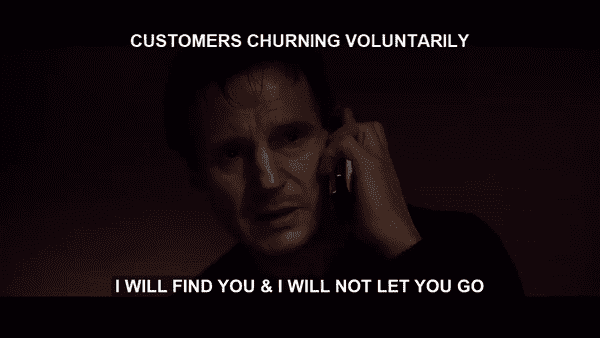
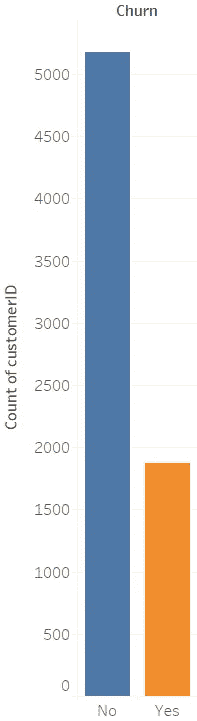
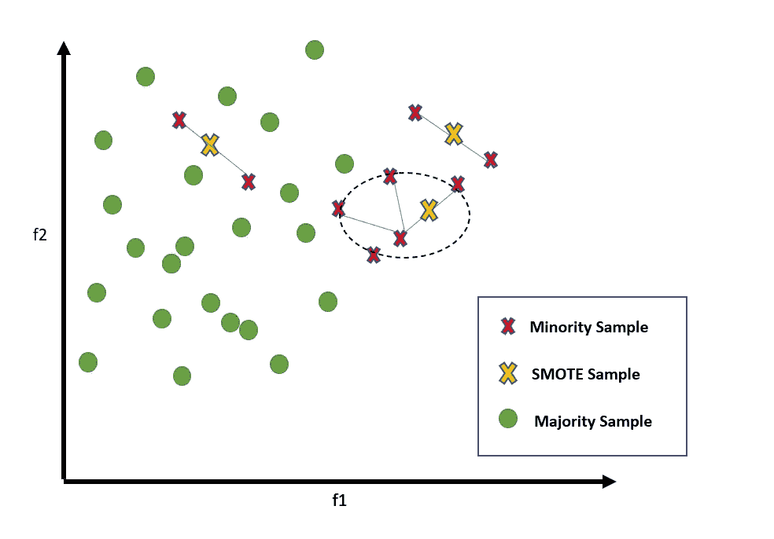
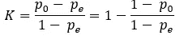
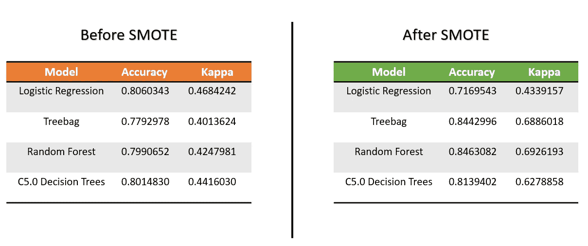
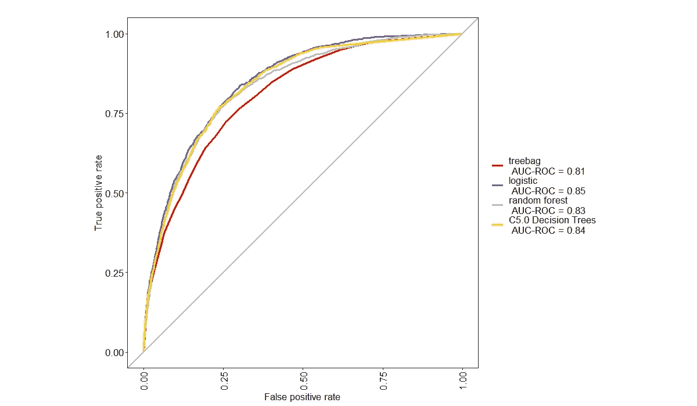
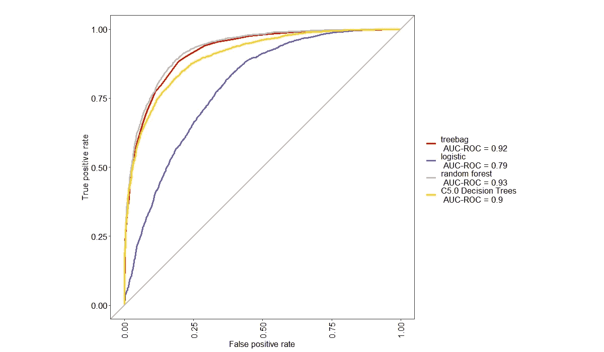

# 基于 SMOTE 机器学习的电信客户流失预测

> 原文：<https://towardsdatascience.com/telecom-customer-churn-prediction-using-smote-powered-machine-learning-a7354d54380d?source=collection_archive---------42----------------------->

## 当生活给你不均衡的数据时，打败它，和 Kappa 统计交朋友！


照片由 Nick Fewings 在 Unsplash 上拍摄

> 本博客和项目由 [**维谢哈·巴塔查尔吉**](http://linkedin.com/in/vishakha-bhattacharjee) (纽约哥伦比亚大学商业分析硕士)& [**皮尤什·贝里**](http://linkedin.com/in/piyush-beri)(SCMHRD 浦那商业分析 MBA)。

T 电信服务行业正在迅速成为最难生存的市场之一。最初只专注于通信技术的行业如今已经过渡到了云技术时代。如果有的话，这给该行业现有的困境增加了更多压力，因为今天的公司需要迅速调整其业务模式，以满足物联网、智能设备和增强现实等领域的客户需求。的确，[*数字化转型帮助电信公司从灭亡走向繁荣*。](https://www.racknap.com/blog/digital-transformation-helps-telcos-move-from-perish-to-flourish/)


照片由[尼克·费因斯](https://unsplash.com/@jannerboy62?utm_source=medium&utm_medium=referral)在 [Unsplash](https://unsplash.com?utm_source=medium&utm_medium=referral) 上拍摄

生存是关键，所有电信公司都必须更好地了解他们的客户，并限制(如果不能防止的话)所谓的“**流失**”现象的发生。有了正确的方法来分析客户流失，公司就可以发现客户服务政策甚至营销和定价策略中可能存在的问题。

> **客户获取成本** (CAC)由营销费用、广告费用、销售费用等构成。并且一般总计为[](https://www.invespcro.com/blog/customer-acquisition-retention/)****(CRC)的价值的 5 倍。因此，将高价值客户留在国内非常重要。****
> 
> ****对于客户因非自愿原因流失的情况，电信公司无能为力，但公司完全有理由尝试识别自愿流失 T2 的客户，并为他们提供优惠，防止他们离家出走。****

********

****为了预测可能流失的客户，我们利用了公开可用的数据集[*“IBM 电信客户流失”*](https://github.com/IBM/telco-customer-churn-on-icp4d/tree/master/data) *。*****

****该数据集具有以下特征以及指示特定客户是否已经从该公司的服务中流失的目标变量:****

*   ******客户订购的服务:**电话、多条线路、互联网、在线安全、在线备份、设备保护、技术支持以及流媒体电视和电影。****
*   ******客户的账户信息:**成为客户的时间、合同、支付方式、无纸化账单、每月费用和总费用。****
*   ******客户的人口统计信息:**性别、年龄范围以及他们是否有伴侣和家属。****

# ****使用 SMOTE(合成少数过采样技术)处理类不平衡****

********

****在桌面上完成的可视化****

****一轮快速的探索性数据分析(EDA)将我们引向左侧的图表，该图表向我们展示了各行业中与客户流失相关的一个常见问题；**阶层失衡。**一类数据的总数**远小于另一类数据的总数**是机器学习中的一个问题。IBM 电信客户流失数据集的“未流失”类别代表率过高(73%)，而“流失”类别代表率过低(27%)。****

****但是阶级不平衡的问题是什么呢？为什么一个分析师在创建预测模型的时候要如此担心呢？****

****事实证明，大多数用于分类的机器学习算法都被隐式地调整为在数据类别平均分布的情况下工作得最好。在类别分布不均匀的情况下，得到的分类模型表现出较差的性能，特别是对于代表性不足的类别，也称为**少数类别。**在我们的电信客户流失预测案例中，少数族裔或已经流失的客户是更重要的类别，而*[***的高错误分类错误***](https://gerardnico.com/data_mining/error_rate) 会破坏首先识别他们的目的。*****

## *****出击救援！*****

*****[***SMOTE(合成少数过采样技术)***](https://www.researchgate.net/publication/220543125_SMOTE_Synthetic_Minority_Over-sampling_Technique) 工作原理是**对数据的少数类**进行过采样。有几种方法可以做到这一点，比如简单地复制少数数据样本，但 SMOTE 通过创建新的原始样本来工作。*****

*****简而言之，新值是通过考虑位于 [***特征空间***](https://dataorigami.net/blogs/napkin-folding/17536555-feature-space-in-machine-learning) 中少数类的**随机选择样本附近的样本而创建的。使用一条线来连接这些样本，然后通过在这条线上随机选择一个点来创建一个新值。*******

**********

*****SMOTE 的图示*****

*****用于 SMOTE 应用和用于流失预测的数据预处理的 R 代码:*****

```
***library(pROC) # for AUC calculations
library(DMwR) # for smote implementation
library(ggplot2)
library(dominanceanalysis)
library(caret) # for model-building
library(dplyr) # for data manipulation
library(plyr)#reading data into data frame
df_telecom = read.csv("WA_Fn-UseC_-Telco-Customer-Churn.csv")#### Data Overview #####No. of observations and attributes and the head data for each attribute
glimpse(df_telecom)  # No. of observations(rows) : 7043 #No. of attributes(columns) : 21#Datatypes of different columns of the dataframe
sapply(df_telecom,class)#check the column with NA values
sapply(df_telecom, function(x) sum(is.na(x))) #totalCharges has 11 na values#### Data Manipulation #####dropping NA values because the tenure is also 0 for those customers
df_telecom = df_telecom[complete.cases(df_telecom), ]#Converting Senior Citizen Column values to Yes and No
df_telecom$SeniorCitizen <- ifelse(df_telecom$SeniorCitizen==1,"Yes","No")#Converting Tenure to categorical column
df_telecom %>%
  mutate(tenure_year = case_when(tenure <= 12 ~ "0-1 year",
                                 tenure > 12 & tenure <= 24 ~ "1-2 years",
                                 tenure > 24 & tenure <= 36 ~ "2-3 years",
                                 tenure > 36 & tenure <= 48 ~ "3-4 years",
                                 tenure > 48 & tenure <= 60 ~ "4-5 years",
                                 tenure > 60 & tenure <= 72 ~ "5-6 years")) -> df_telecom#converting column value "No Internet Service" to "No" for columns OnlineSecurity, OnlineBackup, DeviceProtection, TechSupport, StreamingTV, StreamingMoviescols_r <- c(10:15)
for (i in 1:ncol(df_telecom[,cols_r]))
{
  df_telecom[,cols_r][,i] <- as.factor(mapvalues(df_telecom[,cols_r][,i],
                                                 from=c("No internet service"),to=c("No")))
}#converting column value "No phone Service" to "No" for column MultipleLinesdf_telecom$MultipleLines <- as.character(df_telecom$MultipleLines)
df_telecom$MultipleLines[df_telecom$MultipleLines == "No phone service"] <- "No"
df_telecom$MultipleLines <- as.factor(df_telecom$MultipleLines)#Applying SMOTE
df_telecom_c = data.frame(df_telecom[,-c(1,20)])
df_telecom_c$SeniorCitizen <- as.factor(df_telecom_c$SeniorCitizen)
df_telecom_c$tenure_year <- as.factor(df_telecom_c$tenure_year)
df_telecom_c$Churn <- as.factor(df_telecom_c$Churn)
df_telecom_c <- SMOTE(Churn ~ ., df_telecom_c, perc.over = 100, perc.under=200)
prop.table(table(df_telecom_c$Churn))***
```

# *****选择最佳模型:欢迎科恩的 Kappa 统计！*****

**********

*****使用 [ezgif](https://ezgif.com/add-text) 创建的 GIF*****

*****当涉及到处理多类分类和类不平衡分类问题时，通常的性能度量如[](/metrics-to-evaluate-your-machine-learning-algorithm-f10ba6e38234)*可能会产生误导。通常，在类别不平衡数据的情况下，由于其中一个类别的过度表示，精度被过度报告。******

******在这种情况下，科恩的 Kappa 统计是一个方便的指标。Kappa 统计量可以很好地处理上述两种情况，并提供一个真实表示模型性能的稳健值。******

******科恩的卡帕定义为:******

************

******使用 MS Word 上的公式创建器创建的公式******

******其中 po 为**观察一致**，pe 为**预期一致**。简而言之，当与根据每个类别的频率随机猜测的分类器相比较时，该统计有助于理解我们的分类器的性能。因为 Cohen 的 Kappa 考虑到了分类器**之间偶然发生一致的可能性**，所以它给出了模型性能的更加**健壮的视图**。******

******根据 [**兰迪斯和科赫(1977)**](https://www.jstor.org/stable/2529310?seq=1) **，**对科恩的 Kappa 的解读方式如下:******

*   ******轻微一致=小于 **0.20********
*   ******公平协议= **0.20** 到 **0.40********
*   ******适度一致= **0.40** 至 **0.60********
*   ******基本一致= **0.60** 至 **0.80********
*   ******几乎完全一致= **0.80** 到 **1.00********

******我们使用 R 中的以下代码来生成 Kappa 统计数据和其他指标，如准确性、ROC、AUC 等。评估分析的最佳模型。可以在 CARET 库下选择各种模型进行进一步分析。******

```
****#K-fold cross-validation ---2 (Ensemble Bagging Algorithm)
# Define training control
set.seed(123)#With Accuracy as the metric
train.control <- trainControl(method = "cv", number = 10,
                           savePredictions = TRUE,classProbs = TRUE)model <- train(Churn ~., data = df_telecom_c, method = "treebag",
               trControl = train.control,metric = "Accuracy")print(model)  #Accuracy - 0.8442996  Kappa - 0.6886018#With ROC as the metric
train.control <- trainControl(method = "cv", number = 10,summaryFunction = twoClassSummary,
                              repeats = 3,savePredictions = TRUE,classProbs = TRUE)model <- train(Churn ~., data = df_telecom_c, method = "treebag",
               trControl = train.control,metric = "ROC")
print(model)  
#ROC        Sens       Spec     
#0.9190668  0.8686399  0.8081906****
```

## ******成绩来了！******

******看一下在这种情况下使用的模型的准确性和 Cohen 的 Kappa 统计，获得了以下数据。******

************

******在 SMOTE 之前和之后，比较各种模型的模型精度和 Cohen 的 Kappa 统计量******

> ******注意，在实施 SMOTE 之前，模型的精确度相当高。**但是考虑到阶级的不平衡，Kappa 提出了不同的建议(低值)**。******
> 
> ******实施 SMOTE 后，模型的 Kappa 增加，现在属于上述**“基本一致”**的范围。还要注意精度的提高。******

******现在，让我们来看看上面使用的各种型号的 [**接收机工作特性曲线**](https://medium.com/greyatom/lets-learn-about-auc-roc-curve-4a94b4d88152) (ROC 曲线)。首先，我们将看到没有实施 SMOTE 的模型的 ROC 曲线。******

************

******无 SMOTE 模型的 ROC 曲线******

******现在，实施 SMOTE 后模型的 ROC 曲线为:******

************

******SMOTE 后模型的 ROC 曲线******

> ******从上述 ROC 曲线中可以注意到，在实施 SMOTE 后，曲线下的**面积显著增加。********

******因此，为了电信公司的客户流失预测模型的目的，我们使用**随机森林模型**，它提供了**最高的精确度、ROC 曲线下的面积，以及最重要的 Kappa 统计数据**。******

# ******分析在商业中的应用******

******在这个媒体故事的开头提到了一个事实，即客户获取成本(CAC)是客户保留成本(CRC)的 5 倍。记住这一点，我们可以使用这个模型来分析和设计客户保持策略(感谢我们的低错误分类错误！).使用有针对性的营销活动，优惠和策划计划可以推出，以防止这些客户翻腾。******

> ******因此，当生活给你不均衡的数据时，击垮它，和 Kappa 统计交朋友！******

> ********邀请您查看 GitHub 回购，了解上述分析！********

******[](https://github.com/vishakha-b18/Customer-Churn-in-Telecom) [## visha kha-b18/电信客户流失

### 客户流失意味着客户在一段时间后离开公司的服务或订阅…

github.com](https://github.com/vishakha-b18/Customer-Churn-in-Telecom) 

> 在 LinkedIn 上与我们联系！

 [## vishakha Bhattacharjee——助教——哥伦比亚商学院| LinkedIn

### 目前在纽约哥伦比亚大学攻读商业分析硕士学位。前商业情报分析师在…

www.linkedin.com](https://www.linkedin.com/in/vishakha-bhattacharjee/)  [## Piyush Beri 工商管理硕士商业分析-SCMHRD，浦那

www.linkedin.com](https://www.linkedin.com/in/piyush-beri/)******