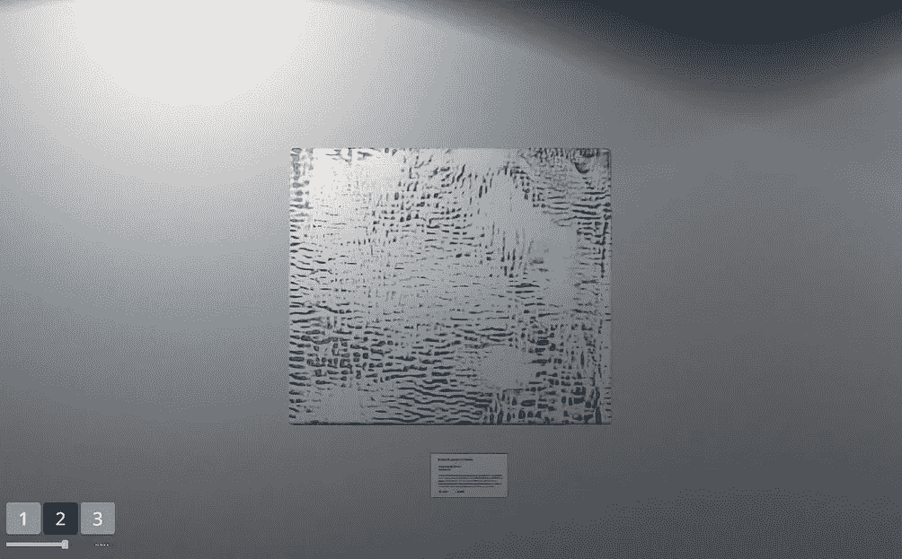

# 电话绘画

> 原文：<https://towardsdatascience.com/telephone-paintings-a7ef662f50a9?source=collection_archive---------39----------------------->

## 在艺术(莫霍利-纳吉)和甘斯之间

[斯佩拉福特](https://spelafort.itch.io/)的[电话绘画](https://spelafort.itch.io/telephone-paintings)/(默兹曼施截图)

在 Instagram 出现之前很久，一位名叫的园艺家和包豪斯艺术家**拉斯洛·莫霍利-纳吉**(1895-1946)就用手机进行艺术创作。甚至在电话出现之前。但是如果没有这种远距离交流的工具，他的作品“电话图片”就不可能出现。

这个系列是怎么创作出来的？在当时常见的艺术过程中，艺术家通过触摸、用刷子、用锤子等方式直接创作出艺术品。但是莫霍利-纳吉使用了当时完全不同寻常的东西:一部电话:

> 1922 年，我通过电话向一家标牌厂订购了五幅搪瓷画。我面前有工厂的颜色图表，我在绘图纸上画了草图。在电话的另一端，工厂主管把同样的纸分成方块。他把听写的图形记在正确的位置上。(这就像通信下棋)…因此，这些照片没有“个人触摸”的优点，但我的行动正是针对这种过分强调。(*来源:拉斯洛·莫霍利-纳吉，《新视野》(1947)，引自《* [*电话绘画:挂上莫霍利*](https://www.jstor.org/stable/1575903) *》作者路易·卡普兰*)

莫霍利-纳吉用这个项目批评了艺术中“个人风格”的古典冲动。在这里，两个参与者制作了艺术品:艺术家按照他的指示，工厂按照他们的指示。

这位包豪斯艺术家甚至放弃了在自己的作品上签名:

> 我把带有必要数据的数字和字母放在画布的背面，就好像它们是汽车、飞机或其他工业产品一样。(资料来源:莫霍利-纳吉，同上)

这位艺术家消失在他的作品后面。在这种情况下，交流是艺术创作的方式。

# 甘斯的电话绘画。

一位数字艺术家兼游戏设计师 [**史蒂文·西奇**](https://twitter.com/steven_sych) 和视频艺术家 [**蒂莫西·托马森**](https://timothythomasson.com/Telephone-Paintings) 用通讯的方式表达了他们对莫霍利-纳吉的敬意，标题同为“电话绘画”:

 [## 电话绘画

### 按键盘或屏幕上的 1、2、3 来放大和缩小。滑动音量以提高或降低速度。它是这样的…

spelafort.itch.io](https://spelafort.itch.io/telephone-paintings) 

随着游戏类型“无尽的卷轴”，你正沿着一个永恒的程序生成的艺术画廊前进，有各种光线条件，一些建筑工地工具和墙上的绘画。这些画都有标题和描述。

而一切都是利用**生成性对抗网络**做出的。在这种情况下，艺术不是由一个叫生产的艺术家创造的，而是由 GANs 之间的交流创造的:

**1。艺术品创作:StyleGAN。** 这里用了一个 StyleGAN(或者 StyleGAN2？)模特，受过艺术品方面的训练。我想知道是阿甘还是维基亚特训练的。更多信息请点击此处:

 [## 数据集的不可背叛性

### ArtGAN 和 WikiArt:用人工智能创造艺术。用艺术制造 AI。

towardsdatascience.com](/the-non-treachery-of-dataset-df1f6cbe577e) 

**2。对象检测:(YOLOv3)** 对于模式识别和对象检测，作者使用了 YOLO 网络([你只看一次，在版本 3](https://arxiv.org/abs/1804.02767) )。该网络在抽象图像中发现物体(这已经是一个挑战——不仅对机器，对人类也是如此)。

**3。讲故事(GPT-2)** open ai 的 NLP 框架用它来提示作者和背景的简短描述。新艺术家的传记是在一个复杂的过程中创建的，包括微调博物馆描述的 GPT-2，以及程序性的名称生成。这就是为什么结果是一致的，鼓舞人心的，令人信服的。

我想，如果你愿意，使用 GPT-3 甚至可以生成一个博物馆指南，将作者组合成一个概念展览。

艺术体验不是即时的(现在实时使用 GANs 仍然是未来的事情)，大约有 3000 件艺术作品被生成并随机呈现——如果你在这里足够长的时间，你可能会偶然发现已经看过的绘画。但是增加新作品的可能性是存在的——半永恒是可能的。

# 一种全新的艺术。

在展览中前进，你没有太多的选择，但要观看无止境的艺术展示，放大画面并阅读描述。但是，这正是你参观博物馆的目的。

如果你准备好投入进去，接受这出戏，你将享受独特艺术的快乐。因为这是你瞥见由人工智能生成的另一个现实的唯一机会。

这里只是我喜欢的一些艺术品和描述。

[斯佩拉福特](https://spelafort.itch.io/)的[电话绘画](https://spelafort.itch.io/telephone-paintings)/(Merzmensch 截图)

请注意，德国医生和艺术收藏家 Ona Tymes，“*用色彩的力量揭示了本体的潜在结构*”。

斯佩拉福特的“电话绘画”(Merzmensch 截图)

如果你真的想，你会看到蓝猫。但这里有一个问题，这是否只是另一个盲目崇拜。

斯佩拉福特的“电话绘画”(Merzmensch 截图)

艾不仅观察到了“*城市与工业景观的交汇点*”，还观察到了“*椅子上的一只猫*”(大概是猫在物体探测 YOLOv3 中独领风骚，就像[谷歌梦境中的恶犬](/pareidolia-of-ai-dba7cf44bfde?source=friends_link&sk=f22677820ca169764e2c076fea98ee6e))。

然后是这个:

斯佩拉福特的“电话绘画”(Merzmensch 截图)

斯泰西·莫亚似乎是个奢侈的家伙。他相信“找到上帝”并成为“圣经中的第一人称叙述”。然而:“*注意猫的倒影*”。对我来说，这个头看起来像猫眼。

Every time you explore a new artwork, it will soon disappear, with its visuals, background story, and artist. Trascience of art and all things, “mono no aware” (物の哀れ).

Spelafort 的电话绘画是对过去的 lászlo Moholy-Nagy 的美丽致敬，也是对未来的展望。以新的方式对生成艺术、阐释、玻璃透镜状的审美体验是艺术的未来和存在。

您将在此处找到 Unity 和 GAN 驱动的虚拟图库(在您的浏览器中运行):

 [## 电话绘画

### 按键盘或屏幕上的 1、2、3 来放大和缩小。滑动音量以提高或降低速度。它是这样的…

spelafort.itch.io](https://spelafort.itch.io/telephone-paintings) 

*你会发现哪些新世界和艺术品？*