# 给我讲个笑话——如何给你的 Power 虚拟代理聊天机器人添加闲聊支持。

> 原文：<https://towardsdatascience.com/tell-me-a-joke-how-to-add-small-talk-support-to-your-power-virtual-agents-chatbot-6a0eba974de2?source=collection_archive---------19----------------------->

## 微软 POWER 平台解决方案

## 闲聊是每个聊天机器人的基本特征。在 QnA Maker 和 Power Automate 的帮助下，我们将这一功能添加到任何使用微软 Power 虚拟代理构建的聊天机器人中


[梁杰森](https://unsplash.com/@ninjason?utm_source=medium&utm_medium=referral)在 [Unsplash](https://unsplash.com?utm_source=medium&utm_medium=referral) 上的照片

不管你的聊天机器人是为了什么而设计的，也不管它的目的有多清晰或简单，你的用户总是会首先尝试聊天。

了解了这一点，即使是最简单的聊天机器人也必须具备得体的聊天技巧。但是这可能是一个挑战——特别是当您使用像 Power Virtual Agents (Power VA)这样的低代码产品时，因为这样的产品可能没有开箱即用的良好聊天功能。

在本指南中，我将向您展示如何使用 QnA Maker 作为 Azure 认知服务套件的一部分，向任何 Power VA 聊天机器人添加聊天功能，并在 Power Automate 的帮助下将这两种产品结合起来。

如果你是 Power VA 的新手，我在 Medium 上为你提供了一个简单的分步介绍[这里](/meet-lena-a-simple-ai-no-code-chatbot-8ac006c92a45)。

让我们开始吧。

## 创建 QnA Maker 闲聊知识库

在微软 **QnA Maker** 的帮助下，我们可以为我们的聊天机器人创建一个知识库，其中包含大约 100 个聊天场景的预填充数据集，包括响应和样本查询。我们可以选择 5 种不同的性格和 9 种语言。你可以在 [GitHub](https://github.com/microsoft/BotBuilder-PersonalityChat) 上了解更多。

要创建我们的闲聊知识库，请转到[https://www.qnamaker.ai/](https://www.qnamaker.ai/)，登录并点击**创建知识库**。

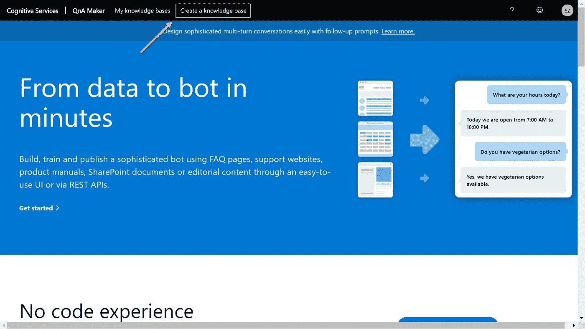

点击**创建 QnA 服务**按钮，重定向到 Azure 门户，创建您自己的 QnA Maker 实例。

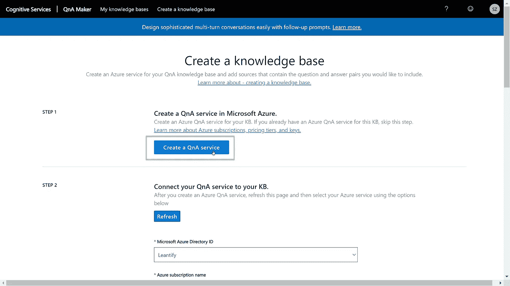

在 Azure 门户中，你必须命名一些资源。为创建的每个服务选择适当的名称和位置。

> 如果你没有 Azure 订阅，先注册一个 [Azure 免费试用](https://azure.microsoft.com/en-us/free/cognitive-services/)。
> 
> 此外，如果你不是 Azure 专家，这可能会有点混乱。别担心，使用和我一样的设置。只需将**西欧**替换为您最近的位置，将 **MyBot** 替换为您聊天机器人的名称。其余部分遵循一些命名和简单部署的最佳实践。

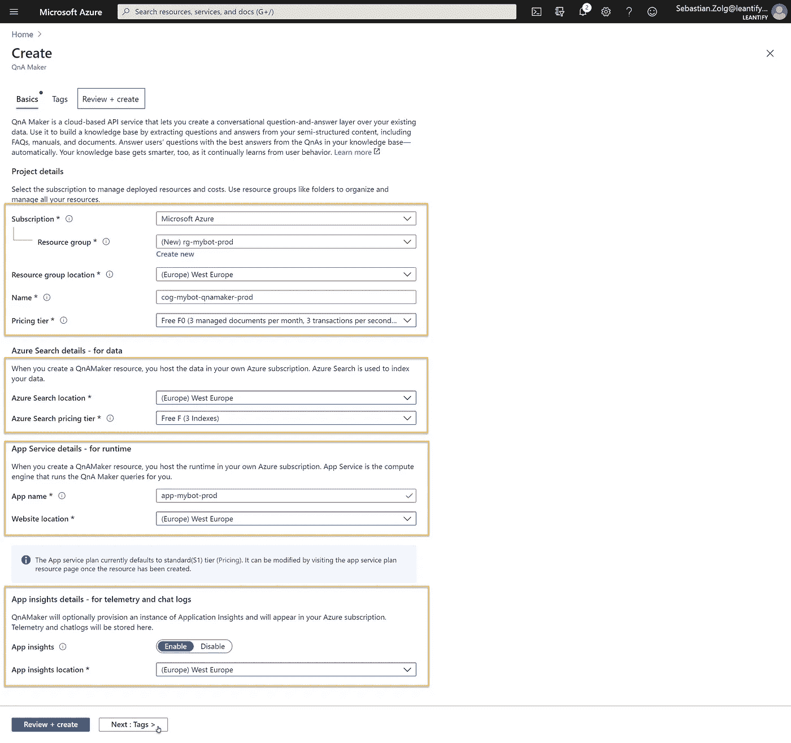

在向导的最后点击，最后一次验证你的设置，然后点击**创建**。

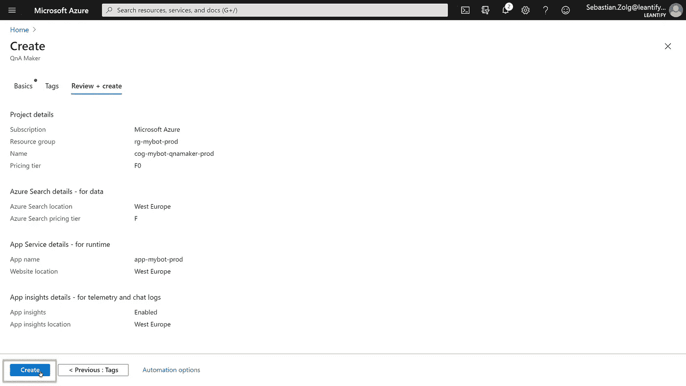

等待**您的部署已完成**消息，并在浏览器中跳转回 QnA Maker 门户。

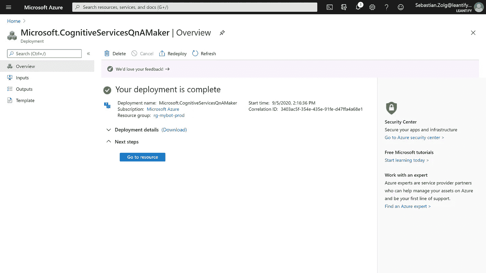

返回 QnA Maker 门户，单击**刷新**按钮，并从下拉列表中选择之前创建的 Azure QnA 服务实例。请注意，这可能需要您刷新(F5)多次，或者再等几分钟，实例才会出现。

像我一样，给你的 QnA Maker 知识库起一个响亮的名字。


现在我们可以添加一些闲聊的场景，并在 5 种不同的性格中进行选择。

准备好后，点击**创建您的知识库**。

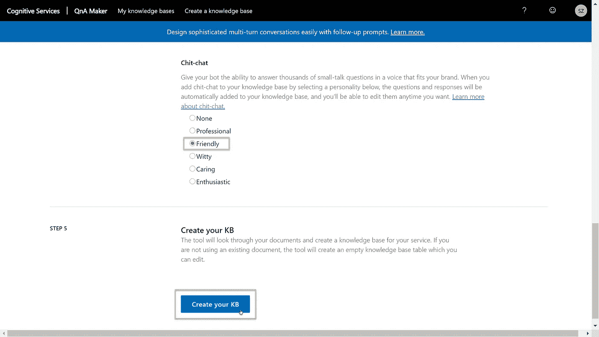

当你的知识库准备好了，我们可以有选择地稍微调整一下。例如，你可以搜索“*你是谁？”*并更改其响应，以包含来自您的聊天机器人的个性化欢迎消息。

还可以添加新的 QnA 对，就像您企业的基本常见问题一样。玩玩它，当你觉得准备好的时候点击**保存和训练**。

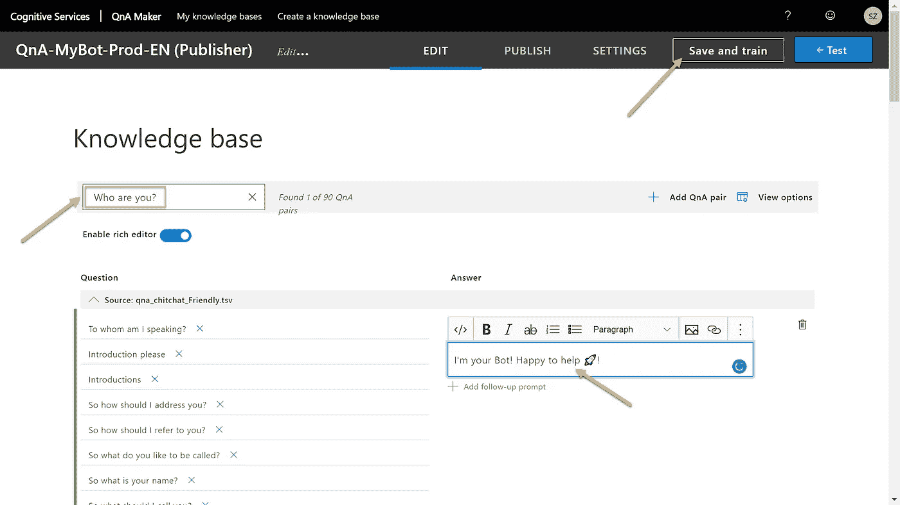

现在我们可以转到**发布**选项卡并点击**发布**按钮。

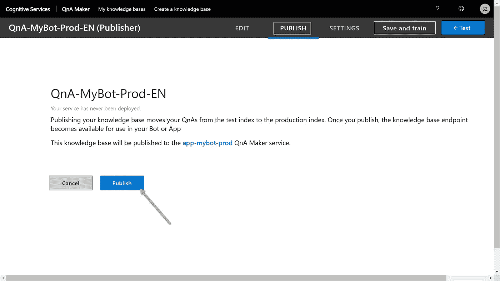

发布成功后，门户向我们提供了必要的详细信息，如**知识库 id** 、**主机、**和**端点密钥**。保持此页面打开，因为我们稍后需要此信息。

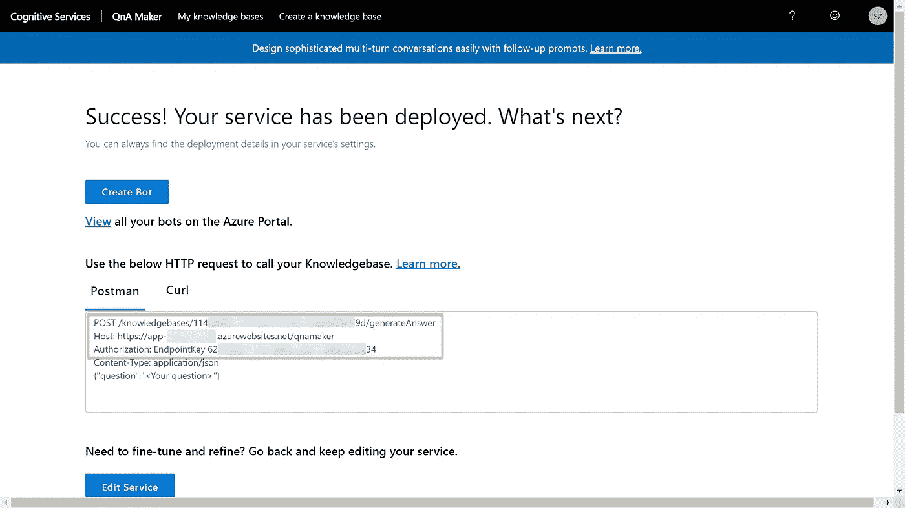

## 将聊天添加到您的 Power VA 聊天机器人

在 Power VA 管理门户，打开你的聊天机器人，点击**齿轮**图标，选择**系统回退**。

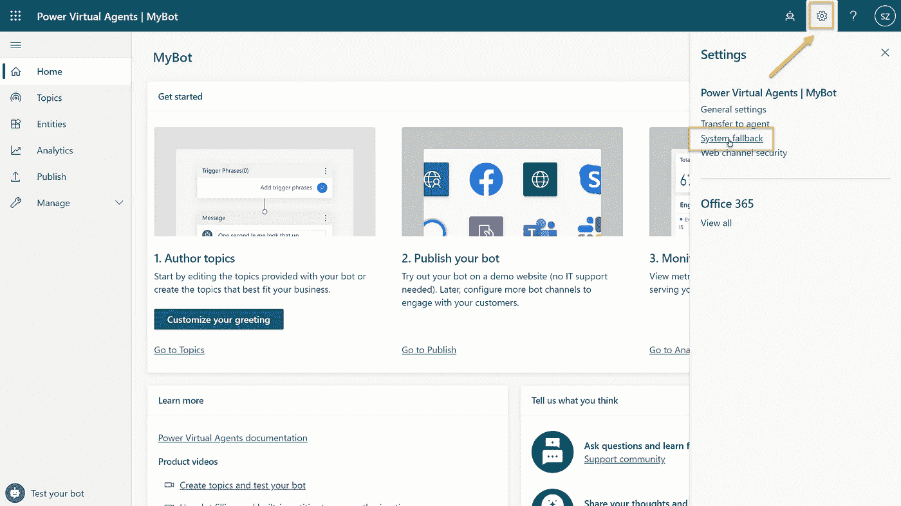

通过点击**添加**按钮，我们启用回退系统主题。这取代了自动提示信息的默认行为，并允许我们挂接自定义逻辑。

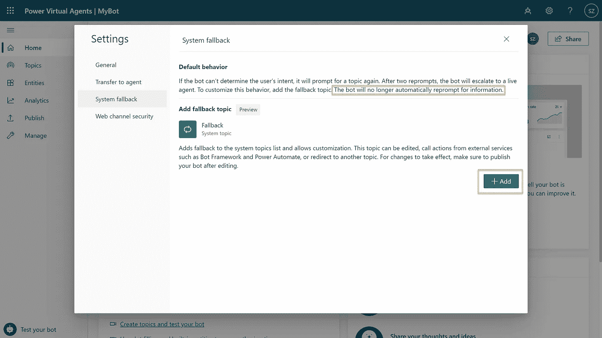

添加回退系统主题后，点击**转到回退主题**打开设计器。

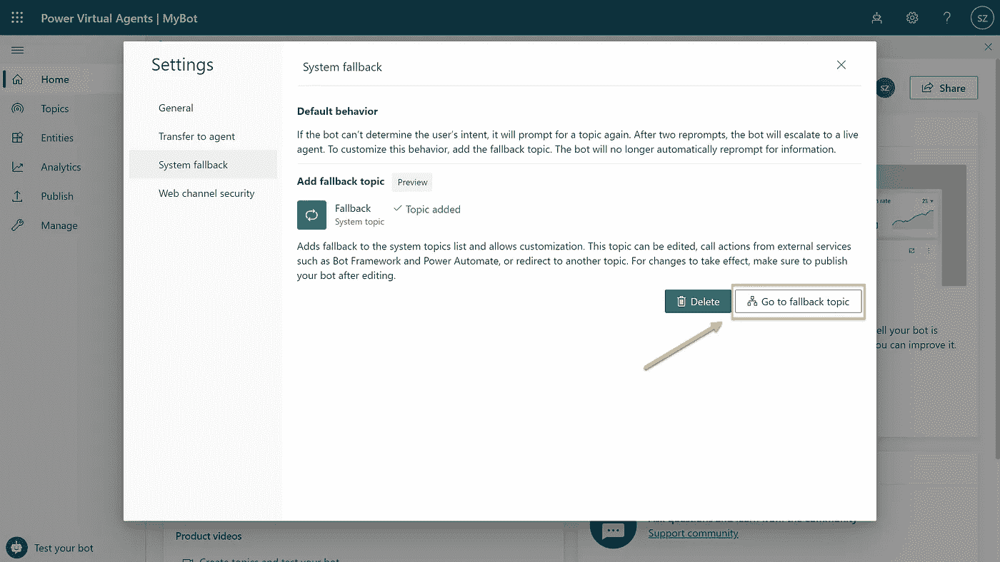

首先，我们使用每个画布上的三个点删除默认消息和升级重定向。

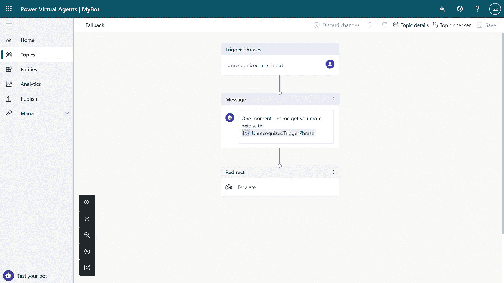

点击连接器末端的 **+** 图标，选择**调用动作**，点击**创建流程**。

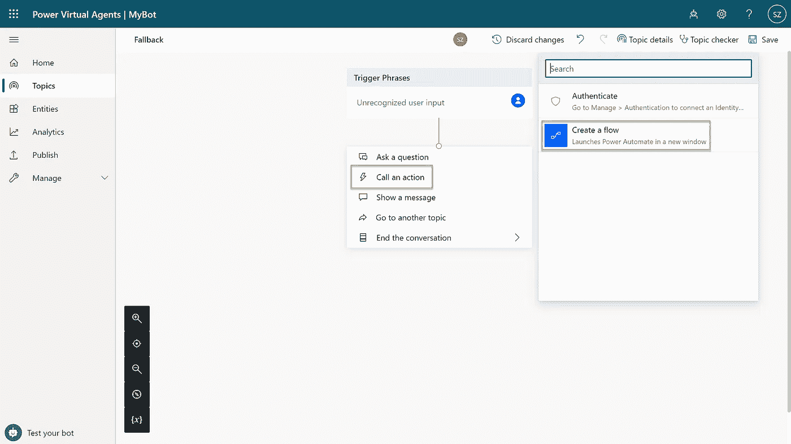

这将启动 Power Automate 管理门户，为 Power VA 提供一个触发器和输出操作。

首先，我们点击**+Add a Input**，为我们的触发器添加一个新的输入。选择一个文本输入并将其命名为`Question`。

同样，我们使用 **+** 图标添加了**生成答案(预览)**动作。

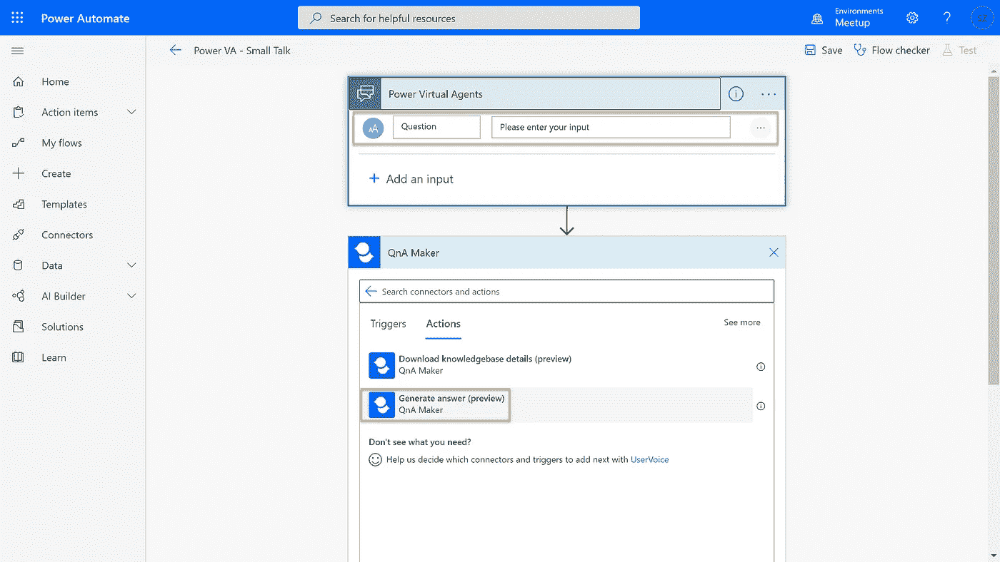

在下一步中，我们必须配置到 QnA Maker 实例的连接。我们需要您之前在 QnA Maker 中发布知识库时显示的连接详细信息(请参考上面的截图)。

根据需要输入一个**连接名**—将 **API 键**映射到**端点键**并将**站点 URL** 映射到**主机**。再次验证您的设置并点击**创建**。

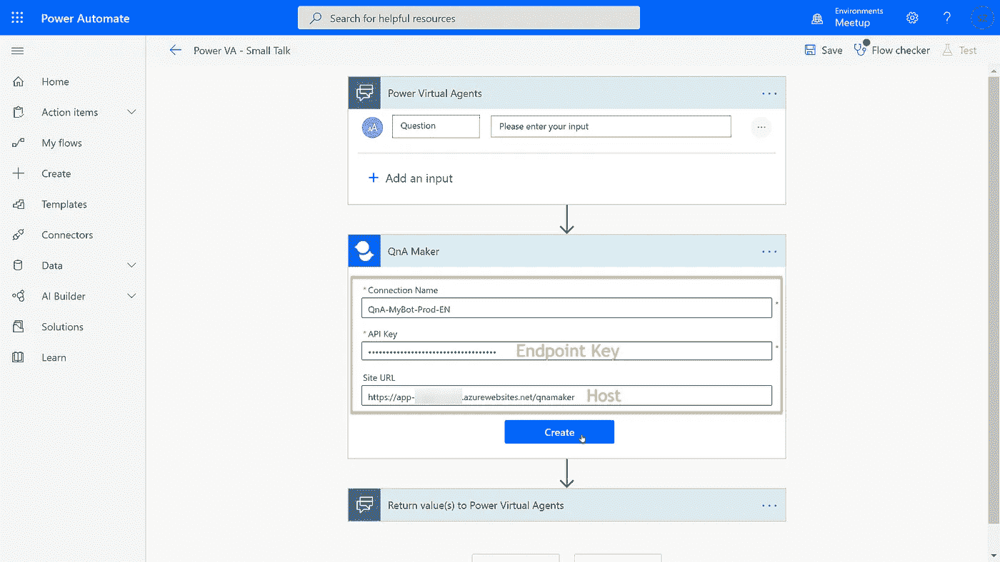

在下一步中，**生成** **应答**动作再次要求相同的参数。我们还需要**知识库 Id** ，它只是 QnA Maker 门户中部署细节的 *GUID* 部分。

最后，我们将**问题**字段映射到上面触发器的新**问题**输入。


QnA Maker 可能会对一个问题给出多个答案。这就是为什么我们用接下来的两步从回答中“挑选”最佳答案。

首先，我们添加一个**初始化变量**的步骤，并创建一个名为`BestAnswer`的新对象。我们用从**生成答案**动作获得的第一个答案条目初始化对象。为此，我们使用下面的简单表达式。

```
first(outputs('Generate_answer')?['body/answers'])
```

这个表达式选择上面的第一个答案。

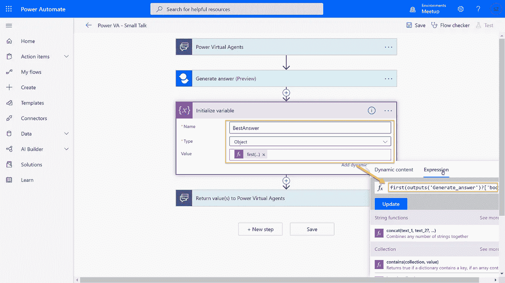

现在我们有了这个答案，我们添加一个**解析 JSON** 动作来从我们的**最佳答案**构造一个对象。为此，我们使用下面的 JSON 模式，您可以将它复制并粘贴到动作的模式字段中。

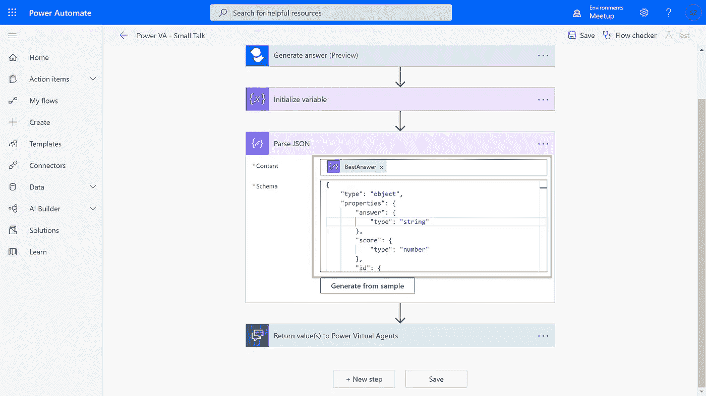

作为流程的最后一步，我们添加了两个输出。

首先，我们添加一个名为**答案**的*文本*输出，并将其映射到最佳答案的**答案**属性。

其次，我们添加一个名为 **Score** 的*数字*输出，并分别将其映射到 **score** 属性。分数是一个置信度值，表示 QnA Maker 对响应的确信程度。我们将在稍后使用这个值。

在点击保存之前，给你的流起一个更好的名字。

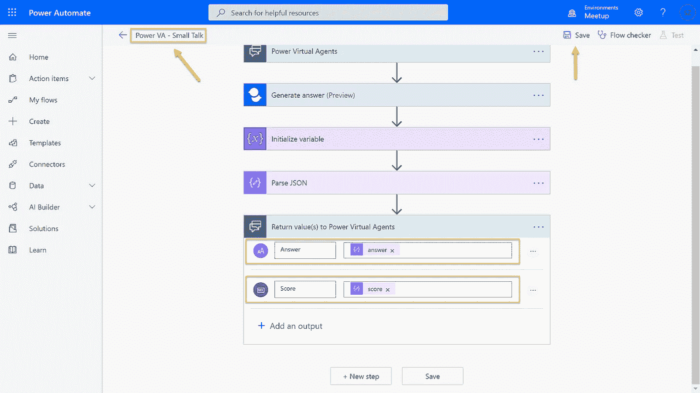

回到 Power VA 中的回退系统主题，我们现在可以添加新的流并将`UnrecognizedTriggerPhase`变量链接到流的**问题**输入。这样，我们只需将用户所说的传递给我们的流。

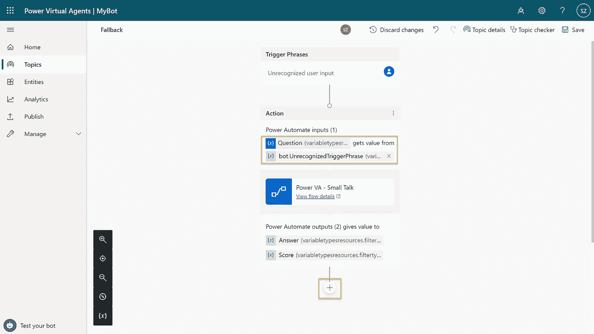

之后，我们使用连接器末端的 **+** 图标添加一个新条件。

我们测试**分数**变量是否大于 **0** 。在这种情况下，我们确保我们从 QnA Maker 收到了一个正确的答案，这个答案值得向用户显示，我们用一个使用 **Answer** 变量的简单消息来完成。

对于任何其他情况，我们用静态消息进行响应，表明即使我们的 QnA Small Talk 数据库也完全不知道用户说了什么。

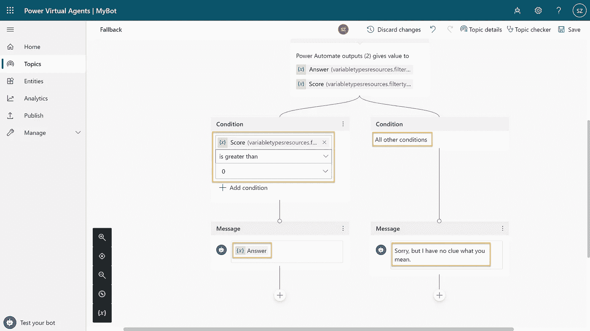

最后，点击**保存**按钮，我们就可以测试我们聊天机器人的聊天技能了。只需抛出一堆愚蠢的问题，然后看看聊天机器人的反应。

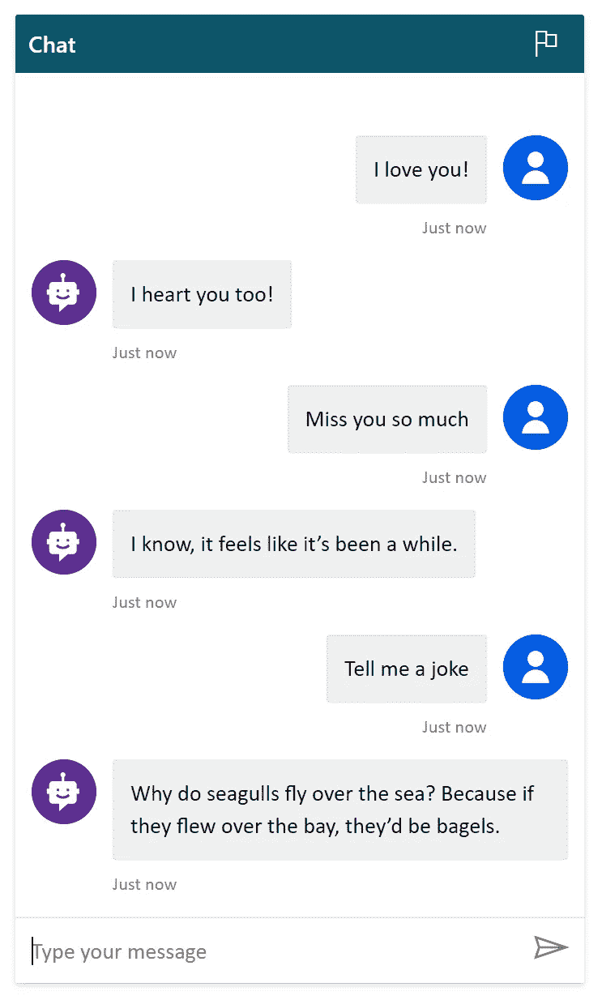

就是这样。我们的聊天机器人表现得非常自然，可以回答许多最常见的问题。即使是一个不完美的答案也能带来令人捧腹的幽默对话。你的聊天机器人肯定会经受住你的第一次用户交互，并且总是有机会通过添加新的 QnA 对来改善结果。

👉，
塞巴斯蒂安