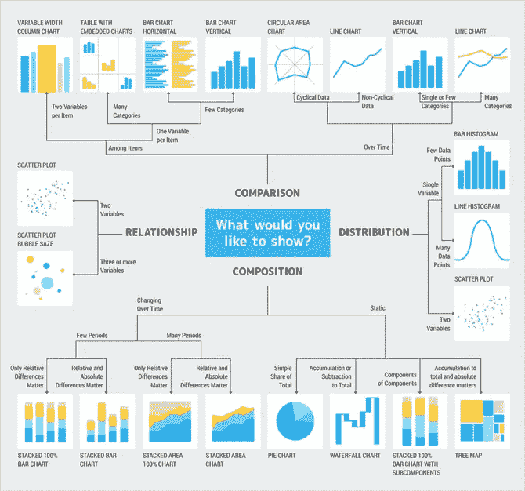

# 用数据讲故事:数据科学中的交流

> 原文：<https://towardsdatascience.com/tell-stories-with-data-communication-in-data-science-5266f7671d7?source=collection_archive---------13----------------------->

## 数据故事可以推动受众参与，并将见解转化为行动或业务成果。

照片由 [Unsplash](https://unsplash.com?utm_source=medium&utm_medium=referral) 上的 [Dmitry Ratushny](https://unsplash.com/@ratushny?utm_source=medium&utm_medium=referral) 拍摄

在数据科学的世界里，一个人必须擅长数据创造、怀疑和交流。来自数据分析的有趣见解必须与高层决策者和关键利益相关者分享，以实现最大的影响。

通过创造引人入胜的故事，向科学数据分析领域之外的受众有效展示和交流发现的能力，是任何成功的数据科学家的决定性特征。好消息是，用数据寻找和讲述故事是一门艺术，跨越学科，任何人都可以学习。

# 为什么沟通很重要？

数据科学家的工作不仅仅局限于数据库。作为一名数据科学家，你不会仅仅花几个小时钻研数据集、处理数字或解释关键发现来得出结论。您还必须:

*   **解释一下**你是如何得出特定结论的
*   理性地证明你为什么以一种特定的方式处理一个问题
*   **传达**有趣的见解*以某种方式*让人们以不同的方式思考或行动
*   说服你的听众，你的结果是决定性的，可以转化为可操作的东西
*   **表达**你的发现为何有价值，以及它们如何融入整体图景

这需要大量的沟通。

数据科学家必须具有说服力、说服力和可信度，而做到这一点的最佳方式就是**“数据故事”**。《有效的数据故事讲述:如何用数据、叙述和视觉效果推动变革》一书的作者 Brent Dykes 认为，数据故事讲述是一种传达数据洞察力的结构化方法，包含三个关键要素:*数据*、*视觉效果*和*叙述*。

在本文中，我们将讨论后两个元素。叙述可能有助于**向你的听众解释**数据表明了什么，以及为什么见解很重要。视觉效果——图形、图表、图示——可以用来以电子表格和仪表板无法做到的方式**突出**洞察力。

叙事和视觉的结合可以用来**吸引**你的观众和**推动**可操作的见解，从而实现有效的决策。

# 叙述

统计数据可能很难理解，尤其是如果你没有排除不必要的信息或给数据添加叙述的话。**你希望以一种能引起目标受众共鸣并对其产生影响的方式展示和传达你的见解。**下面是该如何做:

## 1.将你的数据联系起来

如果你看到一个没有任何上下文层次的数字“25”，你不会知道它的真正含义。是某人的年龄吗？是客户转化率的百分比变化吗？是网站访问量吗？

虽然在真空中展示数据无助于我们对其意义的理解，但将数据置于更大的环境或背景中可以使其获得真实和完整的意义。

你必须问自己，为了更好地理解你的发现，什么样的背景信息是相关的或必要的。通过这种方式，您可以将无意义的数据转换为真实的信息，这些信息可以用作可操作的见解。您还必须:

***a .了解你的听众—*** 考虑一下*你要向谁*展示你的发现和见解。是对整体业务表现感兴趣的高管吗？是营销经理想要确定特定的社交媒体活动是否有效吗？销售团队是否需要知道本季度是否能达到配额？你的演示和数据可视化需要围绕你的听众已经拥有的信息水平和他们想要的信息来构建。

***b .与你的听众相关***—[哈佛商业评论](https://hbr.org/2014/10/why-your-brain-loves-good-storytelling)进行了一项关于讲故事的神经生物学研究，发现“带有情感内容的人物驱动的故事可以更好地理解演讲者想要表达的要点。”这意味着决策通常是基于情感而非逻辑。通过与你的观众建立概念驱动的联系，你可以增加观众的参与度。

> 人们听到的是统计数据，但他们感受到的是故事——布伦特·戴克斯

## 2.创造一个引人注目的故事

你展示信息的方式可以塑造你的观众的看法和行为。强大的故事都是在更大的画面内**诬陷****——它们有[一个**勾，气势**和**销魂目的**](https://hbr.org/2013/04/how-to-tell-a-story-with-data) 。思考如何组织故事可以帮助你找到吸引人的故事，让人们了解复杂的问题，并激发关于提议的解决方案的对话。**

那么，你如何构建你的故事，并形成一个强有力的叙述呢？考虑以下问题:

*   你数据分析的目的是什么？为什么你首先要解读这些数据？
*   你的信息是什么？
*   你打算用你的洞察力解决什么问题？
*   你的发现给你的组织增加了什么价值？

数据故事化(通过叙述)的目标是激发商业决策的批判性思考和讨论——你应该能够通过**行动号召**来引发听众的回应。

## 3.总结你的见解

想象一下，你只有有限的时间或一句话来向你的听众传达信息。你会怎么说？你只需要告诉他们*需要知道的*。以这种方式思考你的陈述，将使你能够简洁、清晰、简明地讲述你想要讲述的故事。

请记住，好的数据故事只包含与分析目标直接相关的信息，超过这个数量，你的听众将很难理解你想要表达的观点。

# 画面

数据可视化——图形、图表、图解——是赋予数据生命的绝佳方式。强大的可视化通过统计信息的图形描述讲述一个故事。通过创造性地使用数据和统计数据来展示模式并得出关于假设的结论，你可以抓住并保持你的听众的注意力。

Deliveroo 是一个受欢迎的英国食品交付应用程序，已经[筹集了数百万美元的投资者资金](https://www.crunchbase.com/organization/deliveroo)，它使用大数据和机器学习来推动食品交付。工程副总裁这样评价数据可视化:

> 图表帮助我们的运营团队了解趋势并做出反应，整个企业的代理每天 24 小时都在对我们的数据集进行查询——Dan Webb

理解*什么时候最适合使用某些数据可视化也很重要。[疯狂的蛋](https://www.crazyegg.com/)用一个超级酷的信息图来演示这一点:*

疯狂鸡蛋信息-图片

用适当的数据可视化来说明你的结论是一种动态的说服形式。它让你的观众发现模式，看到趋势，并以更快的速度消化大量的数据。

总之，**当数据适合一个故事时，它的价值就增加了。**那些处理数据的人必须能够传达出数据为什么吸引人或有用，否则数据的价值就会丧失。你的目标受众必须能够对你的分析解决方案产生共鸣或反应。通过在叙述中呈现数据(并辅以视觉效果)，你可以从人的角度看待事实数据，以增加观众对你的发现的理解，并获得有价值的见解。