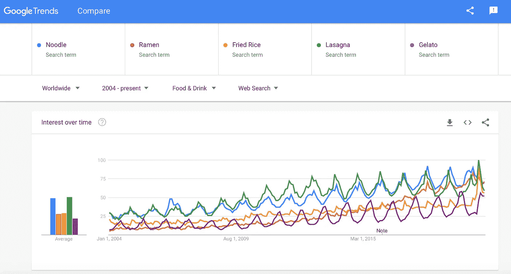
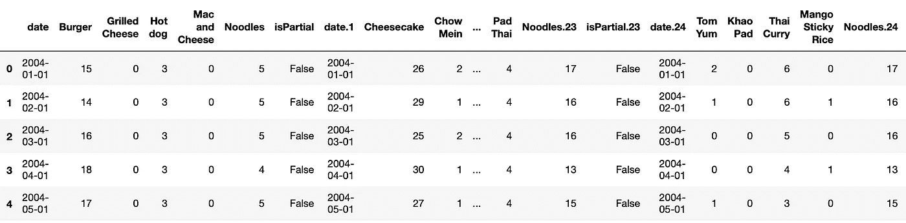
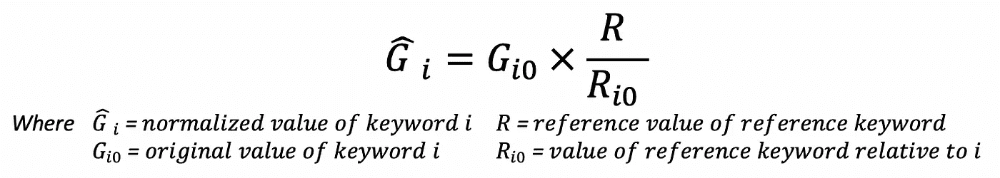
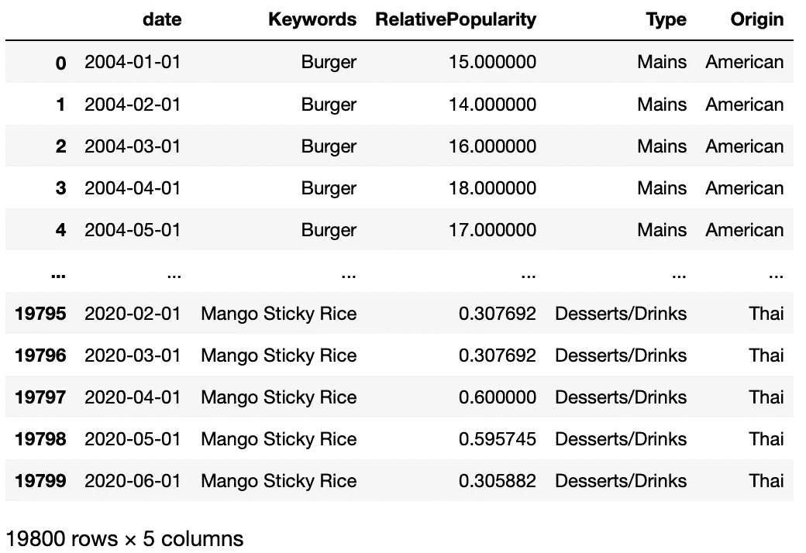
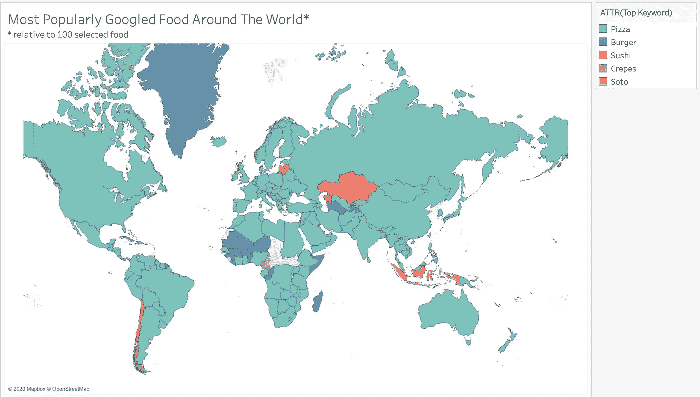
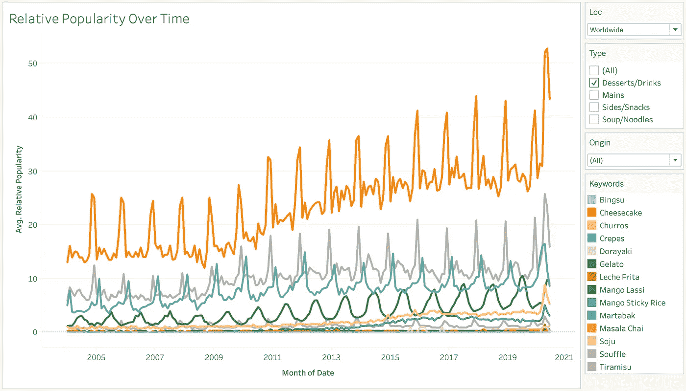
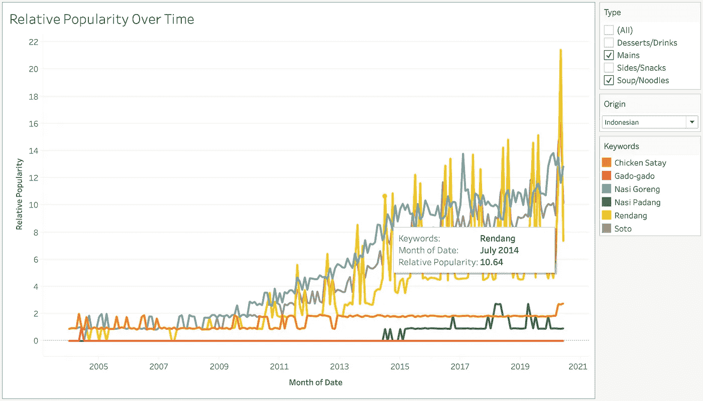
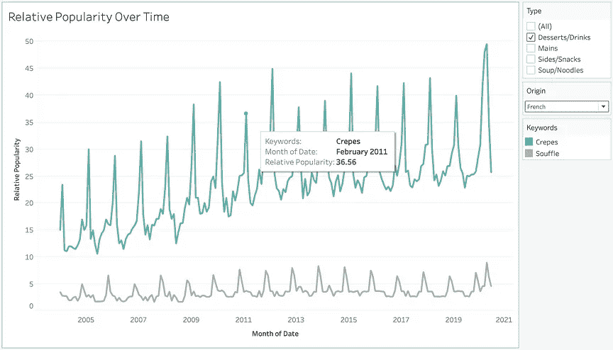
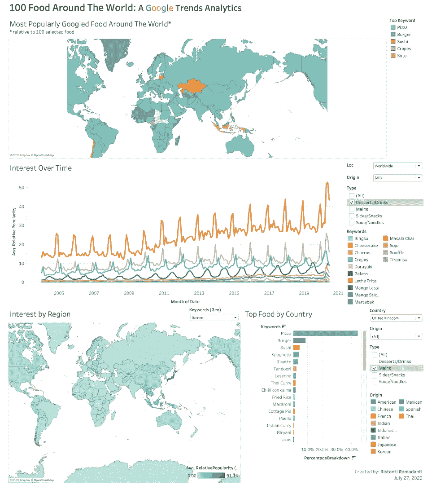

# 使用 Python 中的 Pytrends 讲述 Google Trends 的故事

> 原文：<https://towardsdatascience.com/telling-stories-with-google-trends-using-pytrends-in-python-a11e5b8a177?source=collection_archive---------11----------------------->

## 如何使用*谷歌趋势* python 库 *Pytrends* 追踪多个关键词的相对受欢迎程度并发现它们的故事。 *+* 数据可视化使用 *Tableau* 。

*Google Trends* 从 2006 年开始向公众开放，让他们搜索可以追溯到 2004 年的某些关键词的相对受欢迎程度。从谷歌的数据中，我们可以了解不同国家或地区之间的相对受欢迎程度。


[米切尔·罗](https://unsplash.com/@mitchel3uo?utm_source=medium&utm_medium=referral)在 [Unsplash](https://unsplash.com?utm_source=medium&utm_medium=referral) 上的照片

在本教程中，我将分享如何跟踪多个关键词的相对受欢迎程度(我说的是一次几十个，甚至几百个关键词)。

我使用 *Python* 连接到 *Google Trends API* 使用 [*Pytrends*](https://pypi.org/project/pytrends/) ，迭代关键字列表上的数据收集，并使用一个关键字作为参考来整合它们。我们需要这样做，因为谷歌趋势一次只允许最多 5 个关键词比较。



直接在[谷歌趋势](https://trends.google.com/trends/explore)上比较关键词

现在让我们搜索关于食物的关键词。这将是有趣的，因为不同类型的食物可能有不同的季节性和受欢迎程度，这可能是一个很好的研究餐饮业。还有，我饿了。所以让我们开始吧！

**准备**

首先，我们需要准备关键字列表，并选择一个参考关键字来实现比较的集成。注意*谷歌趋势*给出的是相对受欢迎程度的数据，而不是实际的搜索量。来自*谷歌趋势*页面:

> “数字代表在给定地区和时间内相对于图表最高点的搜索兴趣。值 100 是该术语的最高流行度。值为 50 表示该术语的流行程度减半。得分为 0 意味着没有足够的数据用于这个术语。

再者，从我的经验来看，选择一个不太热门的参考关键词是一件好事，因为我们会得到更有特色的对比。但是，引用关键字也应该足够受欢迎，不会获得 0 相对受欢迎度。

所以让我们制作一个关键词列表，可以直接在 *Python* 或者任何电子表格中制作。为了这个教程，我列出了世界上几个受欢迎的菜系的 100 种食物。

**连接谷歌 API &收集数据**

现在让我们跳进 *Python* 吧。首先要做的是导入库并连接到 *Google API* :

```
# pip install pytrends
import pandas as pd
from pytrends.request import TrendReqpytrends = TrendReq(hl=’en-US’, tz=360)
```

接下来，读取列表并创建迭代以获得列表中所有关键词的 *Google Trends* 数据。为此，我创建了一个函数来收集一段时间内的 *Google Trends* 数据(时态数据):

我还创建了一个函数来按地区或国家收集 *Google Trends* 数据(空间数据):

几个重要参数(详情[此处](https://pypi.org/project/pytrends/)):

*   *kw_list* 是要搜索的关键字列表，
*   *geo* 可以设置为特定的国家代码，例如“美国”或“全球”，
*   *猫*可以设置到某个类别，例如所有类别:0，食物&饮料:71，
*   *时间范围*可以设置为过去 5 年`'today 5-y'`，2004 年到现在`'all'`等。

每个函数产生 25 个文件(100 个关键字除以 4)，每个文件包含 4 个关键字+参考关键字的比较。接下来，我们将整合这些文件，并相应地归一化相对流行度。

**数据整合**

通过将所有文件的列连接在一起，我们得到了完整的数据集，每行代表时间或空间维度。然而，我们可以观察到，在不同的比较之间，参考关键词的相对流行度的值可能是不同的。



下一步是将这些值标准化，这样我们就可以得到所有 100 种食物的完整的相对比较。我们使用以下公式来计算每个关键字的归一化值:



归一化关键字相对流行度的公式

为了实现上面的公式，让我们运行我创建的下面的函数。注意，为了避免无限值，如果参考关键词的相对流行度太小，以至于 *Google* 报告为 0，我假设相对流行度为 0.01(来自 *Google Trends* 的最小值)。

我们在 *Python* 中做的最后一步是整理和融化*数据帧*。



我们的数据已经可以可视化了！

**数据可视化使用*Tableau***

几个**好吃的**发现:

1.  **披萨主宰一切。**他们到处都有极高的人气。但是很明显，T42 的 Soto 在印尼打败了他们，喀麦隆的 Crepes 打败了他们。汉堡和寿司在一些国家也是最受欢迎的。



披萨统治

2.**甜点的季节性**(其他也是)。夏天吃冰淇淋，冬天吃蛋糕，经典。



随着时间的推移而流行

3.**欢宴&节日模式。**例如，*人当*每年有两次高峰，分别发生在伊斯兰节日开斋节和宰牲节。



印度尼西亚食物

4.更多花样:**每年二月的薄饼** ❤

此外，几乎所有的食品都在 2020 年 4 月至 5 月突然涨价，这可能是由于新冠肺炎封锁和检疫的影响。



绉效应日

请随意浏览此处提供的完整*表格*仪表盘[。](https://public.tableau.com/profile/ristanti.ramadanti#!/vizhome/100FoodAroundTheWorld/Dashboard1)



[完整仪表板](https://public.tableau.com/profile/ristanti.ramadanti#!/vizhome/100FoodAroundTheWorld/Dashboard1)

我希望这篇教程对你有所帮助，并可能激发更多的分析来！

完整的 *Jupyter 笔记本是* [*这里有*](https://github.com/rframadanti/gtrends_multiple/blob/master/pytrends_multiple_keywords.ipynb) *。*

可以通过 [*LinkedIn*](https://www.linkedin.com/in/ristanti-ramadanti/) 联系我。之前我还用 *Google Trends* 做了一个 *Tableau* 仪表盘，关于家庭娱乐设备[这里有](https://public.tableau.com/profile/ristanti.ramadanti#!/vizhome/GoogleTrends-SmartHomeGamingDevices/Dashboard1)。