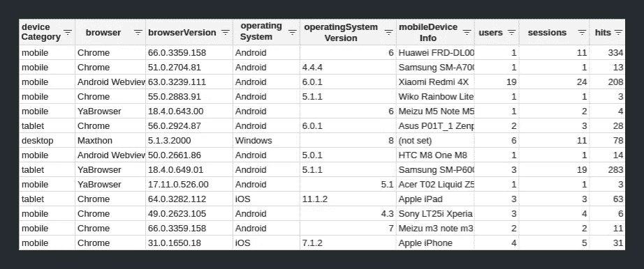
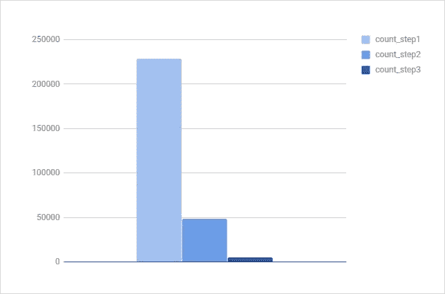
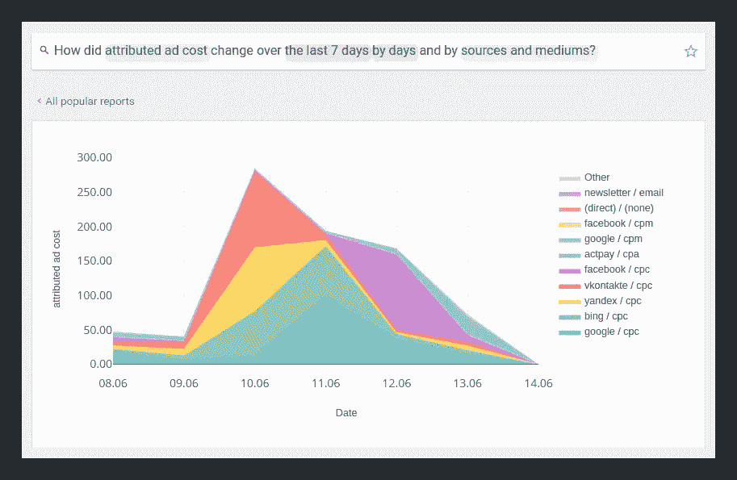
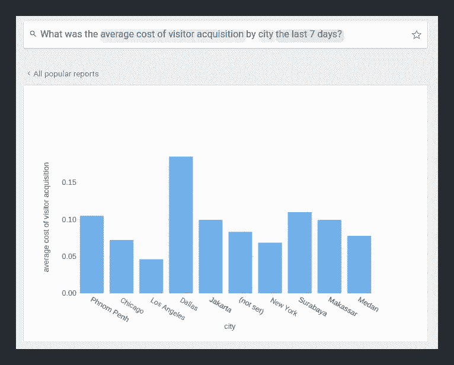
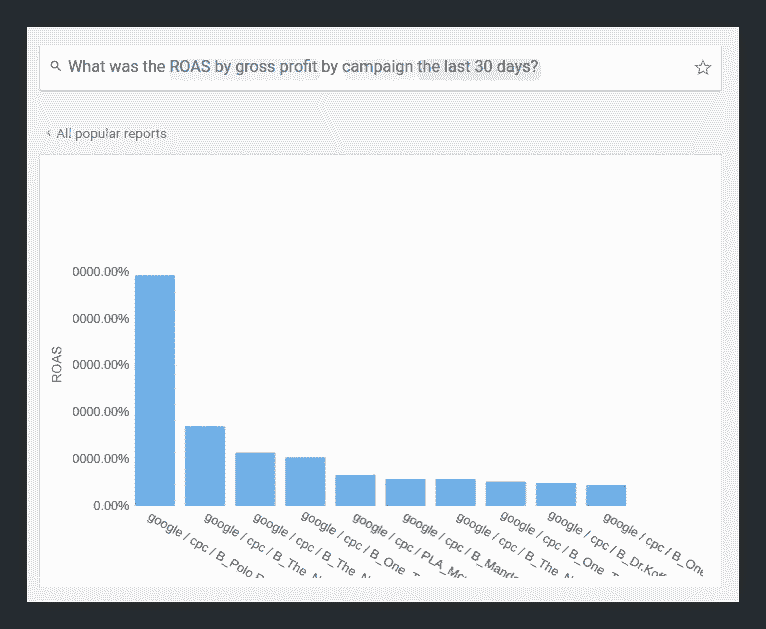
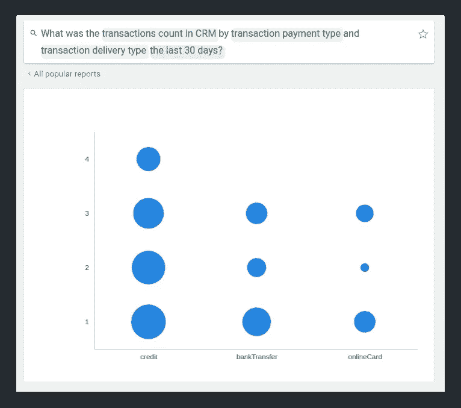
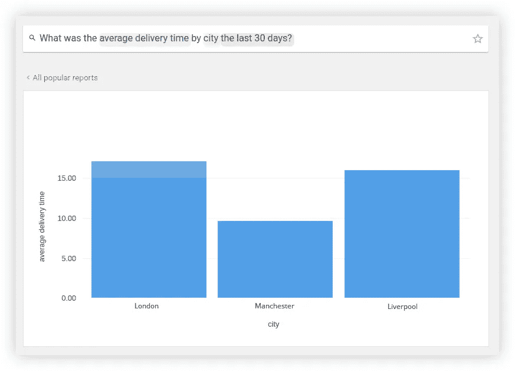

# 到 Google BigQuery 的 SQL 查询模板将把您的报告带到另一个层次

> 原文：<https://towardsdatascience.com/templates-of-sql-queries-to-google-bigquery-that-will-take-your-reports-to-another-level-d0ebc1b8957d?source=collection_archive---------30----------------------->

来源:[沉积照片](https://ru.depositphotos.com/6186970/stock-photo-database-concept-vintage-cabinet-library.html)

## 了解创建报告的常见挑战 Google Analytics，以及如何使用 Google BigQuery 克服这些挑战

在这篇文章中，我们分享了一些报告模板，你可以用 SQL 查询来构建 Google BigQuery 数据。

首先，您将了解从 GA360 到 GBQ 的标准导出可以计算什么。

接下来，在 [OWOX BI Pipeline](https://www.owox.com/products/bi/pipeline/) 的帮助下，您将发现哪些独特的指标可以添加到标准的谷歌分析指标中。

# 基于从 Google Analytics 360 到 BigQuery 的标准导出的报告

谷歌分析报告是用户友好和方便的，尽管你可能会面临[采样](https://www.owox.com/blog/articles/how-to-avoid-google-analytics-sampling/)，数据聚合[和其他限制](https://www.owox.com/blog/articles/gbq-reports/)。抬头！有一个解决办法:使用标准的数据导出到 Google BigQuery 来规避限制，并通过 SQL 请求构建更全面的报告。

# 1.跨任何维度的用户行为

假设您已经在网站上实施了新的指标或更新了现有指标，以衡量对您的业务至关重要的 KPI。您可以使用网站上的点击量变化报告来查看数据是否发送正确，并及时对任何分析错误做出反应。对于此报告类型，您需要以下维度:

*   设备类别。
*   设备浏览器。
*   点击类型。
*   事件类别。
*   事件操作。
*   内容分组。

常规的谷歌分析报告不会为你提供所有上述信息，因为它只允许同时选择 2 个维度，而定制报告则建议更多——5 个维度。SQL 查询没有这样的限制，让您可以在报告中提取您想要的所有指标和维度。

我们在 PDF 文件中提供的 SQL 查询模板将帮助您了解会话、用户和点击是如何在浏览器、设备和点击类型之间分布的。如果需要，您可以向查询中添加更多的维度。例如:

*   设备.操作系统。
*   device.mobileDeviceInfo。
*   设备.语言。
*   地理网络.区域

通过添加这些维度，您将得到下表:

图片由作者提供

你也可以将 CRM 或 ERP 系统中的信息导入 Google BigQuery。因此，您将能够跨任何所需的指标分析用户行为:产品目录、利润、产品类别、用户描述、订单完成等。例如，您发送一个查询来获取交易数据，然后将它们与来自 CRM 的已付款订单相结合，并计算在线完成订单的百分比。这将帮助您了解从下订单到付款或交货的过程中是否存在任何问题。

# 2.关键用户操作的统计数据

如果你想建立用户群并建立个性化的时事通讯，你需要关于在线用户行为的信息。细节越多，分割的选择就越多。Google Analytics 不会为您提供所有点击类型的用户行为报告，如浏览量、事件、社交、计时以及增强型电子商务事件(点击、详细信息、添加、删除、结账、购买、退款)。您也不能查看某个用户点击类型的平均值、最大值或最小值。然而，所有这些信息都可以通过一个 SQL 查询获得，这个查询可以在这篇文章的 PDF 文件中找到。

上述查询还将帮助您计算每个用户的以下平均值、最大值和最小值:

*   根据特定搜索查询的页面视图。
*   每次访问的页面访问量。
*   将产品添加到购物车的次数。
*   从购物车中取出产品的次数。
*   添加到购物车的产品数量。
*   从购物车中移除的产品数量。
*   添加到购物车的产品的总价格。
*   从购物车中移除的产品的总价格。

使用完全相同的 SQL 查询，您还可以为每个会话计算这些值:

*   根据特定搜索查询的页面视图。
*   每个会话的页面访问量。
*   在购物车中添加/移除产品的次数。
*   添加到购物车或从购物车中移除的产品数量。
*   添加到购物车或从购物车中移除的产品的总价格。

手头有了这样的信息，就可以预测重复购买和微转化。

# 3.选择访问过某些产品页面的用户

为了完善你的销售漏斗，你需要在购买之前对用户在你的网站上所做的给予适当的信任。GA 中的用户浏览器报告将为您提供所有类型的用户操作信息(浏览量、事件、社交、计时)。然而，这可能是复杂和耗时的，因为您将只能看到单个用户的这种统计数据，为此应用了高级细分和产品 ID 过滤器。

然而，基于从 GA360 到 Google BigQuery 的标准导出，构建一个报告将为您提供关于您网站上所有用户操作的数据，通过 GA 代码进行跟踪。例如，我们前面谈到的 SQL 查询将帮助您对查看过一些产品页面的用户进行分组。因此，您可以提醒那些没有付款就把商品放在购物车里的用户他们感兴趣的产品，并推荐其他产品，甚至建立客户档案。

# 4.购买了某种产品的用户的行为

上一段提到的所有情况也适用于本报告。使用我们的 PDF 文件中的 SQL 查询，您将构建一个报告，其中包含购买了某个特定商品的用户的姓名。这些名称将允许您向用户提供与已经购买的产品相似的产品或配件。

# 5.用更适合您业务的步骤建立漏斗

比方说，你在博客上发表了一篇文章，鼓励你的客户订阅时事通讯。要跟踪这样的转换，您需要两个事件:阅读文章和订阅。问题是你不能在谷歌分析中将这两者结合起来，因为它们是两种不同的目标类型——浏览量和事件。

此外，在 GA 中设置目标还有其他限制:

*   每个 GA 视图最多可以配置 20 个目标。这些目标不能删除，你只能停止为它们收集数据。
*   在报告中，您将看到创建目标后收集的数据。这意味着您不能将目标应用于前一时期的数据。

将数据导出到 Google BigQuery 和一个简单的 SQL 查询将帮助您规避上述限制。你可以建立一个包含任何必要步骤的漏斗，找到网站上任何狭窄的范围，并了解用户在哪个阶段掉得最多。

您还可以发现用户查看产品描述的频率，以及这种查看如何影响转化率。在我们的例子中，漏斗是这样的:

1.产品页面视图→ 2。产品描述视图→ 3。将产品添加到购物车。不过，你可以将任何用户操作设置为漏斗步骤，以便在网站上进行跟踪。结果，你会得到一个类似的图表:

图片由作者提供

# 6.网站内部搜索的效率

你可以通过改善网站的内部搜索来提高转化率。例如，分析零搜索结果的百分比并更新网站内容，添加类似产品、特价商品等等。另一种选择是使用搜索查询报告，将查询最多的产品类别切换到更高的位置。

GA 报告中的维度和指标需要处于同一级别:点击级别、会话级别、用户级别或产品级别范围。这意味着，在包含维度的单个报表中，您无法查看产品 SKU 或跨会话 ID 的搜索查询排名。

该模板将有助于评估搜索查询会话的性能，并检查网站可用性的假设。

SQL 查询也将为您提供这些数据:

*   具有特定查询的会话数。
*   根据搜索查询的平均搜索结果数。
*   使用明确的搜索查询跨会话的总收入。
*   会话间搜索查询的等级。
*   搜索查询在搜索结果中的排名。

# 基于从 OWOX BI Google Analytics 到 Google BigQuery 的管道数据的报告

如果您还没有 GA 360 订阅，但真的愿意用您的业务所需的附加信息来丰富您的 GA 数据，OWOX BI Pipeline 将帮助您并为您提供必要的原始数据。事情是这样的，谷歌分析只允许[导入](https://support.google.com/analytics/answer/3191589)跨广告活动的总成本数据，而[标准导出模式](https://support.google.com/analytics/answer/3437719)根本不提供这样的信息。

使用 OWOX BI Pipeline，您可以组合来自所有广告平台的数据，并将其发送到 Google BigQuery，甚至可以查看所有会话的成本。这将允许您将您的支出和收入分组到用户级别、细分或群组级别，甚至是登录页面级别。

下面，我们提供了无法通过标准导出来计算的指标，但是可以通过 OWOX BI 来计算。以下所有报告都可以通过 [SQL 查询](https://www.owox.com/blog/use-cases/bigquery-query-examples/#download)或简单提问 [OWOX BI 智能数据](https://www.owox.com/products/bi/smart-data/)获得。

# 1.归因广告成本如何随来源、媒介和天数而变化？

该报告将为您提供特定时期的成本信息，以及设定时间内的指标变化信息。你可以将获得的信息与之前的信息进行比较，评估不同来源的广告效果。

下面是 OWOX BI 智能数据的一个报告示例:

图片由作者提供

从上面的图表中，你可以看到 facebook/cpc 的成本在 6 月 7 日急剧下降。这可能是一个信号，让营销专家检查哪些活动、广告组和特定来源的关键词开始减少点击。很可能，由于竞争对手的广告，广告浏览量减少了。为了解决这个问题，营销专家可以调整出价、更新广告内容等等。

# 2.每个城市获得访客的平均成本是多少？

如前所述，Google Analytics 和 BigQuery 的标准导出不允许您计算每个会话、用户和群组的成本。但是，OWOX BI 肯定会让你这么做。

借助下面的报告，您可以了解不同城市和时间段的平均客户获取成本。查看它在 OWOX BI 智能数据界面中的外观:

图片由作者提供

通常，每个地区的广告活动都有不同的设置。前面提到的报告会让你知道该关注哪个地区。例如，从上图可以看出，达拉斯的客户获取成本(CAC)最高。这意味着你应该更仔细地观察这个地区的广告活动，计算每个用户的平均收入，广告活动的 CAC，将其与客户终身价值(LTV)进行比较。如果广告活动没有回报，你可以调整出价或干脆取消一些广告。

# 3.按活动划分的毛利润的 ROAS 是多少？

这样的报告可以帮助您评估广告的表现，并通过 CRM 中的订单完成率和产品主要成本来查看活动的贡献。要获得这个报告，您需要首先将订单数据从 CRM 或 ERP 系统导入到 Google BigQuery。下面您可以看到报告在 OWOX BI 智能数据界面中的外观:

图片由作者提供

从图表中你可以看到活动的表现，从最好的到最差的。营销人员将能够对每一次营销活动给予适当的肯定，了解其中一些活动成功或失败的原因，并为未来的营销努力选择最有效的渠道。

# 4.根据交易支付类型和交易交付类型，CRM 中的交易数量是多少？

有了这份报告，你就可以找到任何与下订单或支付选项有关的问题。为了构建报告，您必须将关于已完成订单的 CRM 数据上传到 Google BigQuery。接下来，您将能够使用我们的 SQL 模板，根据您需要的指标提出智能数据问题，并最终获得以下报告:

图片由作者提供

这个气泡图显示了用户通过信用卡(onlineCard)支付四次的三次或两次:当选择客户上门取件或邮局上门取件递送选项时。但是，客户也可以通过信用卡支付快递服务。如果没有使用这种方法，你的网站可能会有一些问题。

# 5.每个城市的平均送货时间是多少？

对于这个报告，您还需要来自 CRM 系统的已完成订单的数据。该报告将允许您检查在某些城市是否有任何递送问题。

图片由作者提供

例如，您可以看到伦敦的交付时间最长。如果平均送货时间比你网站上说的要长，你可能需要查一下那个地区是否有当地的线下商店或仓库。如果还没有的话，去找一个可能是个好主意，因为这会减少送货时间。另一个好主意是检查你的客户在这个地区的满意度。

# 结论

标准的数据导出到 Google BigQuery 和 SQL 查询以及 [OWOX BI 工具](https://www.owox.com/products/)在克服默认的 Google Analytics 限制和创建深入分析报告时非常方便。例如，您可以:

*   跨任意数量的参数分析用户行为。
*   获取关键用户操作的统计数据，以及每个用户点击类型的平均值、最大值和最小值。
*   根据用户访问的特定页面对用户进行分组，或者查看购买了特定产品的人的用户行为。
*   建立一个包含所有必要步骤的漏斗。
*   评估内部网站搜索的性能。

OWOX BI Pipeline 将丰富您的 Google BigQuery 数据，并帮助您了解:

*   不同来源和媒介的归属成本每天有什么变化。
*   平均获客成本如何取决于城市。
*   毛利率如何取决于活动来源和媒体。
*   CRM 系统中的订单编号如何取决于付款和交货选项。
*   平均配送时间如何取决于城市。