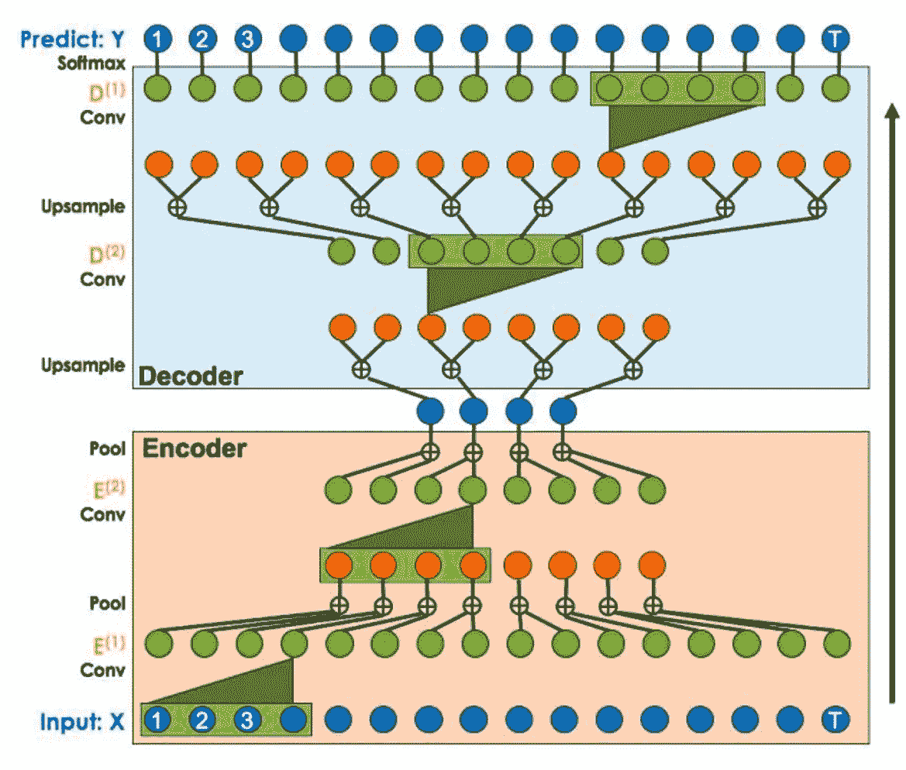
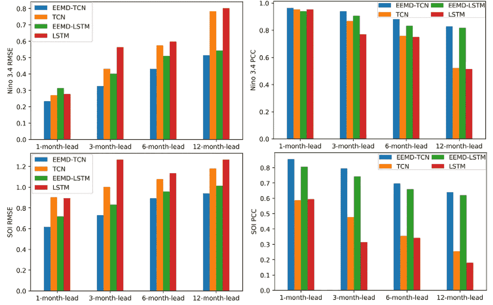
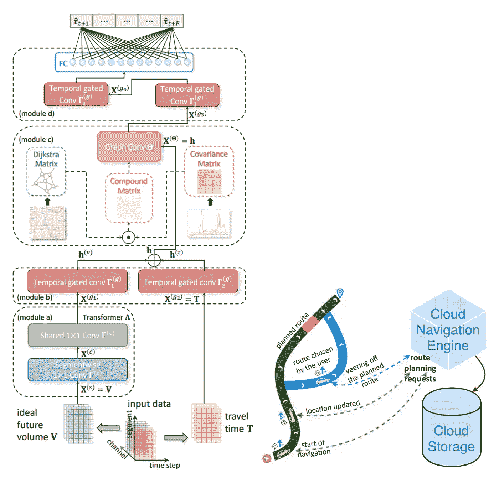
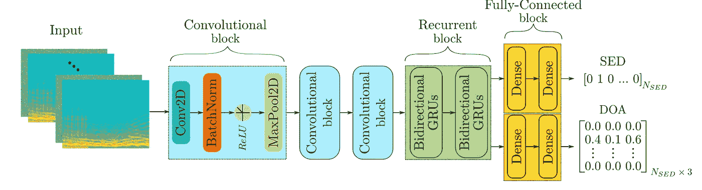
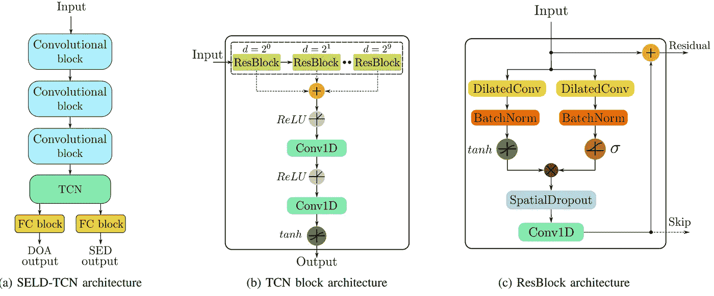
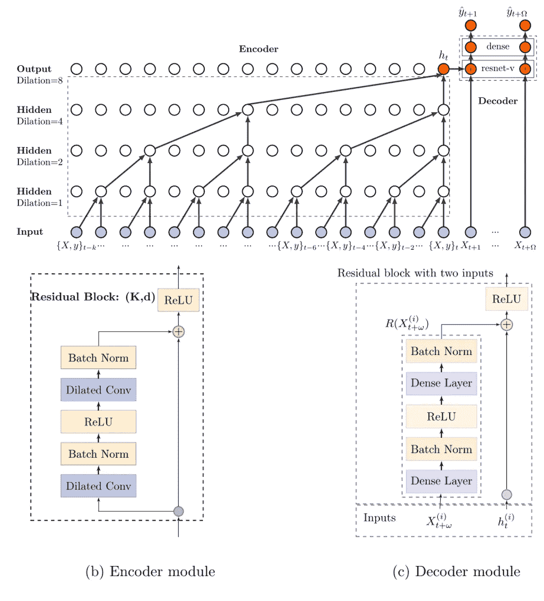

# 时间卷积网络，时间序列的下一次革命？

> 原文：<https://towardsdatascience.com/temporal-convolutional-networks-the-next-revolution-for-time-series-8990af826567?source=collection_archive---------0----------------------->

这篇文章回顾了 TCN 解决方案的最新创新。我们首先介绍了一个运动检测的案例研究，并简要回顾了 TCN 架构及其相对于卷积神经网络(CNN)和递归神经网络(RNN)等传统方法的优势。然后，我们介绍了几部使用 TCN 的小说，包括《改进交通预测》、《声音事件定位与检测》和《概率预测》。

**TCN 简评**

Lea 等人(2016)的开创性工作首先提出了用于基于视频的动作分割的时间卷积网络(TCNs)。该传统过程的两个步骤包括:首先，使用(通常)编码时空信息的 CNN 计算低级特征，其次，将这些低级特征输入到使用(通常)RNN 捕获高级时间信息的分类器中。这种方法的主要缺点是它需要两个独立的模型。TCN 提供了一个统一的方法来捕获所有两个层次的信息。

编码器-解码器框架如图 1 所示，关于该架构的更多信息可在前两篇参考文献中找到(见本文末尾)。最关键的问题提供如下:TCN 可以采取一系列的任何长度，并输出同样的长度。在使用 1D 完全卷积网络架构的情况下，使用因果卷积。一个关键特征是在时间 *t* 的输出仅与在 *t* 之前出现的元素进行卷积。

Lea 等人(2016 年)

《自然》杂志最近发表了严等人(2020)在进行天气预报任务的研究成果，这甚至引起了周围的议论。在他们的工作中，对 TCN 和 LSTM 进行了对比实验。他们的结果之一是，在其他方法中，TCN 在时间序列数据的预测任务中表现良好。

颜等(2020)

接下来的部分提供了这个经典 TCN 的实现和扩展。

**改善交通预测**

拼车和在线导航服务可以改善交通预测，改变路上的生活方式。更少的交通堵塞、更少的污染、安全和快速的驾驶只是通过更好的交通预测可以实现的基本问题的几个例子。由于这是一个实时数据驱动的问题，因此有必要利用即将到来的流量的累积数据。为此，戴等(2020)最近提出了一种混合时空图卷积网络(H-STGCN)。总体思路是利用分段线性流量密度关系的优势，将即将到来的交通量转换为其行程时间当量。他们在这项工作中使用的最有趣的方法之一是图形卷积来捕捉空间依赖性。复合邻接矩阵捕捉了流量近似值的固有特性(更多信息，请参考李瑟娥，2017)。在下面的体系结构中，给出了四个模块来描述整个预测过程。

戴等(2020)

**声音事件定位&检测**

声音事件定位和检测(SELD)领域继续发展。理解环境在自主导航中起着至关重要的作用。Guirguis 等人(2020)最近为声音事件 SELD-TCN 提出了一种新的架构。他们声称他们的框架优于该领域的最新技术，训练时间更快。在他们的 SELDnet(架构如下)中，以 44.1 kHz 采样的多声道音频录音通过应用短时傅立叶变换提取频谱的相位和幅度，并将其作为单独的输入特征进行叠加。然后，卷积块和递归块(双向 gru)被连接，随后是全连接块。SELDnet 的输出是声音事件检测(SED)和到达方向(DOA)。

Guirguis 等人(2020 年)

为了超越它，他们提出了 SELD-TCN:

Guirguis 等人(2020 年)

由于扩展的卷积使网络能够处理各种输入，因此可能需要更深入的网络(这将受到反向传播期间不稳定梯度的影响)。他们通过调整 WaveNet (Dario 等人，2017 年)架构克服了这一挑战。他们表明，SELD 任务不需要循环层，并成功地检测到活跃声音事件的开始和结束时间。

**概率预测**

陈等人(2020)设计的新框架可用于估计概率密度。时间序列预测改进了许多业务决策方案(例如，资源管理)。概率预测可以从历史数据中提取信息，将未来事件的不确定性降到最低。当预测任务是预测数以百万计的相关数据序列时(如在零售业中)，它需要令人望而却步的劳动力和计算资源来进行参数估计。为了解决这些困难，他们提出了一个基于 CNN 的密度估计和预测框架。他们的框架可以学习序列之间潜在的相关性。他们作品的新颖之处在于他们提出的深层 TCN，正如他们的建筑所展示的那样:

陈等(2020)

编码器-解码器模块解决方案可能有助于实际大规模应用的设计。

# 摘要

在这篇文章中，我们介绍了最近的工作，涉及时间卷积网络，并优于经典的 CNN 和 RNN 方法的时间序列任务。如需更多信息，请随时给我发电子邮件。

— — — — — — — — — — — — — — — — — — — — — — — — —

# 关于作者

Barak 获得了以色列理工学院的航空工程学士学位(2016 年)、硕士学位(2018 年)以及经济和管理学士学位(2016 年，成绩优异)。他曾在高通工作(2019-2020)，在那里他主要研究机器学习和信号处理算法。巴拉克目前正在海法大学攻读博士学位。他的研究兴趣包括传感器融合、导航、深度学习和估计理论。[www.Barakor.com](http://www.Barakor.com)

https://www.linkedin.com/in/barakor/领英

推特:巴拉克 2

— — — — — — — — — — — — — — — — — — — — — — — — —

# 参考

时间卷积网络:动作分段的统一方法。*欧洲计算机视觉会议*。施普林格，查姆，2016。

行动分割与侦测的时间回旋网络。IEEE 计算机视觉和模式识别会议论文集。2017.

闫，吉宁，等。enSo 预报的时间卷积网络。*科学报告*10.1(2020):1–15。

李，亚光，等。扩散卷积递归神经网络:数据驱动的交通预测。 *arXiv 预印本 arXiv:1707.01926* (2017)。

雷萨格、达里奥、乔迪·庞斯和泽维尔·塞拉。"用于语音去噪的波网." *2018 IEEE 声学、语音和信号处理国际会议(ICASSP)* 。IEEE，2018。

陈，易天，等。“时间卷积神经网络的概率预测”*神经计算* (2020)。

SELD-TCN:通过时间卷积网络的声音事件定位和检测 arXiv 预印本 arXiv:2003.01609 (2020)。