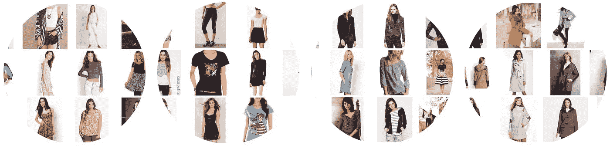
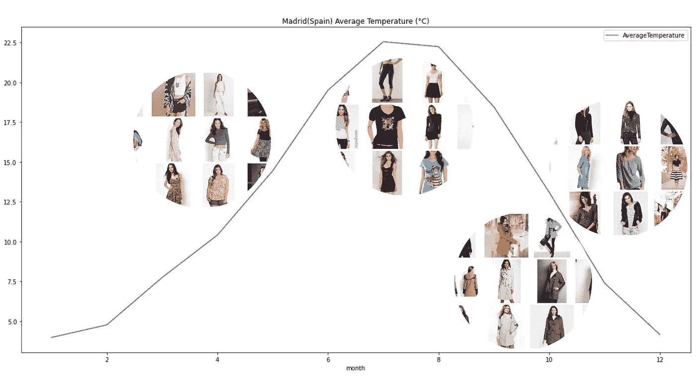
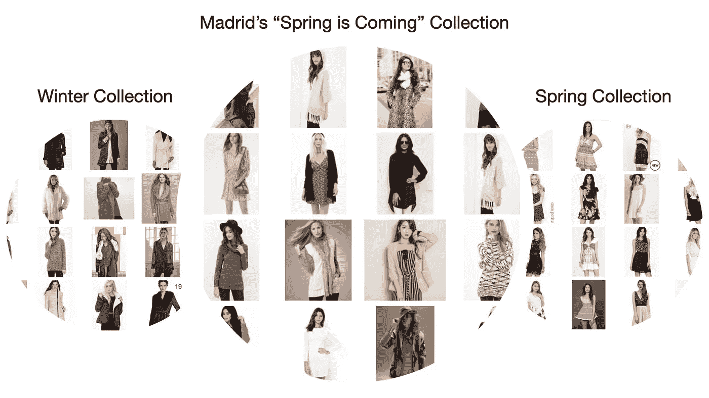
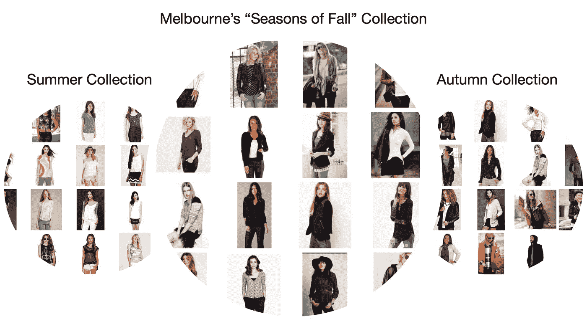
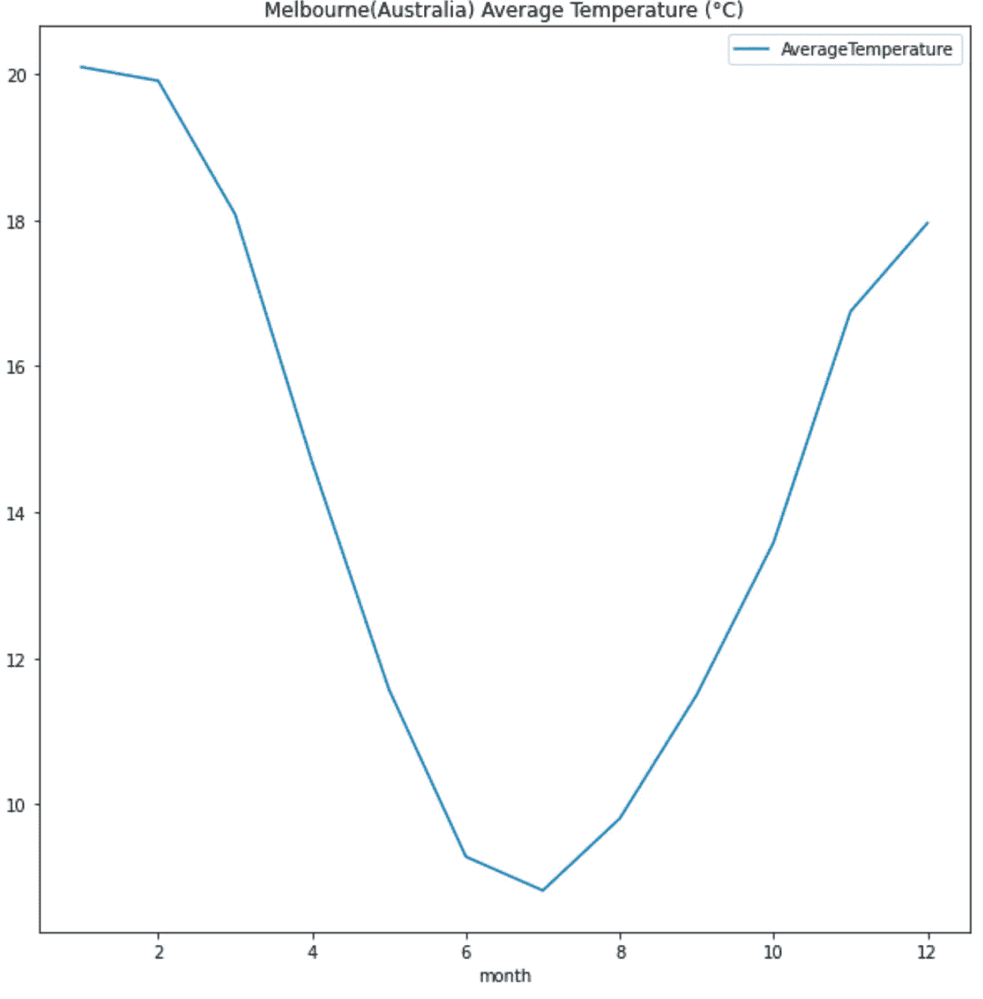
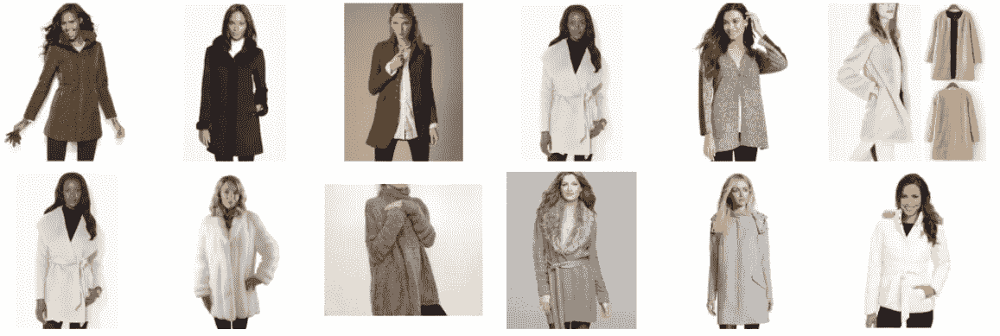
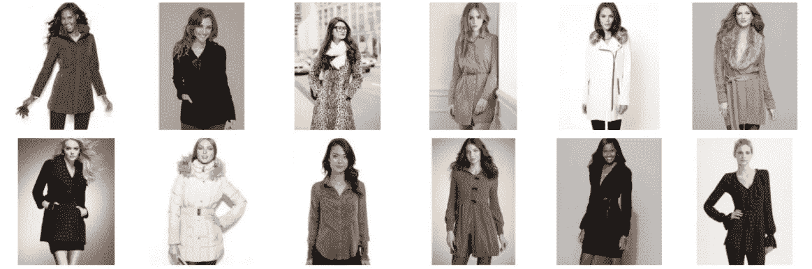
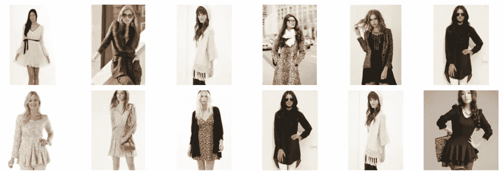
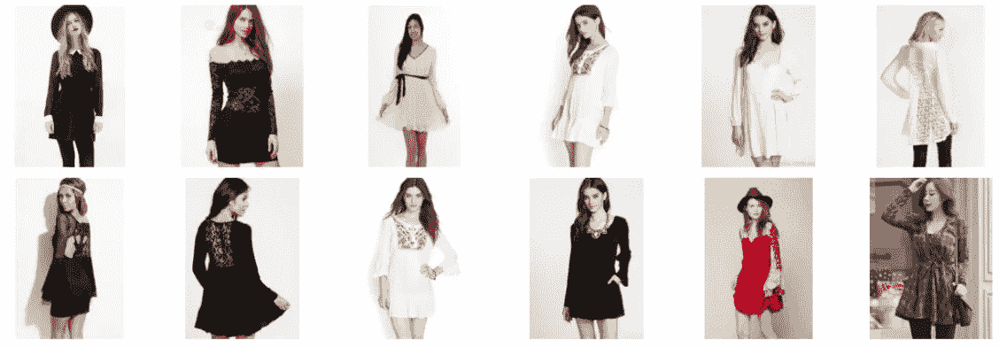
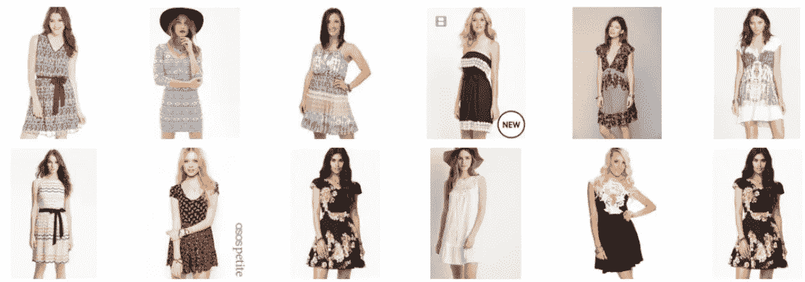

# 时间时尚推荐器

> 原文：<https://towardsdatascience.com/temporal-fashion-recommender-59c26313fa25?source=collection_archive---------46----------------------->

## 现代 RecSys

## 建立一个随季节变化的推荐器

设计任何推荐系统(RecSys)的最大挑战之一是处理时间变化。由于时尚界随着时间而发展，我们设计的推荐人也必须适应变化的潮流。

在本文中，我们将考虑如何使用时间权重将季节性服装的微妙之处纳入我们的卷积神经网络(CNN)模型。

# 商业问题

我们想象中的电子商务公司**happy panda co .**正在全球扩张，并将推出**季节性系列**。产品要求是:

*   给定服装系列，我们如何调整它们以适应不同国家的不同季节？注意，每个国家在不同的季节会有不同的时尚感和天气状况。

# 数据

*   我们将使用**[**deep fashion**](http://mmlab.ie.cuhk.edu.hk/projects/DeepFashion.html)**数据的子集，由香港中文大学刘 z .等人**开源。我们的数据由 46 个类别的 28 万张时尚图片组成。你可以从他们的网站上下载数据。 此外，团队还发布了一个[更新版本，增加了](https://github.com/switchablenorms/DeepFashion2)的数据。你需要[填写一份谷歌表格](https://docs.google.com/forms/d/e/1FAIpQLSeIoGaFfCQILrtIZPykkr8q_h9qQ5BoTYbjvf95aXbid0v2Bw/viewform?usp=sf_link)来获取数据。**
*   ****温度数据**来自[**ka ggle——气候变化:地球表面温度**](https://www.kaggle.com/berkeleyearth/climate-change-earth-surface-temperature-data) 由[伯克利地球](http://berkeleyearth.org/)开源。这些数据包括 1750 年至 2013 年间 3400 个城市的全球气温。**我们将只使用数据的子集，马德里和墨尔本 10 年(2004-2013)的平均气温** **。****

****

**从 [DeepFashion、](http://mmlab.ie.cuhk.edu.hk/projects/DeepFashion.html)开源从 [**刘 z 等**](https://liuziwei7.github.io/) 挑选春夏秋冬服装**

**从深层的时尚数据中，我选择适合四季的服装**。例如，在冬天，大多数人会穿上更厚的夹克来保暖。另一方面，春天和夏天是穿着轻便的衣服在阳光下享受时光的时候。因此，温度在影响人们穿着方面起着重要作用。例如，如果我们考虑一个特定城市全年的平均温度，**马德里(西班牙)**，我们可以将我们选择的服装放置在不同的时间，以观察服装和温度之间的关系。****

****

**马德里(西班牙)温度来自 [Kaggle —气候变化:地球表面温度](https://www.kaggle.com/berkeleyearth/climate-change-earth-surface-temperature-data) ( [CC BY-NC-SA 4.0](https://creativecommons.org/licenses/by-nc-sa/4.0/) )由[伯克利地球](http://berkeleyearth.org/)**

> **更重要的是，季节之间的**过渡需要几周时间，**我们的模型应该能够**随着时间的推移调整推荐，帮助我们的用户逐渐过渡到下一个季节。****
> 
> **当然，在现实世界中，我们将有机会获得更丰富的时间序列数据。例如，随着时间的推移，客户的查看/购买趋势，热卖品，或像韩国 Kpop 时尚这样的时尚。这里的天气数据说明了纳入时间序列数据的潜力，而不是问题的最终或唯一的数据解决方案。**

# **查看**季节性**系列的结果**

**在深入研究代码之前，让我们看一下模型的输入/输出，以获得对问题和建议的解决方案的直觉。**

**输入:**

*   **我为每一季选择了 24 套服装。它们将作为季节性系列的种子图片。**
*   **我将只把图像传递到模型中；模型不吸收额外的属性/描述/产品细节；这是因为我们希望模型能够自动学习和检测传递给它的时尚图像的风格，而无需进一步的人/机器标记。**

**输出:**

*   **我们的目标是让季节性系列融入每个季节的影响，并根据季节的深度进行加权。**

****

**季节性系列为马德里(西班牙)选择的服装。左:100%冬天。右:100%弹簧。中间:冬春各占一半。服装来自 [DeepFashion，](http://mmlab.ie.cuhk.edu.hk/projects/DeepFashion.html)开源来自 [**刘等**](https://liuziwei7.github.io/)**

**从冬天到春天，从一月到五月，马德里的天气逐渐变化。季节性系列可以通过**将冬季**(外套、长袖、长筒装)**的特点与春季**(更轻的材质、多彩的穿着、更少的层次感)的特点融合成一个新的“春天来了系列”，从而为过渡期打造一个新系列。**我们在这里使用的比例是 50–50**，所以冬天和春天在最终的混合中具有相同的权重(我们将在代码部分探讨这个概念)。**

****

**季节性系列为墨尔本(澳大利亚)选择的服装。左:100%夏天。右:100%秋天。中间:25–75 度夏秋季混合。服装来自 [DeepFashion，](http://mmlab.ie.cuhk.edu.hk/projects/DeepFashion.html)开源来自 [**刘等**](https://liuziwei7.github.io/)**

****

**与马德里形成鲜明对比的是，墨尔本的夏天迅速过渡到秋天，气温每周都会下降几摄氏度。因此，我们需要**积极引入秋季系列**的元素，以满足顾客对保暖的需求。**使用 25–75 的混合比例，我们为秋季系列赋予了更高的权重**，让我们的模特展现出必要的属性，如层次感、长袖和更厚的材料，为顾客保暖。**

> **可见**国产化的重要性；**针对不同城市不同时期调整模型。**对于 RecSys 来说，没有放之四海而皆准的解决方案，尤其是当我们想要跨时态数据进行推荐时。****

# **代码**

**[**链接到 Colab 上的代码**](https://colab.research.google.com/gist/thiakx/336f04cfc4d56d903ebc17cf67b599fa/modeling-temporal-fashion-recommender-across-season.ipynb) (你只需要一个免费的 Google 账号就可以在云端运行 GPU 上的代码)。**

**季节性收集建立在**卷积神经网络上，从 ResNet 和近似最近邻**进行转移学习。我将不深究个别的理论，因为它们已经在许多文章中被很好地涵盖了:**

****整体设置说明:****

*   **[打造个性化实时时尚收藏推荐器](/building-a-personalized-real-time-fashion-collection-recommender-22dc90c150cb)**
*   **[py torch 中卷积神经网络的迁移学习](/transfer-learning-with-convolutional-neural-networks-in-pytorch-dd09190245ce)**

****卷积神经网络:****

*   **[由 deeplizard(视频)解释的卷积神经网络(CNN)](https://youtu.be/YRhxdVk_sIs)**
*   **[卷积神经网络(CNN)简介](https://algobeans.com/2016/01/26/introduction-to-convolutional-neural-network/)**
*   **[理解卷积神经网络的初学者指南](https://adeshpande3.github.io/A-Beginner%27s-Guide-To-Understanding-Convolutional-Neural-Networks/)**

****ResNet 与迁移学习:****

*   **[了解深层剩余网络](https://shuzhanfan.github.io/2018/11/ResNet/)**
*   **[ResNet 及其变体概述](/an-overview-of-resnet-and-its-variants-5281e2f56035)**
*   **[全面的实践指南，将学习与深度学习中的真实世界应用相结合](/a-comprehensive-hands-on-guide-to-transfer-learning-with-real-world-applications-in-deep-learning-212bf3b2f27a)**

****近似最近邻居:****

*   **[Erik:aroy:最近邻和向量模型——第二部分——算法和数据结构](https://erikbern.com/2015/10/01/nearest-neighbors-and-vector-models-part-2-how-to-search-in-high-dimensional-spaces.html)**

**相反，我将专注于季节性系列的核心逻辑:**

**获取上面墨尔本示例的服装列表的命令是这行代码:**

```
get_similar_image(generate_image_mix(summer_ids, autumn_ids, number_of_items=24, ratio=0.25))
```

*   **实质上，我们将两个系列( *summer_ids* 和 *autumn_ids* )根据*比率(0.25)* 进行混合，并从混合中选择 *24* 项。**
*   **这意味着 **6 套夏季服装和 18 套秋季服装**将作为新系列的种子。**
*   *****比率*因此是可以基于时间序列模式调整的临界超参数。**如果我们想增加一个系列的影响力，我们会调整比例，以便**在组合中包含更多该系列的服装。****
*   **质心嵌入然后将**通过平均所有维度上的值将所有种子图像合并成一个表示**。最后，近似最近邻被应用于返回与表示最接近的服装。**
*   **我们可以将上面的 get_similar_image()代码片段放在一个循环中，并基于不同的比率生成集合的混合:**

****

**冬季与春季的比率为 1.00。来自 [DeepFashion、](http://mmlab.ie.cuhk.edu.hk/projects/DeepFashion.html)开源由 [**刘 z 等人**](https://liuziwei7.github.io/)**

****

**冬季与春季的比率为 0.75。服装来自 [DeepFashion，](http://mmlab.ie.cuhk.edu.hk/projects/DeepFashion.html)开源由 [**刘 z 等人**](https://liuziwei7.github.io/)**

****

**冬季与春季的比率为 0.50。各路人马出自 [DeepFashion，](http://mmlab.ie.cuhk.edu.hk/projects/DeepFashion.html)开源出自 [**刘 z 等人**](https://liuziwei7.github.io/)**

****

**冬季与春季的比率为 0.25。来自 [DeepFashion、](http://mmlab.ie.cuhk.edu.hk/projects/DeepFashion.html)开源由 [**刘 z 等人**](https://liuziwei7.github.io/)**

****

**冬季与春季的比率为 0.00。服装来自 [DeepFashion，](http://mmlab.ie.cuhk.edu.hk/projects/DeepFashion.html)开源来自 [**刘等**](https://liuziwei7.github.io/)**

# **我们学到了什么**

**我们可以通过调整比率来混合不同的集合，从而直观地将季节性和时间序列数据纳入 RecSys。然而，在现实世界中确定这个比例并不容易。我们将需要进行大量的 AB 测试，并收集来自用户、领域专家、产品团队的反馈。此外，我们将不得不在不同的地区和市场本地化解决方案，以迎合时尚趋势甚至天气的差异。**