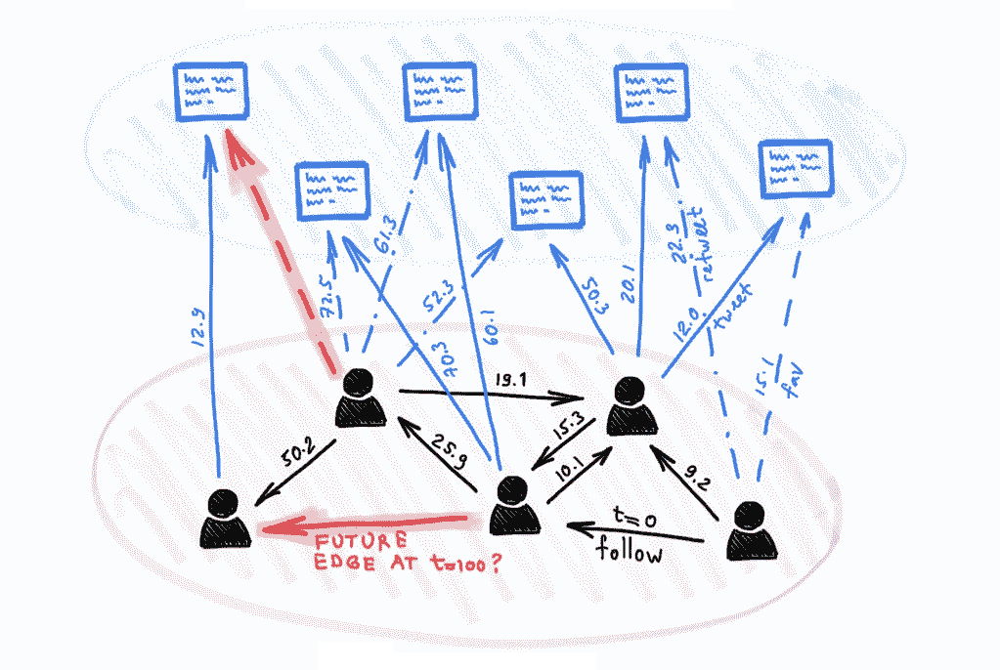
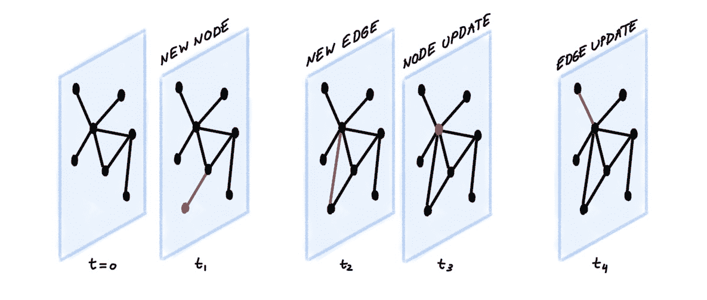
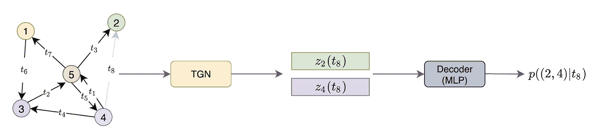
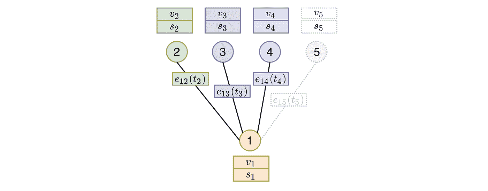
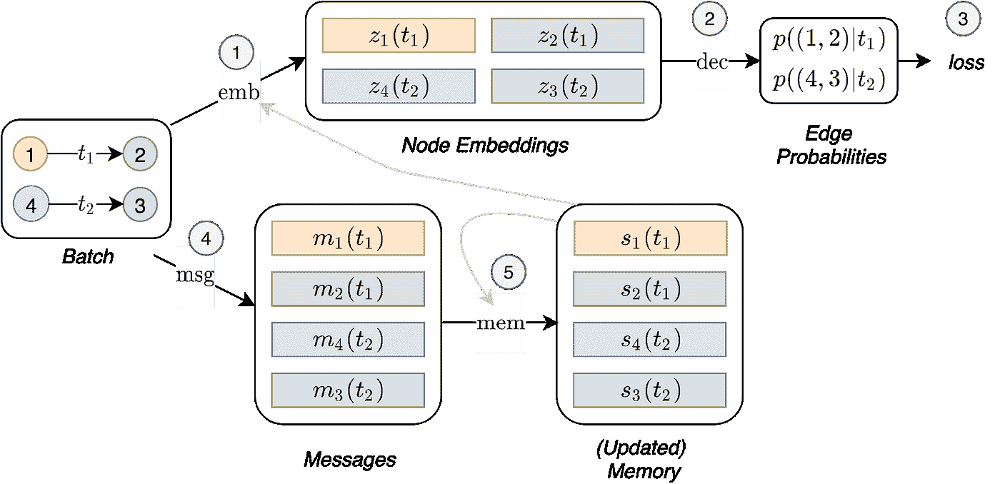
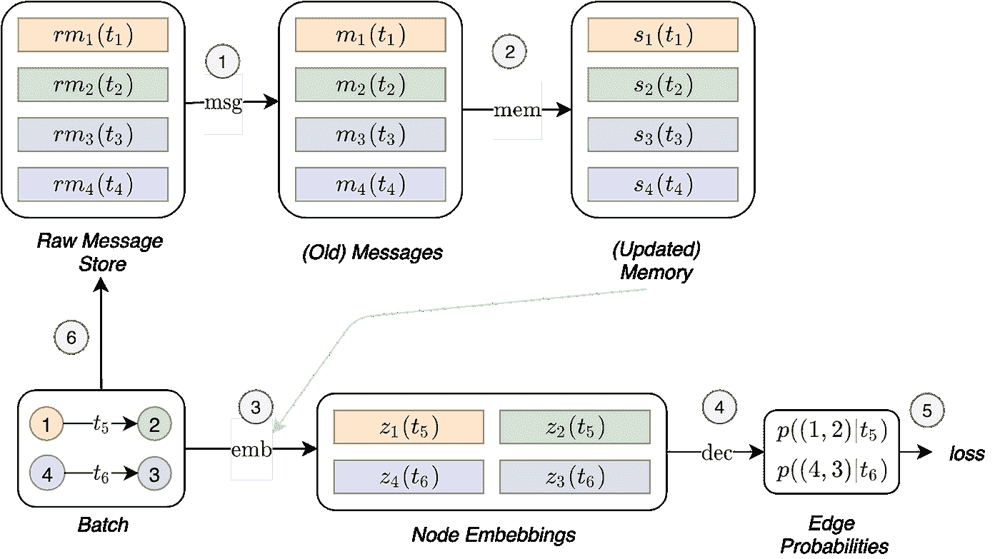
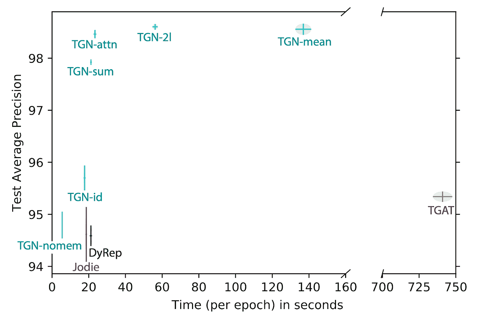

# 时态图网络

> 原文：<https://towardsdatascience.com/temporal-graph-networks-ab8f327f2efe?source=collection_archive---------4----------------------->

## 动态图上的深度学习

## 许多现实世界的问题涉及各种性质的交易网络以及社会互动和参与，这些问题是动态的，并且可以被建模为图，其中节点和边随着时间的推移而出现。在这篇文章中，我们描述了时态图网络，这是 Twitter 开发的一个通用框架，用于在动态图上进行深度学习。

*本帖与* [*伊曼纽罗西*](https://www.emanuelerossi.co.uk/) *合著。*

*一个动态的 Twitter 用户网络，用户可以与 tweets 互动并互相关注。所有的边都有时间戳。给定这样一个动态图表，我们希望预测未来的互动，例如，用户会喜欢哪条推文，或者他们会关注谁。*

今年，图形神经网络(GNNs)的研究已经成为机器学习领域最热门的话题之一。GNNs 已经在生物学、化学、社会科学、物理学和许多其他领域的问题上取得了一系列的成功。到目前为止，GNN 模型主要是为不随时间变化的静态图开发的。然而，许多有趣的现实世界的图表是动态的，随着时间的推移而演变，突出的例子包括社交网络、金融交易和推荐系统。在许多情况下，正是这种系统的动态行为传达了重要的见解，否则如果只考虑静态图，就会失去这些见解。

一个动态图可以被表示为一个有序的列表或者一个异步的定时事件“流”，比如节点和边的增加或删除[1]。像 Twitter 这样的社交网络是一个很好的例子:当一个人加入这个平台时，一个新的节点就产生了。当他们跟随另一个用户时，会创建一个跟随边。当他们改变他们的配置文件时，节点被更新。

该事件流被编码器神经网络接收，该编码器神经网络为图的每个节点产生依赖于时间的嵌入。然后，该嵌入可以被馈送到为特定任务设计的解码器中。一个示例任务是通过尝试回答以下问题来预测未来的交互:在时间 *t* 节点 *i* 和 *j* 之间有边的概率是多少？回答这个问题的能力对于推荐系统至关重要，例如，推荐系统建议社交网络用户关注谁或决定显示哪些内容。下图说明了这种情况:

*tgn 编码器摄取具有七条可见边(时间戳为 t₁到 t₇)的动态图的示例，目标是预测节点 2 和 4 在 t₈时间(灰色边)的未来交互。为此，TGN 在 t₈.时间计算节点 2 和 4 的嵌入然后，这些嵌入被连接并被馈送到解码器(例如，MLP)，该解码器输出交互发生的概率。*

上述设置中的关键部分是可以用任何解码器训练的编码器。在前面提到的未来交互预测的任务中，训练可以以自我监督的方式进行:在每个时期，编码器按照时间顺序处理事件，并根据先前的事件预测下一个交互[2]。

Temporal Graph Network(TGN)是一个通用编码器架构，我们在 Twitter 上与同事法布里齐奥·弗拉斯卡、大卫·艾纳德、本·张伯伦和费德里科·蒙蒂共同开发。该模型可以应用于在表示为事件流的动态图上学习的各种问题。简而言之，TGN 编码器通过基于节点的交互来创建节点的压缩表示，并在每个事件发生时更新它们。为了实现这一点，TGN 具有以下主要组件:

**记忆。**存储器存储所有节点的状态，充当节点过去交互的压缩表示。它类似于 RNN 的隐藏状态；但是，这里我们为每个节点 *i* 都有一个单独的状态向量***s****ᵢ*(*t*)。当一个新的节点出现时，我们添加一个相应的初始化为零向量的状态。此外，由于每个节点的内存只是一个状态向量(而不是一个参数)，当模型接受新的交互时，它也可以在测试时更新。

**消息功能**是更新存储器的主要机制。给定在时间 *t* 节点 *i* 和 *j* 之间的交互，消息函数计算两个消息(一个给 *i* 一个给 *j* )，用于更新存储器。这类似于在消息传递图神经网络中计算的消息[4]。该消息是在交互之前的时间 *t⁻* 的情况下节点 *i* 和 *j* 的存储器、交互时间 *t* 和边缘特征[5]的函数:

**存储器更新器**用于用新消息更新存储器。这个模块通常被实现为一个 RNN。

假设一个节点的记忆是一个随时间更新的向量，最直接的方法是直接用它作为节点嵌入。然而，实际上，由于*陈旧性*问题，这是一个坏主意:假设只有当节点参与交互时，内存才会更新，节点长时间的不活动会导致其内存过期。举个例子，想象一个用户离开 Twitter 几个月。当用户回来的时候，他们可能已经发展了新的兴趣，所以他们过去活动的记忆不再相关。因此，我们需要一种更好的方法来计算嵌入。

**嵌入。**一种解决方案是查看节点邻居。为了解决陈旧问题，嵌入模块通过在节点的时空邻居上执行图形聚合来计算节点的时间嵌入。即使一个节点已经不活动了一段时间，它的一些邻居也可能是活动的，并且通过聚集它们的记忆，TGN 可以为该节点计算最新的嵌入。在我们的例子中，即使当用户离开 Twitter 时，他们的朋友仍然是活跃的，所以当他们回来时，朋友最近的活动很可能比用户自己的历史更相关。

*图嵌入模块通过对目标节点的时间邻域执行聚合来计算目标节点的嵌入。在上图中，当在大于 t* ₂ *、t* ₃ *和 t* ₄ *但小于 t* ₅ *的某个时间 t 计算节点 1 的嵌入时，时间邻域将仅包括在时间 t 之前出现的边。因此，具有节点 5 的边不包括在计算中，因为它在未来发生。相反，嵌入模块聚集来自邻居 2、3 和 4 的特征(v)和存储器(s)以及边上的特征，以计算节点 1 的表示。在我们的实验中，表现最好的图形嵌入模块是图形注意力，它能够根据邻居的记忆、特征和交互时间来学习哪些邻居是最重要的。*

下图总结了 TGN 对一批训练数据进行的整体计算:

*TGN 对一批训练数据进行的计算。一方面，嵌入模块使用时态图和节点的存储器产生嵌入(1)。然后，嵌入用于预测批次相互作用并计算损失(2，3)。另一方面，这些相同的交互用于更新存储器(4，5)。*

通过查看上图，您可能会想知道与内存相关的模块(*消息功能*、*消息聚合器、*和*内存更新器*)是如何训练的，因为它们似乎不会直接影响损耗，因此不会接收到梯度。为了让这些模块影响损失，我们需要在预测批次相互作用之前更新内存。然而，这将导致泄漏，因为内存中已经包含了我们试图预测的信息。我们提出的解决这个问题的策略是用来自*之前*批次的消息更新内存，然后预测交互。下图显示了训练存储器相关模块所需的 TGN 的操作流程:

*训练记忆相关模块所需的 TGN 的操作流程。引入了一个新的组件，原始消息存储，它存储了计算消息所必需的信息，我们称之为原始消息，用于模型过去已经处理过的交互。这使得模型可以将交互带来的内存更新延迟到后面的批次。首先，使用从先前批次(1 和 2)中存储的原始消息计算的消息来更新存储器。然后可以使用刚刚更新的存储器(灰色链接)(3)来计算嵌入。通过这样做，存储器相关模块的计算直接影响损耗(4，5)，并且它们接收梯度。最后，这个批处理交互的原始消息被存储在原始消息存储库(6)中，以便在将来的批处理中使用。*

在对各种动态图进行的大量实验验证中，TGN 在未来边缘预测和动态节点分类任务中，无论是在准确性还是速度方面，都明显优于竞争方法[6]。一个这样的动态图是 Wikipedia，其中用户和页面是节点，交互表示用户编辑页面。编辑文本的编码被用作交互特征。这种情况下的任务是预测用户在给定时间将编辑哪个页面。我们将 TGN 的不同变体与基线方法进行了比较:

*根据预测准确性和时间，比较 TGN 和旧方法(戴雷普、TGAT 和乔迪)在维基百科数据集上的未来链接预测的各种配置。*

这项消融研究阐明了不同 TGN 模块的重要性，并让我们得出一些一般性结论。首先，记忆很重要:它的缺失会导致性能的大幅下降[7]。其次，嵌入模块的使用(与直接输出内存状态相反)很重要。基于图注意力的嵌入表现得最好。第三，具有存储器使得仅使用一个图关注层就足够了(这极大地减少了计算时间)，因为 1 跳邻居的存储器给予模型对 2 跳邻居信息的间接访问。

作为结束语，我们认为对动态图的学习几乎是一个未开发的研究领域，有许多重要和令人兴奋的应用以及重大的潜在影响。我们相信，我们的 TGN 模型是向提高在动态图上学习的能力迈出的重要一步，巩固并扩展了以前的结果。随着这一研究领域的发展，更好、更大的基准将变得至关重要。我们现在正致力于创建新的动态图形数据集和任务，作为[开放图形基准](https://ogb.stanford.edu/docs/team/)的一部分。

[1]这种场景通常被称为“连续时间动态图”。为简单起见，这里我们只考虑节点对之间的交互事件，用图中的边来表示。当一个端点不在图中时，节点插入被认为是新边的特殊情况。我们不考虑节点或边的删除，这意味着该图只能随着时间的推移而增长。由于一对节点之间可能有多条边，从技术上讲，我们拥有的对象是一个[多图](https://en.wikipedia.org/wiki/Multigraph#:~:text=In%20mathematics%2C%20and%20more%20specifically,by%20more%20than%20one%20edge.)。

[2]多个交互可以具有相同的时间戳，并且模型独立地预测它们中的每一个。此外，通过将*有序的*事件列表分割成固定大小的连续块来创建小批量。

[3] E. Rossi 等[动态图上深度学习的时态图网络](https://arxiv.org/abs/2006.10637) (2020)。arXiv:2006.10637。

[4]为了简单起见，我们假设该图是无向的。在有向图的情况下，将需要两个不同的消息函数，一个用于源，一个用于目的地。

[5] J. Gilmer 等人[量子化学的神经信息传递](https://arxiv.org/abs/1704.01212) (2017)。arXiv:1704.01212。

[6]我们并不是第一个研究动态图的人。然而，大多数先前的方法集中于离散时间动态图的更有限的情况，例如 A. Sankar 等人[通过自我注意网络的动态图表示学习](https://arxiv.org/abs/1812.09430)，Proc .WSDM 2020，或者时态知识图的具体场景，比如 A. García-Durán et al. [学习序列编码器用于时态知识图完成](https://www.aclweb.org/anthology/D18-1516.pdf) (2018)。继续。EMNLP 或 Z. Han 等. [Graph Hawkes 神经网络用于时态知识图的预测](https://arxiv.org/abs/2003.13432)2020。参见 s .卡泽米等人的[动态图的表示学习:一个调查](https://arxiv.org/abs/1905.11485)以获得这种方法的更广泛的概述。另一方面，在动态图上进行深度学习的方法屈指可数，如 R. Trivedi 等人的 dy rep[在动态图上进行表示学习](https://arxiv.org/pdf/1803.04051.pdf) (2018)，arXiv:1803.04051，D. Xu 等人的[在时态图上进行归纳表示学习](https://arxiv.org/abs/2002.07962) (2020)，arXiv:2002.07962 和 S. Kumar 等人的 Jodie[在时态上预测动态嵌入轨迹我们证明了这些方法可以作为 TGN 的特殊构型得到。出于这个原因，TGN 似乎是迄今为止在动态图上学习的最通用的模型。](https://arxiv.org/abs/1908.01207)

[7]虽然存储器包含关于节点过去所有交互的信息，但是图嵌入模块只能访问时间邻域的样本(出于计算原因),因此可能无法访问手头任务的关键信息。

作者感谢 Giorgos Bouritsas、Ben Chamberlain 和 Federico Monti 对本文的校对，并感谢 Stephan Günnemann 参考了动态知识图的早期作品。本帖的 [*中文翻译*](https://www.infoq.cn/article/D2cFv5V8IF8gvZDovq1p) *由* [*刘止庸*](https://medium.com/@zhiyongliu) *提供。参见 Twitter Research GitHub 资源库中的* [*TGN 代码*](https://github.com/twitter-research/tgn) *。对图形 ML 和几何深度学习感兴趣？参见我的* [*其他文章*](https://towardsdatascience.com/graph-deep-learning/home) *在走向数据科学，* [*订阅*](https://michael-bronstein.medium.com/subscribe) *到我的帖子，获取* [*中等会员*](https://michael-bronstein.medium.com/membership) *，或者关注我的* [*推特*](https://twitter.com/mmbronstein) *。*