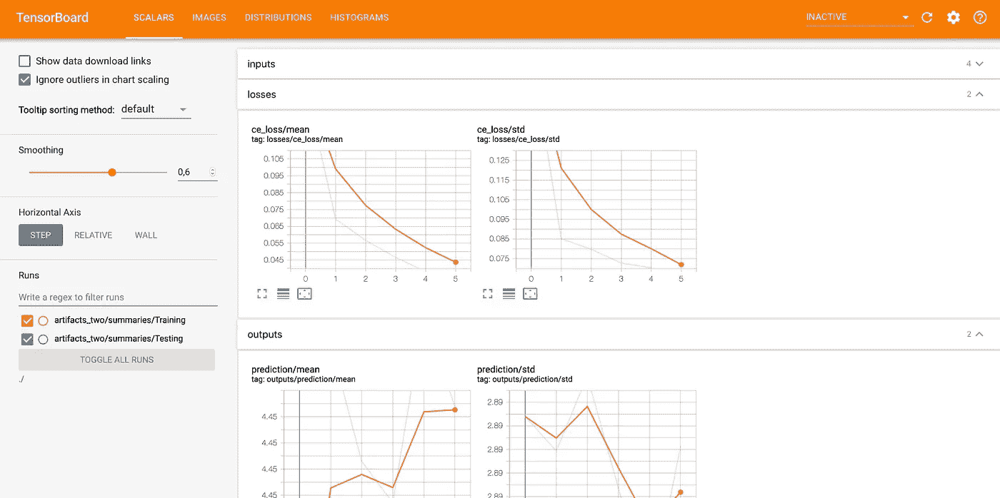
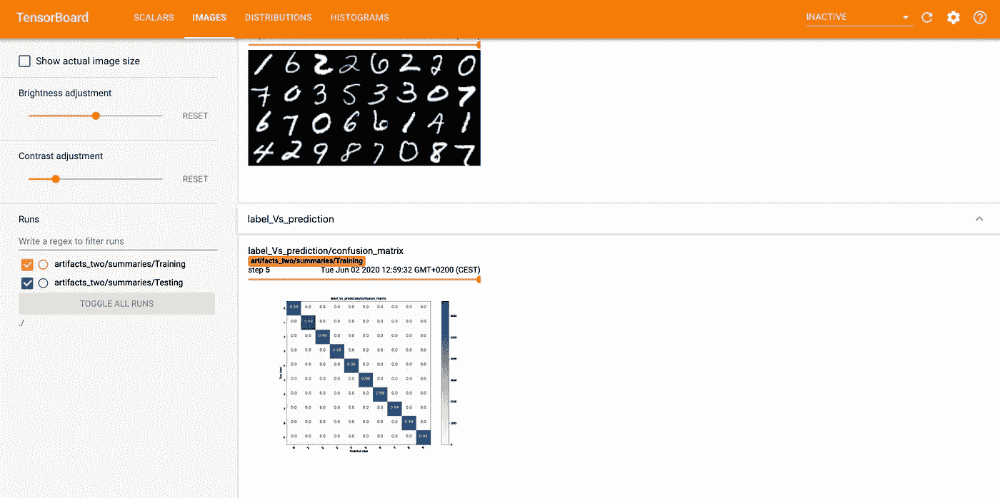
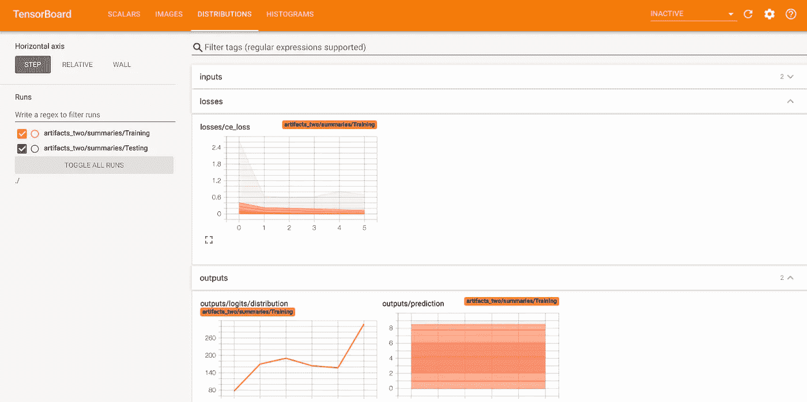
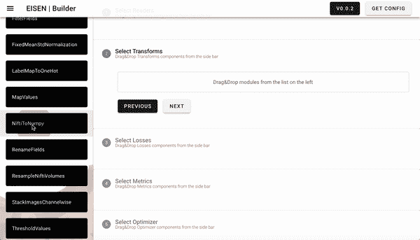

# 改变我进行深度学习方式的 10 个艾森特性

> 原文：<https://towardsdatascience.com/ten-eisen-features-that-changed-the-way-i-do-deep-learning-f0358f664dec?source=collection_archive---------59----------------------->

一个简单的“pip 安装艾森”将如何节省几天的工作，并解决(几乎)你所有的问题。


克里斯娅·克鲁兹在 [Unsplash](https://unsplash.com?utm_source=medium&utm_medium=referral) 上的照片

Eisen 是一个 python 包，可以促进和加速深度学习模型的训练和开发。我已经在[之前的一篇博文](https://medium.com/analytics-vidhya/reinventing-the-wheel-for-the-last-time-cba43860f8cf)中谈到了这个项目。总之，Eisen 构建于 PyTorch 之上，提供加载、转换数据、训练模型、实现模型和数据并行、利用混合精度训练等功能。这些功能是为医学图像分析量身定制的，但可以轻松扩展到其他方面。

作为一名专业的深度学习开发者和研究人员，我很好地利用了艾森的特性。我想在这篇博文中分享十个最好的特点。

# 1.自动模型并行

有时模型太大，我们无法在单个 GPU 的内存中容纳它们。这种情况经常发生在高分辨率断层扫描数据(如 CT、MRI)、视频数据和通过数字病理学获得的图像中。

在这种情况下，唯一的解决方案是在不同的 GPU 之间划分模型，这将在多个处理器上分布层，并利用增加的可用内存和计算能力。这种技术被称为模型并行。众所周知，模型并行性很难实现，团队可能会花费数周甚至数月的时间来实现它。

Eisen 仅用一行代码就在多 GPU 机器中实现了自动模型并行。

```
model = eisen.utils.ModelParallel(model, split_size=2)
```

这个特性是 Eisen 独有的，坦率地说非常有用。我已经在另一篇博文中写了关于 Eisen 中的模型并行性，并进行了一次基准测试，所以请随意关注[这个链接](https://medium.com/@faustomilletari/model-parallelism-in-one-line-of-code-352b7de5645a)以了解更多信息。

数据并行也可以通过 PyTorch 实现，作为一个具有几乎相同接口的单行程序。

```
model = torch.nn.DataParallel(model)
```

# 2.张量板摘要

观察培训进展的指标和指示对于了解什么有效，什么可以改进是至关重要的。我在自己的工作中每天使用的功能之一是 Eisen 中包含的 Tensorboard 摘要生成功能。

这个功能最好的方面是它是全自动的！需要定义一个 [TensorboardSummaryHook](http://docs.eisen.ai/eisen/api.html?highlight=tensorboard#eisen.utils.logging.TensorboardSummaryHook) 并将其与工作流关联起来，以获得工作流进度的详细报告。

```
training_tb_hook = TensorboardSummaryHook(
    training_workflow.id,
    'Training',
    './results,
    comparison_pairs=[['label', 'predictions']]
)
```

这简单的一行将生成捕获工作流每个方面的摘要。

*   所有损失和指标的平均值和标准偏差
*   所有损失和指标的分布
*   所有损失和指标的直方图
*   图像摘要:图像的静止帧，体积和视频的 gif
*   投入和产出的分配
*   输入和输出直方图
*   分类任务的混淆矩阵/ PR 曲线

我在这里提供了几个截图，展示了上面写的一行代码可以实现的信息粒度。



每个输入、输出、损失和指标的标量摘要。令人惊讶的是，有时查看输入和输出的平均值和标准差是多么有用。



影像摘要直观地展示了网络的输入内容。一整批被整理在一起，以便给出一个更完整的代表。可选地，也可以绘制有用的表示，例如混淆矩阵和 PR 曲线。



分布(和直方图)为我们提供了输入、度量、输出和损失的范围和分布的直观表示。

# 3.自动混合精确训练

自动混合精度(AMP)可以加快训练速度，降低深度学习模型的内存占用。NVIDIA 在开发和展示减少精确训练的优势方面投入了大量精力。例如，张量核通过使用专门的硬件来执行一些运算，如矩阵乘法，以降低的精度提供非常快速的计算。AMP 旨在自动和动态地选择是否在每一层中使用降低的精度。

如果你已经安装了 [NVIDIA Apex](https://github.com/NVIDIA/apex) ，艾森提供专门的混合精度训练工作流程。一旦 Torch 1.6.0 变得稳定，这一功能将作为原生 pytorch 功能和通过 APEX 提供给

**声明 AMP 工作流[很简单](http://docs.eisen.ai/eisen/api.html#eisen.utils.workflows.TrainingApexAMP)**

```
**from eisen.utils.workflows import TrainingApexAMPTrainingApexAMP(
    *model*, 
    *data_loader*, 
    *losses*, 
    *optimizer*, 
    *metrics=None* )**
```

**一旦 AMP 的本地 PyTorch 实现发布后,[将会非常相似。](http://docs.eisen.ai/eisen/api.html#eisen.utils.workflows.TrainingAMP)**

# **4.公共数据集支持**

**你想参加公开挑战吗？你有兴趣在来自[Grand-Challenge.org](https://grand-challenge.org)或 Kaggle 的数据集上尝试你的想法吗？你想为即将到来的 [MICCAI](http://Miccai.org) 比赛做好准备吗？**

**艾森能够从 [11 个不同的公共数据集](http://docs.eisen.ai/eisen/api.html#datasets)加载数据，随着项目的进展，对其他数据源的支持只会进一步扩展。这是迄今为止任何旨在促进医学成像深度学习的包所支持的最高数量的数据集。**

**唯一需要做的事情是下载数据，解压 zip 文件，并使用 eisen 中实现的一个数据集来加载它。这通常是一行程序，指定数据被解包的目录。其余的都是自动处理的。截至目前，艾森支持:**

*   **[医疗细分十项全能](http://medicaldecathlon.com)由 10 项细分任务组成**
*   **[修补 Camelyon 数据集](https://patchcamelyon.grand-challenge.org/Introduction/)，这是一个数字病理数据集**
*   **[CAMUS](https://www.creatis.insa-lyon.fr/Challenge/camus/index.html) 超声波数据集**
*   **[RSNA 颅内出血](https://www.kaggle.com/c/rsna-intracranial-hemorrhage-detection/overview)检测 CT 数据集**
*   **[RSNA 骨龄](https://www.kaggle.com/kmader/rsna-bone-age)挑战数据集**
*   **[MedSeg Covid 19 数据集](http://medicalsegmentation.com/covid19/)我一直在这里写的**
*   **[UCSD Covid 19 数据集](https://github.com/UCSD-AI4H/COVID-CT)**
*   **[前列腺癌等级评估挑战](https://www.kaggle.com/c/prostate-cancer-grade-assessment/overview)(熊猫)数据集**
*   **[Kaggle COVID 19 肺部 CT 数据集](https://www.kaggle.com/andrewmvd/covid19-ct-scans)**
*   **EMIDEC MICCAI 挑战数据集**
*   **[ABC MICCAI](https://abcs.mgh.harvard.edu)挑战数据集**

# **5.虚拟实验大楼**

**谁没梦想过不用写一行代码就能建立深度学习模型呢？艾森实际上实现了[可视化实验大楼](http://builder.eisen.ai)，它允许控制实验的每个方面，从随机种子选择、数据集、优化器并行策略等。通过在直观的 web 界面中拖拽&来执行培训/验证。**

****

**拖放 Eisen 模块来构建实验和模型，无需编写任何代码。**

**本练习的结果将是一个 JSON 格式的配置文件，可以通过 CLI 使用。**

```
**$ eisen train configuration.json N_EPOCHS ...**
```

# **6.ONNX 模型保存**

**Eisen 可以以多种不同格式保存模型，甚至支持用户扩展可能需要的自定义保存/打包功能。ONNX 允许模型部署在各种**生产**场景中，从嵌入式设备、专业加速器(如 NVIDIA Jetson)、手机，甚至通过 [ONNX.js](https://github.com/Microsoft/onnxjs) 部署在网页中。**

**虽然艾森目前正在进行 [TensorRT](https://developer.nvidia.com/tensorrt) 车型包装， [ONNX](https://onnx.ai) 车型保存已经成为现实。这个功能[可以作为钩子](http://docs.eisen.ai/eisen/api.html#eisen.utils.artifacts.SaveONNXModelHook)使用，这样一旦训练或验证损失/度量表明模型实际上运行良好，它就可以在训练期间自动完成，或者它可以作为一个独立的功能来完成。**

**当用作挂钩时，[该功能](http://docs.eisen.ai/eisen/api.html#eisen.utils.artifacts.SaveONNXModelHook)可通过编写以下内容来使用:**

```
**eisen.utils.artifacts.SaveONNXModelHook(
    *training_workflow.id, 
    phase*, 
    *artifacts_dir*, 
    *input_size*, 
    *select_best_loss=True*, 
    *save_history=False* )**
```

**否则，可以通过编写以下内容来使用独立版本:**

```
**eisen.utils.artifacts.SaveONNXModel(*artifacts_dir*, *input_size*)**
```

# **7.大型模型动物园**

**艾森与 PyTorch 生态系统的整体是相容的。也就是说，如果您有一个用 PyTorch 编写的模型，它将直接与 Eisen 兼容，您将能够直接使用它，而无需在 Eisen 工作流中进行更改。艾森适应任何自定义模型，无论输入输出的类型和数量以及它可能拥有的层。**

**除了这一功能之外，Eisen packs 还包含了一些常见的网络架构:**

*   **U-Net，3D U-Net**
*   **虚拟网络**
*   **高二维和高三维网**
*   **方尖碑**

**尽管这些没有预先训练好的权重，但是如果您想要实现一些健壮的基准测试并与这些架构进行比较，它们是非常有用的。**

**教程还展示了如何在 Eisen 中使用 Torchvision 模型。**

# **8.ITK、Nifti 和 DICOM 支持**

**我每天都会用到的另一个特性是加载各种数据类型的能力。Eisen 的 I/O 功能基本上支持每一种可能的医学成像文件格式，甚至更多。**

**支持医学特定格式包括 ITK 格式，例如。mha，。mhd 等，Nifti 格式。nii 和. nii.gz 和 DICOM .dcm 当然。png，。PIL 仍然支持 jpeg 和所有其他图像格式。**

**[文档](http://docs.eisen.ai/eisen/api.html#i-o)阐明了这些能力。**

# **9.数据转换和操作**

**为了使数据适合于训练，我们要花费多少时间来编写代码来转换数据？在我们的项目中使用可靠的数据转换和增强链之前，我们通常需要找出多少错误？如果 Eisen 生成的 Tensorboard 摘要通常足以发现数据处理代码的错误和问题，那么使用 Eisen 为大量场景提供的开箱即用、经过测试且可靠的转换可能是个好主意。**

**Eisen 中的数据集总是以字典的形式返回数据点。每个训练示例被表示为具有多个字段的字典。**

**艾森[转换](http://docs.eisen.ai/eisen/api.html#module-eisen.transforms)对这些字典进行操作，可以添加、删除或修改字段。例如，数据集可能返回图像的路径，而不是图像本身。然后，转换链将包括将图像替换为数据字典中的路径的数据加载。标签可以作为数据集的一些高级处理的结果来计算，例如使用与患者相关的原始元数据。转换可能会包括完全成熟的人工智能模型，这些模型处理来自不同字典领域的信息，并因此创建新数据。**

**Eisen 目前包含 18 种变换，用于执行图像重采样、调整大小、填充、裁剪等任务。[文档](http://docs.eisen.ai/eisen/api.html#module-eisen.transforms)提供了关于如何为定制用途开发新转换的见解。**

**此外，Eisen 与 PyTorch 中使用的任何数据转换都兼容，几乎无限扩展了它的数据处理能力。**

# **10.灵活的工作流程**

**艾森实施[工作流程](http://docs.eisen.ai/eisen/api.html#workflows)进行培训、验证和测试。这意味着没有必要再次编写训练代码。每个工作流透明地执行完成其目的所需的所有操作。无论模型是数据并行还是模型并行，无论您有一个还是多个丢失，无论使用什么类型的优化器:一旦任务的所有部分，例如模型、丢失、数据加载器等。只需要[一条语句就可以得到一个可以运行的工作流](http://docs.eisen.ai/eisen/api.html#workflows)。**

```
**training_workflow = Training(
      model=model,
      losses=[loss_one, loss_two, loss_three],
      data_loader=loader_training,
      optimizer=optimizer,
      metrics=[metric_one, metric_two, metric_three],
      gpu=True
)**
```

# **10 之二。与 PyTorch 生态系统的兼容性**

**我已经多次声明 Eisen 完全兼容大多数 PyTorch 生态系统包。火炬视觉可能是最好的例子。torchvision 中的模型、转换、数据集和几乎所有其他东西都可以直接使用或通过使用包装器来使用。**

**为此，艾森实现了模型/层，转换和数据集[包装器，在这里解释。](http://docs.eisen.ai/eisen/api.html#workflows)**

**例如，人们可以通过简单的书写来使用火炬视觉的 MNIST 数据**

```
**from torchvision.datasets import MNISTmnist_training_dataset = EisenDatasetWrapper(
    MNIST('./', train=True, download=True), 
    ['image', 'label'], 
    tform
)**
```

**并通过以下方式使用火炬视觉(预训练或裸)模型**

```
**from torchvision.models import resnet18model = EisenModuleWrapper(
    resnet18(num_classes=10), 
    ['image'], 
    ['logits']
)**
```

**我希望你喜欢这篇文章，并且我希望你能继续键入唯一必要的命令来改善你作为一个 AI 开发者的生活:**

```
**pip install eisen**
```