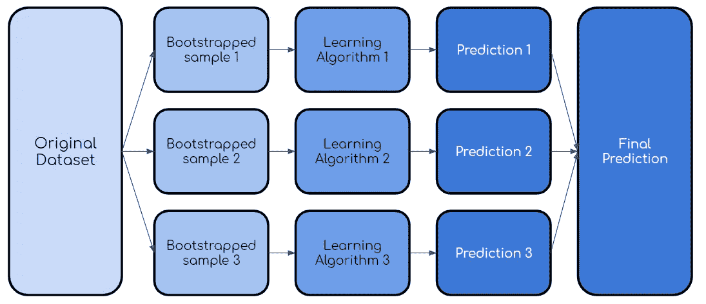

# 数据科学面试中你应该知道的十个机器学习概念

> 原文：<https://towardsdatascience.com/ten-machine-learning-concepts-you-should-know-for-data-science-interviews-70107ca84754?source=collection_archive---------1----------------------->

## 最基本的机器学习概念的总结

马克斯·兰格洛特在 [Unsplash](https://unsplash.com/s/photos/artificial-intelligence?utm_source=unsplash&utm_medium=referral&utm_content=creditCopyText) 上的照片

如你所知，数据科学和机器学习可以提供无穷无尽的信息和知识。也就是说，大多数公司测试的核心理念屈指可数。这是因为这十个概念是更复杂的想法和概念的基础。

在这篇文章中，我将涵盖我认为你应该学习和理解的十个最基本的机器学习概念。

说到这里，我们开始吧！

# 1.监督与非监督学习

你可能想知道为什么我要费心把这个放进去，因为它太基本了。然而，我认为重要的是，你要真正理解两者之间的区别，并能够交流这些区别:

监督学习包括在标记为的**数据集上学习，其中**目标变量是已知的**。**

无监督学习用于从输入数据**中得出推论和发现模式，而不需要**参考标记的结果——没有**目标变量**。

现在你知道了两者的区别，你应该知道一个机器学习模型是有监督的还是无监督的，你也应该知道一个给定的场景是需要有监督的学习算法还是无监督的学习算法。

例如，如果我想预测一位客户是否会购买牛奶，因为他们已经购买了谷类食品，这需要有监督或无监督的学习算法吗？

# 2.偏差-方差权衡

为了理解偏差-方差权衡，你需要知道什么是偏差和方差。

**偏差**是由于简化模型的假设而产生的误差。例如，使用简单的线性回归来模拟病毒的指数增长会导致较高的偏差。

**方差**是指如果使用不同的训练数据，预测值的变化量。换句话说，更重视训练数据的模型将具有更高的方差。

现在，偏差-方差权衡本质上表明，在给定的机器学习模型中，偏差和方差之间存在反比关系。这意味着当你减少模型的偏差时，方差增加，反之亦然。然而，存在一个最佳点，在该点上，特定量的偏差和方差导致最小量的总误差(见下文)。

偏倚方差权衡的可视化(由作者创建)

# 3.正规化

最常见的正则化方法称为 L1 和 L2。L1 和 L2 正则化都是用于减少训练数据过拟合的方法。

L2 正则化，也称为岭回归，最小化残差平方和**加上λ乘以斜率平方**。这个附加项被称为**岭回归惩罚**。这增加了模型的偏差，使得对训练数据的拟合更差，但是也减少了方差。

如果采用岭回归罚分并用斜率的**绝对值**替换它，则得到套索回归或 L1 正则化。

L2 不太稳健，但有一个稳定的解决方案，而且总是一个解决方案。L1 更稳健，但是具有不稳定的解，并且可能具有多个解。

# 4.交叉验证

**交叉验证**本质上是一种用于评估模型在新的独立数据集上表现如何的技术。

交叉验证最简单的例子是将数据分为三组:训练数据、验证数据和测试数据，其中训练数据用于构建模型，验证数据用于调整超参数，测试数据用于评估最终模型。

这就引出了下一点——机器学习模型的评估指标。

# 5.评估指标

有几个指标可供选择来评估您的机器学习模型，最终选择哪一个取决于问题的类型和模型的目标。

如果您正在评估回归模型，重要的度量标准包括以下内容:

*   **R 平方:**一个度量，告诉你因变量的方差比例在多大程度上是由自变量的方差解释的。更简单地说，当系数估计趋势时，R 平方表示最佳拟合线周围的散布。
*   **调整后的 R 平方:**模型中每增加一个独立变量都会增加 R 值——因此，一个有几个独立变量的模型可能看起来更适合，即使它不是。因此，调整后的 R 补偿了每个额外的独立变量，并且仅在每个给定变量将模型改进到超出概率可能的程度时才增加。
*   **平均绝对误差(MAE):** 绝对误差是预测值与实际值之差。因此，平均绝对误差是绝对误差的平均值。
*   **均方误差(MSE):** 均方误差或 MSE 类似于 MAE，除了你取预测值和实际值之间的平方差的平均值。

分类模型的指标包括:

*   **真阳性**:模型正确预测阳性类别的结果。
*   **真阴性**:模型正确预测阴性类别的结果。
*   **假阳性(1 型错误)**:模型错误预测阳性类别的结果。
*   **假阴性(2 型错误)**:模型错误预测阴性类别的结果。
*   **准确性:**等于模型预测正确的比例。
*   **回忆:**尝试回答“正确识别实际阳性的比例是多少？”
*   **Precision:** 试图回答“多大比例的肯定识别实际上是正确的？”
*   **F1 分数:**测试准确度的一种度量——它是准确度和召回率的调和平均值。它的最高分是 1(完美的精确度和召回率)，最低分是 0。总的来说，这是对你的模型的精确性和健壮性的一个度量。
*   AUC-ROC 曲线是对分类问题的一种性能测量，它告诉我们一个模型在多大程度上能够区分类别。更高的 AUC 意味着模型更准确。

# 6.降维

**降维**是减少数据集中特征数量的过程。这主要在您想要减少模型中的方差(过度拟合)的情况下很重要。

最流行的降维技术之一叫做**主成分分析**或 PCA。从最简单的意义上来说，PCA 涉及将高维数据(例如 3 维)投影到更小的空间(例如 2 维)。这导致数据的维度降低(2 维而不是 3 维)，同时保持模型中的所有原始变量。

PCA 通常用于压缩目的，以减少所需的内存并加速算法，以及用于可视化目的，使汇总数据更容易。

# 7.数据争论

**数据角力**是将原始数据清理并转化为更可用状态的过程。在采访中，你可能会被要求列出一些你在争论数据集时采取的步骤。

数据争论中一些最常见的步骤包括:

*   检查异常值并尽可能删除它们
*   缺失数据的插补
*   编码分类数据
*   规范化或标准化您的数据
*   特征工程
*   通过对数据进行欠采样或过采样来处理数据中的不平衡

# 8.自助抽样

Bootstrap 采样方法是一个非常简单的概念，是 AdaBoost 和 XGBoost 等一些更高级的机器学习算法的构建模块。

从技术上讲， **bootstrap 抽样法**是一种使用带替换的随机抽样的重抽样方法。

如果这听起来令人困惑，请不要担心，让我用图表来解释一下:

假设你有一个有 3 个观察值的初始样本。使用 bootstrap 抽样方法，您也将创建一个包含 3 个观察值的新样本。每个观察都有均等的机会被选中(1/3)。在这种情况下，第二个观察值是随机选择的，将是我们新样本中的第一个观察值。

在随机选择了另一个观察点后，你选择了绿色的观察点。

最后，再次随机选择黄色观察值。记住，自举抽样使用随机抽样的**与替换**。这意味着已经选择的观察结果很有可能再次被选择。

而这就是 bootstrap 抽样的精髓！

# 9.神经网络

虽然深度学习不是每个数据科学工作都需要的，但它的需求肯定在增加。因此，对什么是神经网络以及它们如何工作有一个基本的了解可能是一个好主意。

从根本上来说，**神经网络本质上是一个数学方程网络**。它接受一个或多个输入变量，并通过一个方程式网络，产生一个或多个输出变量。

在神经网络中，有一个**输入层**，一个或多个**隐藏层**，以及一个**输出层**。输入层由一个或多个**特征变量**(或输入变量或独立变量)组成，表示为 x1，x2，…，xn。隐藏层由一个或多个隐藏**节点**或隐藏单元组成。节点就是上图中的一个圆圈。类似地，输出变量由一个或多个输出单元组成。

就像我一开始说的，神经网络只不过是一个方程网络。神经网络中的每个节点由两个函数组成，一个线性函数和一个激活函数。这是事情变得有点混乱的地方，但是现在，把线性函数想成一些最佳拟合线。另外，把激活功能想象成一个电灯开关，它会产生一个介于 1 或 0 之间的数字。

# 10.集成学习、打包、提升

一些最好的机器学习算法结合了这些术语，因此，理解什么是集成学习、bagging 和 boosting 是非常重要的。

**集成学习**是一种多种学习算法联合使用的方法。这样做的目的是让您获得比单独使用单个算法更高的预测性能。

**Bagging** 又称 **bootstrap aggregating** ，是用原始数据集的自举样本对同一学习算法的多个模型进行训练的过程。然后，像上面的随机森林示例一样，对所有模型的输出进行投票。

装袋过程(由作者创建)

**Boosting** 是 bagging 的一种变体，其中每个单独的模型都是按顺序构建的，并重复上一个模型。具体来说，任何被前一个模型错误分类的数据点都会在后一个模型中得到强调。这样做是为了提高模型的整体准确性。这里有一个图表，可以更好地理解这个过程:

推进过程(由作者创建)

一旦建立了第一模型，除了第二自举样本之外，还采用错误分类/预测的点来训练第二模型。然后，针对测试数据集使用集合模型(模型 1 和 2 ),并且该过程继续。

# 感谢阅读！

仅此而已！我希望这对你的面试准备有所帮助，并祝你在未来的努力中好运。希望这能为你在数据科学面试中应该了解的机器学习概念提供一个很好的指导。

不确定接下来要读什么？我为你挑选了另一篇文章:

 [## 数据科学面试中你应该知道的十个 SQL 概念

### 学习聪明，不努力。

towardsdatascience.com](/ten-sql-concepts-you-should-know-for-data-science-interviews-7acf3e428185) 

## 特伦斯·申

*   *如果你喜欢这个，* [*在 Medium 上关注我*](https://medium.com/@terenceshin) *了解更多*
*   *关注我*[*Kaggle*](https://www.kaggle.com/terenceshin)*了解更多内容！*
*   *我们连线上*[*LinkedIn*](https://www.linkedin.com/in/terenceshin/)
*   *有兴趣合作吗？查看我的* [*网站*](http://Want to collaborate?) *。*
*   *查看* [*我的免费数据科学资源*](https://docs.google.com/document/d/1UV6pvCi9du37cYAcKNtuj-2rkCfbt7kBJieYhSRuwHw/edit#heading=h.m63uwvt9w358) *每周都有新资料！*