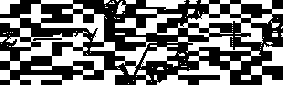

# 2020 年再看 10 篇人工智能论文

> 原文：<https://towardsdatascience.com/ten-more-ai-papers-to-read-in-2020-8c6fb4650a9b?source=collection_archive---------16----------------------->

## 更新的阅读建议让你了解人工智能和数据科学的最新和经典突破

苏珊·尹在 [Unsplash](https://unsplash.com?utm_source=medium&utm_medium=referral) 上的照片

答几周前，我发布了一篇关于人工智能(AI)论文的文章，将在 2020 年阅读。如果算上所有的附加阅读建议，总计 27 篇。然而，这份清单还远未完成。许多宝石被遗漏或只是简单提及。在这篇文章中，为了你的阅读乐趣，我列出了今年人工智能论文的十个建议(和其他几个进一步阅读的建议)。

在这个列表中，我主要关注那些没有提出新架构的文章。这不会是最近的 YOLO 或 ResNet 变种。相反，它强调了损失公式、理论突破、更新的优化器等方面的最新进展。

至于[上一个列表](/ai-papers-to-read-in-2020-ac0e4e91d915)，我将重点介绍计算机视觉和 NLP，因为这些是我最熟悉的话题，并从一两个经典开始。对于每一篇论文，我都会给出其主要贡献的摘要和阅读它的理由列表。最后，我在每篇文章的结尾都给出了关于该主题的具体阅读建议，并将其与其他最新进展或类似观点联系起来。

我们继续:)

# 排名第一的手套(2014)

> 彭宁顿、杰弗里、理查德·索彻和克里斯托弗·d·曼宁。[“手套:单词表示的全局向量。”](https://www.aclweb.org/anthology/D14-1162.pdf)*2014 自然语言处理经验方法会议论文集*。2014.

虽然今天的社区非常关注神经网络，但许多早期结果是通过简单得多的数学获得的。从经典算法开始，GloVe 是一个基于降低单词共现矩阵维度的单词嵌入模型。与以前的方法不同，GloVe 使用隐式公式，这使得它可以扩展到大规模文本语料库。

**原因#1:** 如果你从自然语言处理(NLP)开始，这是一个很好的阅读材料，可以了解单词嵌入的基础知识以及它们为什么重要。

**理由#2:** 曾几何时，并不是一切都以[变形金刚](http://papers.nips.cc/paper/7181-attention-is-all-you-need)为原型。阅读早期的作品是找到那个“被遗忘的想法”的一个极好的方式，这个想法可以将艺术水平推得更远。

**原因 3:** 本文中提到/提出的许多概念后来被许多其他作者扩展。今天，单词嵌入是自然语言处理(NLP)文献中的主要内容。

**延伸阅读:**大约在同一时期，Google 发布了 [Word2Vec](https://arxiv.org/abs/1301.3781) ，另一个众所周知的生成语义向量的模型。不久之后，这些想法被生物学界采用，作为表示大蛋白质和基因序列的方法。今天， [BERT](https://arxiv.org/abs/1810.04805) 是单词表示和语义理解的主导人物。

# #2 AdaBoost (1997 年)

> 弗氏，Yoav 罗伯特·沙皮雷(1997 年)。[在线学习的决策理论概括和 boosting 的应用](https://www.sciencedirect.com/science/article/pii/S002200009791504X)。

经典的机器学习模型一点也不灵活。大多数配方都有惊人的局限性，这使得它们无法扩展到越来越复杂的任务。这个问题的第一个解决方案是将最佳可用模型集成到民主投票中。1997 年， *Freund* 和 *Schapire* 提出了 AdaBoost 算法，这是一种元启发式学习器，能够将许多“弱”模型转化为“强”分类器。

简而言之，该算法基于迭代训练更多的分类器，并将每个训练样本重新加权为“容易”或“困难”随着训练的进行，集合通过更多地关注更难分类的样本而进化。该算法非常有效，以至于即使是复杂的问题也容易过度拟合。

理由#1: 可以认为神经网络是弱分类器(神经元/层)的集合。然而，神经网络文献已经独立于整体而发展。读一篇关于这个主题的论文可能会对神经网络为什么工作得这么好有一些见解。

**原因#2:** 许多新手认为经典的机器学习方法过时且“薄弱”，在几乎所有事情上都倾向于使用神经网络。AdaBoost 是经典机器学习一点也不弱的一个很好的例子。而且，与网络不同，这些模型是高度可解释的。

**原因#3:** 有多少论文是从一个赌徒因与朋友赌马屡输而沮丧的故事开始的？我希望我敢开一份那样的报纸。

**延伸阅读:**其他流行的集成方法是[随机森林](https://en.wikipedia.org/wiki/Random_forest)分类器、[梯度增强](https://en.wikipedia.org/wiki/Gradient_boosting)技术，以及广受好评的 [XGBoost](https://github.com/dmlc/xgboost) 包，这些方法因在几个机器学习比赛中获胜而闻名，同时相对容易使用和调整。该家族的最新成员是微软的 [LightGBM](https://github.com/microsoft/LightGBM) ，面向大规模分布式数据集。

# 第三大胶囊网络(2017 年)

> 萨布尔、萨拉、尼古拉斯·弗洛斯特和杰弗里·e·辛顿。[“胶囊间动态路由”](https://arxiv.org/abs/1710.09829) *神经信息处理系统的进展*。2017.

神经网络文献从感知器模型开始，并到达卷积神经网络(CNN)。下一次大跃进是一个备受争议的话题。Sara Sabour、Nicholas Frosst 和图灵奖获得者 Geoffrey Hinton 提出的胶囊网络就是其中之一。

理解胶囊网络的一个简单方法是用“胶囊”代替“物体探测器”每一层“对象检测器”试图识别图像中的相关特征，以及其姿态(方向、比例、倾斜等)。).通过堆叠检测器，可以得到物体的鲁棒表示。本质上，胶囊并不像 CNN 那样将本地信息聚集到高级特征上。取而代之的是，他们检测对象的各个部分，并对它们进行分层组合，以识别更大的结构和关系。

理由 1: 作为科学家，我们都应该寻找下一件大事。虽然我们不能说胶囊网络将成为下一个摇滚明星，但我们可以说他们试图解决的问题是相关的。并且，至于所有相关的问题，最终都会有人来回答。

**理由#2:** 这篇论文提醒我们，CNN 并不完美。它们对于旋转和缩放不是不变的。虽然我们使用数据增强来缓解这种情况，但没有创可贴曾经治愈过一个人。

**原因#3:** 在深度学习成为主流之前，许多对象检测方法依赖于识别容易发现的[对象部分](https://en.wikipedia.org/wiki/Part-based_models)，并针对[数据库/本体进行模式匹配](https://en.wikipedia.org/wiki/Constellation_model)。Hinton 和他的团队正在做的是使这种早期的方法现代化。这就是为什么我们都应该时不时地阅读经典著作。很多东西都可以更新。

**延伸阅读:**在过去的一年中，有一件事得到了很多关注，那就是[注意力机制](https://arxiv.org/abs/1706.03762)。虽然它没有试图取代或增加卷积，但它确实为全局推理提供了一个途径，这是现代网络的许多阿基里斯脚跟之一。

# #4 关系归纳偏差(2018)

> 彼得·w·巴塔格利亚等人[“关系归纳偏差、深度学习和图形网络”](https://arxiv.org/pdf/1806.01261.pdf) *arXiv 预印本 arXiv:1806.01261* (2018)。

部分立场文件，部分评论，部分统一，这篇文章总结了 Deep Mind 团队认为深度学习中的下一件大事:图形神经网络(GNNs)。用作者自己的话说:

> (…).我们认为，组合概括必须是人工智能实现类似人类能力的首要任务，而结构化表示和计算是实现这一目标的关键。正如生物学合作利用先天和后天，我们拒绝在“手工工程”和“端到端”学习之间的错误选择，而是提倡一种从它们的互补优势中受益的方法。我们探索了在深度学习架构中使用关系归纳偏差如何促进对实体、关系和组成它们的规则的学习。(…)

**旁注:**归纳偏差是学习算法对数据做出的所有假设。例如，线性模型假设数据是线性的。如果一个模型假设数据有特定的关系，它就有一个*关系归纳偏差*。因此，图形是一种有用的表示。

**原因#1:** 当前的 CNN 模型是“端到端”的，这意味着它们处理原始的、大部分未经处理的数据。特征不是由人类“设计”的，而是由算法自动“学习”的。我们大多数人被告知特征学习更好。在本文中，作者提供了相反的观点。

原因 2: 大多数早期的人工智能文献都与计算推理有关。然而，计算直觉占了上风。神经网络不考虑输入；它们会产生相当准确的数学“预感”图表可能是通向直觉推理的桥梁。

**原因 3:** 组合问题可以说是计算机科学中最关键的问题。大多数都处于我们认为易处理或可能的边缘(或更远)。然而，我们人类自然地、毫不费力地进行推理。图形神经网络可能是答案吗？

**延伸阅读:** GNNs 是一个令人兴奋且不断发展的领域。从图论中，我们知道几乎任何东西都可以被建模为图。[谢尔盖·伊万诺夫](https://medium.com/u/b60b4c7e3bfc?source=post_page-----8c6fb4650a9b--------------------------------)在 GNNs 中列出了一份极好的[新趋势列表，其中引用了大量来自即将到来的 2020 年 ICLR 会议的论文。](/top-trends-of-graph-machine-learning-in-2020-1194175351a3)

 [## 2020 年图形机器学习的主要趋势

### 2020 年刚刚开始，但我们已经可以在最新的研究中看到图形机器学习(GML)的趋势…

towardsdatascience.com](/top-trends-of-graph-machine-learning-in-2020-1194175351a3) 

# #5 训练批次标准和唯一批次标准(2020 年)

> Frankle，Jonathan，David J. Schwab，Ari S. Morcos .[“训练批处理范式和唯一批处理范式:论细胞神经网络中随机特征的表达能力”](https://arxiv.org/abs/2003.00152) *arXiv 预印本 arXiv:2003.00152* (2020)。

您相信仅 ResNet-151 的批量标准化层就能在 CIFAR-10 上实现+60%的准确率吗？换句话说，如果你锁定所有其他层的随机初始权重，并训练网络五十个左右的时期，它将比随机的表现更好。我不得不复制这张纸来亲眼看看。“魔力”来自于经常被遗忘的批处理规范的γ和β参数:

批处理规范化操作的完整定义。γ和β是两个可学习的参数，允许图层在标准化发生后缩放和移动每个激活图。

理由 1: 这是一个足够疯狂的想法，值得一读。打破常规的想法总是受欢迎的。

**原因#2:** 你可能会问自己批处理规范层怎么能学到任何东西，你可能还会想为什么有人会关心这个。对于数据科学中的很多东西，我们认为批量范数是理所当然的。我们相信这只会加速训练。显然，它可以做得更多。

**原因#3:** 本文可能会引起您的兴趣，让您了解所有常见图层都具有哪些参数和超参数。

**延伸阅读:**大部分课程讲授的是批量范数层对抗所谓的内部协方差移位问题。[最近的证据显示情况并非如此](https://arxiv.org/abs/1805.11604)。相反，作者认为 BN 层使整体损失情况更加平稳。另一个别出心裁的想法是[彩票假说](https://arxiv.org/abs/1803.03635)，也是由 *Frankle 等人*提出的。

# #6 光谱标准(2018)

> 宫藤，Takeru，等人[“生成性对抗网络的谱规范化”](https://arxiv.org/abs/1802.05957) *arXiv 预印本 arXiv:1802.05957* (2018)。

在 GAN 文献中， [Wasserstein 损失](https://arxiv.org/abs/1701.07875)改进了训练 GAN 的几个关键挑战。然而，它要求梯度必须具有小于或等于 1 的范数( [1-Lipschitz](https://en.wikipedia.org/wiki/Lipschitz_continuity) )。损失的原始作者建议将权重修剪为[-0.01，0.01]，作为一种加强小梯度的方式。用计算机科学术语来说，就是黑客。作为回应，谱范数被提出作为一个平滑的替代方案来约束权重矩阵，以产生最多一个单位梯度。更清洁的解决方案。

**原因 1:** 标准化是一个比大多数人意识到的要大得多的话题。许多特殊属性可以通过专门的规范化和[精心的激活功能设计](https://arxiv.org/abs/1706.02515)来实现。

**原因#2:** 这除了是一种规范，也是一种正则化，是神经网络设计中经常被忽略的话题。除了辍学之外，阅读关于这个问题的成功论文令人耳目一新。

**延伸阅读:**归一化技术的其他最新进展是[组归一化](https://arxiv.org/abs/1803.08494)和[自适应实例归一化](http://openaccess.thecvf.com/content_iccv_2017/html/Huang_Arbitrary_Style_Transfer_ICCV_2017_paper.html)技术。前者解决了小批量批量标准的一些缺点，而后者是任意风格转换的关键突破之一。

# #7 感知损失(2016 年)

> 约翰逊、贾斯汀、亚历山大·阿拉希和李菲菲。[“实时风格转换和超分辨率的感知损失”](https://arxiv.org/abs/1603.08155)T2【欧洲计算机视觉会议】T3。施普林格，查姆，2016。

大多数神经网络背后的驱动力是损失函数。亏损越能描述什么是好什么是坏，我们就能越快地收敛到有用的模型。在文献中，大多数损失相对简单，只能测量低水平的属性。除此之外，捕捉高级语义是众所周知的棘手。

感知损失论文认为，预先训练的网络可以用来测量语义相似度，而不是手工设计复杂的损失函数。在实践中，生成的和地面真实的结果通过预先训练的 VGG 网络，并比较特定层的激活。相似的图像应该有相似的激活。早期图层捕捉广泛的特征，而后期图层捕捉更细微的细节。

**原因#1:** 亏损是培养优秀模特最重要的方面之一。没有适当的反馈信号，任何优化过程都不会收敛。这就是好老师的作用:给予反馈。

**原因#2:** 成功的新亏损往往是一个里程碑。甘斯所达到的质量，是在感知丧失被发明出来之后的飞跃。理解这部作品对于理解后来的大部分文献是必不可少的。

**原因#3:** 这些神经损失既神秘又有用。虽然作者对这些模型的工作提供了合理的解释，但它们的许多方面仍然是开放的，就像神经网络中的大多数事情一样。

**延伸阅读:**神经网络的一个迷人之处是它们的可组合性。这项工作使用神经网络来解决神经网络问题。[拓扑损失论文](http://openaccess.thecvf.com/content_cvpr_2018/html/Mosinska_Beyond_the_Pixel-Wise_CVPR_2018_paper.html)将这一思想扩展到图像分割问题。[神经架构搜索(NAS)](https://en.wikipedia.org/wiki/Neural_architecture_search) 文献利用神经网络寻找新的神经网络。至于计算机视觉的其他损失，这里有一个[综合指南](https://medium.com/ml-cheat-sheet/winning-at-loss-functions-2-important-loss-functions-in-computer-vision-b2b9d293e15a)。感谢[Sowmya yelapragada](https://medium.com/u/dc830cac0dcb?source=post_page-----8c6fb4650a9b--------------------------------)将这个伟大的名单放在一起:)

 [## 理解计算机视觉中的损失函数！

### 选择正确的损失函数可以优化模型的收敛性，也有助于集中在正确的特征集上

medium.com](https://medium.com/ml-cheat-sheet/winning-at-loss-functions-2-important-loss-functions-in-computer-vision-b2b9d293e15a) 

# 第八名那达慕(2016)

> 多扎特蒂莫西。[“把内斯特洛夫的动力融入亚当”](http://cs229.stanford.edu/proj2015/054_report.pdf) (2016)。

我们大多数人都熟悉 SGD、Adam 和 RMSprop 等术语。有些人还知道一些不太熟悉的名字，如阿达格拉德、阿达德尔塔和阿达马克斯。然而，很少有人花时间去理解这些名字的含义，以及为什么亚当是现今的默认选择。Tensorflow 捆绑了 Nadam，这是对 adam 的改进，但大多数用户都没有意识到这一点。

**理由#1:** 这份技术报告对大多数神经网络优化器提供了全面而直接的解释。每一种都是对其他产品的直接改进。很少有论文能在两页半的篇幅内涵盖如此数学化的主题。

**原因 2:** 我们都认为优化者理所当然。理解它们的基本原理对改进神经网络非常有用。这就是为什么当 RMSprop 不收敛时，我们用 Adam 代替它，后来又用 SGD 代替它。

**延伸阅读:**自 2016 年以来，已经提出了许多其他对优化器的改进。有些会在某个时候并入主流图书馆。看看[拉达姆](https://arxiv.org/abs/1908.03265v1)、[前瞻](https://arxiv.org/abs/1907.08610)和[游侠](https://github.com/lessw2020/Ranger-Deep-Learning-Optimizer)的一些新想法。

# #9 双重下降假说(2019)

> Nakkiran，Preetum，et al. [《深度双重下降:更大的模型和更多的数据带来的伤害》](https://arxiv.org/abs/1912.02292) *arXiv 预印本 arXiv:1912.02292* (2019)。

传统观点认为，小型号不足，大型号过多。然而，在彩虹之上的某处，更大的模型仍然闪耀着光芒。

在这篇论文中，Nakkiran *等人*展示了几个模型在规模增长时表现出“双重下降”现象的证据。测试精度下降，然后上升，再下降。此外，他们认为拐点在“插值阈值”:模型大到足以插值数据的点。换句话说，当一个模型被训练得超越了该领域所建议的一切，它就开始改进了。

理由 1: 大多数课程都教授偏差/方差权衡。显然，这个原则只在一定程度上适用——是时候复习基础知识了。

**原因#2:** 如果增加历元数也穿过插值点，我们都应该放弃早期停止，看看会发生什么。集体来说，我们都可以做科学。

**原因 3:** 这一点和第五点都很好地提醒了我们还有很多我们不知道的。不是所有我们学到的都是对的，也不是所有直觉的都是正确的。

**延伸阅读:**更轻松的阅读是[图像分类锦囊](https://arxiv.org/abs/1812.01187)论文。在这本书里，你会找到几个简单可行的建议来从你的模型中提取额外的性能下降。

# 智力指标排名第十(2019)

> 弗朗索瓦，乔莱。[《论智力的衡量》](https://arxiv.org/abs/1911.01547) *arXiv 预印本 arXiv:1911.01547* (2019)。

大多数人都在努力多走一步，弗朗索瓦·乔莱(Franç ois Chollet)正在努力实现梦想。

在这个列表中，所有提到的文章都将实践和理论的最新水平推进了一步。有些已经被广泛采用，有些支持这种或那种技术，还有一些为融合提供了很好的改进。然而，房间里的大象*智力*仍然是一个神秘而难以捉摸的话题，更不用说神秘莫测了。

时至今日，人工智能领域向一般智能的进步只能用“成就”来粗略衡量。每隔一段时间，一种算法就会在一项复杂的任务中击败人类，比如国际象棋、Dota 2 或围棋。每当这种情况发生时，我们就说我们离目标更近了一步😃。然而，这不足以衡量智力的技能获取效率组成部分。

在这篇(很长的)文章中，Chollet 认为:*“为了朝着更智能、更像人类的人工系统稳步前进，我们需要遵循适当的反馈信号。”换句话说，我们需要一个合适的机器智能基准。一种智商测试。由此，作者提出了[抽象与推理语料库(ARC)](https://github.com/fchollet/ARC) :*

> *“ARC 可以看做通用的人工智能基准，可以看做程序合成基准，也可以看做心理测量智能测试。它的目标是人类和人工智能系统，旨在模仿类似人类的一般流体智能形式。”*

**理由 1:** 虽然数据科学很酷很时髦，但人工智能才是真正的东西。如果没有人工智能，就不会有数据科学。它的最终目标不是在数据中寻找洞察力，而是建造能够拥有自己想法的机器。花点时间思考一些基本问题:什么是智力，我们如何衡量它？这篇论文是一个良好的开端。

**原因#2:** 在过去的几十年里，IA 社区被来自数理逻辑和演绎推理的思想所主导。然而，在没有任何形式的显式推理的情况下，支持向量机和神经网络在该领域的发展远远超过了基于逻辑的方法。ARC 会引发经典技术的复兴吗？

**原因 3:** 如果 Chollet 是对的，我们距离创建能够解决 ARC 数据集的算法还有好几年的时间。如果你正在寻找一个数据集在你的业余时间玩，这里有一个会让你忙起来:)

**延伸阅读:**2018 年，Geoffrey Hinton、Yosha Bengio 和 Yan LeCun 因其在深度学习基础方面的开创性工作获得了图灵奖。今年，在 AAAI 会议上，他们分享了他们对人工智能未来的看法。可以在 [Youtube](https://www.youtube.com/watch?v=UX8OubxsY8w) 上看:

我想引用杰弗里·辛顿的一句话来结束这篇文章，我认为这句话概括了一切:

> "未来取决于某个对我所说的一切深感怀疑的研究生。"

GloVe 通过隐式的方式抑制了共现矩阵。AdaBoost 制造了数百个最先进的弱分类器。胶囊网络挑战 CNN，而图形神经网络可能会取代它们。关键进步可能来自规范化、损失和优化器，而我们仍然有空间质疑批量规范和训练过度参数化的模型

我想知道还有多少关于辍学和重新学习的事情有待发现。

我希望这本书对你和我来说都是令人兴奋的。请让我知道你认为符合这个列表的其他文件。我将很高兴阅读和考虑他们的未来列表😃

**编辑:写完这个单子，我用十篇 GAN 论文编了三分之一，2020 年读。如果你喜欢阅读这份(以及之前的)清单，你可能会喜欢阅读第三份:**

 [## 甘 2020 年要读的论文

### 生成性对抗网络的阅读建议。

towardsdatascience.com](/gan-papers-to-read-in-2020-2c708af5c0a4) 

欢迎评论或[联系我](https://www.linkedin.com/in/ygorreboucas/)。如果你刚接触媒体，我强烈推荐[订阅](https://ygorserpa.medium.com/membership)。对于数据和 IT 专业人士来说，中型文章是 [StackOverflow](https://stackoverflow.com/) 的完美搭档，对于新手来说更是如此。注册时请考虑使用[我的会员链接。](https://ygorserpa.medium.com/membership)你也可以直接支持我[请我喝杯咖啡](https://www.buymeacoffee.com/ygorreboucas):)

感谢阅读:)