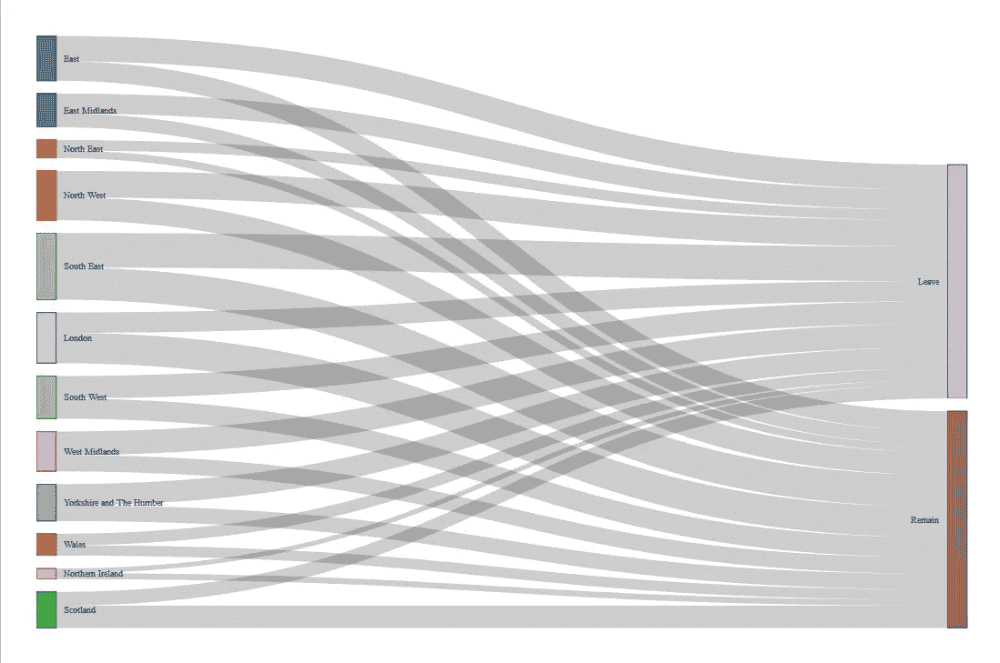

# R 中你可能不知道的另外十个随机有用的东西

> 原文：<https://towardsdatascience.com/ten-more-random-useful-things-in-r-you-may-not-know-about-f7c39cac7e6b?source=collection_archive---------18----------------------->

## 上次我努力保持在 10 分钟，所以再给你 10 分钟

我很惊讶于人们对我去年的文章的积极反应，这篇文章列举了十件人们可能不知道的事情。

我有一种感觉，R 作为一种语言已经发展到如此程度，以至于我们中的许多人现在都在以完全不同的方式使用它。这意味着可能有许多我们每个人都在使用的技巧、包、函数等等，但是其他人完全不知道，如果他们知道了，就会发现它们很有用。

老实说，我上次努力把它保持在 10 个，所以这里有 10 个关于 R 的东西，帮助我的工作更容易，你可能会发现有用。如果这些对你目前的工作有帮助，或者如果你对其他人应该知道的事情有进一步的建议，请在这里或 Twitter 上留言。

# 1.dbplyr

`dbplyr`顾名思义。它允许您对数据库使用`dplyr`。如果你从事数据库工作，并且你从未听说过`dbplyr`，那么你很可能仍然在你的代码中使用 SQL 字符串，这迫使你在你真正想要思考整洁的时候去思考 SQL，并且当你想要抽象你的代码来生成函数之类的时候，这可能是一个真正的痛苦。

`dbplyr`允许您使用`dplyr`创建您的 SQL 查询。它通过建立一个可以使用`dplyr`函数操作的数据库表，将这些函数转换成 SQL 来实现。例如，如果您有一个名为`con`的数据库连接，并且您想要在`CAT_SCHEMA`中操作一个名为`CAT_DATA`的表，那么您可以将这个表设置为:

```
cat_table <- dplyr::tbl(
  con,
  dbplyr::in_schema("CAT_SCHEMA", "CAT_TABLE")
)
```

然后，您可以在`cat_table`上执行常见的操作，如`filter`、`mutate`、`group_by`、`summarise`等，所有这些都将在后台翻译成 SQL 查询。非常有用的是，直到您使用`dplyr::collect()`函数最终获取数据时，数据才真正下载到 R 会话中。这意味着您可以让 SQL 做所有的工作，并在最后收集您操作的数据，而不是一开始就必须拉整个数据库。

关于`dbplyr`的更多信息，你可以查看我以前的文章[这里](/how-to-write-tidy-sql-queries-in-r-d6d6b2a3e17)和教程[这里](https://dbplyr.tidyverse.org/articles/dbplyr.html)。

# 2.rvest 和 xml2

人们说 Python 更适合网络抓取。那可能是真的。但是对于我们这些喜欢在 tidyverse 中工作的人来说，`rvest`和`xml2`包可以通过使用`magrittr`并允许我们使用管道命令来使简单的网页抓取变得非常容易。鉴于网页上的 HTML 和 XML 代码通常是大量嵌套的，我认为使用`%>%`构建抓取代码是非常直观的。

通过最初读取感兴趣的页面的 HTML 代码，这些包将嵌套的 HTML 和 XML 节点分成列表，您可以逐步搜索和挖掘感兴趣的特定节点或属性。将它与 Chrome 的 inspect 功能结合使用，可以让你快速从网页中提取你需要的关键信息。

举个简单的例子，我最近编写了一个函数，可以从[这个相当时髦的页面](https://www.billboard.com/charts/hot-100)中抓取历史上任何时间点的基本 Billboard 音乐图表作为数据帧，代码如下:

```
get_chart <- function(date = Sys.Date(), positions = c(1:10), type = "hot-100") {     # get url from input and read html  
  input <- paste0("https://www.billboard.com/charts/", type, "/", date)     chart_page <- xml2::read_html(input)       # scrape data  
  chart <- chart_page %>%         
    rvest::html_nodes('body') %>%   
    xml2::xml_find_all("//div[contains(@class, 'chart-list-item  ')]")        rank <- chart %>%     
    xml2::xml_attr('data-rank')      artist <- chart %>%     
    xml2::xml_attr('data-artist')      title <- chart %>%     
    xml2::xml_attr('data-title')     # create dataframe, remove nas and return result  
  chart_df <- data.frame(rank, artist, title)  
  chart_df <- chart_df %>%     
    dplyr::filter(!is.na(rank), rank %in% positions)   chart_df 
}
```

更多关于这个例子[这里](/get-any-us-music-chart-listing-from-history-in-your-r-console-6bd168f192cb)，更多关于`rvest` [这里](https://github.com/tidyverse/rvest)，更多关于`xml2` [这里](https://blog.rstudio.com/2015/04/21/xml2/)。

# 3.长数据上的 k-均值

k-means 是一种越来越受欢迎的统计方法，用于对数据中的观察值进行聚类，通常是为了将大量的数据点简化为少量的聚类或原型。`kml`包现在允许对纵向数据进行 k 均值聚类，其中的“数据点”实际上是数据序列。

这在你研究的数据点实际上是一段时间的读数时非常有用。这可能是对医院病人体重增加或减少的临床观察，或者是雇员的补偿轨迹。

`kml`首先通过使用`cld`函数将数据转换成`ClusterLongData`类的对象。然后，它使用“爬山”算法对数据进行划分，对几个`k`值分别测试 20 次。最后，`choice()`函数允许您以图形方式查看每个`k`的算法结果，并决定您认为的最佳聚类。

# 4.RStudio 中的连接窗口

最新版本的 RStudio 中的 connections 窗口允许您浏览任何远程数据库，而不必进入像 SQL developer 这样的独立环境。这种便利现在提供了完全在 RStudio IDE 中完成开发项目的机会。

通过在“连接”窗口中设置与远程数据库的连接，您可以浏览嵌套模式、表、数据类型，甚至可以直接查看表以了解数据的摘录。


RStudio 最新版本中的“连接”窗口

更多关于连接窗口[的信息，请点击](https://blog.rstudio.com/2017/08/16/rstudio-preview-connections/)。

# 5.tidyr::完成()

R 数据帧中的默认行为是，如果某个特定观察没有数据，则该观察的行不会出现在数据帧中。当您需要将该数据帧用作某个东西的输入时，这可能会导致问题，该数据帧期望看到所有可能的观察值。

通常情况下，当您将数据发送到某个图形函数中，而该函数预期在没有观察值的情况下会看到零值，并且无法理解丢失的行意味着该行中的零值时，就会出现这种问题。当您进行未来预测并且起点缺少行时，这也可能是一个问题。

`tidyr`中的`complete()`函数允许您填补所有没有数据的观察值的空白。它允许您定义想要完成的观察，然后声明使用什么值来填补缺口。例如，如果您正在对不同品种的公狗和母狗进行计数，并且您有一些组合在样本中没有狗，您可以使用下面的方法来处理它:

```
dogdata %>%
  tidyr::complete(SEX, BREED, fill = list(COUNT = 0))
```

这将扩展您的数据框架以确保包含所有可能的`SEX`和`BREED`的组合，并且它将用零填充`COUNT`的缺失值。

# 6.gganimate

目前动画图形非常流行，`gganimate`包允许那些使用`ggplot2`的人(我会说是大多数 R 用户)非常简单地扩展他们的代码来创建动画图形。

`gganimate`的工作原理是获取存在于一系列“过渡状态”的数据，通常是几年或其他类型的时间序列数据。您可以绘制每个转换状态中的数据，就好像它是一个简单的静态`ggplot2`图表，然后使用`ease_aes()`函数创建一个在转换状态之间移动的动画。对于如何过渡有许多选项，并且`animate()`功能允许图形以多种形式呈现，例如动画 gif 或 mpeg。

[这里有一个例子](/create-hans-roslings-famous-animated-bubble-chart-in-a-single-piped-r-command-9c50a485259)，我使用一个管道命令生成了汉斯·罗斯林著名的气泡图:


代码见[这里](https://github.com/keithmcnulty/eurovision)和一个关于`gganimate`的很好的一步一步的教程，我发现真的很有帮助见[这里](https://emilykuehler.github.io/bar-chart-race/)。

# 7.网络 3

D3 是一个非常强大的 javascript 数据可视化库。越来越多的软件包开始变得可用，允许 R 用户在 D3 中构建 viz，例如`R2D3`，这很棒，尤其是因为它允许我们欣赏有史以来最好的十六进制贴纸之一(见[这里](https://rstudio.github.io/r2d3/))。

我最喜欢的 R 的 D3 包是`networkD3`。它已经存在了一段时间，非常适合以一种反应灵敏或美观的方式绘制图形或网络数据。特别是，它可以使用`forceNetwork()`绘制力定向网络，使用`sankeyNetwork()`绘制桑基图，使用`chordNetwork()`绘制弦图。这是我创建的一个简单的 sankey 网络的例子，它显示了英国退出欧盟公投中各地区的投票流量。



英国退出欧盟全民投票中使用网络的投票流量 3

更多关于这个具体的例子[这里](/using-networkd3-in-r-to-create-simple-and-clear-sankey-diagrams-48f8ba8a4ace)和更多关于网络 3 [这里](https://christophergandrud.github.io/networkD3/)。

# 8.使用 DT 的 RMarkdown 或 Shiny 中的数据表

`DT`包是从 R 到 DataTables javascript 库的接口。这允许在一个闪亮的应用程序或 R Markdown 文档中非常容易地显示表格，这些表格具有许多内置功能和响应能力。这使您不必编写单独的数据下载函数，为用户提供了数据显示和排序的灵活性，并具有内置的数据搜索功能。

例如，一个简单的命令，如:

```
DT::datatable(
  head(iris),
  caption = 'Table 1: This is a simple caption for the table.'
)
```

能做出像这样好的东西:


更多关于 DT [这里](https://rstudio.github.io/DT/)，包括如何设置各种选项自定义布局和添加数据下载、复制和打印按钮。

# 9.用 prettydoc 给你的博客拉皮条

`prettydoc`是 Qiu 开发的一个软件包，它提供了一组简单的主题来为您的 RMarkdown 文档创建一个不同的、更漂亮的外观。当你只是想让你的文档变得更有趣一些，但是没有时间自己设计它们的样式时，这是非常有用的。

真的很好用。对文档的 YAML 标题进行简单的编辑，就可以在整个文档中调用一个特定的样式主题，有许多主题可用。例如，这将在标题、表格、嵌入式代码和图形中调用可爱的干净蓝色和样式:

```
---
title: "My doc"
author: "Me"
date: June 3, 2019
output:
  prettydoc::html_pretty:
    theme: architect
    highlight: github
---
```

更多关于`prettydoc` [这里](http://yixuan.cos.name/prettydoc/)。

# 10.可以选择用 code_folding 隐藏 RMarkdown 中的代码

RMarkdown 是记录您的工作的一种很好的方式，它允许您编写一个叙述性的内容，并在一个地方捕获您的代码。但是有时你的代码可能会让人不知所措，对于那些试图阅读你的工作的叙述，而对你如何进行分析的复杂性不感兴趣的非编码人员来说不是特别令人愉快。

以前，我们仅有的选择是在我们的`knitr`选项中设置`echo = TRUE`或`echo = FALSE`,要么在文档中显示我们的代码，要么不显示。但是现在我们可以在 YAML 头球中设置一个选项，给我们两个世界最好的东西。默认情况下，在 YAML 标题中设置`code_folding: hide`将隐藏代码块，但是在文档中提供了小的下拉框，以便读者可以随时查看所有代码或特定的代码块，就像这样:


R Markdown 中的代码折叠下拉

这就是我接下来的十个随机 R 技巧。我希望这些能有所帮助，请随意在评论中添加你自己的建议，让其他用户阅读。

最初我是一名纯粹的数学家，后来我成为了一名心理计量学家和数据科学家。我热衷于将所有这些学科的严谨性应用到复杂的人的问题上。我也是一个编码极客和日本 RPG 的超级粉丝。在 [*LinkedIn*](https://www.linkedin.com/in/keith-mcnulty/) *或*[*Twitter*](https://twitter.com/dr_keithmcnulty)*上找我。*