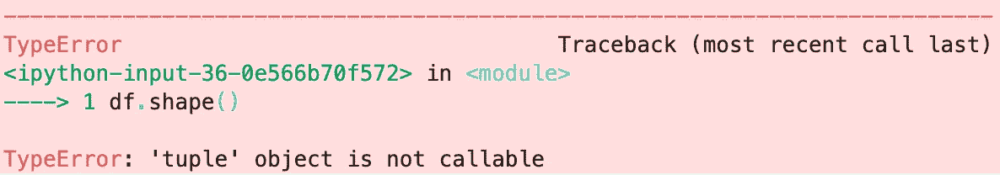
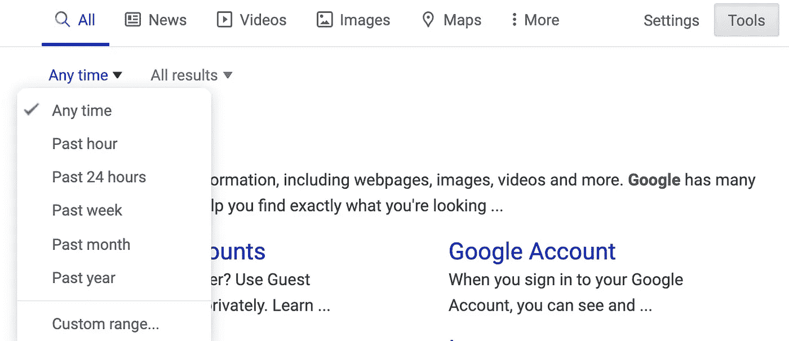

# 编程时节省时间和减少挫折的十个技巧⏳

> 原文：<https://towardsdatascience.com/ten-tips-to-save-you-time-and-frustration-when-programming-1f5a4b61f390?source=collection_archive---------1----------------------->

## 另外还有一个奖金计划，可以更快地解决错误😀

来源:https://pixabay.com/

在我坚持下去之前，我开始和退出编程至少有四次。我对我的数据科学学生的调查显示，这个故事并不罕见。

许多错误的开始部分是由于学习编码的缓慢而乏味的过程以及伴随而来的挫折。因此，我热衷于消除那些阻碍人们成为合格程序员的不必要的障碍。障碍总是会有的，但是没有理由去设置不必要的障碍。😁

这里有 10 个技巧可以帮助你更快地跨越障碍，并获得一种能力感。如果你已经编码多年，这些技巧中的许多对你来说可能是次要的或显而易见的，但是当开始时，没有什么是显而易见的。即使你从手机被称为车载电话的时候就开始编写代码，也可能有一两个小技巧可以节省你的时间。🎉

10 多条提示。来源:https://pixabay.com/

# 十条建议

1.  **分割你的屏幕。**大多数时候，当你学习编码时，我建议你把屏幕分成两个并排的面板——一个用于你在 Jupyter 笔记本或代码编辑器中编写的代码，另一个用于你的网络浏览器。您将使用 web 浏览器查看文档、堆栈溢出和教程。如果你的屏幕太小，我建议你买一个更大的——如果你负担得起的话。在美国，你可以在亚马逊上花 100 多美元买到一台 25 英寸的显示器。随着你越来越熟练，你会经常想要专注于一件作品。使用键盘快捷键可以在分屏和全屏之间切换。对于 Mac，我喜欢 2.99 美元的 [BetterSnapTool](https://apps.apple.com/us/app/bettersnaptool/id417375580?mt=12) ，一些 Windows 选项在本文中讨论。🖥
2.  排除杂念。电脑和手机上的静音通知。如果可以的话，把你的手机拿开。如果你在嘈杂的地方，播放一些舒缓的器乐或使用降噪耳机。你越能集中注意力，你就能学得越快。🎻
3.  键入示例代码。你不能只看一个教程就希望记住它。复制粘贴价值不大。你得把它打出来。那就延伸一下。然后凭记忆打出来。“从理论上讲，理论和实践之间没有区别。实际上是有的。”——[本雅明·布鲁斯特](https://quoteinvestigator.com/2018/04/14/theory/)原本——不是约吉·贝拉。⚾️
4.  **多日学习。**学习一个新的代码概念，并在几天内对自己进行测试。研究表明，在长期记忆方面，间隔重复比死记硬背有效得多。🚚
5.  **寓教于乐。向他人清楚地解释一个概念——大声地或者以书面形式——迫使你理解这个概念的本质，建立关系，并进行类比。你加强了大脑中的联系。这个技巧是优秀的[费曼](https://collegeinfogeek.com/feynman-technique/)学习技巧的一部分。📚**
6.  **语言前库。在你尝试使用一个编程语言的库之前，要充分理解它。变量类型不是最令人兴奋的话题。具有属性和方法的类可能看起来很高级。但是一旦你真正理解了一门语言，这个库就更容易使用了。你会犯很少的错误，节省很多时间。🎉**
7.  一次学一件事。不要试图同时学习两件事。你不是学得慢两倍，而是慢 10 倍。😉相关地，不要被闪亮的东西分散注意力。有一个地方来保存看起来像诱人的兔子洞跳下来的网址。把与你现在正在学习的东西不相关的网址放在安全的地方。[一个标签](https://chrome.google.com/webstore/detail/onetab/chphlpgkkbolifaimnlloiipkdnihall?hl=en)是一个方便的 Chrome 扩展，用于保存标签以备后用。
8.  **睡眠，锻炼，保持活力。**😴🏃🏾‍♀️Put 你的大脑处于一个强大的位置，形成和加强神经连接。🧠在我这本令人难忘的 Python 书籍中学习了更多帮助你保持敏锐的技巧。
9.  **学会更快地键入代码。** ⌨️你输入不寻常的符号越多，你就越快。然而，一点点的意向性可以显著加快这个过程。投资学习良好的触摸打字形式。[这里有一个来自 SpeedCoder 的小练习。](http://www.speedcoder.net/lessons/py/1/)
10.  **成为有键盘快捷键的高手。**以下是 [Chrome](https://support.google.com/chrome/answer/157179?hl=en) 、 [Mac](https://support.apple.com/en-us/HT201236) 和 [Windows](https://support.microsoft.com/en-us/help/12445/windows- keyboard-shortcuts) 的快捷方式链接。如果你是数据科学家或数据分析师，我在这里做了一个 GitHub Gist 的 Jupyter 实验室快捷方式[。我为 Mac 或 Linux 终端创建了快捷方式，在`~/.bash_profile` : `alias gs="git status"`向 Bash 概要文件添加了如下代码行。然后重启你的终端，输入两个键而不是两个单词。😉](https://gist.github.com/discdiver/9e00618756d120a8c9fa344ac1c375ac)

# 额外收获:学会快速解决错误

这是一个如此大的话题，却没有得到足够的关注，以至于我正在考虑就此写一整篇文章。相反，这里有一个额外的部分——一个更快解决错误的 5 步计划。

翻译:当 shape 不存在时，你调用它作为方法，你想得到一个属性。

每个程序员都会看到很多错误。一旦你有了经验，大多数问题只会耸耸肩，因为你可以在一分钟内解决它们。

然而，当你开始时，一个错误可能需要 20 倍的时间来解决。对于一个初学者来说，错误会让你感觉像是在齐踝深的泥泞中跋涉。

模糊的错误。来源:[https://pixabay.com/](https://pixabay.com/)

这里有一个快速解决 95%错误的策略。

## 所以你有一个错误，你应该怎么做？

1.  **查找错别字**——丢失的括号，或者拼写错误的变量或函数。语法突出显示在这里会有所帮助。一定要在提供代码高亮的软件中打字，以提高避免或快速修复缩进、不对称括号和类似错误的机会。有很多好的代码编辑器可供选择。如果你刚刚开始，我建议[vs code](https://code.visualstudio.com/)——它拥有最大的市场份额，它是免费的，并且有许多方便的功能。
2.  **首先读取错误消息堆栈跟踪的顶部和底部。**中间的代码一般帮助不大。然后，根据错误消息中的线索，查看您的代码，看能否找出问题所在。如果不能快速解码错误消息，将消息的最后一行复制粘贴到 Google(如果使用 Python。其他语言可能会在堆栈跟踪之前显示错误消息)。一个新的程序员最大的错误是没有足够快地向谷歌求助。

来源:https://pixabay.com/

3.**筛选网上资源**去粗取精。🌾这里有一些启发，可以帮助你更快地找到更高质量的资源。😀

[栈溢出](https://stackoverflow.com/)、[中](https://medium.com/)、 [Reddit](https://www.reddit.com/) 、[黑客新闻](https://news.ycombinator.com/)、 [Dev](https://dev.to/) 等网络社区都有 upvotes 或 claps 等反馈指标，以显示哪些内容是针对目标的。这些度量标准并不完美，但是它们通常工作得很好。栈溢出、[数据科学](https://towardsdatascience.com/)媒体出版物、关于回购的 GitHub 问题以及语言或库的官方文档是我找到最多解决方案的网站。

瞄准目标。来源:[https://pixabay.com/](https://pixabay.com/)

谷歌搜索结果中的博客质量时好时坏。如果你正在使用 Python，我可以根据我的经验推荐一些不错的网站:

*   [真正的蟒蛇](https://realpython.com/)
*   [数据学校](https://www.dataschool.io/)
*   [数据探索博客](https://www.dataquest.io/blog/)
*   [数据营博客](https://www.datacamp.com/community/blog)
*   [实用商业巨蟒](https://pbpython.com/)
*   克里斯·阿尔邦

4.避免旧的资源。对于大多数问题，您需要的是不超过几年的资源。当在谷歌上搜索错误的解决方案时，过滤掉旧的结果——要么通过对搜索参数进行时间限制，要么在查看结果片段时非正式地过滤。

使用谷歌搜索工具限制搜索结果的时间

如果您刚开始学习 Python，2009 年关于 Python 2 的内容可能对您没有帮助。🐍

API 在不断发展，而事情是如何完成的通常不是今天推荐的方法。你更有可能在相对最近的结果中找到一个合适的答案。📆

如果你第一次尝试不成功，那么下一次浏览旧帖子和低质量网站是值得的。

5.**了解错误代码的含义。** [这里是](https://inventwithpython.com/blog/2012/07/09/16-common-python-runtime-errors-beginners-find/)Python 的常见错误代码和解释列表。这里有一个非常好的流程图来帮助你处理常见的 Python 错误。

如果使用 Python pandas 库进行数据操作，会出现一些常见错误。下面是我用 Jupyter 笔记本写的 GitHub 要点以及如何解决它们:

常见熊猫错误:[https://gist . github . com/disc diver/2 F8 df 1c 3 f1 c 66 f 47129568 a82c 0666 e 5](https://gist.github.com/discdiver/2f8df1c3f1c66f47129568a82c0666e5)

如果 Python 和 pandas 能提供真正有用的错误消息，包括对错误可能原因的解释，那就太好了。如果有人想解决它，那听起来像是一个有价值的项目！👍

这就是我更快处理错误的计划。如果你有其他建议，请告诉我。😀

# 包装

希望这 10 个减少挫败感和提高速度的建议能节省你的时间。希望解决错误信息的 5 步计划能帮助你或你认识的人更快地学习。🚀

有了正确的心态，一点指导和大量的实践，任何人都可以学习编码。这可能不会很快或很容易，但希望这篇文章会让它不那么令人沮丧。

如果你觉得这很有帮助，请在你最喜欢的社交媒体上分享，这样其他人也可以找到它。

我写关于 Python、Docker、数据科学等等的文章。如果你对此感兴趣，请在这里阅读更多[和关注我。😄](https://medium.com/@jeffhale)

如果你对帮助你提高工作效率的技巧感兴趣，我在我每月的 [Data Awesome 时事通讯](https://dataawesome.com)中分享了很多。

快乐学习！🚀