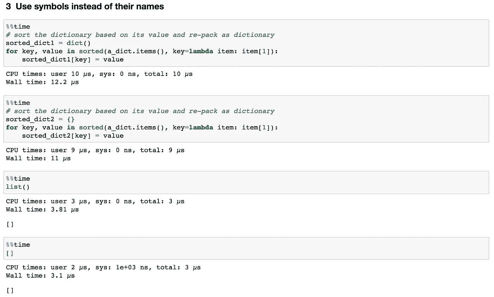

# 提高 Python 代码速度的十个技巧

> 原文：<https://towardsdatascience.com/ten-tricks-to-speed-up-your-python-codes-c38abdb89f18?source=collection_archive---------0----------------------->


君的轻音乐

## 每一步的微小进步，整体的巨大飞跃

Python 很慢。

我打赌你可能会多次遇到这种关于使用 Python 的反驳，尤其是来自`C`或`C++`或`Java`世界的人。在许多情况下都是这样，例如，循环或排序 Python 数组、列表或字典有时会很慢。毕竟，开发 Python 是为了让编程变得有趣和简单。因此，Python 代码在简洁性和可读性方面的改进必须以性能为代价。

话虽如此，近年来已经做了许多努力来提高 Python 的性能。我们现在可以通过使用`numpy`、`scipy`、`pandas`和`[numba](http://numba.pydata.org/)`以高效的方式处理大型数据集，因为所有这些库都在`C/C++`中实现了它们的关键代码路径。还有另一个令人兴奋的项目， [Pypy 项目](https://www.pypy.org/)，与 [Cpython](https://stackoverflow.com/questions/17130975/python-vs-cpython/17130986) (最初的 python 实现)相比，它将 Python 代码的速度提高了 4.4 倍。

> Pypy 的缺点是它对一些流行的科学模块(如 Matplotlib、Scipy)的覆盖有限或不存在，这意味着您不能在 Pypy 的代码中使用这些模块。

除了这些外部资源，**在日常编码实践中，我们还能做些什么来加速 Python 代码呢**？今天和大家分享一下我在学习 Python 过程中经常用到的 10 招。

像往常一样，如果你想自己重新运行这篇文章中的代码，可以从 [my Github](https://github.com/Perishleaf/data-visualisation-scripts/tree/master/speed_up_python_code) 访问所有需要的数据和笔记本。

**1。熟悉内置函数**


图 1 |[Python 3 中的内置函数](https://docs.python.org/3/library/functions.html)

Python 自带了许多在`C`中实现的内置函数，这些函数非常快并且维护良好(图 1)。我们至少应该熟悉这些函数名，并且知道在哪里可以找到它们(一些常用的与计算相关的函数有`abs()`、`len()`、`max()`、`min()`、`set()`、`sum()`)。因此，每当我们需要进行一个简单的计算时，我们可以走正确的捷径，而不是笨拙地编写自己的版本。

让我们以内置函数`set()`和`sum()`为例。如图 2 所示，使用`set()`和`sum()`分别比我们自己编写的函数快 36.1 倍和 20.9 倍。


图 2 | set()和 sum()函数的示例

**2。**`**sort()**`***vs***`**sorted()**`

这两个函数都可以对列表进行排序。

如果我们只想获得一个已排序的列表，而不关心原始列表，那么无论是对于基本排序还是在使用 `**key**` **参数**(`key`参数指定了在进行比较之前要在每个列表元素上调用的函数)时，`**sort()**` **都比** `**sorted()**` **要快一点，如图 3 所示。**

这是因为`sort()`方法就地修改列表，而`sorted()`构建一个新的排序列表并保持原始列表不变。换句话说，`a_long_list`本身的值的顺序实际上已经改变了。


图 3| sort()和 sorted()

然而，`sorted()`比`sort()`更通用。这是因为`sorted()`接受任何 iterable，而`sort()`只为列表定义。因此，如果我们想对列表之外的东西进行排序，`sorted()`是可以使用的正确函数。例如，我们可以根据字典的`keys`或`values`对其进行快速排序(图 4)。


图 4 |已排序的()字典

**3。用符号代替它们的名字**

如图 5 所示，当我们需要一个空的字典或列表对象时，不用使用`dict()`或`list()`，直接调用`{}`(至于空集，需要使用`set()`本身)和`[]`。这个技巧不一定会加速代码，但是会让代码更复杂。



图 5 |直接使用 list()和 dict()符号

**4。列表理解**

通常，当我们需要根据某些规则从一个旧列表创建一个新列表时，我们使用一个`for`循环来遍历旧列表，并根据规则转换它的值，然后保存在一个新列表中。例如，假设我们想从`another_long_list`中找到所有偶数，我们可以使用以下代码:

```
even_num = []
for number in another_long_list:
    if number % 2 == 0:
        even_num.append(number)
```

但是，有一种更简洁、更优雅的方法可以实现这一点。如图 6 所示，**我们把原来的** `**for**` **循环放在仅仅一行代码**中。而且，速度提高了差不多 2 倍。


图 6 |列表理解

结合**规则 3** ，我们也可以将列表变成字典或集合，只需将`[]`改为`{}`。让我们重写图 5 中的代码，我们可以省略赋值的步骤，在符号内部完成迭代，就像这个`sorted_dict3 = {key: value for key, value in sorted(a_dict.items(), key=lambda item: item[1])}`。

要分解这个，从最后开始。函数“`sorted(a_dict.items(), key=lambda item: item[1])`”返回给我们一个元组列表(图 4)。这里，我们使用多重赋值来解包元组，对于列表中的每个元组，我们将`key`赋给它的第一项，将`value`赋给它的第二项(因为我们知道在这种情况下每个元组中有两项)。最后，每一对`key`和`value`都保存在一本字典中。

**5。使用** `**enumerate()**` **作为数值和索引**

有时，当我们遍历一个列表时，我们希望在表达式中同时使用它的值和索引。如图 7 所示，我们应该使用`enumerate()`，它将列表的值转换成索引和值对。这也将我们的代码速度提高了大约 2 倍。


图 7 | enumerate()示例

**6。使用** `**zip()**` **打包和解包多个迭代**

在某些情况下，我们需要遍历两个或更多的列表。然后我们可以使用`zip()`函数，它将多个列表转换成一个元组列表(图 8)。注意，列表最好长度相同，否则，`zip()`会在较短的列表结束后立即停止。


图 8 | zip()示例

相反，要访问列表中每个元组的条目，我们也可以通过添加星号(*)和使用多重赋值来解压缩元组列表，就像这样，`letters1, numbers1 = zip(*pairs_list)`。

**7。组合** `**set()**` **和** `**in**`

当我们想检查一个值是否存在于一个列表中时，一个笨拙的方法是构造这样一个函数:

```
**# Construct a function for membership test**
def check_membership(n):
    for element in another_long_list:
        if element == n:
            return True
    return False
```

然后调用`check_membership(value)`看`another_long_list`里面的`value`是否。然而，一种 pythonic 式的方法是通过调用`value in another_long_list`来使用`in`，如图 9 所示。这就像你直接问 python“嘿 Python，你能告诉我`value`是否在`another_long_list`里面吗”。


图 9 |使用 in 和 set()检查成员资格

为了更有效，我们应该首先使用`set()`从列表中删除重复项，然后测试 set 对象中的成员资格。通过这样做，我们减少了需要检查的元素的数量。此外，`in`是一个非常快速的集合操作。

从图 9 中可以看出，尽管构建 set 对象花费了 20 毫秒，但这只是一次性投资，检查步骤本身仅用了 5.2 秒，这是 1962 倍的改进。

8。检查变量是否为真

不可避免地，我们会使用大量的`if`语句来检查空变量、空列表、空字典等等。我们也可以从这里节省一点时间。

如图 10 所示，我们不需要在`if`语句中显式地声明`== True`或`is True`，取而代之的是我们只使用变量名。这节省了魔法函数`[__eq__](https://stackoverflow.com/questions/3588776/how-is-eq-handled-in-python-and-in-what-order)`用于比较两边值的资源。


图 10 |只需检查变量

同样，如果我们需要检查变量是否为空，我们只需要说`if not string_returned_from_function:`。

**9。使用**计数唯一值`**Counters()**`

假设我们试图计算在**规则 1** 、`a_long_list`中生成的列表中的唯一值。一种方法是创建一个字典，其中的键是数字，值是计数。当我们迭代列表时，如果它已经在字典中，我们可以增加它的计数，如果它不在字典中，我们可以将它添加到字典中。

```
num_counts = {}
for num in a_long_list:
    if num in num_counts:
        num_counts[num] += 1
    else:
        num_counts[num] = 1
```

然而，更有效的方法是在一行代码`num_counts2 = Counter(a_long_list)`中使用 [**集合**](https://docs.python.org/3.8/library/collections.html) 中的`Counter()`。是的，就是这么简单。如图 11 所示，它比我们编写的函数大约快 10 倍。

如果我们想知道 10 个最常见的数字，`Counter()`实例还有一个非常方便的`most_common`方法。


图 11 |计数器()示例

总之，**收藏**是一个很神奇的模块，我们应该把它保存到我们的日常工具箱中，随时使用。

10。将 `**for**` **循环放入**函数中

可能有一段时间，我们构建了一个函数，并且需要重复这个函数给定的次数。一个显而易见的方法是我们构建一个函数，然后将这个函数放入一个`for`循环中。

但是，如图 12 所示，我们没有重复执行函数 100 万次(a_long_list 的长度为 1，000，000)，而是在函数内部集成了`for`循环。这为我们节省了大约 22%的运行时间。这是因为函数调用是昂贵的，通过将函数写入列表理解来避免它是更好的选择。


图 12 |函数内部的 put for 循环

仅此而已！感谢你阅读这篇文章。希望有些小技巧能对你有用。此外，您还使用了哪些其他方法来加速 Python 代码？如果你能留下评论来分享它们，我将不胜感激。

以下是您可能感兴趣的链接:

*   [如何使用](https://docs.python.org/3/howto/sorting.html) `[sort()](https://docs.python.org/3/howto/sorting.html)` [和](https://docs.python.org/3/howto/sorting.html) `[sorted()](https://docs.python.org/3/howto/sorting.html)`对列表进行排序
*   [在 Python 中何时使用列表理解](https://realpython.com/list-comprehension-python/)
*   [将代码转换成漂亮、地道的 Python 语言](https://www.youtube.com/watch?v=OSGv2VnC0go)
*   [Python 编程语言的优缺点](https://medium.com/@mindfiresolutions.usa/advantages-and-disadvantages-of-python-programming-language-fd0b394f2121)

和往常一样，我欢迎反馈、建设性的批评以及听到关于您的数据科学项目的信息。可以通过 [Linkedin](https://www.linkedin.com/in/jun-ye-29aaa769/) 和[我的网站](https://junye0798.com/)找到我。