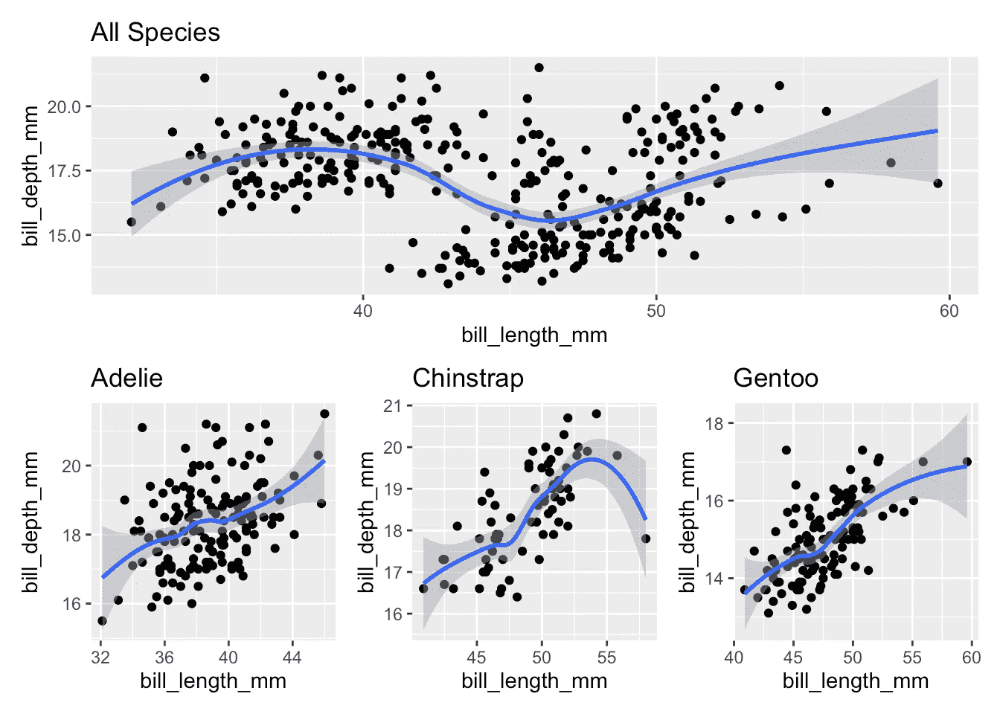
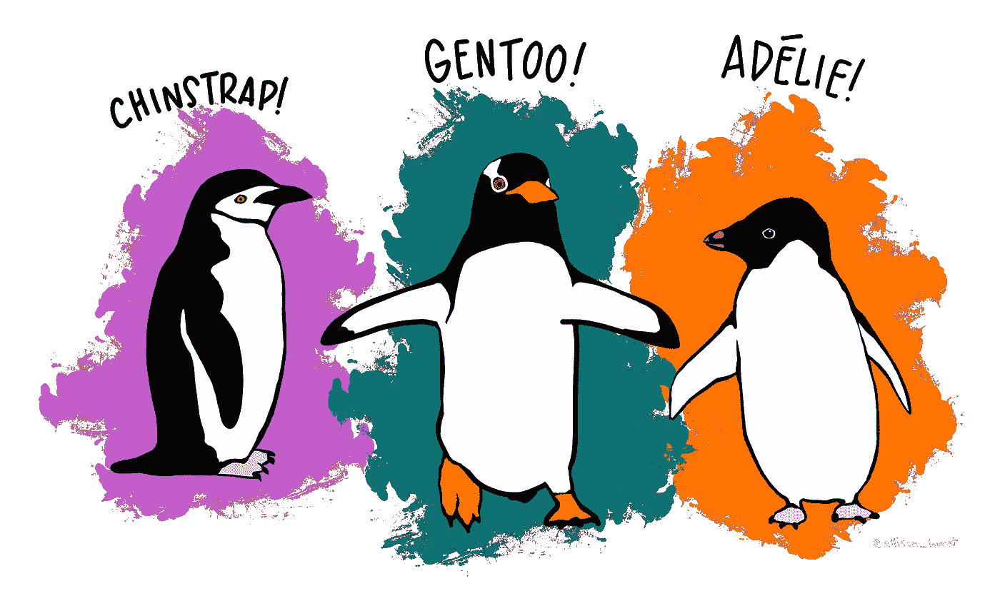

# 在 R 中执行常见数据任务的十种最新方法

> 原文：<https://towardsdatascience.com/ten-up-to-date-ways-to-do-common-data-tasks-in-r-4f15e56c92d?source=collection_archive---------13----------------------->

## 用可爱企鹅的数据集来了解这十个简单的例子

无论您是否是 tidyverse 的粉丝，毫无疑问，这个 R 包集合提供了一些整洁而有吸引力的方式来处理数据，这些方式对用户来说通常非常直观。在 tidyverse 包的早期版本中，用户控制输出的一些元素被牺牲掉了，以利于新手能够掌握和容易使用的更简单的功能。在最近对`dplyr`和`tidyr`的更新中，在恢复这种控制方面有了重大进展。

这意味着 tidyverse 中有一些您可能不知道的新函数和方法。它们允许您更好地按照自己的意愿转换数据，并更灵活地执行操作。它们还提供了新的替代方法来执行任务，如嵌套、建模或绘图，使您的代码更具可读性和可理解性。事实上，我确信用户仅仅是对这个重要的软件包的最新更新的皮毛。

任何程序员都有责任跟上方法的发展。下面是最新的 tidyverse 更新提供的处理常见数据任务的新方法的十个示例。对于这些例子，我将使用新的*帕尔默企鹅*数据集，这是对有争议的*虹膜*数据集的替代，众所周知，Fischer 在他围绕优生学的工作中使用了该数据集。正如我们将看到的，它实际上是一个更好的教学和演示数据争论的全面数据集，我鼓励你使用和探索它。

首先，让我们加载 tidyverse 包和帕尔默企鹅数据集，并快速浏览一下。我鼓励您在尝试复制本文中的工作之前安装这些包的最新版本。

我们可以看到，该数据集提供了不同物种、性别和原产地的企鹅的各种解剖特征的几种测量方法，以及采取这些测量方法的年份。

## 1.选择数据中的列

`tidyselect`现在内置了助手函数，允许您根据常见条件使用`dplyr::select()`选择列，从而节省时间。在这种情况下，如果我想将数据集简化为仅包含账单测量值，我可以使用这个(注意，所有测量值列都包含一个下划线):

一整套`tidyselect`助手函数可以在文档[这里](https://cran.r-project.org/web/packages/tidyselect/tidyselect.pdf)找到。

## 2.重新排序数据中的列

`dplyr::relocate()`允许以一种新的方式对特定的列或列集进行重新排序。例如，如果我想确保我的所有测量列都在数据集的末尾，我可以使用这个(注意我的最后一列是`year`):

类似于`.after`你也可以在这里用`.before`作为论元。

## 3.控制突变的列位置

你会注意到在`penguins`数据集中，每只企鹅都没有唯一的标识符。当数据集中有多个相同物种、岛屿、性别和年份的企鹅时，这可能会有问题。为了解决这个问题并为后面的例子做准备，让我们使用`dplyr::mutate()`添加一个惟一的标识符，这里我们可以说明`mutate()`现在如何允许您以类似于`relocate()`的方式定位新列:

## 4.从宽到长的转变

`penguins`数据集显然是一种广泛的形式——它给出了跨列的多个观察值。出于多种原因，我们可能希望将数据从宽型转换为长型。在长数据中，每个观察值都有自己的行。在`tidyr`中旧的函数`gather()`在这类任务中很流行，但是它的新版本`pivot_longer()`更加强大。在这种情况下，我们在这些列名中有不同的正文部分、度量和单位，但是我们可以像这样非常简单地将它们分开:

## 5.由长变宽

从长移回宽也一样容易。`pivot_wider()`比旧的`spread()`更加灵活:

## 6.跨多个列运行组统计信息

`dplyr`如何使用`across`副词将多个汇总函数应用于分组数据，帮助您提高效率。如果我们想总结所有企鹅的喙和鳍状肢的尺寸，我们会这样做:

## 7.控制跨多列汇总时输出列的命名方式

您将在上面看到`penguin_stats`中的多个列是如何被赋予默认名称的，这并不直观。如果您命名了您的汇总函数，那么您可以使用`.names`参数来精确地控制您想要如何命名这些列。这使用了`glue`符号。例如，这里我想构造新的列名，方法是获取现有的列名，删除任何下划线或“mm”度量，并使用下划线粘贴到汇总函数名:

## 8.跨数据子集运行模型

`summarise()`的输出现在可以是任何东西，因为`dplyr`现在允许不同的列类型。您可以生成汇总向量、数据帧或其他对象，如模型或图形。

如果你想为每个物种运行一个模型，你可以这样做:

将模型对象保存在数据帧中通常不是很有用，但是您可以使用其他面向整洁的包来总结模型的统计数据，并将它们作为完美集成的数据帧返回:

## 9.嵌套数据

我们经常需要处理数据的子集，按子集对数据进行分组会很有用，这样我们就可以在所有数据子集上应用通用的函数或操作。例如，也许我们想看看我们不同种类的企鹅，并为它们制作一些不同的图表。以前，基于子集的分组可以通过以下有些笨拙的 tidyverse 函数组合来实现。

新功能`nest_by()`提供了一种更直观、更快捷的方式来做同样的事情:

请注意，嵌套数据将存储在名为`data`的列中，除非您使用`.key`参数指定其他方式。

## 10.跨子集绘图

有了`nest_by()`和我们现在可以总结或变异几乎任何类型的对象的事实，这允许我们跨子集生成图形，并将它们存储在数据帧中以备后用。让我们为我们的三个企鹅种类散点图比尔长度和深度:

现在我们可以很容易地显示不同的散点图，例如，我们的企鹅体现了[辛普森悖论](https://en.wikipedia.org/wiki/Simpson%27s_paradox):

最初我是一名纯粹的数学家，后来我成为了一名心理计量学家和数据科学家。我热衷于将所有这些学科的严谨性应用到复杂的人的问题上。我也是一个编码极客和日本 RPG 的超级粉丝。在[*LinkedIn*](https://www.linkedin.com/in/keith-mcnulty/)*或*[*Twitter*](https://twitter.com/dr_keithmcnulty)*上找我。也可以看看我在【drkeithmcnulty.com】**上的博客。***

**

*帕尔默企鹅作品由 [@allison_horst](https://twitter.com/allison_horst) (经许可使用)*