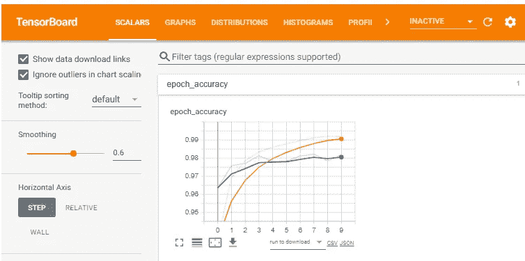
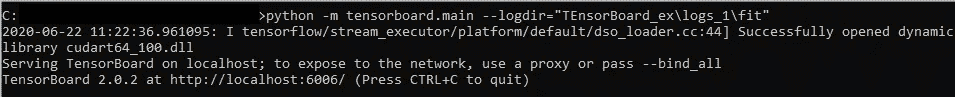
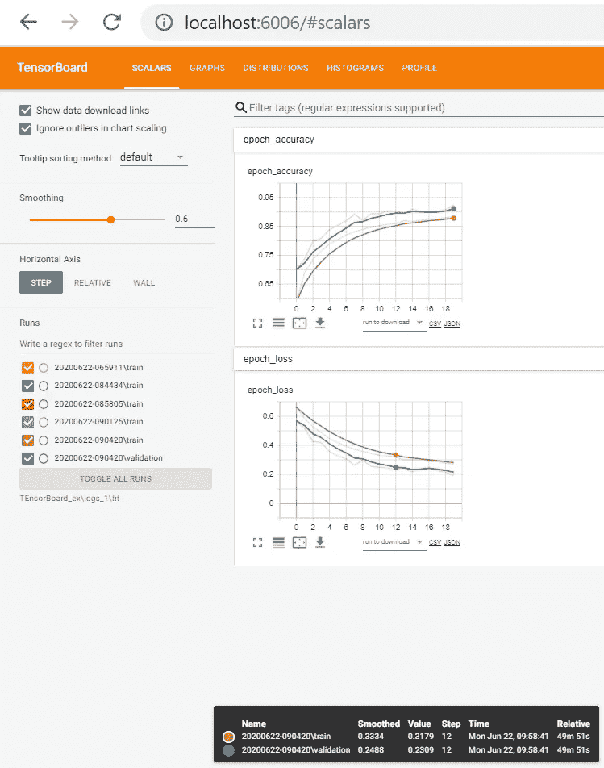
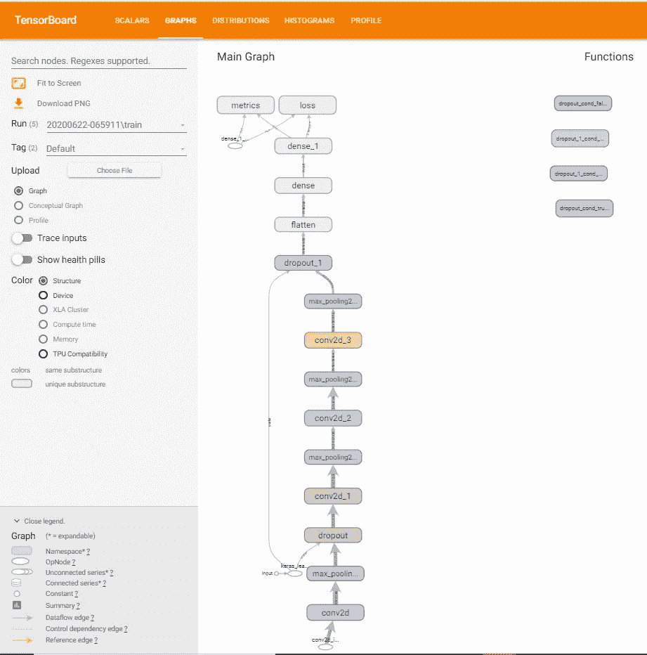
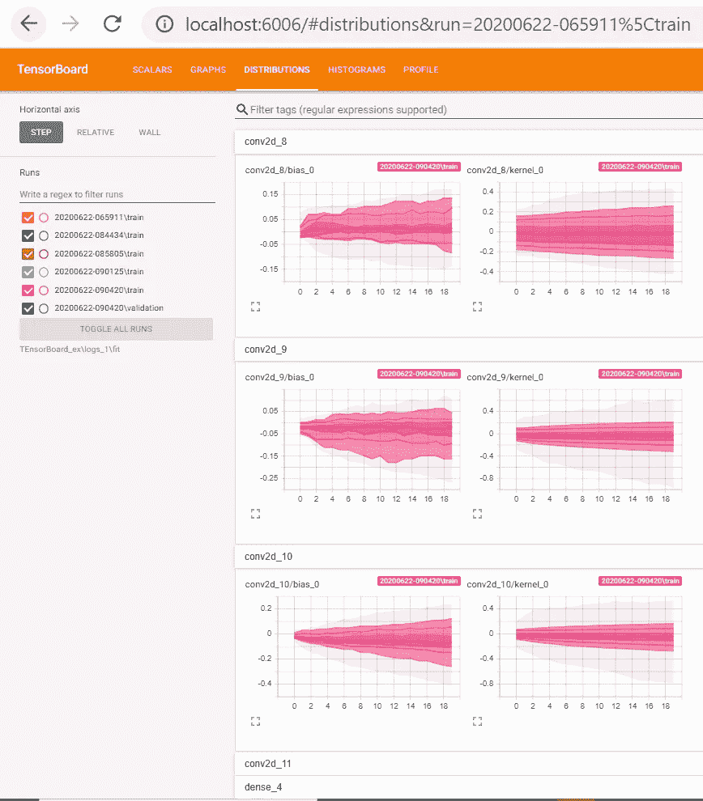
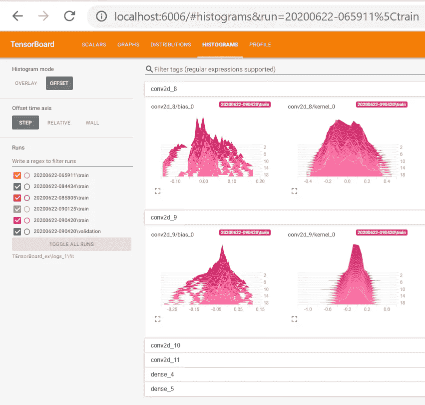
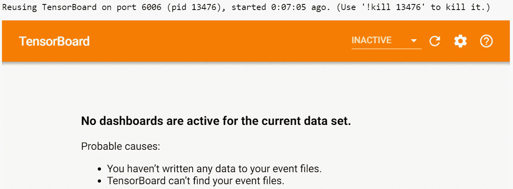
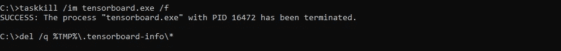

# tensor board——tensor flow 模型的可视化套件

> 原文：<https://towardsdatascience.com/tensorboard-a-visualization-suite-for-tensorflow-models-c484dd0f16cf?source=collection_archive---------23----------------------->

## 学习使用 TensorBoard 可视化指标、图表、权重直方图和 Tensorflow 模型的偏差

*在本文中，您将学习使用 TensorBoard 显示在 TensorFlow 中创建的深度学习模型在不同时期的指标、图表、图像以及权重和偏差直方图，以及您可能会遇到的常见问题。*



***什么是张量板？***

**TensorBoard 是 Tensorflow 的一个可视化工具包，用于显示不同的指标、参数和其他可视化内容，帮助调试、跟踪、微调、优化和共享您的深度学习实验结果。**

***通过 TensorBoard 可以追踪到哪些不同的东西？***

TensorBoard 允许您跟踪

*   **度量** : **损失和准确度**随着每个时期而变化。跟踪训练周期中的损失和准确性将有助于您了解模型是否过度拟合。
*   **模型图**:可视化深度学习模型，了解其构建是否正确
*   **分布直方图:可视化各个时期的权重和偏差直方图**
*   **图像**:在 TensorBoard 中为你的数据集可视化任意图像

***为什么要用 TensorBoard？***

*你正在开发一个图像分类深度神经网络，希望拥有 98%以上的准确率。*

您希望**跟踪模型在每个时期的准确性和损失；另外**您可能希望**使用不同的超参数值(如学习率、优化器、退出**等)来跟踪和分析您的模型的准确性和损失。**超参数不同值的跟踪精度将帮助您微调模型。**

**深度学习模型在计算上非常昂贵，使用不同的超参数值可视化我们的实验结果，并跟踪几个时期的准确性和损失，将有助于快速微调模型。**

您可以基于不同的数据流图跟踪模型的准确性和损失，这些数据流图具有不同的隐藏层数和隐藏层中的单元数。

**TensorBoard 通过跟踪精度和损失，帮助可视化模型中的张量流，以便进行调试和优化。**

**TensorBoard 将计算图形、训练参数、度量和超参数可视化，这将有助于跟踪模型的实验结果，从而更快地对模型进行微调。**

有了 [**TensorBoard.dev**](https://tensorboard.dev/#get-started) ，你就可以托管你的深度学习模型实验结果，分享给你的团队。**任何人都可以通过链接查看数据，所以不要上传敏感数据。**

***如何使用 TensorBoard？***

我们将使用 TensorBoard 使用[猫狗数据集](https://www.kaggle.com/c/dogs-vs-cats/data)可视化标量、图形和分布。

## 导入所需的库

```
**import tensorflow as tf
import datetime
from tensorflow.keras.models import Sequential
from tensorflow.keras.layers import Dense, Conv2D, Flatten, Dropout, MaxPooling2D
from tensorflow.keras.preprocessing.image import ImageDataGenerator, img_to_array, load_img**
```

我用过 TensorFlow 2.0.0 版本。

## 加载 TensorBoard 笔记本扩展

```
# Load the TensorBoard notebook extension
**%load_ext tensorboard**
```

## 创建图像分类深度学习模型

**设置培训的关键参数**

```
**BASE_PATH = 'Data\\dogs-vs-cats\\train\\'
TRAIN_PATH='Data\\dogs-vs-cats\\train_data\\'
VAL_PATH='Data\\dogs-vs-cats\\validation_data\\'batch_size = 32 
epochs = 60
IMG_HEIGHT = 150
IMG_WIDTH = 150**
```

**重新缩放并对训练图像应用不同的增强**

```
**train_image_generator = ImageDataGenerator(                                                rescale=1./255,                                              rotation_range=45,                                                width_shift_range=.15,                                                height_shift_range=.15,                                                horizontal_flip=True,                                                zoom_range=0.3)**
```

**重新调整验证数据**

```
**validation_image_generator = ImageDataGenerator(rescale=1./255)**
```

**为训练和验证数据集生成批量归一化数据**

```
**train_data_gen = train_image_generator.flow_from_directory(batch_size = batch_size,                                                     directory=TRAIN_PATH,                                                     shuffle=True,                                                     target_size=(IMG_HEIGHT, IMG_WIDTH),                                                     class_mode='categorical')val_data_gen = validation_image_generator.flow_from_directory(batch_size = batch_size,                                                              directory=VAL_PATH,                                                              target_size=(IMG_HEIGHT, IMG_WIDTH),                                                              class_mode='categorical')**
```

## 创建并编译模型

```
**def create_model():
    model = Sequential([
    Conv2D(16, 3, padding='same', activation='relu', 
           input_shape=(IMG_HEIGHT, IMG_WIDTH ,3)),
    MaxPooling2D(),
    Dropout(0.2),
    Conv2D(32, 3, padding='same', activation='relu'),
    MaxPooling2D(),
    Conv2D(64, 3, padding='same', activation='relu'),
    MaxPooling2D(),
    Conv2D(128, 3, padding='same', activation='relu'),
    MaxPooling2D(),
    Dropout(0.2),
    Flatten(),
    Dense(512, activation='relu'),
    Dense(2, activation='softmax')])
    return model**# Create and Compile the model
**model= create_model()
model.compile(optimizer='adam',                 loss='categorical_crossentropy', 
metrics=['accuracy'])**
```

## 使用张量板拟合模型

为了可视化损失和准确性、模型图以及权重和偏差的直方图，您需要创建日志并存储详细信息。TensorBoard 将使用这些日志文件来显示详细信息。

要创建日志文件，在拟合模型时使用***TF . keras . callbacks . tensor board***。

```
**log_dir=r'\Tensorboard_ex\logs_1\fit\' + datetime.datetime.now().strftime('%Y%m%d-%H%M%S')
tensorboard_callback= tf.keras.callbacks.TensorBoard(log_dir=log_dir,                     
                               histogram_freq=1)**
```

为了对每个层和每个时期的权重和偏差进行直方图计算，我们将 **histogram_freq=1** 设置为默认关闭。

**拟合模型**

```
**model.fit_generator(
    train_data_gen,
    steps_per_epoch=1000,
    epochs=epochs,
    validation_data=val_data_gen,
    validation_steps=1000,
    callbacks=[tensorboard_callback]
)**
```

**可视化张量板仪表盘**

您可以使用 Jupyter 笔记本中的不同命令查看 TensorBoard 仪表板

```
%tensorboard --logdir="\TEnsorBoard_ex\logs_1\fit"
```

或者

```
**%tensorboard — logdir log_dir**
```

或者

通过指定存储事件日志的目录来启动 TensorBoard。这些事件日志是在我们拟合模型时创建的。

```
python -m tensorboard.main — logdir=”TensorBoard_ex\logs_1\fit”
```



在 Chrome 地址栏输入 [http://localhost:6006/](http://localhost:6006/) ，你现在可以看到 Tensorboard

**标量信息，包含 20 个时期内训练和验证**数据集的准确性和损失



**带有图像分类模型图形的张量板显示模型是否构建正确**



你也可以查看**非标量张量在多次迭代中的分布**



**直方图在多次迭代中显示相同的张量非标量张量变量，但显示为三维直方图**



## TensorBoard 常见问题

当前数据集没有活动的仪表板



杀死所有当前运行的 Tensorboard 任务。在命令提示符下键入以下命令

```
**taskkill /im tensorboard.exe /f**
**del /q %TMP%\.tensorboard-info\***
```



现在，通过指定存储事件日志的目录来启动 TensorBoard。这些事件日志是在我们拟合模型时创建的。

```
python -m tensorboard.main — logdir=”TensorBoard_ex\logs_1\fit”
```


有时，您可能需要多次尝试这些语句才能查看 Tensorboard 仪表板。

## 结论:

针对模型的不同元素的 TensorBoard 可视化使得更容易调试和优化深度学习模型实验，以获得更好的准确性。

下一步是什么？

在下一篇文章中，您将学习使用 TensorBoard 使用超参数调整来微调深度学习模型。

## 参考资料和灵感:

[](https://www.tensorflow.org/tensorboard/get_started) [## TensorBoard | TensorFlow 入门

### 在机器学习中，要改进某样东西，你通常需要能够测量它。TensorBoard 是一款提供…

www.tensorflow.org](https://www.tensorflow.org/tensorboard/get_started) [](https://github.com/tensorflow/tensorboard/issues/2481) [## Jupyter 中的 TensorBoard“本地主机拒绝连接”问题(Windows 问题#2481 …

### 解散 GitHub 是超过 5000 万开发者的家园，他们一起工作来托管和审查代码，管理项目，以及…

github.com](https://github.com/tensorflow/tensorboard/issues/2481) [](https://github.com/tensorflow/tensorflow/issues/7856) [## [Windows]tensor board-需要从与 logdir 问题#7856 相同的驱动器启动…

### 解散 GitHub 是超过 5000 万开发者的家园，他们一起工作来托管和审查代码，管理项目，以及…

github.com](https://github.com/tensorflow/tensorflow/issues/7856)