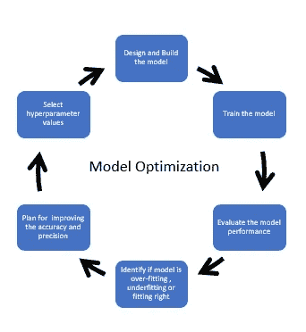
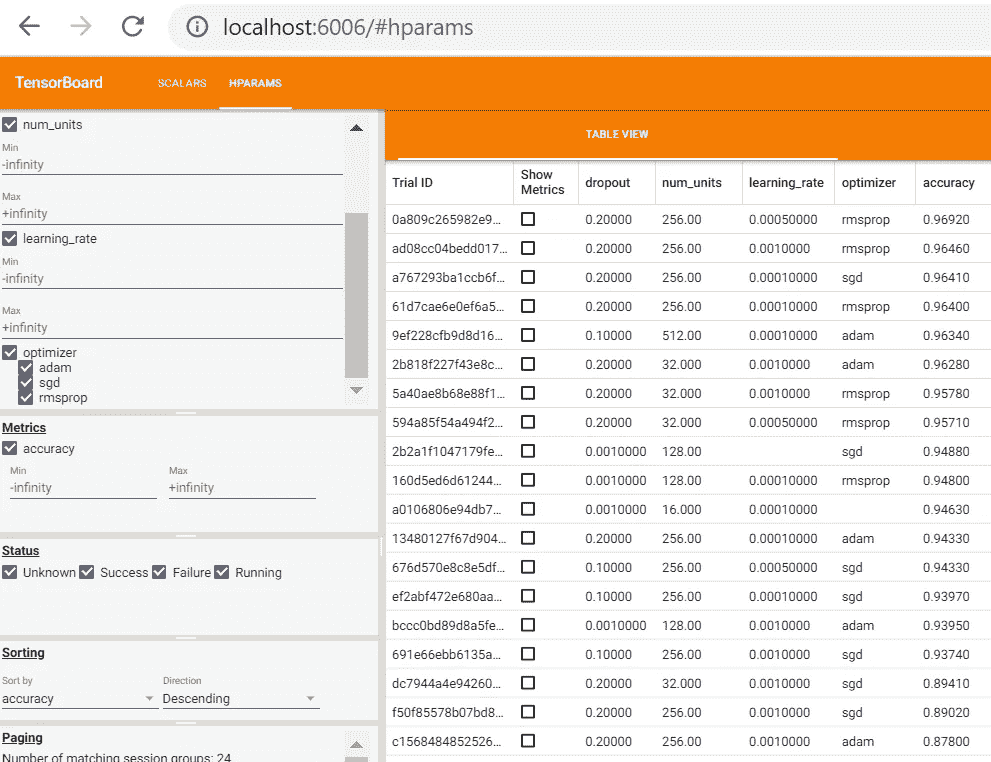
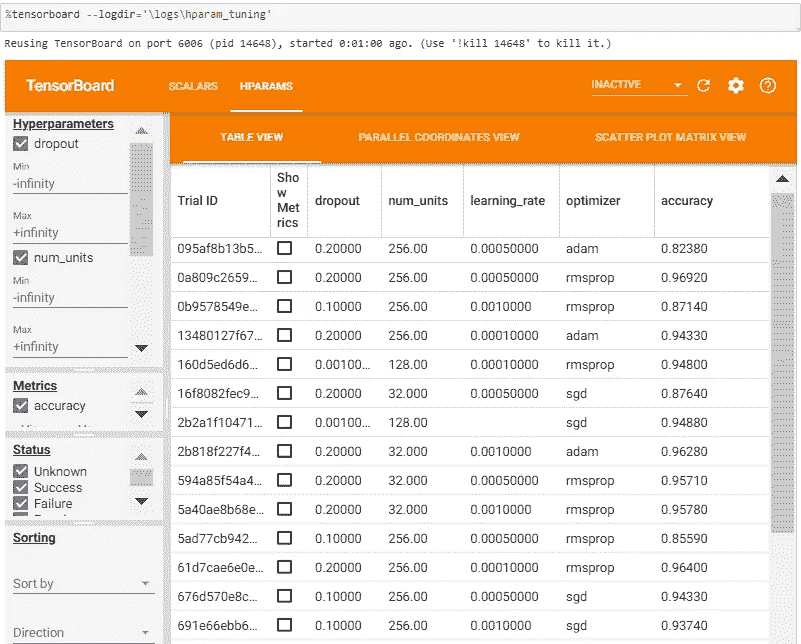
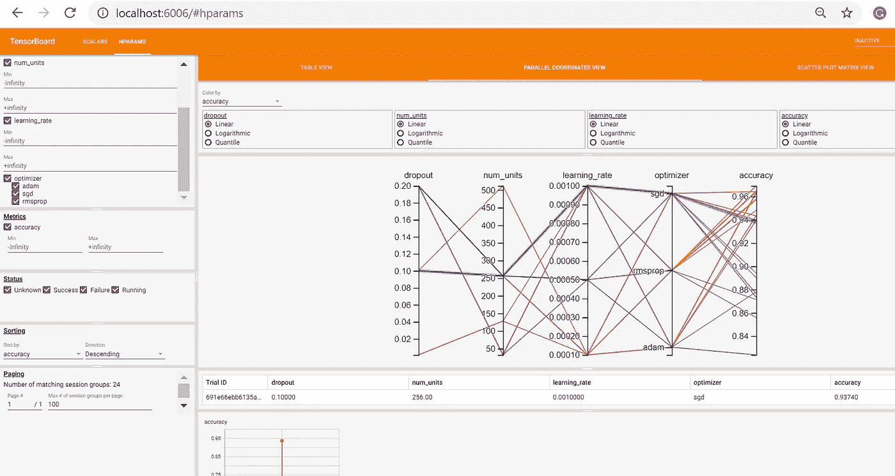

# 张量板:超参数优化

> 原文：<https://towardsdatascience.com/tensorboard-hyperparameter-optimization-a51ef7af71f5?source=collection_archive---------17----------------------->

## 了解如何使用 TensorBoard 的 HParamas 仪表板为深度学习模型找到最佳超参数。

**先决条件:**

[tensor board——tensor flow 模型的可视化套件](/tensorboard-a-visualization-suite-for-tensorflow-models-c484dd0f16cf)

**在本文中，您将学习超参数优化，然后使用 TensorBoard 显示超参数优化的结果。**

***深度神经网络背景下的超参数是什么？***

你在深度学习神经网络中的目标是找到节点的权重，这将帮助我们理解图像、任何文本或语音中的数据模式。

为此，您可以使用为模型提供最佳准确度和精度的值来设计神经网络参数。

***那么，这些被称为超参数的参数是什么呢？***

**用于训练神经网络模型的不同参数称为超参数。这些超参数像旋钮一样被调整，以提高神经网络的性能，从而产生优化的模型。**

神经网络中的一些超参数是

*   **隐藏层数**
*   **隐藏层中单元或节点的数量**
*   **学习率**
*   **辍学率**
*   **历元或迭代**
*   **像 SGD，Adam，AdaGrad，Rmsprop 等优化者。**
*   **激活功能，如 ReLU、sigmoid、leaky ReLU 等。**
*   **批量大小**

***如何实现超参数优化？***

> 超参数优化是找到超参数值的过程，如优化器、学习率、辍学率等。深度学习算法的一部分，它将提供最好的模型性能。



您可以使用以下技术执行超参数优化。

*   **手动搜索**
*   [**网格搜索**](https://medium.com/datadriveninvestor/tuning-artificial-neural-network-b028dcc3b9d0) : **对产生笛卡尔积的指定超参数的所有可能组合进行彻底搜索。**
*   **随机搜索** : **随机选择超参数，并不是每个超参数组合都尝试**。随着超参数数量的增加，随机搜索是更好的选择，因为它可以更快地获得超参数的良好组合。
*   [**贝叶斯优化**](https://medium.com/datadriveninvestor/bayesian-optimization-f5ab0cc653a7)**:**I**n 合并关于超参数的先验数据，**包括模型的精度或损失**。先验信息有助于确定模型超参数选择的更好近似。**

为了可视化 TensorBoard 上模型的超参数调整，我们将使用网格搜索技术，其中我们将使用一些超参数，如节点数量、不同的优化器或学习率以及不同的退出率，并查看模型的准确性和损失。

***为什么要用 TensorBoard 进行超参数优化？***

一张图胜过千言万语，这也适用于复杂的深度学习模型。深度学习模型被认为是一个黑匣子，你发送一些输入数据，模型进行一些复杂的计算，瞧，你现在有你的结果了！！！

> TensorBoard 是 Tensorflow 的一个可视化工具包，用于显示不同的指标、参数和其他可视化内容，帮助调试、跟踪、微调、优化和共享您的深度学习实验结果

**有了 TensorBoard，可以在每个历元跟踪模型的精度和损耗；并且还具有不同的超参数值**。**超参数不同值的跟踪精度将帮助您更快地微调模型。**

***最后，下面是用 Python 实现的代码……***

我们将使用 TensorBoard 使用[猫狗数据集](https://www.kaggle.com/c/dogs-vs-cats/data)可视化标量、图形和分布。

# 导入所需的库

导入 TensorFlow 和 TensorBoard HParams 插件以及 Keras 库，用于预处理图像和创建模型。

```
**import tensorflow as tf
from tensorboard.plugins.hparams import api as hp
import datetime
from tensorflow.keras.models import Sequential
from tensorflow.keras.layers import Dense, Conv2D, Flatten, Dropout, MaxPooling2D
from tensorflow.keras.preprocessing.image import ImageDataGenerator, img_to_array, load_img
import numpy as np**
```

我用过 TensorFlow 2.0.0 版本。

# 加载 TensorBoard 笔记本扩展

```
# Load the TensorBoard notebook extension
**%load_ext tensorboard**
```

# 创建图像分类深度学习模型

**设置培训的关键参数**

```
**BASE_PATH = 'Data\\dogs-vs-cats\\train\\'
TRAIN_PATH='Data\\dogs-vs-cats\\train_data\\'
VAL_PATH='Data\\dogs-vs-cats\\validation_data\\'batch_size = 32 
epochs = 5
IMG_HEIGHT = 150
IMG_WIDTH = 150**
```

**重新缩放并对训练图像应用不同的增强**

```
**train_image_generator = ImageDataGenerator(                                                rescale=1./255,                                              rotation_range=45,                                                width_shift_range=.15,                                                height_shift_range=.15,                                                horizontal_flip=True,                                                zoom_range=0.3)**
```

**重新调整验证数据**

```
**validation_image_generator = ImageDataGenerator(rescale=1./255)**
```

**为训练和验证数据集生成批量归一化数据**

```
**train_data_gen = train_image_generator.flow_from_directory(batch_size = batch_size,                                                     directory=TRAIN_PATH,                                                     shuffle=True,                                                     target_size=(IMG_HEIGHT, IMG_WIDTH),                                                     class_mode='categorical')val_data_gen = validation_image_generator.flow_from_directory(batch_size = batch_size,                                                              directory=VAL_PATH,                                                              target_size=(IMG_HEIGHT, IMG_WIDTH),                                                              class_mode='categorical')**
```

## 为网格搜索设置超参数

我们通过列出超参数的不同值或值范围，使用四个超参数来运行我们的实验。

**对于离散的超参数，会尝试所有可能的参数组合，对于实值参数，只会使用上下界。**

1.  **第一密集层单元数:256 和 512**
2.  **辍学率:范围在 0.1 到 0.2 之间。因此将使用 0.1 和 0.2 的辍学率。**
3.  **优化者:亚当、SGD 和 rmsprop**
4.  **优化器的学习率:0.001，0.0001，0.0005，**

我们还将指标设置为显示在 TensorBoard 上的精确度

```
## Create hyperparameters
**HP_NUM_UNITS=hp.HParam('num_units', hp.Discrete([ 256, 512]))
HP_DROPOUT=hp.HParam('dropout', hp.RealInterval(0.1, 0.2))
HP_LEARNING_RATE= hp.HParam('learning_rate', hp.Discrete([0.001, 0.0005, 0.0001]))
HP_OPTIMIZER=hp.HParam('optimizer', hp.Discrete(['adam', 'sgd', 'rmsprop']))****METRIC_ACCURACY='accuracy'**
```

创建和配置日志文件

```
**log_dir ='\\logs\\fit\\' + datetime.datetime.now().strftime('%Y%m%d-%H%M%S')
with tf.summary.create_file_writer(log_dir).as_default():
    hp.hparams_config(
    hparams=
    [HP_NUM_UNITS, HP_DROPOUT,  HP_OPTIMIZER, HP_LEARNING_RATE],
    metrics=[hp.Metric(METRIC_ACCURACY, display_name='Accuracy')],
    )**
```

# 创建、编译和拟合模型

超参数不是硬编码的，而是取自 ***hparams*** 字典的不同参数:**HP _ dropout 对于 dropout，HP_NUM_UNITS 对于第一个密集层中的单元数，HP_OPTIMIZER 设置不同的优化器。**我们采用使用的优化器，并根据 **HP_LEARNING_RATE 设置学习率。**

该函数返回最后一个纪元的验证精度。

```
**def create_model(hparams):
    model = Sequential([
    Conv2D(64, 3, padding='same', activation='relu', 
           input_shape=(IMG_HEIGHT, IMG_WIDTH ,3)),
    MaxPooling2D(),**
    #setting the Drop out value based on HParam
    **Dropout(hparams[HP_DROPOUT]),
    Conv2D(128, 3, padding='same', activation='relu'),
    MaxPooling2D(),
    Dropout(hparams[HP_DROPOUT]),
    Flatten(),
    Dense(hparams[HP_NUM_UNITS], activation='relu'),
    Dense(2, activation='softmax')])**

    #setting the optimizer and learning rate
    **optimizer = hparams[HP_OPTIMIZER]
    learning_rate = hparams[HP_LEARNING_RATE]
    if optimizer == "adam":
        optimizer = tf.optimizers.Adam(learning_rate=learning_rate)
    elif optimizer == "sgd":
        optimizer = tf.optimizers.SGD(learning_rate=learning_rate)
    elif optimizer=='rmsprop':
        optimizer = tf.optimizers.RMSprop(learning_rate=learning_rate)
    else:
        raise ValueError("unexpected optimizer name: %r" % (optimizer_name,))**

    # Comiple the mode with the optimizer and learninf rate specified in hparams
    **model.compile(optimizer=optimizer,
              loss='categorical_crossentropy',
              metrics=['accuracy'])**

    #Fit the model 
    **history=model.fit_generator(
    train_data_gen,
    steps_per_epoch=1000,
    epochs=epochs,
    validation_data=val_data_gen,
    validation_steps=1000,
    callbacks=[
        tf.keras.callbacks.TensorBoard(log_dir),  # log metrics
        hp.KerasCallback(log_dir, hparams),# log hparams

    ])
    return history.history['val_accuracy'][-1]**
```

对于模型的每次运行，记录带有超参数和最终历元精度的 ***hparams*** 摘要。我们需要将最后一个时期的验证精度转换为标量值。

```
**def run(run_dir, hparams):
  with tf.summary.create_file_writer(run_dir).as_default():
    hp.hparams(hparams)**  # record the values used in this trial
    **accuracy = create_model(hparams)**
    #converting to tf scalar
    **accuracy= tf.reshape(tf.convert_to_tensor(accuracy), []).numpy()
    tf.summary.scalar(METRIC_ACCURACY, accuracy, step=1)**
```

## 使用不同的超参数值运行模型

这里的实验使用网格搜索，并测试第一层的单元数、辍学率、优化器及其学习率的超参数的所有可能组合，精确度用于精确度。

```
**session_num = 0****for num_units in HP_NUM_UNITS.domain.values:
  for dropout_rate in (HP_DROPOUT.domain.min_value, HP_DROPOUT.domain.max_value):
    for optimizer in HP_OPTIMIZER.domain.values:
        for learning_rate in HP_LEARNING_RATE.domain.values:
          hparams = {
              HP_NUM_UNITS: num_units,
              HP_DROPOUT: dropout_rate,
              HP_OPTIMIZER: optimizer,
              HP_LEARNING_RATE: learning_rate,
          }
          run_name = "run-%d" % session_num
          print('--- Starting trial: %s' % run_name)
          print({h.name: hparams[h] for h in hparams})
          run('logs/hparam_tuning/' + run_name, hparams)
          session_num += 1**
```

## HParams 仪表板中结果的可视化

您可以使用不同的命令查看 HParams TensorBoard 仪表板:在 Jupyter notebook 中或使用 cmd

**使用 cmd**

您将通过使用以下命令提供存储不同运行日志的目录路径来显示 Hparam 仪表板

```
python -m tensorboard.main --logdir="logs/hparam_tuning"
```

当按降序对准确度排序时，可以看到优化最多的模型是 256 个单元，辍学率为 0.2，rmsprop 优化器的学习率为 0.0005。



**使用 Jupyter 笔记本**

```
%tensorboard --logdir='\logs\hparam_tuning'
```



您也可以查看**平行坐标视图，显示每个超参数的单次运行**并显示精确度



Tensorboard Hparams 仪表板有助于找到最佳的超参数，以获得最佳的模型精度

## 结论:

张量板超参数调整提供了一种直观的方式来了解哪些超参数可用于微调深度学习模型以获得最佳精度

## 参考资料:

[https://github.com/tensorflow/tensorboard/issues/3688](https://github.com/tensorflow/tensorboard/issues/3688)

[https://www . tensor flow . org/tensor board/hyperparameter _ tuning _ with _ hparams](https://www.tensorflow.org/tensorboard/hyperparameter_tuning_with_hparams)