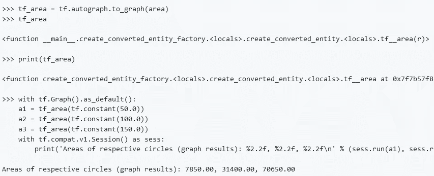

# TensorFlow 2.0: tf.function 和亲笔签名

> 原文：<https://towardsdatascience.com/tensorflow-2-0-tf-function-and-autograph-af2b974cf4f7?source=collection_archive---------8----------------------->

随着 TensorFlow (TF) 2.0 的出现，`tf.function`的引入为 TF 1.0 带来了一些有用的改进，最显著的是 AutoGraph 的引入。



# TensorFlow 是如何工作的？

基本上，TensorFlow 通过计算图运行，即节点图用于表示一系列 TensorFlow 操作。

然而，编译张量流图可能是一个繁琐的过程，因为语法结构与 Python 明显不同，并且图代码比简单的 Python 结构使用更多的资源。

AutoGraph 的目的是通过把用 Python 的经典语法结构编写的代码转换成 TensorFlow 图兼容代码来图形化代码。这使得使用 Python 和 TensorFlow 更加直观，因为它简化了从 Python 代码到图形代码的转换。

更重要的是，`tf.function`允许直观地使用急切执行和自动签名，从而可以使用 Python 语法运行一个函数，然后转换成等价的图形代码。

我们举个例子。

# 急切执行:循环函数的区域

这是一个计算圆面积的 Python 函数。在 TF 2.0 中默认开启急切执行，值 **r** (圆的半径)被定义为`tf.Variable`。

```
>>> import tensorflow as tf
>>> tf.executing_eagerly()
>>> r = tf.Variable(10.0, name="r")>>> def area(r):
>>>     circle=3.14*(r**2.00)
>>>     return circle>>> area(10)314.0>>> print('Areas of respective circles: %2.2f, %2.2f, %2.2f' % (area(tf.constant(50.0)), area(tf.constant(100.0)), area(tf.constant(150.0))))Areas of respective circles: 7850.00, 31400.00, 70650.00
```

# 用 tf 签名。会议

现在，假设有人希望使用 AutoGraph 实现这个代码。使用 TF 1.0 约定，这可能是使用`tf.Session`实现的。以前，图形必须在会话中显式启动才能运行。

```
>>> r = tf.Variable(10.0, name="r")>>> def area(r):
>>>     circle=3.14*(r**2.00)
>>>     return circle>>> print(tf.autograph.to_code(area))def tf__area(r):
  do_return = False
  retval_ = ag__.UndefinedReturnValue()
  circle = 3.14 * r ** 2.0
  do_return = True
  retval_ = circle
  cond = ag__.is_undefined_return(retval_) def get_state():
    return () def set_state(_):
    pass def if_true():
    retval_ = None
    return retval_ def if_false():
    return retval_
  retval_ = ag__.if_stmt(cond, if_true, if_false, get_state, set_state)
  return retval_
```

这是一个图形格式的代码示例。

```
>>> tf_area = tf.autograph.to_graph(area)
>>> tf_area<function __main__.create_converted_entity_factory.<locals>.create_converted_entity.<locals>.tf__area(r)>>>> print(tf_area)<function create_converted_entity_factory.<locals>.create_converted_entity.<locals>.tf__area at 0x7f7b57f8a620>>>> with tf.Graph().as_default():
    a1 = tf_area(tf.constant(50.0))
    a2 = tf_area(tf.constant(100.0))
    a3 = tf_area(tf.constant(150.0))
    with tf.compat.v1.Session() as sess:
        print('Areas of respective circles (graph results): %2.2f, %2.2f, %2.2f\n' % (sess.run(a1), sess.run(a2), sess.run(a3)))Areas of respective circles (graph results): 7850.00, 31400.00, 70650.00
```

使用[会话](https://stackoverflow.com/questions/43530309/what-is-a-tensorflow-session-actually)意味着上面计算的圆的面积值将只在会话本身内计算。

# 使用 tf.function 自动签名

让我们看看如何使用`tf.function`来实现这一点。

```
>>> r = tf.Variable(10.0, name="r")>>> @tf.function
>>> def area(r):
>>>     circle=3.14*(r**2.00)
>>>     return circle>>> print(tf.autograph.to_code(area.python_function))def tf__area(r):
  do_return = False
  retval_ = ag__.UndefinedReturnValue()
  circle = 3.14 * r ** 2.0
  do_return = True
  retval_ = circle
  cond = ag__.is_undefined_return(retval_) def get_state():
    return () def set_state(_):
    pass def if_true():
    retval_ = None
    return retval_ def if_false():
    return retval_
  retval_ = ag__.if_stmt(cond, if_true, if_false, get_state, set_state)
  return retval_>>> area(60)<tf.Tensor: id=13, shape=(), dtype=float32, numpy=11304.0>>>> print(area(tf.constant(50.00)), area(tf.constant(100.0)), area(tf.constant(150.0)))tf.Tensor(7850.0005, shape=(), dtype=float32) tf.Tensor(31400.002, shape=(), dtype=float32) tf.Tensor(70650.0, shape=(), dtype=float32)
```

从上面可以看出，计算面积值不需要会话。而是用`tf.function`指定可以直接转换为 AutoGraph 的函数，然后面积值计算为张量。

# 结论

在这个例子中，我们看到了 TF 2.0 如何通过使用`tf.function`和 AutoGraph 来简化 TensorFlow 中的函数实现。非常感谢您的时间，您还可以在 michael-grogan.com[找到更多使用 TensorFlow 和 Keras 的机器学习示例。](https://www.michael-grogan.com/)

*免责声明:本文是在“原样”的基础上编写的，没有任何担保。本文旨在提供数据科学概念的概述，不应以任何方式解释为专业建议。*