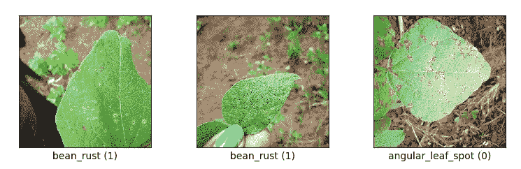

# TensorFlow 2.2+和自定义培训逻辑

> 原文：<https://towardsdatascience.com/tensorflow-2-2-and-a-custom-training-logic-16fa72934ac3?source=collection_archive---------37----------------------->

## 最近的 TensorFlow 版本引入了 tf.keras.Model 的新方法 train_step 和 **test_step** ，极大地改进了我们处理自定义训练循环的方式。我会告诉你怎么做。

来源:pexels.com

大家都熟悉标准模型——一个输入、一个输出、一个损失函数。也许还有几个指标。你可以用[顺序](https://www.tensorflow.org/api_docs/python/tf/keras/Sequential)或[功能](https://www.tensorflow.org/guide/keras/functional)的方式定义模型，编译并训练它。

有时候，会有[多个输入](https://www.tensorflow.org/guide/keras/functional#models_with_multiple_inputs_and_outputs)。或[多路输出](https://www.tensorflow.org/guide/keras/functional#models_with_multiple_inputs_and_outputs)。这仍然可以用这些 API 来实现。假设输出是“独立的”——损失函数(一个用于所有输出或一个用于每个输出)分别对每个输出起作用。

有时候，我们需要更进一步。也许损失是从更多的输出中计算出来的。或者有一些用于计算损失的附加信息。这是必须实现定制训练循环的时候。

在这篇博文中，我不会涉及这样的具体用例。相反，我将向您展示一个简化的示例，说明如何训练它的三种方式。稍后，我将继续一个更复杂的例子。敬请关注！

# 示例问题

即使在教程里，我也喜欢可运行的代码，甚至现实世界的问题。因此，让我们以 TensorFlow 数据集之一—[bean](https://www.tensorflow.org/datasets/catalog/beans)为例。

> Beans 是一个使用智能手机相机在田间拍摄的豆子图像数据集。它包括 3 个类别:2 个疾病类别和健康类别。描述的疾病包括角斑病和豆锈病。乌干达国家作物资源研究所的专家对数据进行了注释，数据由 Makerere AI 研究实验室收集。

它相当小(171.63 MiB，1295 张图片)，使我们能够快速训练我们的模型。即使经过少量的时期，结果看起来也是有希望的。

来自 beans 数据集的示例图像和标签，来源[tensorflow.org](https://www.tensorflow.org/datasets/catalog/beans)

[这里](https://gist.github.com/liborvaneksw/60597e7f473a739e439b589e8dea295f)是后面三章的通用代码，主要包含数据集的准备和训练设置。这与我们的主题没有直接联系，我不想让文章太长，所以如果你愿意，请查看随附的[要点](https://gist.github.com/liborvaneksw/60597e7f473a739e439b589e8dea295f)。

# 标准编译和拟合方法

这就是如何定义和训练一个简单的转移模型。没什么神秘的，但为了完整起见我会在这里展示一下。

像往常一样训练。关于导入、参数和数据集定义，参见[该代码](https://gist.github.com/liborvaneksw/60597e7f473a739e439b589e8dea295f)。

我使用了 [MobileNet](https://www.tensorflow.org/api_docs/python/tf/keras/applications/MobileNetV2) 和几个附加层。[globalaveragepool2d](https://www.tensorflow.org/api_docs/python/tf/keras/layers/GlobalAveragePooling2D)将要素转换为单个矢量，该矢量可用于最终的密集图层。中间我用了[辍学](https://www.tensorflow.org/api_docs/python/tf/keras/layers/Dropout)。请记住，数据集非常小，我们必须小心过度拟合。剩下的就简单了。

# 用老方法定制训练逻辑

自定义训练循环的详细描述可在[官方文档](https://www.tensorflow.org/tutorials/customization/custom_training_walkthrough)中找到。如果我们将这一点转化为上一段中的问题，我们会得到以下代码:

自定义训练循环。关于导入、参数和数据集定义，参见[该代码](https://gist.github.com/liborvaneksw/60597e7f473a739e439b589e8dea295f)。

你看到所有的代码，只是关心跟踪损失和准确性？现在假设您有多个指标和几个回调，例如包括 TensorBoard。你想要更好的输出。代码开始越来越多的扩展。

# 未来:train_step()和 test_step()

从 TensorFlow 2.2 开始，不再需要所有这些锅炉板代码。你只需要告诉 TensorFlow 每个单独的训练步骤(可能还有测试步骤)将会是什么样子。其余的在 [tf.keras.Model](https://www.tensorflow.org/api_docs/python/tf/keras/Model) 类中完成。我们就不拐弯抹角了，下面是代码:

使用 train_step()和 test step()的示例。关于导入、参数和数据集定义，参见[该代码](https://gist.github.com/liborvaneksw/60597e7f473a739e439b589e8dea295f)。

我想指出两件事:

*   输入的格式通常是 **x，y** 和可选的**样品重量**。您不需要在子类中遵守这一点。不过要小心，这是有后果的。很明显，您不能再使用 fit 方法的`class_weight`参数。即使您只向这三个参数添加了额外参数，也是如此。
*   您可以使用已编译的 loss(损失)、metrics 和 optimizer。我建议你尽可能经常这样做。但是通常，当这些还不够时，您会覆盖这个方法。所以不要害怕从一个`compile`方法中去掉一些，定义你自己的或者完全离开`compile()`。

## 没有编译的优化器、损失和指标

那么当你不考虑`compile()`的时候会发生什么呢？您仍然需要添加一些代码。但是请注意与完全定制的训练循环的巨大差异。您现在正在指定一个步骤的行为。因此，父模型类可以负责所有的支持功能。例如打印漂亮的进度条或者调用所有的回调函数。(它们可以以通常的方式作为参数提供给`fit`方法。)

我试图将所有重要的注释写入代码本身。因此，我在此仅补充一点。可以省略`metric()`属性，直接返回`train_step()`和`test_step()`中的 *name: (float) value* 对。进度输出将是正常的，你会看到一个平均值。但不是在你的试镜中。在那里，您将获得与您返回的值完全相同的值。

# 最后的想法

在这篇博文中，我向您介绍了在 TensorFlow 中训练模型的不同方法，包括覆盖 Keras 模型的新方法`train_step` 和`test_step`。这个例子使用起来太简单了。但我希望它能达到演示不同方法的目的，而不需要解释复杂的模型。我想做的比一些即将到来的文章。

如果你觉得这有用，请给我留言。如果你有任何问题，请随时这样做。我很乐意回答你。