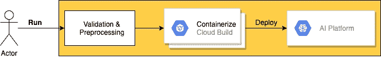
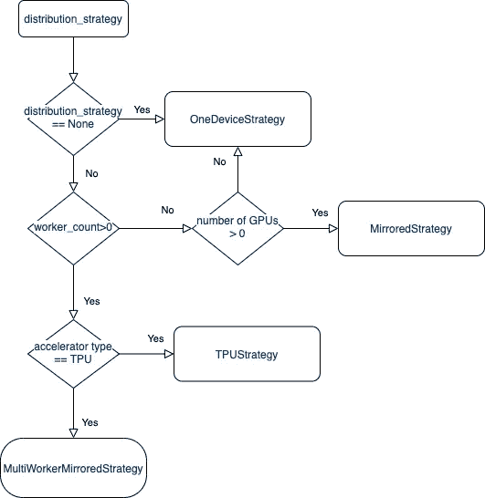
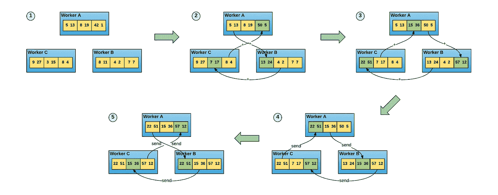
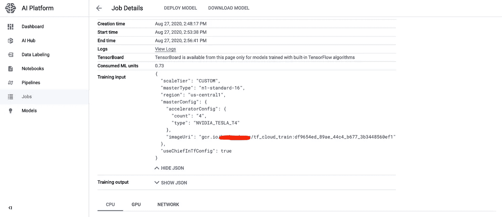
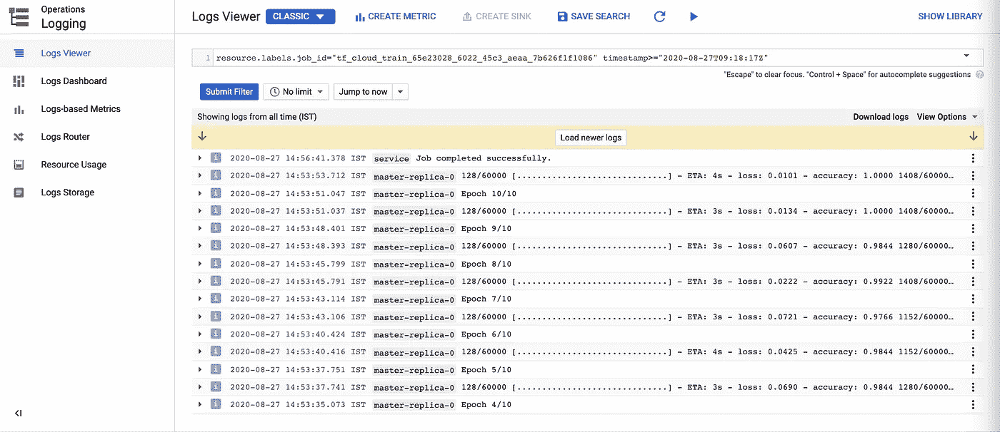

# 张量流云:从本地到分布式

> 原文：<https://towardsdatascience.com/tensorflow-cloud-local-to-distributed-286e3665302f?source=collection_archive---------53----------------------->

[TensorFlow Cloud](https://github.com/tensorflow/cloud) 是一个 python 包，用于使用 Google AI 平台从本地调试无缝过渡到云中的分布式训练。TensorFlow Cloud 有**在谷歌云平台(GCP)上运行** API 用于训练模型，有 **tuner** 用于超参数调优。它通过一个**单一功能调用**简化了云上的训练模型，并处理所有特定于云的任务，如 VM 实例创建和选择分发策略[1]。

调用后的 **run** API 将验证和预处理 python 脚本或笔记本，使用云构建或本地 docker 守护进程将其容器化，并将训练作业部署到 AI 平台。可以将相关日志流式传输到日志记录，并使用托管 TensorBoard 监控培训。



**运行 API** 高层流程

```
**run**(entry_point=None,
    requirements_txt=None,
    distribution_strategy='auto',
    docker_base_image=None,
    chief_config='auto',
    worker_config='auto',
    worker_count=0,
    entry_point_args=None,
    stream_logs=False,
    docker_image_bucket_name=None,
    job_labels=None,
    **kwargs)
```

运行 API 有以下重要参数，这些参数有助于将代码从本地迁移到 AI 平台。[2]

*   **entry_point:** 可选字符串**、** python 脚本或包含训练代码的笔记本。如果未提供 entry_point，则当前 python 脚本或笔记本将被用作 entry_point。例如 train.py 或 train.ipynb
*   **requirements_txt:** 可选字符串**，**附加必需库列表。
*   **distribution_strategy:** 自动或无，默认为自动，将根据主管配置、员工配置和员工人数选择分配策略。
*   **chief_config:** 分布式集群中主要工作者的机器配置。默认:T4_1X
*   **worker_config:** 分布式集群中工作者的机器配置。默认:T4_1X
*   **worker_count:** 分布式集群中的工作线程数。默认值:0
*   **entry _ point _ args:**entry _ point 脚本或笔记本的可选参数。默认值:无
*   **stream_logs:** 来自 AI 平台的流日志的布尔标志。
*   **docker _ image _ bucket _ name:**可选字符串，指定 docker image 云存储桶名。如果设置了该参数，docker 容器化使用[**Google Cloud Build**](https://cloud.google.com/cloud-build)完成，否则使用本地 docker 守护进程。



TensorFlow 云培训分发策略

# 分销策略

运行 API 支持自动和自定义分发策略，上面的流程图显示了自动选择分发策略。所有分布策略都遵循数据并行性，其中模型变量跨设备复制，并使用 all-reduce 策略进行同步。

下图显示了“*all reduce 策略(ring all-reduce)的一种可能实现，其中 N 个节点中的每个节点与其两个对等节点通信 2*(N-1)次。在此通信期间，节点发送和接收数据缓冲区的块。在前 N-1 次迭代中，接收到的值被添加到节点缓冲区中的值。在第二个 N-1 次迭代中，接收到的值替换保存在节点缓冲区中的值。* [ [5](https://eng.uber.com/horovod/)



环环全减策略:图片来自[优步·霍罗沃德](https://eng.uber.com/horovod/)

**一种设备策略:**无分布式训练，这种策略的典型用途可能是训练代码验证。

**镜像策略:**变量在所有设备上复制，并使用 all-reduce 策略保持同步。如果在策略的构造器参数中没有指定设备，那么它将使用所有可用的 GPU。如果没有找到 GPU，它将使用可用的 CPU。

**多工作者镜像策略:**类似于镜像策略，在所有工作者的每个设备上创建模型中所有变量的副本，并使用 CollectiveOps 的多工作者 all-reduce 实现来保持变量同步。

# 工作示例

让我们看一个工作示例，通过在 MNIST 数据集上定义一个简单的用于数字分类的 Keras 模型训练代码，保存为 **toy_mnist.py [2]**

```
import tensorflow as tf(x_train, y_train), (_, _) = tf.keras.datasets.mnist.load_data()x_train = x_train.reshape((60000, 28 * 28))
x_train = x_train.astype('float32') / 255model = tf.keras.Sequential([
  tf.keras.layers.Dense(512, activation='relu', input_shape=(28 * 28,)),
  tf.keras.layers.Dropout(0.2),
  tf.keras.layers.Dense(10, activation='softmax')
])model.compile(loss='sparse_categorical_crossentropy',
              optimizer=tf.keras.optimizers.Adam(),
              metrics=['accuracy'])model.fit(x_train, y_train, epochs=10, batch_size=128)
```

上面的模型可以通过编写下面的简单脚本在云上运行。

```
import tensorflow_cloud as tfc
tfc.run(entry_point='**toy_mnist.py**', chief_config=tfc.COMMON_MACHINE_CONFIGS['T4_4X'])
```

当我们运行上面的脚本时，用 chief_config 作为 T4_4X 机器，没有创建 worker，因为 worker_count 默认为 0，并且低于自动生成的代码以及其他参数，如 chief_config、worker_config，docker registry 被部署到 AI 平台，并且由于 chief config 的加速器数量> 0**T4 _ 4X**，选择了**TF . distribute . mirroredstrategy**。用于分发策略的 TensorFlow 使用[NCCL](https://docs.nvidia.com/deeplearning/nccl/)(Nvidia Collective communication s Library)作为 GPU 的跨设备通信，并使用 tf.distribute.NcclAllReduce 作为镜像策略。

```
import os
import tensorflow as tf
os.environ["TF_KERAS_RUNNING_REMOTELY"]="1"
**strategy = tf.distribute.MirroredStrategy()**
tf.distribute.experimental_set_strategy(strategy)
exec(open("toy_mnist.py").read())
```

下图显示了提交到 AI 平台的作业。



提交的工作细节，谷歌人工智能平台

训练日志和详细信息在堆栈驱动程序日志中提供，如下图所示，也可以通过在 run API 调用中将 stream_logs 设置为 True 来传输到主机。



显示每个历元的交叉熵损失、精确度的日志

还可以使用`**tf.keras.models.save_model**`将模型保存到 Google 云存储桶，使用`[**gcloud ai-platform predict**](https://cloud.google.com/sdk/gcloud/reference/ai-platform/predict)`将模型部署到 AI 平台进行在线推理。

关于设置 TensorFlow、TensorFlow-Cloud 和云配置(创建项目和启用 AI 平台等)，请参考参考资料[ [3](https://github.com/tensorflow/cloud#setup-instructions) ]。

# 参考

1.  [https://www . tensor flow . org/guide/keras/training _ keras _ models _ on _ cloud](https://www.tensorflow.org/guide/keras/training_keras_models_on_cloud)
2.  [https://github.com/tensorflow/cloud](https://github.com/tensorflow/cloud)
3.  [https://github.com/tensorflow/cloud#setup-instructions](https://github.com/tensorflow/cloud#setup-instructions)
4.  [https://www.tensorflow.org/api_docs/python/tf/distribute](https://www.tensorflow.org/api_docs/python/tf/distribute)
5.  [https://eng.uber.com/horovod/](https://eng.uber.com/horovod/)