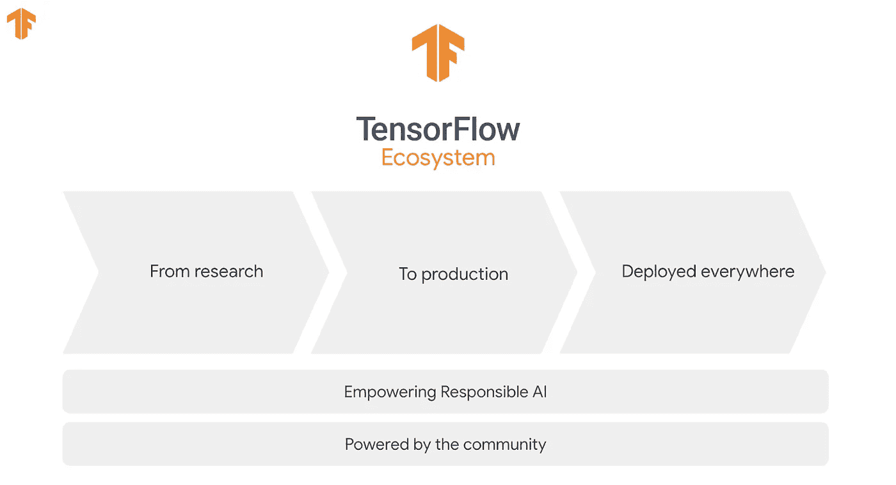
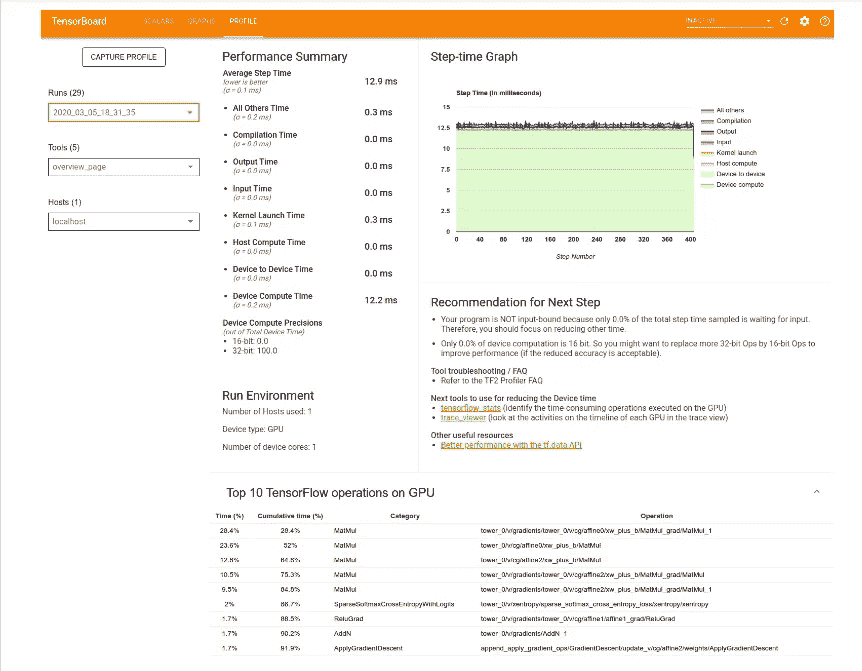
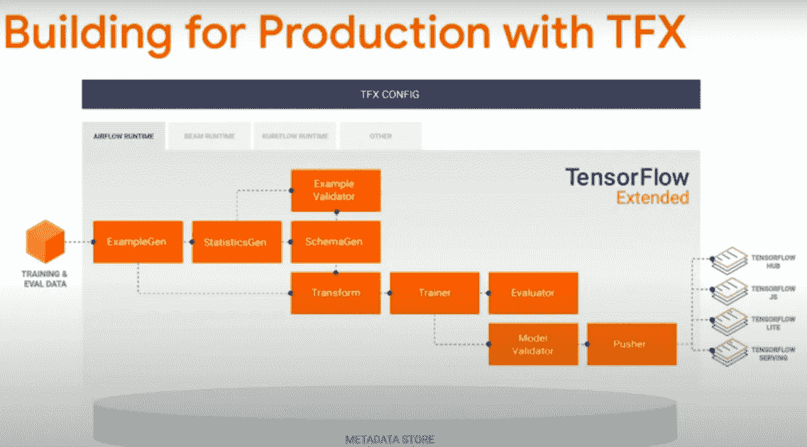
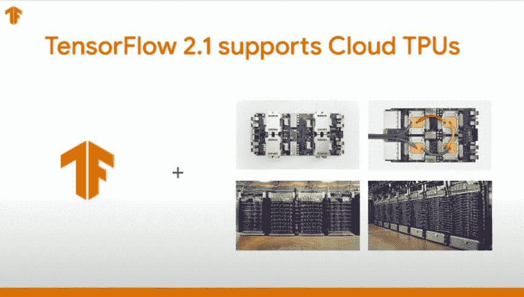

# TensorFlow 开发峰会 2020 倒带

> 原文：<https://towardsdatascience.com/tensorflow-dev-summit-2020-rewind-f21b35763c?source=collection_archive---------58----------------------->

作为 4 年一度的 TensorFlow 开发者，Summit 2020 发生在三月。因此，这篇文章旨在让这个美妙的人工智能社区的所有工程师、开发人员、计算机科学家和数据科学家了解在那次峰会上做出的最新更新和公告。

截图来自[开发者峰会 2020](https://www.youtube.com/watch?v=HlBGYxO8RaU) YouTube 视频[( CC BY 4.0)]，部分由作者通过 Canva 创作。

# “我们选择去月球”

让我带你回到 1962 年 9 月 12 日，美国第 35 任总统[约翰·肯尼迪](https://en.wikipedia.org/wiki/John_F._Kennedy)“我们选择去月球”在莱斯大学的演讲。肯尼迪说。“我们选择在这十年登上月球并做其他事情，不是因为它们容易，而是因为它们很难。”

嗯，我认为 TensorFlow 工程团队将这个演讲放在了心上，在收到来自整个社区的大量反馈后，他们开始致力于解决这个难题，即让 TensorFlow 对世界上基本了解计算机工作原理的每个人或那些能够利用 tensor flow platform 等超能力并使世界变得更美好的人来说尽可能简单。

在这方面，TensorFlow 团队去年实现了一个重要的里程碑，推出了 [TensorFlow 2.0](https://www.youtube.com/watch?v=k5c-vg4rjBw) ，这使他们朝着打造易于使用的端到端"**一体式**"平台的目标又迈进了一步。

# 建立势头:

由作者使用 [Canva](https://www.canva.com/) 和 [Icon8](https://icons8.com/) 创建

TensorFlow 2.0 推出时具有以下特性:

1.  简化 API
2.  默认情况下，使用 [Keras](http://keras.io/) 和 [Eager execution](https://www.tensorflow.org/guide/eager) 轻松构建模型。
3.  支持将模型部署到更多设备上(例如 [Raspberry Pi](https://www.raspberrypi.org/) )。
4.  强大的研究实验(如 [Tensorboard.dev](https://tensorboard.dev/) )。

因此，在去年发布的 2.0 版本的基础上，TensorFlow 团队发布了最新版本的 TensorFlow 2.2，其增强功能包括:

1.  与上一版本相比，性能有所提高。
2.  与 TF 生态系统其余部分的兼容性。

因此，所有那些在迁移到 2.0 时遇到困难的用户，不用担心，因为 TF 团队现在已经使整个系统与你最喜欢的库兼容了。简而言之，适用于 1.x 的也适用于 2.x。

3.最后，任何软件都是根据可伸缩性和稳定性来判断的。显然，TF 团队提交了核心库，这证实了他们不会很快做出任何重大改变。因此，核心库更加稳定。

# 张量流生态系统

截图自[开发者峰会 2020](https://www.youtube.com/watch?v=HlBGYxO8RaU) YouTube 视频[( CC BY 4.0)]

自从拥有 6000 万参数的 [Alexnet](https://papers.nips.cc/paper/4824-imagenet-classification-with-deep-convolutional-neural-networks.pdf) 通过赢得[ImageNet challenge ils vrc 2012](http://www.image-net.org/challenges/LSVRC/)而普及深度卷积神经网络以来，总的趋势是制造更深更复杂的网络，以实现更高的精度。

同样，为了提高我们对 TensorFlow 2.x 理解的准确性，我们也需要更深入地挖掘。

# A.研究用张量流

TensorFlow 中存在大量的库和扩展，如 [JAX](https://github.com/google/jax) 、 [TF 概率](https://www.tensorflow.org/probability)和[张量流量子](https://www.tensorflow.org/quantum)，这加强了对 ML 世界的研究。与其他平台相比，研究人员更喜欢 TensorFlow，因为它具有新的可扩展性，允许在核心执行，并保持类似于 [NumPy](https://numpy.org/) ，非常 Python 化，并易于与 Python 生态系统的其余部分集成。

然而，在本节中，我将简要地谈谈我最喜欢的一个特性，即引入了一个名为[性能分析器](https://www.tensorflow.org/guide/profiler)的新工具。

来自 TensorFlow ( CC BY 4.0)中“使用分析器优化 TensorFlow 性能”指南部分的截图

TensorBoard 中的这个新工具将在两个方面帮助研究人员:

1.  它将在主机(CPU)、设备(GPU)或主机和设备的组合上针对 TF 模型中的各种张量流运算(ops)持续监控 TF 模型性能。
2.  它将为研究人员提供深入的调试指导，最终有助于解决性能瓶颈。

最终结果:它将使模型执行得更快。[对每个人都是双赢]

# B.生产张量流

[TensorFlow](https://www.tensorflow.org/) 不仅是研究团体的首选，也是医疗保健和汽车等各行业领域无可争议的选择。由于 TensorFlow 为研究人员提供了尽快测试一些新想法的能力，类似地，它也使实业家或生产工程师能够采纳他们的想法，并通过使培训到部署阶段变得无障碍来创造现实世界的影响。

因此，让我们了解更多关于 TensorFlow 2.x 更新和库的信息，以实现我们的端到端 ML 目标。

截图自[开发者峰会 2020](https://www.youtube.com/watch?v=HlBGYxO8RaU) YouTube 视频[( CC BY 4.0)]

## TensorFlow 和 Keras 的婚姻万岁

使用 Canva 创建图像，图像元素包括来自[【pngriver.com】]、TensorFlow 和 Keras 站点(CC BY 4.0)的来源

包括我在内的整个人工智能界都喜欢使用 [Keras](https://keras.io/) ，因为它易于使用，甚至允许它的用户非常快速地构建和训练定制模型，这就是为什么 TensorFlow 团队考虑到我们的需求，致力于将 **tf.keras** 作为默认的高级 API。

## TensorFlow Hub:转移学习爱好者的工具

如果在日常工作中，你从事各种与计算机视觉相关的应用，并且希望在这方面取得更快的进展，你或多或少会使用迁移学习。

(对于非人工智能观众)嗯，[迁移学习](https://cs231n.github.io/transfer-learning/)只不过是一种方法，你可以从公开可用的数据集( [MS-COCO](http://cocodataset.org/#home) ， [ImageNet](http://www.image-net.org/) )下载开源权重，这是其他人花了很多周、几个月才弄明白的，并将其用作对你自己的[神经网络](https://www.youtube.com/watch?v=aircAruvnKk)的非常好的初始化【而不是随机初始化】，以将这些大型公共数据集的知识转移到你自己的问题中。

截图来自 [TensorFlow](https://www.tensorflow.org/hub) 网站(CC BY 4.0)

因此，现在根据最近的公告，在 [TF Hub](https://www.tensorflow.org/hub) 中有超过 1000 个模型，文档、代码片段、演示和交互式 [Google Colab](https://www.youtube.com/watch?v=inN8seMm7UI) 都在等待使用。

## TensorFlow Extended (TFX):一个端到端的 ML 平台

截图自[开发者峰会 2020](https://www.youtube.com/watch?v=HlBGYxO8RaU) YouTube 视频[( CC BY 4.0)]

根据最近的更新，一旦您准备好将您的模型投入生产。 [TensorFlow Extended](https://www.tensorflow.org/tfx) 现在将允许您为您的可扩展、高性能机器学习任务构建生产就绪的[端到端] ML 管道。

## TensorFlow 2.1 支持云 TPU

截图自[开发者峰会 2020](https://www.youtube.com/watch?v=HlBGYxO8RaU) YouTube 视频[( CC BY 4.0)]

这次更新是特别为 TPU 的情人们准备的。现在，你可以在专门为人工智能工作流设计的定制硬件上训练和部署你的模型和管道，比如 TPU 的。在最新版本中，TensorFlow 已经使用 Keras 针对[云 TPU](https://cloud.google.com/tpu) 进行了优化，这意味着您开始使用的相同 API 将帮助您扩展到 TPU 计算的[千万亿次浮点运算](https://en.wikipedia.org/wiki/FLOPS)，这将足以[转变您的业务或创造下一个研究突破](https://cloud.google.com/tpu)。

## 结束了

好了，伙计们，现在我们已经到了这篇文章的结尾。我知道，通过这篇文章，我只能对 [TensorFlow Dev Summit 2020](https://www.youtube.com/watch?v=HlBGYxO8RaU) 上发布的公告和更新略知一二。

因此，请访问此[链接](https://www.youtube.com/playlist?list=PLQY2H8rRoyvzuJw20FG82Lgm2SZjTdIXU)观看 TensorFlow Dev Summit 2020 的所有会议。

**感谢您的关注**

[亲教会媒体](https://unsplash.com/@prochurchmedia?utm_source=unsplash&utm_medium=referral&utm_content=creditCopyText)在 [Unsplash](https://unsplash.com/s/photos/filled-with-gratitude?utm_source=unsplash&utm_medium=referral&utm_content=creditCopyText) 上拍摄的照片

你利用你的时间阅读我的《T21》作品对我来说意味着整个世界。我完全是这个意思。

此外，如果你愿意，可以在 Medium、LinkedIn 或 Twitter 上关注我！我很乐意。

 [## 纳文·曼瓦尼—中等

### 阅读纳文·曼瓦尼在媒介上的作品。一个机器学习工程师，一个深度学习爱好者|谷歌印度…

medium.com](https://medium.com/@naveenmanwani)  [## Naveen Manwani 机器学习工程师 AIMonk Labs Private Ltd | LinkedIn

### 查看纳文·曼瓦尼在全球最大的职业社区 LinkedIn 上的个人资料。Naveen 有一份工作列在他们的…

www.linkedin.com](https://www.linkedin.com/in/naveen-manwani-65491678/)  [## 纳文·曼瓦尼

### 纳文·曼瓦尼的最新推文(@纳文·曼瓦尼 17)。机器学习工程师@ AIMONK Labs Pvt ltd，深…

twitter.com](https://twitter.com/NaveenManwani17)