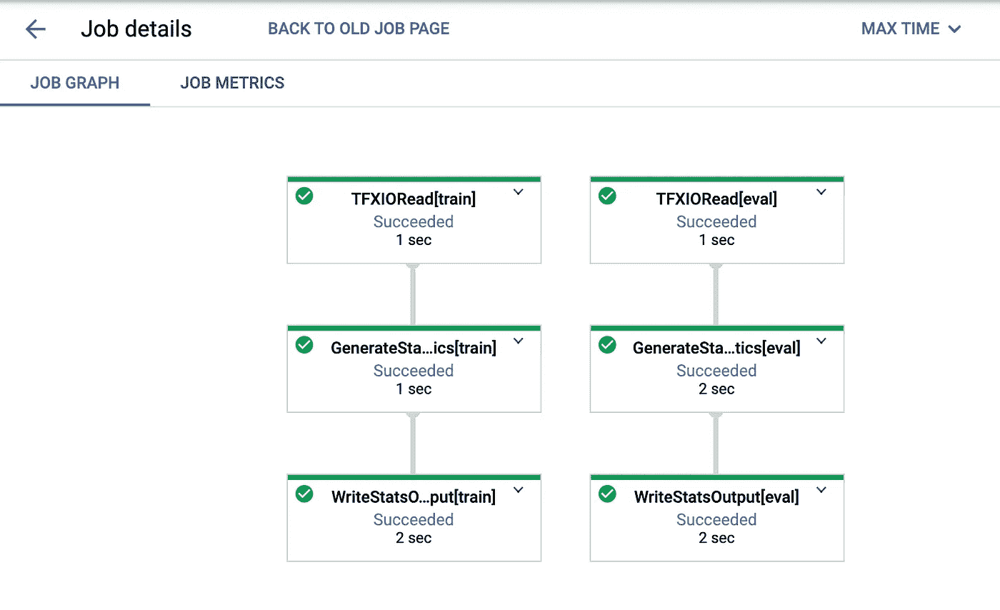
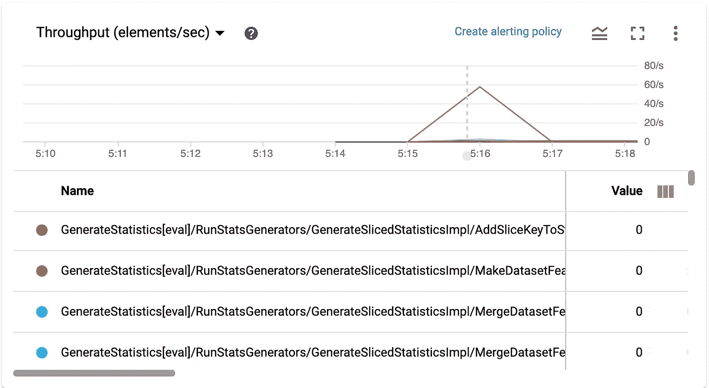
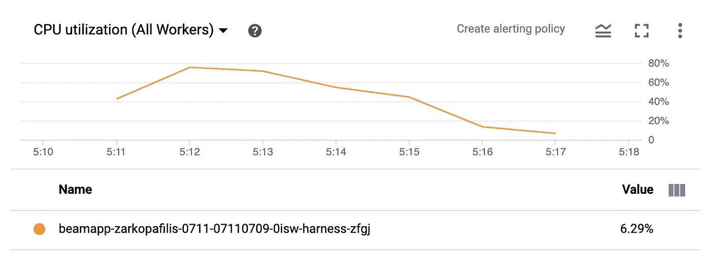
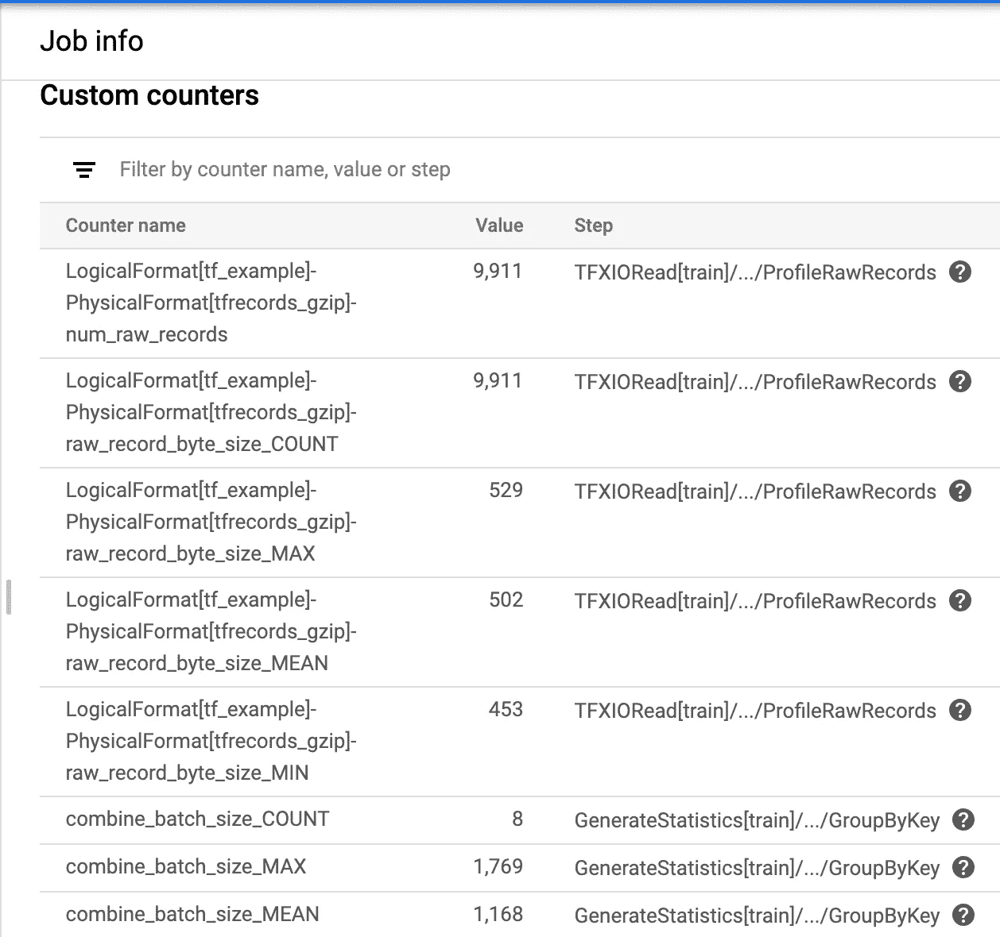
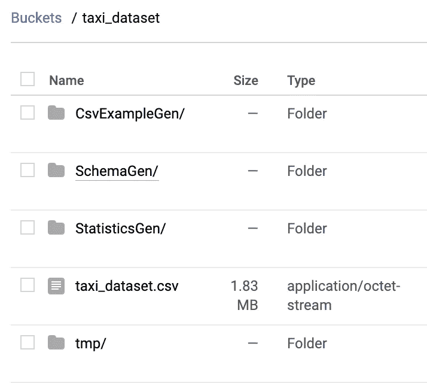
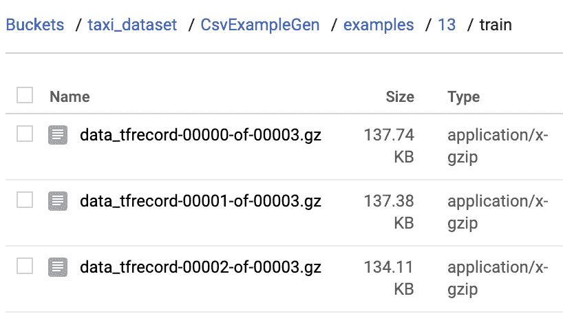

# 云上的 Tensorflow 扩展、ML 元数据和 Apache Beam

> 原文：<https://towardsdatascience.com/tensorflow-extended-ml-metadata-and-apache-beam-on-the-cloud-2e4fce035f69?source=collection_archive---------47----------------------->

## 一个使用 GCP 数据流的实用且独立的示例

tensorflow extended 通过运行`tfx template copy taxi $target-dir` **提供的完整端到端示例产生了分散在 5 个目录中的 17 个文件。**如果你正在寻找一个**更小、更简单、自包含的例子**，它实际上运行在云上，而不是本地，这就是你正在寻找的。这里还提到了云服务的设置。

图片来自 pexels.com

## 会涵盖哪些内容

我们将为 Chicago taxi trips csv 数据集生成统计数据和模式，您可以通过运行`data`目录下的`tfx template copy taxi`命令找到该数据集。

通过连接到 ML 元数据存储，或者只是从简单的文件/二进制存储中下载工件，可以从 jupyter 笔记本中查看生成的工件，比如数据统计或模式。

*文章底部的完整代码示例*

## 使用的服务

*   [数据流](https://cloud.google.com/dataflow)作为 [Apache Beam 管道](https://beam.apache.org/)运行服务
*   [存储桶](https://cloud.google.com/storage/docs/json_api/v1/buckets)作为简单(但快速)的二进制和文件存储服务
*   (可选，但回报递减)[云 SQL](https://cloud.google.com/sql) (MySQL)作为 [ML 元数据](https://www.tensorflow.org/tfx/guide/mlmd)的后备存储服务

> 整个管道可以在您的本地机器上运行([或者在不同的云提供商/您的定制 spark 集群上运行](https://beam.apache.org/documentation/runners/capability-matrix/))。这是一个可以通过使用更大的数据集来扩展的例子。如果你希望明白这是如何透明地发生的，[阅读这篇文章](https://medium.com/swlh/understanding-ml-in-production-preprocessing-data-at-scale-with-tensorflow-transform-90aefc26e98f?source=friends_link&sk=9734448bfe53fa051e230070c0744e72)。

## 执行过程

1.  如果在本地运行，代码将不会被序列化或发送到云中(当然)。否则，Beam 将把所有东西发送到一个**中转**位置(通常是铲斗存储)。查看 cloudpickle，直观了解电子监管是如何完成的。
2.  您选择的云运行服务(我们的是数据流)将检查所有提到的资源是否存在并且可访问(例如，管道输出、临时文件存储等)
3.  计算实例将被启动，您的管道将在分布式场景中执行，当它仍在运行或完成时，它将显示在作业检查器中。

> 将`/temp`或`/tmp`用于临时文件，将`/staging`或`/binaries`用于暂存目录是一个很好的命名实践。

## TFX 管道

Tensorflow Extended 提供了围绕普通旧梁组件的自定义组件包装器。它们在形式上更加联合:工件只是被生产和消费。这意味着它们不会每次都传输所有的数据集，它们只是传递资源定位器字符串。由于分析预处理速度的原因，您的数据集被流式传输，然后以小块的形式保存为`tfrecords`,以获得最佳性能，充分利用存储桶的快速存储技术。

这就是为什么当你[声明定制组件](https://www.tensorflow.org/tfx/guide/custom_component)时，你声明了强类型输入和输出通道(工件类型和名称)，它们被映射到[光束侧](https://beam.apache.org/documentation/programming-guide/#output-tags)的多个标记输入-输出。你用一个`Dict`返回这些。请随意查看默认 TFX 组件的源代码，以获得关于这些组件的更多信息

这就是为什么你需要做这样的事情:

`example_gen = CsvExampleGen(...)`

`statistics_gen = StatisticsGen(**examples=example_gen.outputs['examples']**)`

你需要了解的另一个 TFX 抽象是 **tfx.orchestration.pipeline。通过提供一组组件来形成管道 DAG，管道根数据源(文件系统或桶)和一个可选的元数据存储库(T17)，您将控制权移交给 TFX 的`BeamDagRunner`。所支持的射束管道执行参数是平台不可知的。[以下是数据流的，供参考。](https://cloud.google.com/dataflow/docs/guides/specifying-exec-params)**

> 对于它所做的所有事情，我们的管道创建是非常小的

> 您可以使用带有通配符的模式一次读取多个文件。

这里是我们的**数据流执行参数:**

## 云服务设置

我们不需要太多就能运行。只是一个存储桶，要启用的数据流服务，如果你选择使用 ml 元数据，一个云 sql 实例。

1.  [登录谷歌云控制台](https://console.cloud.google.com/)
2.  [创建一个存储桶](https://cloud.google.com/storage/docs/creating-buckets)
3.  启用数据流 API
4.  [可选] [创建一个云 SQL MySQL 实例](https://cloud.google.com/sql/docs/mysql/create-manage-databases)用于 ML 元数据
5.  创建服务帐户，应用正确的权限(云存储桶项目创建、删除、sql 访问)。

不要用自己的个人账号进行云操作。将一些凭证密钥导出为`.json`文件，以便与`GOOGLE_APPLICATION_CREDENTIALS` [环境变量一起使用，这样您就有足够的权限将管道部署到数据流。](https://cloud.google.com/docs/authentication/getting-started) **确保您的服务帐户** [**拥有足够的角色**](https://cloud.google.com/iam/docs/understanding-roles) **来创建新的数据流作业，对云 SQL 实例进行读写，对桶存储进行读写。**

6.确保服务可以相互通信(通常在第一次运行管道时进行故障诊断)

> 如果您的管道使用的不止是 tensorflow 扩展组件，请在 `[setup.py](https://beam.apache.org/documentation/sdks/python-pipeline-dependencies/)` [文件下包含设置](https://beam.apache.org/documentation/sdks/python-pipeline-dependencies/)[运行环境所需的任何内容。更多信息请点击这里。](https://beam.apache.org/documentation/sdks/python-pipeline-dependencies/)

## 在云上运行管道并查看结果

> 你可能会得到`UserWarning: RuntimeParameter is only supported on KubeflowDagRunner currently.
> warnings.warn(‘RuntimeParameter is only supported on KubeflowDagRunner ‘`。现在可以随意忽略这个警告。只有参数化的流水线(模板)才可以用不同的配置运行。您通常将它们存放在存储服务中，并通过 post http 请求作业提交来运行它们。[点击此处了解更多信息。](https://cloud.google.com/dataflow/docs/guides/templates/creating-templates#python)

我们用`BeamDagRunner().run(<your pipeline object here>)`。

*`*tfx.orchestration*`*下有不同的滑道。这一个是从* `*tfx.orchestration.beam.beam_dag_runner*` *下的。**

**

*图表时间*

*你可以看到我们的工作是在云控制台上完成的。在这里，您可以查看指标、日志消息、运行时间、每个工作者的 cpu 利用率。*

**

*吞吐量*

**

*cpu 利用率*

*您甚至可以查看不同的自动生成的统计数据(*不是以 protobuf 格式保存的数据集统计数据)*。*

**

*工作统计*

## *生成的工件*

*让我们进入存储浏览器，检查我们的存储区。*

**

*存储桶统计*

*这些目录用于存放组件之间的二进制文件和数据，临时文件和暂存文件的临时存储。CsvExampleGen 包含直接从逗号分隔值文件生成的 tfrecords。StatisticsGen 和 SchemaGen 只包含一个(或者 2 个，如果您还指定了一个测试集)tfrecord 文件，该文件包含提取的统计数据和生成的模式。我们稍后会用笔记本检查那些。*

**

*您可以看到，除了对应于时间线中特定步骤的不同编号的文件夹之外，tfrecords 也是为了提高性能而拆分的。*

*旁注:这并不适用于非常非常大(TB 级)的数据集，因为这样一来，它们会成倍增加，并在桶中占据大量空间。[在这些情况下，使用基于波束生成器的数据集会更有效，这超出了本教程的范围。](https://www.tensorflow.org/datasets/beam_datasets#implementing_a_beam_dataset)*

*如果您使用 ML 元数据服务，没有理由在您的桶中手动查找这些。*

## *人工制品检查*

*Tensorflow Extended 已经提供了可视化这些默认工件的方法。首先，模式是基于文本的，所以你可以直接打印出来。通过加载扩展，统计数据可以很容易地在 jupyter 笔记本中可视化。*

*这些数据存储在一个云原生环境中，手动检查这些数据有点棘手，但也很重要。对于此任务，您可以:*

*   *在 Google Colab 中进行身份验证，并从那里加载文件。(如果您不是项目的所有者或编辑，可能会失败，因为您不应该是所有者或编辑。仅使用服务帐户以获得良好的安全性)*
*   *启动一个微小的([可能可抢占的](https://cloud.google.com/compute/docs/instances/preemptible))虚拟机，并从那里启动一个笔记本实例(在数据流左侧面板中有一个快捷方式)*
*   *在本地手动导出数据，并使用本地 jupyter 实例检查它们。(这一点也不方便——最终是一种解决方法)*

*无论您选择做什么，或者如果您的数据是基于文件还是 ml 元数据形式，我们都可以满足您的需求。*

*访问**普通文件**很容易。如果您在一个计算实例/虚拟机/笔记本中，它是存储桶所在的 GCP 项目的一部分，那么您只需使用`gs://<bucket name>` url 来访问文件，就像访问您的文件系统一样。*

*   *对于这个模式，它非常简单。这是一个小的协议缓冲区，以文本格式保存。如果您了解模式协议缓冲区的定义，您可以在文本编辑器中检查或更改它。*

*或者，正确且类型安全的方法是用 python 加载并编辑它。将返回一个类型保存协议缓冲区存根，您可以使用它进行编辑。*

*[同样，对于统计协议缓冲区](https://stackoverflow.com/questions/55484793/reading-dataset-statistics-generated-by-statisticsgen)(这些不是文本可读的)。*

## *结论*

*现在，您应该能够充分理解 tensorflow 扩展生态系统所提供的功能，以及它的组件如何与 cloud beam runner 和其他公共云服务协作工作。*

*谢谢你一路看完！*

*下面是完整的代码示例:*