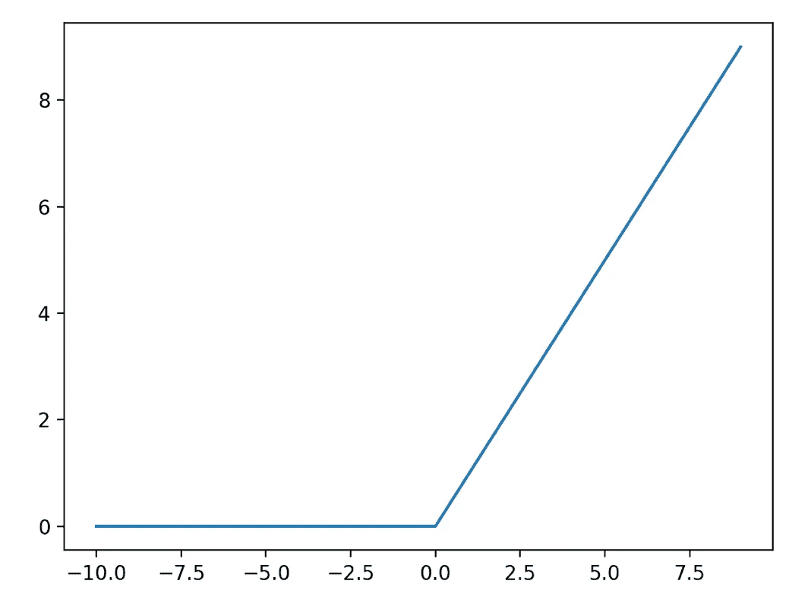
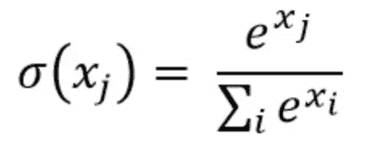

# 网飞电影推荐—使用深度学习

> 原文：<https://towardsdatascience.com/tensorflow-for-recommendation-model-deep-learning-d9d4e826ea0b?source=collection_archive---------44----------------------->

## 网飞使用深度学习

## 使用 TensorFlow 构建电影推荐模型

在 [Unsplash](https://unsplash.com?utm_source=medium&utm_medium=referral) 上由 [Myke Simon](https://unsplash.com/@myke_simon?utm_source=medium&utm_medium=referral) 拍摄的照片

 [## 推荐模型的张量流:第 1 部分

### 在这个由两部分组成的系列中，我们将了解如何使用 TensorFlow 构建电影推荐模型。

medium.com](https://medium.com/analytics-vidhya/tensorflow-for-recommendation-model-part-1-19f6b6dc207d) 

让我们从停止的地方继续。在之前的系列文章中，我们使用矩阵分解来学习用户嵌入向量，从而为我们执行推荐。这些用户嵌入表示用户和被称为反馈矩阵的电影矩阵之间的学习特征。现在，让我们了解如何使用深度学习来执行建议。下面附上了[谷歌实验室](https://colab.research.google.com/drive/11zEddP5TUAVCTkUgFwtFN7LG1z2A85hB#scrollTo=TOF0qSte0ljl&uniqifier=4)。

 [## 谷歌联合实验室

### 第二部分神经 n。

colab.research.google.com](https://colab.research.google.com/drive/11zEddP5TUAVCTkUgFwtFN7LG1z2A85hB#scrollTo=TOF0qSte0ljl&uniqifier=4) 

# 矩阵分解的缺点

在很大程度上，使用 MF 来执行推荐有一些缺点:

*   **小特征空间**:电影或者用户 id 唯一可以查询的特征。
*   **推荐**的相关性:由于 MF 讲的是用点积或者欧氏距离，所以把最受欢迎的项目推荐给大家。

# 卷积神经网络

在神经网络中，CNN 仍然是执行图像分类、图像识别、目标检测等的主要算法。

 [## 理解卷积神经网络(CNN) —深度学习

### 在神经网络中，卷积神经网络(ConvNets 或 CNN)是进行图像处理的主要类别之一

medium.com](https://medium.com/@RaghavPrabhu/understanding-of-convolutional-neural-network-cnn-deep-learning-99760835f148) 

然而，在建议模型中，我们可以着手创建一个简单的 softmax CNN 模型，其中的参数为:

*   **输入**:用户查询输入和与之相关的条目。
*   **输出**:用户与物品的交互概率。

在输入空间中，可以添加更多的辅助功能，如手表时间、国家等。这将允许隐藏层中的神经网络学习更多的数据，从而在这些层中建立更多的连接。

# 激活层

通过定义神经网络的结构，可以增加激活层来进一步捕获更多的隐藏连接，并在隐藏层中形成更好的特征采样。对于本推荐模型，将使用校正线性单位(ReLU)。

在大多数神经网络中，将使用梯度下降算法，其中在误差反向传播期间，需要激活函数作为线性函数。这就是 ReLU 的用武之地。

来源:[https://machine learning mastery . com/rectified-linear-activation-function-for-deep-learning-neural-networks/](https://machinelearningmastery.com/rectified-linear-activation-function-for-deep-learning-neural-networks/)

如果我们看一下左边的图像，我们可以看到函数的方程可以表示为 ***y=max(0，x)，其中*** 表示当 x 的值大于 0 时采用 y 的值。这充当线性和非线性函数，其中该函数对于大于零的量是线性的，这意味着它具有线性激活函数的许多期望属性。然而，它是一个非线性函数，因为负值总是输出为零。这就是为什么 ReLu 激活功能大多用在现代 NN 上的原因。

# Softmax 作为最后一层

该模型通过 softmax 层将最后一层的输出映射到概率分布。一种函数，将 X 个实数的向量作为输入，并将其归一化为由 X 个概率组成的概率分布，这些概率与输入数的指数成比例。从建议模型的角度来看:

*   ***x*** 代表用户-特征交互输出的个体概率。这可以是用户接下来将要观看的建议电影
*   ***∑(x)****表示该输出在最终层中所有输出上分布的概率*

* [## 在几分钟内了解 Softmax 功能

### 学机器学习？具体来说，尝试深度学习的神经网络？您可能遇到了…

medium.com](https://medium.com/data-science-bootcamp/understand-the-softmax-function-in-minutes-f3a59641e86d) 

# 神经网络中的嵌入

与 MF 模型相比，NN 模型也具有嵌入来表示用户和项目之间的关系。模型学习嵌入，每个项目的 V，j。

然而，查询嵌入是不同的。系统确定从查询特征到嵌入的映射，而不是每个查询学习一个嵌入。因此，由于激活函数(ReLU)的存在，与 MF 模型相比，嵌入现在被概括为非线性函数。

有可能对这些嵌入执行点积来获得最终的概率分数，但是这不是本系列的范围的一部分。

# 输入数据

现在让我们为创建的 NN 模型定义训练数据。训练数据由查询特征和用户与之交互的项目向量(表示为概率分布)组成。变量或权重表示用户项目特征的相互作用，并且被随机初始化用于训练。

## 创建数据

输入数据是从 ratings()数据帧和 movies()数据帧创建的。这两个 DF 代表我们必须整理以创建输入数据的基本信息:

List comprehension 在某种程度上被用来创建这个特性，因为它速度更快，而且当内存成为一个问题时，它也是大多数程序员现在使用的东西。

## 数据批次

至于训练输入数据，使用批处理将数据传播到 softmax 模型中。一个**批次**的大小是在模型被更新之前处理的样本的数量，当地面真实值和输出被比较用于另一个迭代时。一批 4 个特征将被传播到 NN 模型中。这将是电影 id、年份、类型和标签。因此，每个用户将在神经网络模型中学习这些特定的交互。***TF . data . dataset()***用于初始化批量操作。批量大小至关重要，因为较大的批量大小(有内存限制)将允许神经网络在优化阶段更有效地学习

## 神经网络训练

一旦输入数据和批次被处理，神经网络训练最终可以开始。创建嵌入()函数来捕获训练数据的特征。softmax 最终层神经网络模型用于输出由 K 个概率组成的概率分布，这些概率与输入数的指数成比例。

# 最终总结

客观地说，矩阵因式分解经常用在大型**稀疏数据**环境中，其中可以使用**简单点积函数**来识别与用户最接近的项目。这在系统中时间和内存受限的情况下特别有用。它更容易扩展，查询更便宜，速度更快。

至于神经网络，可以形成更复杂的关系来理解推荐在模型内部如何工作。神经网络模型捕捉更个性化的偏好，因为输入可以是用户与国家、年龄、观看时间等交互的向量。在某些情况下，神经网络模型更受青睐，因为预测将更加**准确，更加面向用户/有偏向**，而不是纯粹基于用户和项目之间的点距离。这对于其他用例特别有用，如市场营销或广告定位，其中收集了大量用户数据，NN 可以了解每个用户的**潜在偏好**。同样通过使用 NN，查询嵌入通常需要在查询时计算；结果，这在计算上可能是昂贵的。

# 最后

如果您成功地保持了对这一点的关注，如果您对本系列有任何建议，或者有任何尝试使用 NN 的 MF 构建推荐模型的经验，请留下评论。* 

*[*普雷姆·库马尔*](https://medium.com/@premstroke95) *是一个无私的学习者，对围绕我们的日常数据充满热情。在 LinkedIn 上与我联系***当你写信谈论这个故事以及等待的未来发展时，请提及这个故事。***