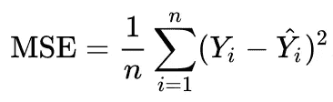
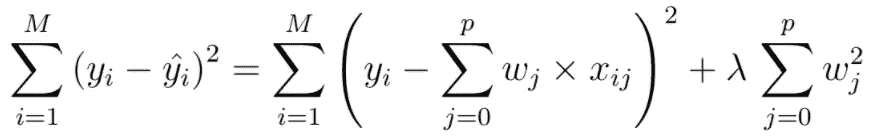
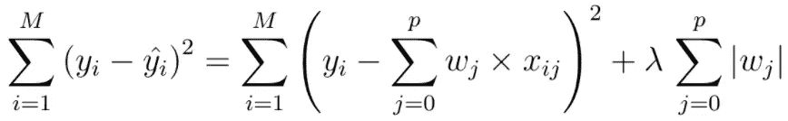
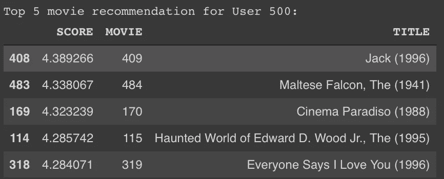

# 网飞电影推荐—使用协同过滤

> 原文：<https://towardsdatascience.com/tensorflow-for-recommendation-model-part-1-19f6b6dc207d?source=collection_archive---------19----------------------->

## 我们将了解如何使用 TensorFlow 构建一个[电影推荐](https://www.allcodingtutorial.com/posts/netflix-deep-learning-part-1)模型。

[亨利&公司](https://unsplash.com/@hngstrm?utm_source=medium&utm_medium=referral)在 [Unsplash](https://unsplash.com?utm_source=medium&utm_medium=referral) 上的照片

# 什么是推荐模型？

[推荐模型](https://www.allcodingtutorial.com/posts/netflix-deep-learning-part-1)，简而言之，是一种算法，旨在根据用户的行为向用户提供最相关和最相关的信息。像网飞和谷歌这样的公司有一个收集数据行为的巨大数据库，能够执行最先进的推荐，以便他们可以向用户显示最相关的内容或服务，以增加参与度。在第 1 部分中，我们将构建一个推荐模型，使用 [***协同过滤***](https://www.allcodingtutorial.com/posts/netflix-deep-learning-part-1) 向用户推荐电影。

 [## Google Colab

### 笔记本

colab.research.google.com](https://colab.research.google.com/drive/1GV4lg3LRN-ghtAwJbN_Xy9tQmpAEykPY) 

# 协同过滤？

协同过滤处理用户和项目之间的相似性以执行[推荐](https://www.allcodingtutorial.com/posts/netflix-deep-learning-part-1)。这意味着[算法](https://www.allcodingtutorial.com/posts/netflix-deep-learning-part-1)不断地发现用户之间的关系，并依次进行[推荐](https://www.allcodingtutorial.com/posts/netflix-deep-learning-part-1)。[算法](https://www.allcodingtutorial.com/posts/netflix-deep-learning-part-1)学习用户之间的嵌入，而不必调整特征。最常见的技术是通过执行矩阵分解来找到构成特定用户兴趣的[嵌入](https://www.allcodingtutorial.com/posts/netflix-deep-learning-part-1)或特征。

## 矩阵分解

矩阵分解是一种嵌入。假设我们有一个用户电影矩阵或*反馈矩阵，一个* ᴺᴹ，模型学习分解成:

*   A ***用户*** 嵌入向量 **U** ，其中第 N 行是项目 m 的嵌入
*   An ***项*** 嵌入向量 **V** ，其中 M 行是对项 N 的嵌入

学习嵌入向量，使得通过执行 UVᵀ，可以形成反馈矩阵的近似。

## 损失函数

为了逼近反馈矩阵，需要一个损失函数。直观的[损失函数](https://www.allcodingtutorial.com/posts/netflix-deep-learning-part-1)之一是使用均方误差(MSE)。MSE 计算反馈矩阵 a 和近似 UVᵀ矩阵的差值。简单来说:

其中:

*   ***n*** 代表用户总数
*   ***Yᵢ*** 代表反馈矩阵 a
*   ***Yᵢ_bar*** 代表 UVᵀ的近似矩阵

## 正则化函数

训练模型最常见的问题之一是 ***过度拟合。*如果这个特定的异常特征具有大的“幅度”或偏差，那么可以说该模型对于这些特定特征是过度拟合的。为了减少这种情况，我们可以在 MSE 损失中增加一个惩罚项。最常用的模型是**套索回归**和**岭回归**。**

 [## 机器学习中的正则化

### 训练机器学习模型的一个主要方面是避免过度拟合。该模型将有一个低…

towardsdatascience.com](/regularization-in-machine-learning-76441ddcf99a) 

**岭回归(L2)**

岭公式

*   取系数的**平方**、**T43、w、**。因此，任何大的 ***w*** 值都将被扣分，以减少过度拟合。

**拉索回归(L1)**

套索公式

*   取系数的**大小**，**， *w* ，**。因此，任何大的 **w** 值都会被扣分，以减少过度拟合。
*   如果你有一个稀疏矩阵，收缩系数和执行特征选择是有用的，这正是我们所需要的。

# [提出建议](https://www.allcodingtutorial.com/posts/netflix-deep-learning-part-1)

一般来说，步骤*(和功能)*如下:

*   创建一个**稀疏张量** : *tf。SparseTensor()* ，用于随机初始化的*和 ***V*** 矩阵*
*   *创建**损失函数和优化器**:*TF . losses . mean _ squared _ error()，*来估计带有正则化惩罚和 SGD 作为优化器的总损失*
*   *创建**模型** : *tf。Session()* ，初始化超参数、学习率和嵌入*
*   ***列车**车型: *tf。Session.run()，*学习反馈矩阵的嵌入并返回 ***v*** 和 ***k*** 作为嵌入向量*
*   ***展示**推荐: *df。DataFrame()，*显示与被查询用户最近的电影*

> *准备好模型后，让我们尝试计算用户 ID: **500** 的推荐值*

**

*决赛成绩*

*我们可以看到，该模型已经学习了用户 500 的嵌入，并且它推荐了用户 ID: 500 可能喜欢的前 5 部电影。*

# *最后*

*如果您成功地保持了对这一点的关注，如果您对本系列有任何建议，或者有任何尝试使用 NN 的 MF 构建推荐模型的经验，请留下评论。*

*[*普雷姆·库马尔*](https://medium.com/@premstroke95) *是一个无私的学习者，对我们身边的日常数据充满热情。在*[*LinkedIn*](https://www.linkedin.com/in/premstrk/)*上与我联系，当你写信谈论这个故事和等待的未来发展时，提及这个故事。**