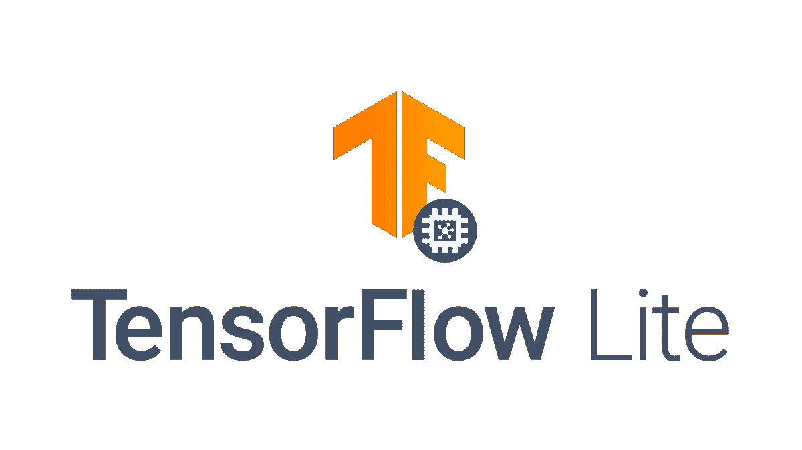

# TensorFlow Lite Android 支持库:简化 Android 上的 ML

> 原文：<https://towardsdatascience.com/tensorflow-lite-android-support-library-simply-ml-on-android-561402292c80?source=collection_archive---------20----------------------->

## 介绍新的 TF Lite Android 支持库


Benjamin Sow 在 [Unsplash](https://unsplash.com?utm_source=medium&utm_medium=referral) 上拍摄的照片

每个人都喜欢 TensorFlow，当你可以直接在 Android 上运行 TF 模型时就更喜欢了。我们都在 Android 上使用 TensorFlow Lite，我们也有几个 CodeLabs 在上面。使用 Android 上的`Interpreter`类，我们目前正在应用程序中运行我们的`.tflite`模型。

但是在那之前我们要做很多事情，对吗？如果我们正在执行图像分类任务，你可能会从相机库中获得一个`Bitmap`或`Image`对象，然后我们将其转换为`float[][][]`或`byte[]`。然后我们从`assets`文件夹中加载我们的模型作为`MappedByteBuffer`。在调用了`interpreter.run()`之后，我们获得了类概率，我们对其执行`argmax()`操作，然后最终从`labels.txt`文件中获得一个标签。

这是我们开发人员遵循的传统方法，没有其他方法。

# TensorFlow Lite Android 支持库简介



[来源](https://www.tensorflow.org/lite)

[TensorFlow](https://www.tensorflow.org/) 团队发布了 [TensorFlow Lite Android 支持库](https://github.com/tensorflow/tensorflow/tree/master/tensorflow/lite/experimental/support/java)来解决预处理的繁琐任务。GitHub 页面给出了他们目标的直觉，

> 移动应用程序开发人员通常与位图等类型化对象或整数等原语进行交互。然而，运行设备上机器学习模型的 TensorFlow Lite 解释器使用 ByteBuffer 形式的张量，这可能很难调试和操作。TensorFlow Lite Android 支持库旨在帮助处理 TensorFlow Lite 模型的输入和输出，并使 TensorFlow Lite 解释器更易于使用。

首先，我们需要在我们的 Android 项目中做到这一点。还记得`build.gradle`文件吗？对！我们将把这些依赖关系添加到我们的应用程序级`build.gradle`文件中，

# 1.创建输入和输出数组

运行 TFLite 模型的第一步是创建一些数组对象，它可以存储模型的输入以及模型将产生的输出。为了让我们的生活更轻松，减少与`float[]`对象的斗争，TF 支持库包含了一个`[TensorBuffer](https://github.com/tensorflow/tensorflow/blob/master/tensorflow/lite/experimental/support/java/src/java/org/tensorflow/lite/support/tensorbuffer/TensorBuffer.java)`类，它采用所需数组的形状及其数据类型。

片段 1

> **注:截至 2020 年 4 月 1 日，仅支持** `**DataType.FLOAT32**` **和** `**DataType.UINT8**` **。**

您甚至可以通过修改现有的`TensorBuffer`对象的数据类型来创建一个`TensorBuffer`对象，

```
**val** newImage = TensorImage.createFrom( image , DataType.**FLOAT32** )
```

# 2.图像操作

如果您正在处理对象检测、图像分类或其他与图像相关的模型，您需要在`Bitmap`上工作，并调整其大小或使其正常化。我们对此有三个操作，即`[ResizeOp](https://github.com/tensorflow/tensorflow/blob/master/tensorflow/lite/experimental/support/java/src/java/org/tensorflow/lite/support/image/ops/ResizeOp.java)`、`[ResizeWithCropOrPadOp](https://github.com/tensorflow/tensorflow/blob/master/tensorflow/lite/experimental/support/java/src/java/org/tensorflow/lite/support/image/ops/ResizeWithCropOrPadOp.java)`和`[Rot900p](https://github.com/tensorflow/tensorflow/blob/master/tensorflow/lite/experimental/support/java/src/java/org/tensorflow/lite/support/image/ops/Rot90Op.java)`。

首先，我们使用`[ImageProcessor](https://github.com/tensorflow/tensorflow/blob/master/tensorflow/lite/experimental/support/java/src/java/org/tensorflow/lite/support/image/ImageProcessor.java)`类定义预处理管道。

> **问题:什么是双线性和最近邻法？**
> 
> 答:读[这个](https://support.esri.com/en/technical-article/000005606)。

接下来，创建一个`[TensorImage](https://github.com/tensorflow/tensorflow/blob/master/tensorflow/lite/experimental/support/java/src/java/org/tensorflow/lite/support/image/TensorImage.java)`对象并处理图像。

# 3.张量运算

图像阵列的归一化对于几乎所有的模型都是必要的，无论是图像分类模型还是回归模型。对于处理张量，我们有一个`[TensorProcessor](https://github.com/tensorflow/tensorflow/blob/master/tensorflow/lite/experimental/support/java/src/java/org/tensorflow/lite/support/common/TensorProcessor.java)`。除了`[NormalizeOp](https://github.com/tensorflow/tensorflow/blob/master/tensorflow/lite/experimental/support/java/src/java/org/tensorflow/lite/support/common/ops/NormalizeOp.java)`，我们还有`[CastOp](https://github.com/tensorflow/tensorflow/blob/master/tensorflow/lite/experimental/support/java/src/java/org/tensorflow/lite/support/common/ops/CastOp.java)`、`[QuantizeOp](https://github.com/tensorflow/tensorflow/blob/master/tensorflow/lite/experimental/support/java/src/java/org/tensorflow/lite/support/common/ops/QuantizeOp.java)`和`[DequantizeOp](https://github.com/tensorflow/tensorflow/blob/master/tensorflow/lite/experimental/support/java/src/java/org/tensorflow/lite/support/common/ops/DequantizeOp.java)`。

> **问题:什么是正常化？**
> 
> 答:将实际值范围转换为标准值范围的过程，通常为-1 到+1 或 0 到 1。例如，假设某个特征的自然范围是 800 到 6000。通过减法和除法，您可以将这些值规范化到-1 到+1 的范围内。

此外，我们可以通过实现`[TensorOperator](https://github.com/tensorflow/tensorflow/blob/master/tensorflow/lite/experimental/support/java/src/java/org/tensorflow/lite/support/common/TensorOperator.java)`类来自由构建定制的 ops，如下所示。

# 4.加载模型和标签

我们可以使用`[FileUtil.loadMappedFile()](https://github.com/tensorflow/tensorflow/blob/master/tensorflow/lite/experimental/support/java/src/java/org/tensorflow/lite/support/common/FileUtil.java)`方法轻松加载我们的`.tflite`模型。类似地，我们可以从`InputStream`或资产文件夹中加载标签。

然后使用`Interpreter.run()`进行推理，

# 关于 Android 机器学习的更多资源

# 仅此而已！

我希望你喜欢新的 TensorFlow Lite Android 支持库。这是一个内部的快速审查，但尝试探索自己。感谢阅读！