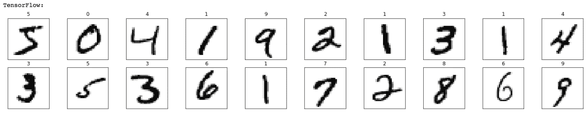
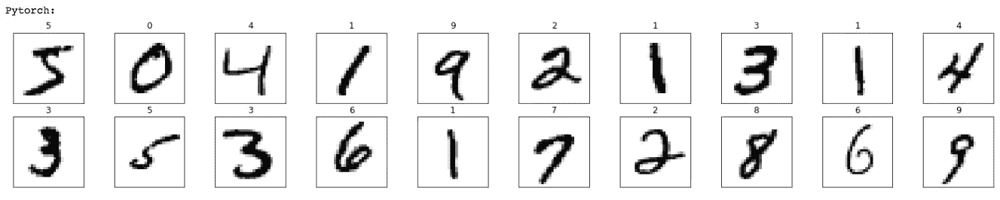
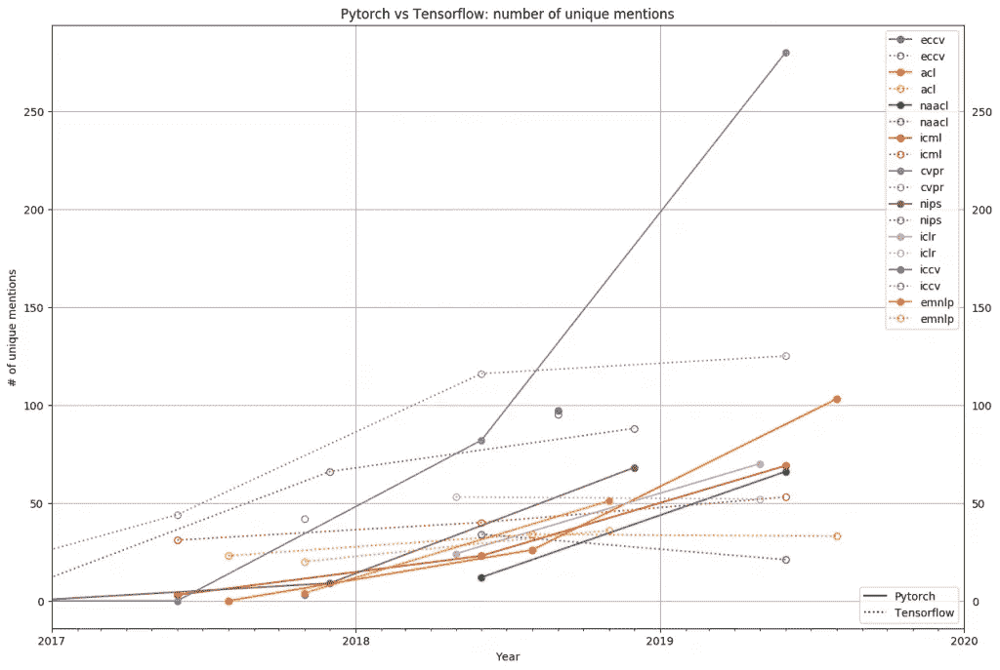

# TensorFlow 还是 PyTorch？

> 原文：<https://towardsdatascience.com/tensorflow-or-pytorch-146f5397278a?source=collection_archive---------18----------------------->

## 深度学习网络编程的最佳框架是什么？


来源: [https://torres.ai](https://torres.ai)

UPC Barcelona Tech[的一名](https://upc.edu/en)学生问我*为神经网络编程的最佳框架是什么？TensorFlow 还是 PyTorch？。*我的回答是*:别急，你从哪一个开始，选择哪一个都不重要，重要的是开始，* ***走吧！***

在两种环境中对神经网络进行编程的步骤在*机器学习*中是相同的:

*   导入所需的库，
*   加载并预处理数据，
*   定义模型，
*   定义优化器和损失函数，
*   训练模型，最后
*   评估模型。

这些步骤可以在任一框架中非常相似地实现。为此，在本出版物中，我们将构建一个神经网络模型，该模型将在 **API PyTorch** 和 TensorFlow 的 **API Keras 中对手写数字进行分类。[整个代码可以在 GitHub 上测试](https://github.com/jorditorresBCN/PyTorch-vs-TensorFlow/blob/master/MNIST-with-PyTorch-and-TensorFlow.ipynb)和[运行它作为一个谷歌笔记本](https://colab.research.google.com/github/jorditorresBCN/PyTorch-vs-TensorFlow/blob/master/MNIST-with-PyTorch-and-TensorFlow.ipynb)。**

# **1。神经网络编程步骤**

## **a)导入所需的库**

在这两个框架中，我们首先需要导入一些 Python 库，并定义一些训练所需的超参数:

```
import numpy as np 
import matplotlib.pyplot as plt epochs = 10 
batch_size=64
```

对于 TensorFlow，您只需要这个库:

```
import tensorflow as tf
```

而在 PyTorch 的例子中，这两个:

```
import torch 
import torchvision
```

## b)加载和预处理数据

使用 TensorFlow 加载和准备数据可以通过这两行代码完成:

```
(x_trainTF_, y_trainTF_), _ = tf.keras.datasets.mnist.load_data() x_trainTF = x_trainTF_.reshape(60000, 784).astype('float32')/255 y_trainTF = tf.keras.utils.to_categorical(y_trainTF_, 
            num_classes=10)
```

在 PyTorch 和另外两个人在一起的时候:

```
xy_trainPT = torchvision.datasets.MNIST(root='./data', train=True, download=True,transform=torchvision.transforms.Compose([torchvision.transforms.ToTensor()])) xy_trainPT_loader = torch.utils.data.DataLoader(xy_trainPT, batch_size=batch_size)
```

我们可以验证这两个代码已经用库`matplotlib.pyplot`加载了相同的数据:

```
print("TensorFlow:")
fig = plt.figure(figsize=(25, 4))
for idx in np.arange(20):
   ax = fig.add_subplot(2, 20/2, idx+1, xticks=[], yticks=[])
   ax.imshow(x_trainTF_[idx], cmap=plt.cm.binary)
   ax.set_title(str(y_trainTF_[idx]))
```



```
print("PyTorch:")
fig = plt.figure(figsize=(25, 4)) 
for idx in np.arange(20):
   ax = fig.add_subplot(2, 20/2, idx+1, xticks=[], yticks=[])
   ax.imshow(torch.squeeze(image, dim = 0).numpy(), 
             cmap=plt.cm.binary)
   image, label = xy_trainPT [idx]
   ax.set_title(str(label))
```



## c)定义模型

为了定义模型，在这两种情况下，都使用了相当相似的语法。在 TensorFlow 的情况下，可以使用以下代码完成:

```
modelTF = tf.keras.Sequential([ tf.keras.layers.Dense(10,activation='sigmoid',input_shape=(784,)), tf.keras.layers.Dense(10,activation='softmax') 
])
```

在 PyTorch 有这样一个:

```
modelPT= torch.nn.Sequential(   
         torch.nn.Linear(784,10),
         torch.nn.Sigmoid(), 
         torch.nn.Linear(10,10), 
         torch.nn.LogSoftmax(dim=1) 
         )
```

## d)定义优化器和损失函数

同样，指定优化器和损失函数的方式是完全相同的。使用 TensorFlow，我们可以这样做:

```
modelTF.compile( 
               loss="categorical_crossentropy",     
               optimizer=tf.optimizers.SGD(lr=0.01), 
               metrics = ['accuracy'] 
               )
```

而 PyTorch 是这样的:

```
criterion = torch.nn.NLLLoss() 
optimizer = torch.optim.SGD(modelPT.parameters(), lr=0.01)
```

## e)训练模型

谈到培训，我们发现最大的差异。在 TensorFlow 的例子中，我们可以只用这一行代码来完成:

```
_ = modelTF.fit(x_trainTF, y_trainTF, epochs=epochs, 
                batch_size=batch_size, verbose = 0)
```

而在 Pytorch，我们需要像这样更长的东西:

```
for e in range(epochs):
    for images, labels in xy_trainPT_loader:
        images = images.view(images.shape[0], -1)
        loss = criterion(modelPT(images), labels)
        loss.backward()
        optimizer.step()
        optimizer.zero_grad()
```

在 PyTorch 中，没有像 Keras 或 Scikit-learn 中的`fit()`那样的“预制”数据模型调优函数，所以训练循环必须由程序员指定。嗯，在简单性和实用性之间，这里有某种妥协，以便能够做更多定制的事情。

## f)评估模型

当我们需要评估模型时，也会发生同样的情况，而在 TensorFlow 中，您只需用测试数据调用方法`evaluate()`:

```
_, (x_testTF, y_testTF)= tf.keras.datasets.mnist.load_data()
x_testTF = x_testTF.reshape(10000, 784).astype('float32')/255
y_testTF = tf.keras.utils.to_categorical(y_testTF, num_classes=10)

_ , test_accTF = modelTF.evaluate(x_testTF, y_testTF)
print('\nAccuracy del model amb TensorFlow =', test_accTF)TensorFlow model Accuracy = 0.8658999800682068
```

在 PyTorch 中，再次要求程序员指定评估循环:

```
xy_testPT = torchvision.datasets.MNIST(root='./data', train=False, download=True, 
            transform=torchvision.transforms.Compose([torchvision.transforms.ToTensor()]))

xy_test_loaderPT = torch.utils.data.DataLoader(xy_testPT)

correct_count, all_count = 0, 0
for images,labels in xy_test_loaderPT:
  for i in range(len(labels)):
    img = images[i].view(1, 784)

    logps = modelPT(img)
    ps = torch.exp(logps)
    probab = list(ps.detach().numpy()[0])
    pred_label = probab.index(max(probab))
    true_label = labels.numpy()[i]
    if(true_label == pred_label):
      correct_count += 1
    all_count += 1

print("\nAccuracy del model amb PyTorch =", (correct_count/all_count))TensorFlow model Accuracy = 0.8657
```

# **2。更重要的是他们将会融合！**

正如这个简单的例子所示，在 TensorFlow 和 PyTorch 中创建神经网络的方式并没有什么不同，除了程序员实现训练和评估循环的一些细节，以及一些超参数如`epochs`或`batch_size`在不同的步骤中指定。

事实上，这两个框架在过去的两年中一直在不断融合，相互学习并采用各自的最佳特性。例如，在几周前发布的 TensorFlow 2.2 的新版本中，训练步骤可以像 PyTorch 一样完成，现在程序员可以通过实现`traint_step()`来指定循环体的详细内容。所以不要担心选择“错误”的框架，它们会收敛的！最重要的是学习背后的深度学习理念，你在其中一个框架里获得的所有知识，在另一个框架里都会对你有用。

# **3。产还是研**？

然而，很明显，如果你想要的是将解决方案投入生产或在神经网络中进行研究，这是不同的。在这种情况下，选择哪一个的决定很重要。

TensorFlow 是一个非常强大和成熟的 Python 库，具有强大的可视化特性和各种用于高性能模型开发的选项。它具有为生产做好准备的展示选项，以及对 web 和移动平台的自动支持。

另一方面，PyTorch 仍然是一个年轻的框架，但是有一个非常活跃的社区，尤其是在研究领域。[门户*梯度*](https://thegradient.pub/state-of-ml-frameworks-2019-pytorch-dominates-research-tensorflow-dominates-industry/) 如图[附图](https://blog.exxactcorp.com/wp-content/uploads/2020/01/pasted-image-0-5-.png)py torch 的兴起和采用研究社区基于主要会议主题(CVPR、ICRL、ICML、NIPS、ACL、ICCV 等)发表的研究论文数量。).



[来源:渐变](https://blog.exxactcorp.com/wp-content/uploads/2020/01/pasted-image-0-5-.png)

从图中可以看出，2018 年 PyTorch 框架的使用是少数，相比之下，2019 年研究人员对它的使用是压倒性的。所以如果想打造人工智能相关的产品，TensorFlow 是个不错的选择。如果你想做研究，我推荐 PyTorch。

> **因此，如果你想打造与人工智能相关的产品，TensorFlow 是一个不错的选择。如果你想做研究，我推荐 PyTorch。**

# **4。如有疑问，选择 Kera** s

如果不确定，先从 TensorFlow 的 Keras API 开始。PyTorch 的 API 有更多的灵活性和可控性，但是很明显 TensorFlow 的 Keras API 可以更容易上手。如果你正在阅读这篇*帖子*，我可以假设你正开始深度学习的话题。

此外，您还有我在过去两年中准备的其他出版物中关于 Keras 的额外文档。(一个秘密:我也计划在夏天准备好 PyTorch 的等效文档)。

顺便说一下，Keras 为 2020 年计划了几款“让它更简单”的新产品。这里列出了最近添加或即将推出的一些新功能:

**层和预处理 API**

到目前为止，我们已经用 NumPy 和 PIL (Python Imaging Library)编写的辅助工具完成了预处理。而且这种外部预处理使得模型的可移植性降低，因为每当有人重用一个已经训练好的模型时，他们都必须重放预处理程序*管道*。因此，预处理现在可以通过“预处理层”成为模型的一部分。这包括文本标准化、标记化、矢量化、图像标准化、数据扩充等方面。也就是说，这将允许模型接受原始文本或原始图像作为输入。我个人觉得这会很有意思。

**Keras 调谐器**

这是一个框架，允许您在 Keras 中找到模型的最佳超参数。当你花一些时间在深度学习上工作时，你会看到这解决了模型构建的一个代价高昂的问题，例如细化超参数，以使模型表现最佳。这总是一项非常困难的任务。

**AutoKeras**

这个项目试图在几行代码中为数据找到一个好的 ML 模型，根据可能模型的空间自动搜索最佳可能模型，并使用 Keras Tuner 查找超参数调整。对于高级用户，AutoKeras 还允许对搜索空间和过程的配置进行更高级别的控制。

**云角**

我们的愿景是让程序员更容易将代码(在我们的笔记本电脑或 Google Colab 上本地工作的代码)转移到云中，使其能够在云中以最佳和分布式的方式执行代码，而不必担心集群或 Docker 参数。

**与 TensorFlow 的集成**

与 TFX (TensorFlow Extended，一个管理 ML 生产应用的平台)的更多集成工作正在进行中，并更好地支持将模型导出到 TF Lite(一个用于移动和嵌入式设备的 ML 执行引擎)。毫无疑问，提高对模型生产的支持对于 Keras 中程序员的忠诚度是至关重要的。

# **5。总而言之**

用一个明喻来说，你认为开始编程最好的语言是 C ++还是 Java？嗯……这取决于我们想用它做什么，最重要的是取决于我们有什么工具可以学习。我们可能无法同意，因为我们有一个先入为主的观点，我们很难改变我们对这个问题的答案(PyTorch 和 TensorFlow 的“粉丝”也是如此😉 ).但是我们肯定同意重要的是知道如何编程。事实上，无论我们从一种语言的编程中学到什么，当我们使用另一种语言时，它都会为我们服务，对吗？同样的事情也发生在框架上，重要的是了解深度学习，而不是框架的语法细节，然后我们会将这些知识用于流行的框架或我们当时有更多机会使用的框架。

> 这篇文章的代码可以从 GitHub 下载

[](/tensorflow-vs-pytorch-the-battle-continues-9dcd34bb47d4) [## TensorFlow vs Pytorch:战斗仍在继续

### 本周，脸书宣布 PyTorch 1.5 的发布

towardsdatascience.com](/tensorflow-vs-pytorch-the-battle-continues-9dcd34bb47d4) 

*原文于 2020 年 4 月 19 日* [*发表于加泰罗尼亚语 https://Torres . ai*](https://torres.ai/pytorch-vs-tensorflow/)*。*

# 附录 1:对 PyTorch 感兴趣？

[](/deep-learning-with-pytorch-a93b09bdae96) [## 使用 PyTorch 进行深度学习

### 初学 PyTorch

towardsdatascience.com](/deep-learning-with-pytorch-a93b09bdae96) 

# 附录二:对 TensorFlow 感兴趣？

[](/convolutional-neural-networks-for-beginners-using-keras-and-tensorflow-2-c578f7b3bf25) [## 卷积神经网络初学者使用 Keras 和 TensorFlow 2

### 边做边学:包含 GitHub 代码的实用指南

towardsdatascience.com](/convolutional-neural-networks-for-beginners-using-keras-and-tensorflow-2-c578f7b3bf25)