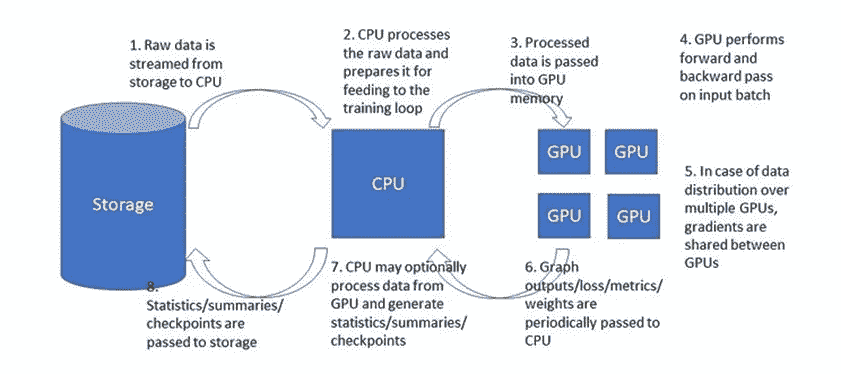
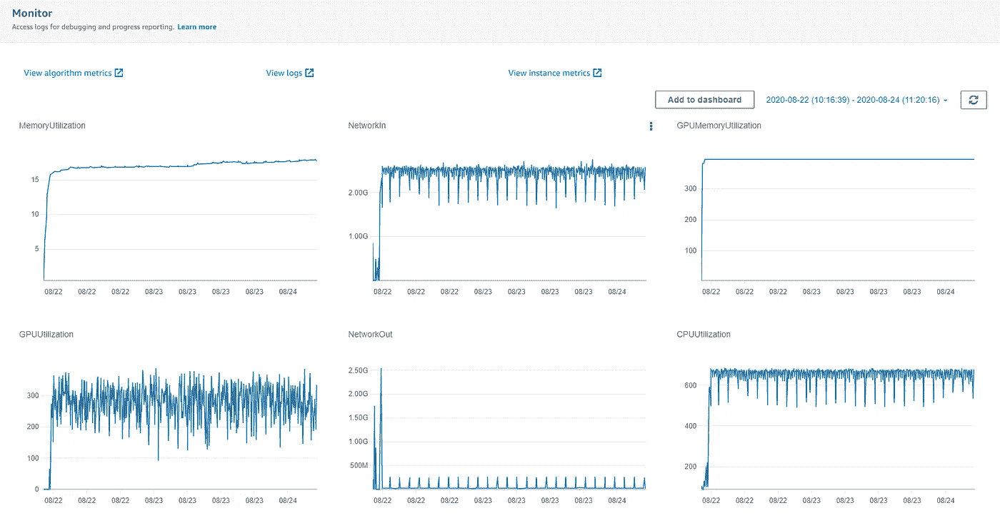
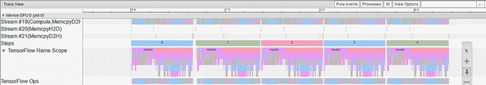
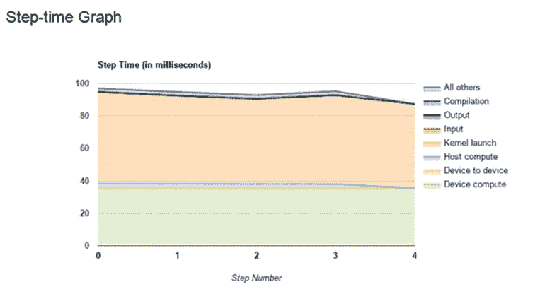
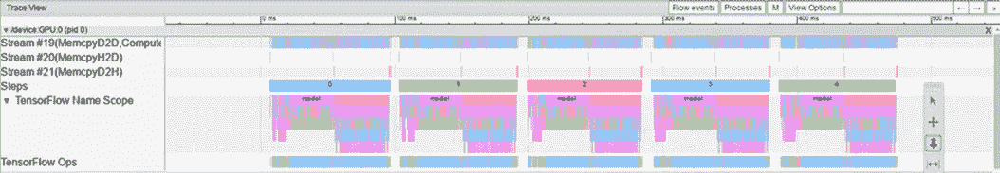
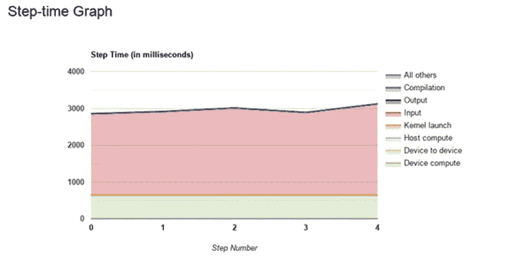
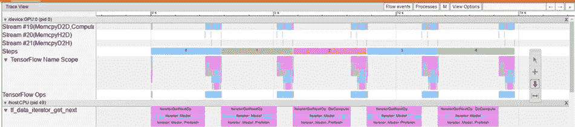
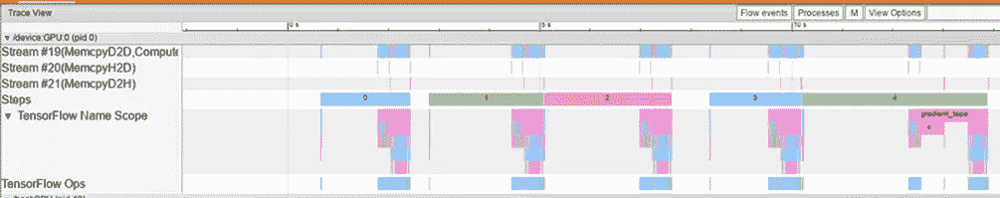
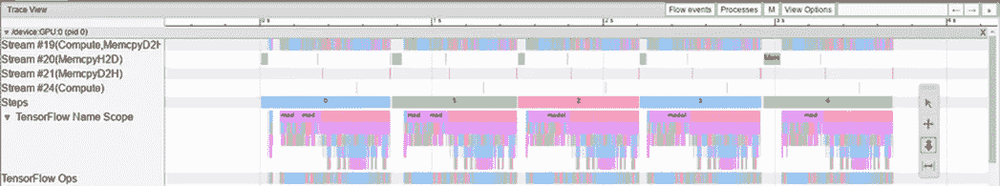
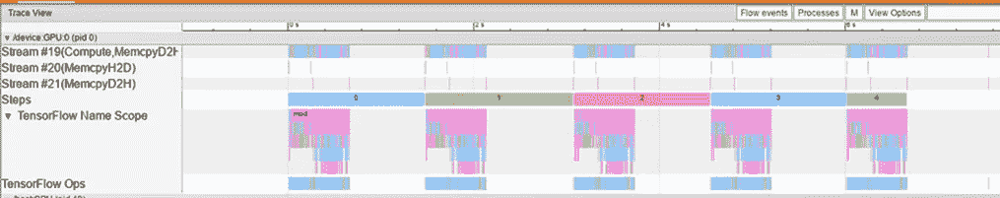

# 张量流性能分析

> 原文：<https://towardsdatascience.com/tensorflow-performance-analysis-314b56dceb59?source=collection_archive---------15----------------------->

在以前的帖子中([这里](https://medium.com/@julsimon/making-amazon-sagemaker-and-tensorflow-work-for-you-893365184233)和[这里](https://medium.com/@julsimon/deep-dive-on-tensorflow-training-with-amazon-sagemaker-and-amazon-s3-12038828075c)，我告诉过你我们的团队如何使用亚马逊 SageMaker 和亚马逊 s3 服务来训练我们对大量数据的深度神经网络。

在这篇博客中，我想讨论如何分析在 TensorFlow 中运行的 DNN 训练课程的性能。当谈到 DNN 训练课的“表现”时，人们可能指的是许多不同的事情。在本博客的上下文中，“性能”分析指的是对执行训练的速度(例如，通过每秒迭代次数的训练吞吐量来衡量)的分析，以及会话利用系统资源来实现这一速度的方式。我们将不会提及被训练的模型的性能，其通常通过测试集上的损失或度量评估来测量。性能的另一个衡量标准是训练收敛之前所需的批次数量。这也超出了本博客的范围。

简而言之，如果你想弄清楚为什么你的训练跑得慢，你来对地方了。如果您正在寻找提高 mnist 模型准确性的方法，或者正在寻找使用什么优化器设置来加速收敛，那么您还没有找到。

我们将回顾的例子是用 TensorFlow 编写的，并使用 Amazon SageMaker 服务在云中运行，但是我们将进行的讨论同样适用于任何其他培训环境。

# **前奏**

任何关于你的训练的性能分析的讨论都需要我们清楚目标是什么，或者我们试图优化什么效用函数。您的效用函数可能取决于许多因素，包括您可支配的训练实例的数量、这些实例的成本、您需要训练的模型的数量、项目调度约束等。

为了进行有意义的讨论，我们将做一些简化的假设。我们的目标将是**在给定**固定训练环境**的情况下，最大化训练会话**的吞吐量，而不损害最终模型的质量，也不增加收敛所需的训练样本的数量。

如前所述，这个目标包含了一些模糊之处，我们会及时解释。

## **培训实例**

我们的第一个简化假设是，训练是在单个实例/机器上执行的，并且实例类型是固定的。

自然，不同的型号在不同类型的机器上表现不同。在理想的情况下，我们总是能够选择一台对于被训练的模型来说是最优的机器，也就是说，一台所有资源都被充分利用的机器。这样，我们可以避免未被使用的资源成本。不幸的是，在现实世界中，我们通常面临固定数量的实例类型可供选择。例如，Amazon SageMaker 提供了[多种多样的实例类型](https://aws.amazon.com/sagemaker/pricing/instance-types/)供选择，它们在 GPU 的类型和数量、CPU 的数量、网络属性、内存大小等方面都有所不同。另一方面，人们没有能力自由选择(基于他们的模型的属性)具有特定数量的 CPU、特定的 GPU 和特定的网络带宽的机器。

为了选择最合适的训练实例，必须仔细权衡模型对不同训练实例的适合程度，以及诸如这些实例的成本和可用性以及调度要求等考虑因素。正如我们在本帖中所描述的，这需要对在每种不同的实例类型上训练模型所能达到的最大性能进行全面的分析。

我们将把讨论限制在具有单个 GPU 的实例类型上。具体来说，我们将在配备 NVIDIA V100 Tensor Core GPU 的机器上工作。如果您使用 Amazon SageMaker 服务进行培训，这就是 ml.p3.2xlarge 实例类型。

## **培训框架**

有许多不同的库和框架可用于训练 DNN 模型。和以前一样，固定模型、固定训练算法和固定硬件的训练性能会因不同的软件解决方案而异。正如帖子标题中所强调的，我们的重点将放在 TensorFlow 培训环境上。即使在这种训练环境中，性能也可能取决于许多因素，如框架版本、是否选择高级 API(如 tf.estimator 或 tf.keras.model.fit)或实现自定义训练循环，以及将训练数据输入训练管道的方式。我们在本文中的假设是，训练将在 TensorFlow 2.2 中使用 tf.keras.model.fit() API 执行，数据将使用 tf.dataset APIs 提供。

## **规则和约束**

在没有限制的情况下，加快培训量将是小菜一碟。例如，我们可以简单地减少我们的模型架构的大小，这样培训就会进行。当然，这很可能会扼杀训练的收敛能力，并且所得到的模型预测可能是无用的。显然，我们必须确保我们为加速训练所采取的任何行动都不会损害最终模型的质量。

在我们的讨论中，我们引入了一个额外的约束条件，即我们不希望影响训练收敛所需的总时间，这是通过在收敛之前输入到网络中的训练样本总数来衡量的。换句话说，我们做了一个简化的假设，即我们的模型需要固定数量的训练样本才能收敛，并且我们必须优化的选项不会改变这个固定数量。基于这一假设，给定一个固定的实例和软件环境，我们的目标是优化训练所花费的总时间(以秒为单位)，或者，优化**训练吞吐量**，以训练循环每秒处理的样本数来衡量。

我们强调这是我们为了简化讨论而引入的人为约束。当然，可能存在这样的情况:模型架构的变化会增加收敛所需的样本数量，同时减少收敛所需的总时间。例如，降低某些变量的位精度可能会增加吞吐量，但也可能需要更多步骤才能收敛。如果训练的总时间减少了，并且最终的模型预测也一样好，那么这将是一个很好的优化。另一个重要的例子是增加批量。增加训练批量是增加产量的基本方法之一。但是，有一些模型的训练质量可能对批量大小很敏感。我们做了一个简化的假设，即这种影响可以忽略不计，并且可以通过调整其他超参数(如学习率)来克服。

## **计量单位**

我们将用来测量吞吐量的单位是训练循环每秒处理的样本的平均数。另一种更常见的吞吐量单位度量是每秒的平均训练迭代次数、每秒的步骤数或每秒的批次数。然而，由于这种测量是基于所选择的(全局)批次大小，因此很难在使用不同批次大小的运行之间进行比较。

要提取此测量值，您可以依赖 TensorFlow 打印的日志(在每个时期结束时)，也可以自行实施测量值(例如，使用自定义 TensorFlow 回调)。

## **优化策略**

我们提高训练吞吐量的主要方法是提高训练实例的资源利用率。理论上，任何未充分利用的资源都是增加吞吐量的潜在机会。然而，实际上，一旦最昂贵和最重要的系统资源 GPU 得到充分利用，并且假设我们对 GPU 操作的性能感到满意，我们将认为我们的任务已经完成。理论上，我们可以考虑将一些训练卸载给 CPU，但是性能增益可能是微不足道的(如果有的话)——当然不值得头痛。未充分利用可能是管道未达到其最大容量的结果(例如，所有资源都没有得到充分利用)。在这种情况下，增加产量相当容易，(例如，简单地增加批量)。如果管道处于最大容量，系统资源的利用不足通常是管道中瓶颈的结果。例如，在等待 CPU 准备训练数据时，GPU 可能处于空闲状态。在这种情况下，我们将尝试通过消除瓶颈来增加吞吐量。例如，我们可以在 CPU 和 GPU 之间引入并行化，这样 GPU 就永远不必等待数据。

一般策略是反复执行以下两个步骤，直到我们对吞吐量感到满意，或者直到 GPU 得到充分利用:

1.概述培训绩效，以确定流程中的瓶颈和未充分利用的资源

2.解决瓶颈并提高资源利用率

请注意，在任何给定的时间，管道中可能有多个瓶颈。CPU 可能在等待从网络接收数据时处于空闲状态，GPU 可能在等待 CPU 准备用于训练的数据时处于空闲状态。此外，在培训的不同阶段可能会出现不同的瓶颈。例如，当我们保存一个检查点时，GPU 可能被充分利用，但仅在迭代期间空闲。这种瓶颈，即使只是周期性的，仍然可能对平均吞吐量产生重大影响，应该加以解决。

## **为什么性能分析很重要？**

这一点现在应该非常清楚了，但有时显而易见的事情需要陈述。我经常遇到对 40%的 GPU 利用率非常满意的开发人员。让我想尖叫。GPU(通常)是你正在使用的最昂贵的资源；如果你对低于 90%的利用率感到满意，那你就是在浪费你(你公司)的钱。更不用说你可能会更快地交付你的产品。

一切都是为了钱。培训资源是昂贵的，如果你没有最大限度地利用它们，你就是在犯反人类罪。

我希望你能确信描述你的训练表现和最大化资源利用的重要性。在下一节中，我们将回顾典型培训渠道中的一些潜在瓶颈。然后，我们将调查一些我们可以用来识别这些瓶颈的工具。

# **培训渠道和潜在瓶颈**

为了便于讨论培训课程中可能出现的瓶颈，我们提供了一个典型的培训流程图。培训分为八个步骤，每个步骤都可能阻碍培训流程。请注意，虽然在此图中训练是在多个 GPU 上执行的，但在本文中，如上所述，我们将假设只有一个 GPU。



样本培训渠道(按作者)

## **原始数据输入**

除非您是自动生成培训数据，否则您可能会从存储中加载它。这可能来自本地磁盘，也可能通过网络来自远程存储位置。在这两种情况下，您使用的系统资源都有可能阻塞管道。如果每个训练样本的原始数据量特别大，如果您的 IO 接口具有高延迟，或者如果您的训练实例的网络带宽很低，您可能会发现您的 CPU 在等待原始数据进入时处于空闲状态。一个经典的例子是，如果你使用“filemode”和 Amazon SageMaker 一起训练。在“文件模式”中，甚至在训练开始之前，所有的训练数据都被下载到本地磁盘。如果你有很多数据，你可能要等一段时间。另一个 Amazon Sagemaker 选项是使用“pipemode”。这允许您将数据直接从 s3 传输到您的输入数据管道中，从而避免训练启动的巨大瓶颈。但是，即使在“管道模式”的情况下，您也很容易遇到资源限制。例如，如果您的实例类型支持高达每秒 10 千兆位的网络 IO，并且每个样本需要 100 兆位的原始数据，则无论您的 GPU 有多快，您都将拥有每秒 100 个训练样本的上限。解决这些问题的方法是减少原始数据，压缩一些数据，或者选择一个具有更高网络 IO 带宽的实例类型。

在我们给出的示例中，限制来自实例的网络 IO 带宽，但也可能来自您可以从 s3 或其他地方获取的数据量的带宽。(附注:如果您在不使用管道模式的情况下从 s3 中提取数据，请确保选择启用了[弹性网络适配器](https://aws.amazon.com/about-aws/whats-new/2016/06/introducing-elastic-network-adapter-ena-the-next-generation-network-interface-for-ec2-instances/)的实例类型。)

## **数据预处理**

训练管道的下一步是数据预处理。在这一阶段，通常在 CPU 上执行，原始数据准备好进入训练循环。这可能包括对输入数据应用扩充、插入屏蔽元素、批处理、过滤等等。tensorflow.dataset 函数包括用于在 CPU 内并行处理操作的内置功能(例如 tf.dataset.map 例程中的 num_parallel_calls 参数)，以及用于与 GPU 并行运行 CPU 的内置功能(例如 tf.dataset.prefetch)。然而，如果您在这个阶段运行繁重或内存密集型计算，您可能仍然会发现您的 GPU 空闲，因为它等待数据输入。

更新:请务必查看我的[最近的帖子](/overcoming-data-preprocessing-bottlenecks-with-tensorflow-data-service-nvidia-dali-and-other-d6321917f851)，主题是数据预处理管道中的性能瓶颈。

## CPU 到 GPU 的数据传输

在大多数情况下，您的 CPU 和 GPU 使用不同的内存，训练样本需要从 CPU 内存复制到 GPU 内存，然后训练循环才能运行。这也可能导致瓶颈，这取决于数据样本的大小和接口带宽。您应该考虑的一件事是，只要有可能，就推迟转换到更高位表示(tf.cast())或解压缩位掩码(tf.one_hot)，直到数据被复制到 GPU 内存之后。

## GPU 向前向后

培训管道的核心是向前和向后管道。这个步骤是在 GPU 上执行的。由于 GPU 是最昂贵的资源，我们希望 GPU 始终保持活跃并处于最佳性能。在大多数情况下，平均吞吐量(以每秒训练的样本数表示)会随着批处理大小的增加而增加，因此我们会尝试将批处理大小增加到 GPU 的内存容量。

显然，这一步的吞吐量是你的模型架构和损失函数的函数。减少计算量的常用方法有很多。这里有一个非常小的例子:

相比密集图层，更喜欢 conv 图层

用一系列具有相同感受野的较小的回旋来代替大的回旋

使用低精度或混合精度变量类型

考虑使用 TensorFlow 本机函数，而不是 tf.py_func

优先选择 tf.where 而不是 tf.cond

研究您的模型和层设置如何影响您的 GPU 性能，例如内存布局(通道优先或最后)和内存对齐(层输入和输出大小、通道数量、卷积滤波器形状等)，并相应地设计您的模型

自定义[图优化](https://www.tensorflow.org/guide/graph_optimization)

另一件要注意的事情是图形操作，它不受 GPU 支持，因此被卸载回 CPU。有时，您可能会发现在训练步骤的中间，GPU 会将数据发送回 CPU 进行处理，并等到处理后的数据返回后再继续计算。不用说，这会降低您的吞吐量。在这种情况下，您应该使用分析工具来查明有问题的操作，并进行必要的调整，以便它们可以在 GPU 上运行。

## 梯度共享

仅当在多个 GPU 上训练运行分布式训练时，才执行此步骤，无论是在单个训练实例上还是在多个实例上。我们将分布式培训的讨论留到以后的文章中，但是我们会注意到这一步也可能引入瓶颈。在分布式训练期间，每个 GPU 必须从所有其他 GPU 收集梯度。根据分布策略、梯度的数量和大小以及 GPU 之间通信通道的带宽，GPU 在收集梯度时可能会发现自己处于空闲状态。为了解决这些问题，可以降低梯度的位精度、调整通信信道或考虑其他分发策略。

## GPU 到 CPU 的数据传输

在训练过程中，GPU 会向 CPU 返回数据。通常，这将包括损失和度量结果，但也可能周期性地包括更多存储器密集型输出张量或模型权重。和以前一样，这种数据传输可能会在训练的某些阶段引入瓶颈，这取决于数据的大小和接口带宽。

## 模型输出处理

CPU 可能会对从 GPU 接收的输出数据执行一些处理。这个过程通常发生在 [TensorFlow 回调](https://www.tensorflow.org/api_docs/python/tf/keras/callbacks/Callback)中。这些可以用来评估张量，创建图像摘要，收集统计数据，更新学习率等等。这可能会以不同的方式减少培训量:

如果处理是计算或内存密集型的，这可能会成为性能瓶颈。如果处理独立于模型 GPU 状态，您可能想要尝试在一个单独的(非阻塞的)线程中运行。

运行大量回调也可能成为管道的瓶颈。你可能会考虑把它们合并成一个小数字。

如果您的回调在每次迭代中处理输出，您也可能会降低吞吐量。考虑降低处理的频率，或者将处理添加到 GPU 模型图中(例如，使用定制的[张量流度量](https://www.tensorflow.org/api_docs/python/tf/keras/metrics/Metric))。

## CPU 到存储

在训练期间，CPU 可能会定期将事件文件、日志文件或模型检查点传输到存储。像以前一样，大量的数据加上有限的 IO 带宽可能会导致训练管道中的延迟。即使您小心翼翼地使数据传输无阻塞(例如，使用专用的 CPU 线程)，您也可能使用共享相同有限带宽的网络输入和输出通道(如在 Amazon SageMaker 实例上)。在这种情况下，通过网络输入提供的原始训练数据量可能会下降。

发生这种情况的一种方式是，如果我们将所有的张量流汇总收集在一个事件文件中，该文件在训练过程中不断增长。每次事件文件上传到 s3 时，网络上传输的数据量都会增加。当文件变得非常大时，数据上载会干扰训练。

# **性能分析工具**

现在，我们已经了解了在培训过程中可能会遇到的一些瓶颈，让我们回顾一下您可以使用的一些工具和技术来识别和分析它们。

## 实例度量

一个好的起点是评估培训实例的资源是如何被利用的。在 Amazon SageMaker 中，这些是作为“实例指标”提供的，显示在培训工作页面的“监控”部分，以及 Amazon SageMaker Studio 中。以下是“培训职务”页面上的一个示例:



实例度量(从 AWS 控制台)

实例指标包括内存利用率、CPU 利用率、网络输入、网络输出、GPU 内存利用率、GPU 利用率和磁盘利用率的图表，其中测量值以五分钟为间隔显示。您可以使用它来确保事情按预期运行，并获得可以改进的高层次指示。(我们称之为“高水平”,因为测量相对较少。)例如，您可以验证您实际上正在 GPU 上运行，并评估您的使用情况。此外，您可以识别不同指标中的异常，例如:

CPU/GPU 利用率下降，这可能表明存在瓶颈

上升的 CPU 内存可能表示内存泄漏

断断续续的网络输入可能表明我们从 s3 获取数据的方式存在问题

如果网络输入达到最大容量(与[训练实例属性](https://aws.amazon.com/sagemaker/pricing/instance-types/)相比),这可能表示输入管道出现瓶颈

上升的网络输出可能表明我们正在上传一个不断增长的文件，而不是上传小文件

GPU 启动时间的延迟可能表示模型编译时间过长

值得注意的一点是，TensorFlow 的默认行为是占用所有的 GPU 内存。所以不要因为 GPU 内存利用率显示为 100%而过度惊慌(或高兴)。要配置 TensorFlow 只使用它实际需要的内存，您需要应用下面的代码行。

```
gpus = tf.config.experimental.list_physical_devices('GPU')
**for** gpu **in** gpus:
    tf.config.experimental.set_memory_growth(gpu, **True**)
```

点击“View Instance Metrics”链接会将您带到 CloudWatch 管理控制台，在这里您可以使用度量和图表进行一些操作。例如，您可以放大训练的特定间隔，减少测量间隔(到一分钟)，并在单个图表上显示多个指标。

SageMaker 还允许您在该窗口中包含自己的自定义指标。这些被称为“算法度量”。详情见 [SageMaker 文档](https://docs.aws.amazon.com/sagemaker/latest/dg/automatic-model-tuning-define-metrics.html)。例如，您可以将培训吞吐量定义为一个指标，并将其显示在此窗口中。

这种性能分析方法还有许多不足之处。除了度量的不频繁，我们很少收到关于代码的哪些部分需要改进的信息。未充分利用的 GPU 可能源于批量较小或瓶颈。高利用率的 GPU 可能是低效损失函数的结果。获取更多的信息需要更多的大炮。

如果您在自己的训练实例上运行，而不是在 SageMaker 服务中运行，那么您将需要自己使用通用的、现成的系统概要分析器来收集“实例度量”。在 linux 环境中，您可以使用命令行工具，如 nmon、perf、strace、top 和 iotop。如果您使用的是 NVIDIA GPU，您可以使用 nvidia-smi(带-l 标志)。

## **性能分析器**

要更深入地了解训练课程不同阶段的表现，您应该使用性能分析器。不同的开发框架可以使用不同的分析器。TenorFlow 提供了 [TensorFlow Profiler](https://www.tensorflow.org/guide/profiler) 用于分析 tf 模型。您第一次接触性能分析器可能会有点害怕。通常有多个图表，看起来可能超载，而且乍一看似乎令人困惑。如何解释报告的大量数据并不总是一目了然。但是一旦掌握了窍门，分析器在评估资源利用率、识别瓶颈和提高模型性能方面非常有用。

***张量流剖面仪***

查看 [TensorFlow Profiler 指南](https://www.tensorflow.org/guide/profiler)和 [TensorBoard Profiler 教程](https://www.tensorflow.org/tensorboard/tensorboard_profiling_keras)了解如何使用该分析器。当使用 tf.keras.model.fit()进行训练时，集成分析的最简单方法是使用 [TensorBoard Keras 回调](https://www.tensorflow.org/api_docs/python/tf/keras/callbacks/TensorBoard)，如下所示:

```
tbc = tf.keras.callbacks.TensorBoard(log_dir='/tmp/tb',       
                                     profile_batch='20, 24')
```

这将捕获迭代 20 到 24 的统计数据，并将它们保存到一个可以在 TensorBoard 中打开和分析的文件中。(间隔的大小会影响捕获的数据量。)

请注意，TensorFlow 分析器回调是有限的，因为它在一系列迭代上运行，而不是在整个训练会话上运行。这意味着，要评估特定的迭代(例如，保存检查点的迭代)或了解性能如何随时间变化，您需要运行不同的分析会话，并在它们之间进行比较。或者，您可以使用更高级的分析 API，这将允许您更自由地收集统计信息。

## 编程技术

有时候，对你的训练表现有一个好的感觉的最好方法是通过摆弄你的程序来看看不同的变化是如何影响表现的。以下是一些你可以尝试的小例子:

您可以使用不同的批处理大小进行训练，以测试最大 GPU 内存容量并评估对 GPU 利用率的影响。

您可以在不执行训练的情况下对训练数据集进行循环，如这里的[所述](https://medium.com/@julsimon/deep-dive-on-tensorflow-training-with-amazon-sagemaker-and-amazon-s3-12038828075c)来测量输入管道的最大吞吐量。

您可以使用生成的数据进行训练，以评估最大 GPU 吞吐量。

您可以添加和删除预处理管道的不同部分，以评估它们对吞吐量的影响。

您可以使用不同的、简单的和复杂的损失函数进行训练，以评估损失函数对吞吐量的影响。

有没有复试都可以训练。

如果您想要评估特定函数的影响，请用简单的虚拟函数替换它们来评估影响。

另一种有用的编程技术是简单地添加打印(例如使用 tf.print())和计时器(例如 tf.timestamp())来评估不同代码块的性能。

## 信息干扰权衡

信息干扰权衡指的是一个简单的观察，即我们为了提取有意义的性能数据而改变原始管道越多，数据实际上就越没有意义。我们越是增加轮询系统利用率指标的频率，实际的分析活动就越是盖过训练循环的活动，基本上认为捕获的数据是无用的。

找到正确的平衡并不总是那么容易。完整的性能分析策略应该包括不同入侵级别的分析，以便尽可能清楚地了解正在发生的情况。

# **案例研究**

在这一节中，我们将展示一些我们在实践中讨论过的潜在性能问题。请注意，我们将展示的许多例子都是由真实事件激发的；我们在 AWS 培训中遇到的实际问题。对于每个示例，我们将演示如何通过选择和分析一些分析度量来识别性能问题。

我们将使用的模型是深度卷积网络，它学习对输入图像执行像素级分割。我们的基本模型将 CPU 和 GPU 处理并行化，以 64 的批处理大小运行。在这种情况下，训练吞吐量大约是每秒 100 个样本。SageMaker 仪表板报告 GPU 内存利用率为 98%，GPU 利用率在 95%到 100%之间。

从 tf profiler 的 trace_viewer 中也可以看到 GPU 的利用率，我们可以看到 GPU 几乎总是处于活动状态。回想一下，tf 配置文件被配置为运行五个步骤，即步骤 20–24。



tf profiler — trace-viewer(作者使用 TensorBoard)

为了便于比较，我们还将注意到实例度量报告每分钟 14.9 的网络输入和每分钟不到 100 的网络输出。

## 小批量

为了评估批处理大小对性能的影响，我们将批处理大小减少到 2，保持所有其他模型属性不变。吞吐量一直下降到每秒 40 个样本。对 GPU 利用率和 GPU 内存利用率的影响从“实例指标”中可以立即看到，我们看到了显著的下降，分别下降到 60%和 23%左右。自然，每次迭代花费的时间要少得多，但是 GPU 处于活动状态的时间百分比要低得多。

tf profiler 步骤时间图显示，小批量导致一半以上的时间花费在将内核加载到 GPU 上。



小批量— tf profiler 步进时间图(作者使用 TensorBoard)

trace_viewer 显示，虽然 GPU 保持不受输入的阻碍，但 tf ops 似乎稀疏地分散在每个步骤的计算块中。



小批量— tf profiler 跟踪查看器(作者使用 TensorBoard)

在 TensorFlow 2.3 中，引入了一个新的[内存分析器](https://www.tensorflow.org/guide/profiler#memory_profile_tool)工具，允许您识别 GPU 内存的未充分利用，并获得您是否可以安全地增加训练批量的指示。

## 网络输入瓶颈

在本例中，我们将人为地在网络输入端引入一个网络瓶颈。为此，我们将删除 10 个输入记录中的 9 个，这样我们需要 10 倍的网络输入数据来维持相同的吞吐量。下面是用于执行此练习的代码:

```
*# id generator* **def** id_gen():
    e = 0
    **while** **True**:
        **yield** e
        e += 1*# enter id to feature dict* **def** add_id_label(f, i):
    f['id'] = i
    **return** f*# create a dataset of indices and zip it with input dataset* ids = tf.data.Dataset.from_generator(id_gen, tf.int64)
ds = tf.data.Dataset.zip((ds, ids))*# enter id to feature dict* ds = ds.map(add_id_label, num_parallel_calls=tf.data.experimental.autotune)*# filter out every 9 out of 10 records* ds = ds.filter(**lambda** f: 
               tf.squeeze(tf.equal(tf.math.floormod(f['id'],10),0)))
```

从实例指标中，我们可以看到网络输入的上限为每分钟 33.4，仅比正常运行(14.9)的两倍多一点，尽管我们需要十倍于此的数据量。吞吐量下降到每秒 22 个样本。不出所料，我们的程序高度依赖输入。tf profiler 报告说，在总的步进时间中，77.8%的时间用于等待数据。



网络瓶颈— tf 分析器步进时间图(作者使用 TensorBoard)

trace_viewer 清楚地显示了 GPU 在等待来自 tf_data_iterator_get_next 操作的数据时，每个步骤的大部分时间都处于空闲状态。



网络瓶颈— tf profiler 跟踪查看器(作者使用 TensorBoard)

## 过载的预处理管道

TensorFlow 提供了最大化数据处理并行化的方法(如 [TensorBoard Profiler 教程](https://www.tensorflow.org/tensorboard/tensorboard_profiling_keras)所示)，但这并不能免除您优化输入数据处理管道的责任。如果您的数据处理是资源密集型的，它可能会影响模型的性能，您可能需要考虑将一些处理转移到离线状态。如果繁重的操作是 GPU 友好的(例如大型卷积)，您也可以考虑使用实验性的 [map_on_gpu](https://github.com/tensorflow/tensorflow/blob/r2.2/tensorflow/python/data/experimental/ops/prefetching_ops.py#L260) 函数在 GPU 上执行操作，(但要记住数据传输的开销)。另一种选择是选择具有更多 CPU 内核的训练实例。

在本例中，我们将通过对输入帧应用滤波器大小为 7x7 的 [separable_conv2d](https://www.tensorflow.org/api_docs/python/tf/nn/separable_conv2d) 来模拟过载预处理流水线。

吞吐量下降到每秒 25 个样本，最大 GPU 利用率下降到 36%。另一方面，CPU 利用率从 66%跃升至 96%。同样，程序是高度输入绑定的，跟踪查看器显示大量的 GPU 空闲时间。



Preproc 瓶颈— tf profiler 跟踪查看器(作者使用 TensorBoard)

仔细分析 trace-viewer 的 CPU 部分(此处未显示)，可以看出可分离卷积占用了大量计算资源。

## CPU GPU 数据接口的瓶颈

在本例中，我们通过将输入帧的大小放大 10 倍，人为地增加了传递给 GPU 的输入数据。在 CPU 端，我们简单地复制输入帧 10 次(使用 tf.tile())。在 GPU 上，我们接收放大的输入帧，但立即丢弃添加的数据。

在这种情况下，吞吐量下降到每秒 84 个样本，瓶颈在跟踪查看器上非常明显。



H2D 瓶颈— tf profiler 跟踪查看器(作者使用 TensorBoard)

注意对于每一步， *Stream #20(MemcpyH2D)* 的块的大小是如何增长的，以及 GPU 计算是如何保持空闲直到块完成。

## GPU 效率低下

在本例中，我们通过在计算损失函数之前对模型的输出应用 11x11 卷积滤波器来模拟低效图表的影响。不出所料，吞吐量略有下降，降至每秒 96 个样本。对图形的影响可以在 tf profiler tensorflow stats 页面上查看，我们看到添加的操作成为 GPU 中最耗时的操作。该表为我们提供了关于最繁重操作的信息，我们可以使用这些信息来提高模型性能。


低效图表-张量流统计(作者使用张量板)

## **重帖处理**

在本例中，我们添加了一个回调函数，通过在每次迭代后创建和存储 64 个随机图像来模拟处理模型输出的分段掩码。我们注意到的第一件事是 TensorFlow 打印了以下警告:

```
WARNING:tensorflow:Method (on_train_batch_end) is slow compared to the batch update (0.814319). Check your callbacks.
```

此外，吞吐量下降到每秒 43 个样本，GPU 利用率下降到 46%，tf profiler 报告每个时间步长中只有 47%的 GPU 处于活动状态。在跟踪查看器上可以清楚地看到瓶颈，我们看到 GPU 在每一步的后半部分处于空闲状态。



Postproc 瓶颈— tf profiler 跟踪查看器(作者使用 TensorBoard)

# **总结**

正如我们所展示的，分析和优化您的培训课程表现的能力可以节省大量时间和成本。您的 DNN 开发团队应该具备执行此类分析所需的技能。这种分析应该成为你的团队发展方法的一个组成部分，并融入到你的 DNN 培训生命周期中。您的开发计划应该包括一些细节，比如何时运行性能分析、使用什么工具、运行什么类型的测试、测试的侵入性如何等等。

在这篇文章中，我们几乎没有触及性能分析的表面。毫无疑问，有更多的工具和技术、其他种类的瓶颈和其他方法来从您的培训资源中挤出更多的性能。我们的目标仅仅是向你介绍这个世界，并强调它在你日常训练中的重要性。祝你好运！！