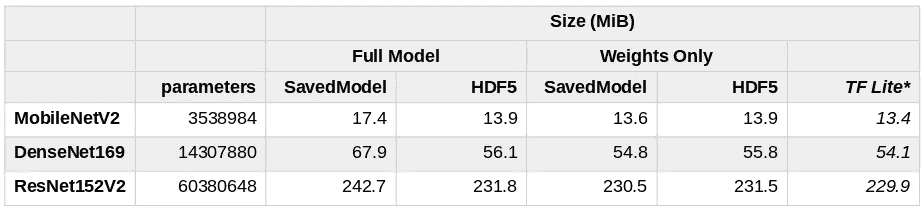
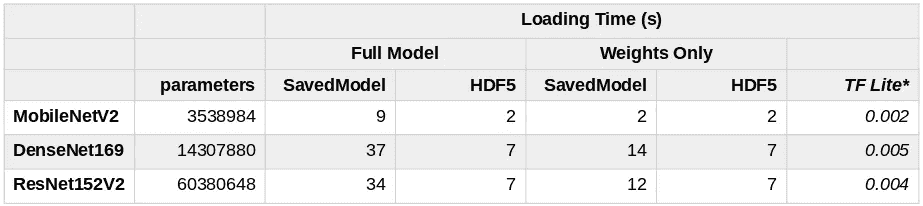
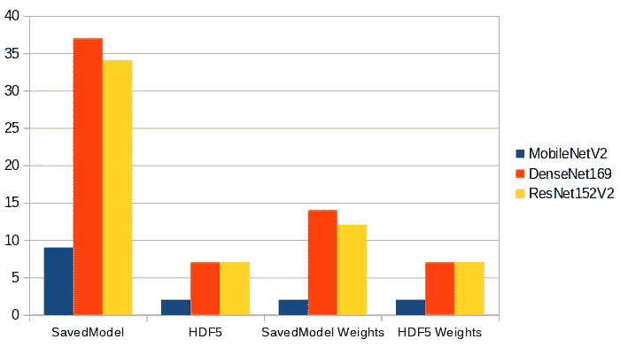

# TensorFlow 性能:加载模型

> 原文：<https://towardsdatascience.com/tensorflow-performance-loading-models-fb2d0dc340a3?source=collection_archive---------43----------------------->

## 有许多方法可以保存训练好的模型。但是哪种格式加载最快呢？

Kolleen Gladden 在 [Unsplash](https://unsplash.com?utm_source=medium&utm_medium=referral) 上拍摄的照片

模型的加载时间有时是一个被忽视的质量。然而，我们不能总是依赖我们的模型在缓存中舒适地等待，我们仍然需要快速预测。在这种情况下选择什么格式？最近我遇到了这个问题，我很惊讶两者之间的差异有多大。我希望以下对我的发现的简要总结会对你有所帮助。

# 测量环境和模型

我不打算对这个话题做全面的研究。相反，我将向你展示我在装有 Arch Linux 和最新的 **TensorFlow 2.2** 和 **Python 3.8** 的笔记本电脑上测得的加载时间。(我也试过 TensorFlow 2.3rc0，结果差不多。)我将为您提供[完整的脚本](https://github.com/liborvaneksw/tf-performance/blob/master/model_loading.py)，以便您可以在自己选择的环境中重现这些实验。如果你能在这种情况下与我分享结果，我会很高兴。

我对深度**卷积神经网络** (CNN)很感兴趣。我挑选了三个参数数量不同的知名模型——[MobileNet V2](https://www.tensorflow.org/api_docs/python/tf/keras/applications/MobileNetV2)、 [DenseNet201](https://www.tensorflow.org/api_docs/python/tf/keras/applications/DenseNet201) 和 [Resnet152 V2](https://www.tensorflow.org/api_docs/python/tf/keras/applications/ResNet152V2) 。所有这些都是 [tf.keras.applications](https://www.tensorflow.org/api_docs/python/tf/keras/applications) 模块的一部分，很容易用于迁移学习。

# 可用选项

TensorFlow 2 支持两种基本格式— **SavedModel** 和 **HDF5** 。您可以保存整个模型，也可以只保存模型的重量。在后一种情况下，您必须重新创建模型架构，然后加载保存的权重。(为了详尽起见，您可以只保存架构，但是我们目前对这个选项不感兴趣。我们希望能够做出预测。)在[官方文档](https://www.tensorflow.org/guide/keras/save_and_serialize)中有很多信息，详情请参考那里。我觉得在这里重新表述是多余的。

小注意，我将`save()`方法的`include_optimizer`参数设置为`False.`，这对加载时间没有太大影响，但是我们的用例中不需要优化器，所以让我们忽略它。

## TensorFlow Lite

除此之外， [TensorFlow Lite](https://www.tensorflow.org/lite/guide/get_started) 不得不提。它有自己的格式。由于精简版是为移动、嵌入式和物联网设备设计的，该模型应该更快。用于预测和加载。尤其是当你用强大的服务器代替我们的智能手机的时候。不幸的是，一切都是有代价的。如这里所解释的:

> 由于 TensorFlow Lite 操作集小于 TensorFlow 的操作集，因此并非每个模型都是可转换的。即使对于受支持的操作，出于性能原因，有时也需要非常具体的使用模式。我们希望在未来的 TensorFlow Lite 版本中扩展支持的操作集。

# 结果

要了解模型在参数数量和占用空间方面有多大，请查看下表。

所选模型的大小(参数，MiB)。(*不同的解释者，不等于其余者。)

现在，让我们看看装货时间。我还包括了参数的数量，所以您不需要参考上面的表。在“仅**重量**一栏中，测量的时间用于**重新创建**模型和**加载**保存的重量。

所选模型的加载时间。(*不同的解释者，不等于其余者。)

或者你喜欢图表的话，可以在下面图形化的看到。我省略了 TensorFlow lite，因为数量级是如此不同。

需要解释吗？新的 SavedModel 格式为我们提供了比旧的 HDF5 模型更好的改进。(我一直不喜欢`custom_objects`这个参数。)不幸的是装载时间非常糟糕。另一方面，TensorFlow lite 在这方面似乎做了很多工作。

# 我们能优化模型吗？

不直接针对模型尺寸。在[官方文档](https://www.tensorflow.org/model_optimization)中有不少关于优化的资源。本页面主要关注 TensorFlow Lite，包括模型选择、训练和训练后优化。除此之外，您还可以直接查看适用于标准模型的 [TensorFlow 模型优化 Python API](https://www.tensorflow.org/model_optimization/api_docs/python/tfmot) 。

您可以使用两种简单的方法:

*   **量化**:将权重转换为预测减少的类型，
*   **修剪**:去除无关紧要的权重。

你可以想象，这些方法影响了机器学习循环的许多部分。这包括模型大小，因此也包括加载时间，但主要关注的是预测时间，其副作用是精度可能会降低。

因此，这些技术高度依赖于您问题领域。因此，我不认为我能得出足够一般的结论，对本文有用。你需要尝试。请随意[下载我的脚本](https://github.com/liborvaneksw/tf-performance/blob/master/model_loading.py)来测量模型加载时间，并添加您自己的优化模型进行比较。

# 最后的想法

要记住的关键点很简单，就像博文本身一样。装载时间是一个问题。在你为你的问题选择合适的模型之前，你应该考虑如何使用它。你需要快速启动吗？也许你应该选择 TensorFlow Lite。并选择仅包含受支持操作的模型。有很多，但是如果你忽略了这一部分，最后的惊喜可能不会令人愉快。

希望这篇文章对你有用。请随时评论，批评，提问！谢谢你的关注。