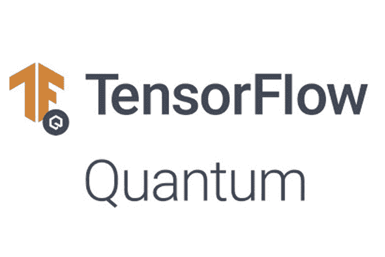
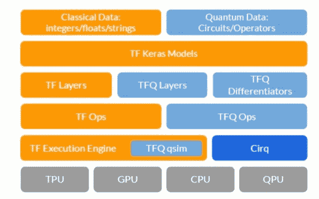

# 张量流量子:美女与野兽

> 原文：<https://towardsdatascience.com/tensorflow-quantum-beauty-and-the-beast-98dee3090ae?source=collection_archive---------49----------------------->

所以，我们终于来了，在漫长的等待之后，我们将进入一个量子计算的时代。TFQ，张量流之美和量子计算的兽性。

**量子计算**正在成为 2020 年更近距离观察的技术。我们已经看到了[霍尼韦尔](https://www.honeywell.com/en-us/company/quantum)、[谷歌](https://research.google/teams/applied-science/quantum/)和其他公司最近的一些公告，值得期待今年会有新的硬件出现。现在，谷歌提出了一个新的机器学习框架，用于以研究为目的的量子计算实验。

来源:[https://www.tensorflow.org/quantum/overview](https://www.tensorflow.org/quantum/overview)

# 定义量子计算机

1930 年，艾伦·特纳发明了车床。它由无限长的胶带组成，也就是无限长的胶带，再被分成小方块。每个方块可以包含一个符号(1 或 0)，也可以是空白。之后，有一个读/写设备读取这些符号，并相应地向机器发出所有指令。这就是我们的传统计算机过去的工作方式。

在量子翻转机中，有一个微小的差异会造成性能上的巨大差距，即磁带。在量子机器中，磁带以量子状态存在。这意味着磁带上的符号可以是 0 或 1。换句话说**，**这两个符号同时是 0 和 1。虽然普通的图灵机一次只能执行一次计算，但量子图灵机可以一次执行多次计算。

量子计算机不限于两种状态；它们将信息编码为量子位，或**量子位**，可以叠加存在。

所以这里最重要的是**量子位**。

**量子位**代表原子、电子以及它们各自的控制装置，它们一起工作，充当计算机存储器和处理器。因为量子计算机可以同时包含这些多种状态。它有可能比当今最强大的超级计算机强大数百万倍。

# 量子计算的最新发展

日前， [Google AI](https://ai.google/) ，宣布发布 [TensorFlow Quantum](https://www.tensorflow.org/quantum) ，这是一个用于[量子机器学习](https://en.wikipedia.org/wiki/Quantum_machine_learning)模型快速成型的开源库。他们并不孤单，因为他们得到了滑铁卢大学和大众汽车的帮助。

TensorFlow Quantum 的核心思想是在 TensorFlow 编程模型中交错量子算法和机器学习程序。谷歌将这种方法称为量子机器学习(QML)，并能够通过利用其最近的一些量子计算框架来实现它，如[谷歌 Cirq](https://github.com/quantumlib/Cirq) 。

所以这里的主要问题是:

# cirq 是什么？

**Cirq** 是一个为设备调用量子电路的开源框架。cirq 背后的主要思想是提供一个简单的编程模型，抽象出量子计算的基本构件。cirq 的基本结构包含量子位、门、测量算子，当然还有电路，这些都是量子计算所必需的东西。

根据 Google AI:“Cirq 使研究人员能够为特定的量子处理器编写量子算法。Cirq 为用户提供了对量子电路的微调控制，使用本机门指定门的行为，将这些门适当地放置在设备上，并在量子硬件的限制内安排这些门的时序”

因此，cirq 中包含以下关键构建模块:

*   **电路:**量子电路的基本形式由这些电路来表示。一个 Cirq 电路被表示为一个矩的集合，其中包括在一些抽象的时间滑动期间可以在量子位上执行的操作。
*   **Gates:** Gates 对量子位集合的抽象操作。
*   **时间表和设备:**简单来说，时间表由一组操作和时间表运行设备的描述组成。在量子计算方面，包括了更多关于门的时间和持续时间的详细信息。

# 张量流量子

TensorFlow Quantum 是一个用于混合量子-经典机器学习的库，开发/构建量子机器学习应用程序。它允许我们构建量子数据集，量子模型。

TFQ 提供了一个模型，抽象了与张量流、Cirq 和计算硬件的交互。栈顶是要处理的数据。经典数据由 TensorFlow 原生处理；TFQ 增加了处理量子数据的能力，包括量子电路和量子算符。堆栈的下一层是 TensorFlow 中的 Keras API。因为 TFQ 的核心原则是与核心 TensorFlow 的本机集成，特别是与 Keras 模型和优化器的集成。在 Keras 模型抽象的下面是我们的量子层和微分器，当与经典张量流层连接时，它支持混合量子-经典自动微分。在这些层和竞争优势之下，TFQ 依赖于 TensorFlow ops，它实例化了数据流图。

来源:https://www.tensorflow.org/quantum/overview

从执行的角度来看，TFQ 遵循以下步骤来训练和建立 QML 模型。

*   **准备一个量子数据集**:量子数据作为张量加载，指定为 [Cirq](https://github.com/quantumlib/Cirq) 中写的量子电路。张量由 TensorFlow 在量子计算机上执行，生成量子数据集。
*   **评估量子神经网络模型:**在这一步中，研究人员可以使用 Cirq 构建一个量子神经网络原型，稍后他们会将它嵌入 TensorFlow 计算图中。
*   **样本或平均值:**该步骤利用了对涉及步骤(1)和(2)的几次运行求平均值的方法。
*   **评估经典神经网络模型:**该步骤使用经典深度神经网络来提取在先前步骤中提取的度量之间的相关性。
*   **评估成本函数**:类似于传统的机器学习模型，TFQ 使用这个步骤来评估成本函数。如果量子数据被标记，这可以基于模型执行分类任务的准确程度，或者如果任务是无监督的，则基于其他标准。
*   **评估梯度&更新参数** —在评估成本函数后，管线中的自由参数应在预期降低成本的方向上更新。

**TFQ** 代表了该领域最重要的里程碑之一，并且利用了量子和机器学习领域的一些最佳知识产权。关于 **TFQ** 的更多细节可以在[项目网站](https://www.tensorflow.org/quantum)上找到。

最初发布于[https://blog . knol dus . com/tensor flow-quantum-beauty-and-the-beast/](https://blog.knoldus.com/tensorflow-quantum-beauty-and-the-beast/)

你们认为量子计算的未来会是怎样的？请在评论框中告诉我们…

快乐学习:-)