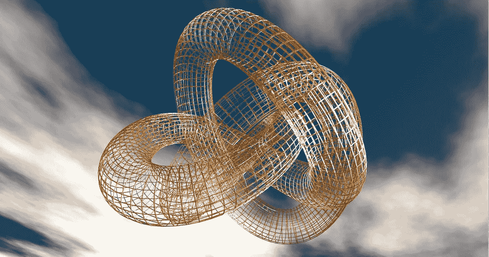
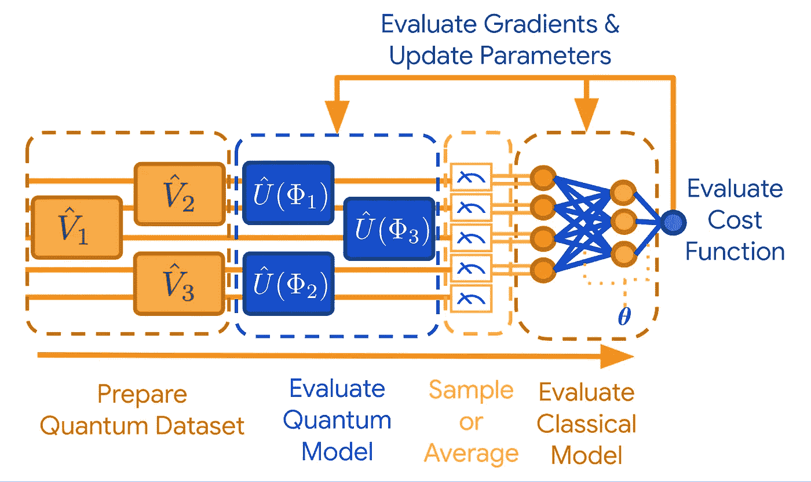

# 张量流量子:将机器学习与量子计算结合起来

> 原文：<https://towardsdatascience.com/tensorflow-quantum-marrying-machine-learning-with-quantum-computing-84533757e07f?source=collection_archive---------22----------------------->

## 谷歌开源了其新的量子计算机器学习库，名为 TensorFlow Quantum (TFQ)。

图片来源: [Pixabay](https://pixabay.com/illustrations/physics-quantum-physics-particles-3873118/)

# 介绍

2020 年 3 月 9 日， [Google AI](https://ai.google/) ，宣布发布 [TensorFlow Quantum](https://www.tensorflow.org/quantum) (TFQ)，这是一个用于[量子机器学习](https://en.wikipedia.org/wiki/Quantum_machine_learning)模型快速成型的开源库。他们并不孤单，因为他们得到了滑铁卢大学和大众汽车的帮助。

这个新框架为量子计算(QC)研究人员提供了必要的软件和设计工具，将机器学习的能力和可能性带入量子计算领域。

这是他们在量子计算软件平台中产品的自然发展。2018 年 3 月，[谷歌公布了 Cirq](https://ai.googleblog.com/2018/07/announcing-cirq-open-source-framework.html) ，这是一个用于噪声中等规模量子( **NISQ** )算法的开源框架。在最基本的层面上，TFQ 将 Cirq 与广受欢迎的深度学习框架 [TensorFlow](https://www.tensorflow.org/) 相集成，并为混合量子经典模型的设计和实现提供了强大的类、数据结构和方法。一方面，它具有与[tensor flow API](https://www.tensorflow.org/api_docs)兼容的量子计算抽象，另一方面，它拥有随时可用的高性能[量子电路](https://en.wikipedia.org/wiki/Quantum_circuit)模拟器。

但是它将帮助解决什么样的问题，它关注什么？

我们将很快讨论这个问题。然而，在进一步发展之前，这里有一个惊人的视频，以一种令人难以置信的有趣方式在高层次上介绍了量子计算的核心概念。

> TFQ 提供了必要的工具，将量子计算和机器学习研究社区聚集在一起，以控制和模拟自然或人工量子系统。

# NISQ:物理科学的新前沿

[约翰·普雷斯基尔](http://www.theory.caltech.edu/people/preskill/)，加州理工学院理论物理学教授理查德·p·费曼在其颇具影响力的论文“[NISQ 时代及以后的量子计算](https://arxiv.org/abs/1801.00862)”中指出，“*我们现在正处于探索物理科学新前沿的早期阶段，我们可以称之为复杂性前沿或纠缠前沿*”。

他继续进一步解释这一点——“现在，人类历史上第一次，我们获得并完善了构建和精确控制许多粒子的非常复杂、高度纠缠的量子状态的工具，这些状态如此复杂，以至于我们无法用最好的数字计算机模拟它们，也无法用现有的理论工具很好地描述它们的特征。这种新兴能力将为新发现打开大门。

## 近期(不完善的)量子器件

量子计算和/或信息处理系统有着漫长而复杂的历史。今天，在 2020 年，几乎毫无疑问的是，制造必要数量的高质量[量子位](https://en.wikipedia.org/wiki/Qubit)和[量子门](https://en.wikipedia.org/wiki/Quantum_logic_gate)的实用方法的商业化还需要几十年的时间。这主要是由于这些系统固有的噪声问题。这种噪声使得量子系统的真正缩放(到更大数量的门)变得极其困难，并且使得量子计算设备变得不稳定和不可靠。

然而，研究人员对近期量子设备的强大用途和可能性越来越感兴趣。这些尺寸适中的设备(50-100 量子位)被称为噪声中等规模量子(NISQ)，主要是为固定应用而设计的，可以忍受伴随它们的噪声缺陷。

 [## 量子技术成熟了

### 从热硅点量子位到离子阱，科学家们正在研究创新的方法来构建更复杂和更强大的…

www.sciencemag.org](https://www.sciencemag.org/features/2019/11/quantum-technology-comes-age) 

这类算法和装置提供了模拟和分析从经典计算观点来看难以处理的系统特性的真正可能性。

这听起来很有趣！但是，有哪些这样的系统的例子，它们的工作不可能用经典的计算机/算法来模拟，但是这种 NISQ 技术正好适合呢？

## 利基但有价值的应用领域

对于量子设备的许多应用，如[密码术](https://en.wikipedia.org/wiki/Cryptography)，噪声造成了严重的限制，并可能导致不可接受的误差水平。NISQ 设备不太可能在短期内用于此类应用。因此，金融和商业安全系统中的人们还不需要担心。就目前而言，像 [RSA-128](https://en.wikipedia.org/wiki/RSA_(cryptosystem)) 这样久经考验的算法是安全的。

但是密码学并不是量子计算唯一可能的应用领域。NISQ 设备和算法使得深入探索复杂分子和先进纳米材料的特性成为可能。它们还允许高精度和高保真度模拟极端物理，如粒子-粒子相互作用，或高能原子碰撞。

人们可以想象这些能力可能应用于各种各样的领域…

*   药物发现
*   纳米材料合成
*   基因工程和个性化医疗
*   化学工程和材料科学
*   粒子物理学
*   半导体和电子设备
*   光纤、光子学和高速通信

[NISQ 系统的渐进和稳定的进展](https://www.sciencemag.org/features/2019/11/quantum-technology-comes-age)已经让科学家、研究人员和企业高管对这些应用(以及更多)感到兴奋。然而，需要认识到的是，随着 TFQ 等工具包的发布，所有这些应用现在都可以充分利用深度神经网络的强大机制，并将基础物理与大数据的力量相结合。

> 这类算法和装置提供了模拟和分析从经典计算观点来看难以处理的系统特性的真正可能性。

# TFQ 关注的是什么？

## 具有近期目标的开源理念

量子计算的前景有着漫长而复杂的历史。然而，越来越多的研究人员呼吁 T2 关注可以在 5 年时间范围内解决的实际问题。TFQ 在一个合适的时机被释放，以利用这一运动和研究势头。

如上所述，TFQ 是围绕 **Cirq** 构建的，Cirq 是为探索中等规模、高噪声的 QC 架构是否能够解决经典数字计算机器难以解决的实际问题而设计和优化的。尊重开源哲学的传统，Cirq 是在 Apache 2 许可下发布的。未来的开源 QC 框架可以利用并嵌入 Cirq 方法和工具，而没有任何版权限制。

## 优化量子电路的数据结构

各种电路设计原语、逻辑门的灵活行为和功能描述、对高度优化的时序和布局设计工具的访问，是任何数字设计框架的一些期望特征。

量子逻辑设计在这些方面没有什么不同。像 Cirq 这样的工具正好为研究人员提供了这些。在 Cirq 中，[谷歌声称](https://github.com/quantumlib/Cirq)，数据结构已经被优化用于编写和编译大量的量子电路描述，以允许用户从现代 NISQ 架构中获得最大收益。作为一个开源项目，它在不断地发展和添加新的抽象和工具。本地支持本地模拟和与未来量子硬件或云上更大模拟器的轻松集成。

## 特别关注化学

在谷歌宣布 Cirq 的同时(2018 年)，他们还宣布了 OpenFermion 和 OpenFermion-Cirq 的上市。

[**Github repo for OpenFremion**](https://github.com/quantumlib/OpenFermion)。

[**Github Repo for OpenFermion-Cirq**](https://github.com/quantumlib/OpenFermion-Cirq)。

根据这篇[谷歌人工智能博客](https://ai.googleblog.com/2018/07/announcing-cirq-open-source-framework.html)，“OpenFermion 是一个为化学问题开发量子算法的平台，OpenFermion-Cirq 是一个开源库，将量子模拟算法编译到 Cirq ”。

谷歌的[量子人工智能团队](https://research.google.com/teams/quantumai/)已经用新的量子算法进行了一段时间的实验，特别是，他们已经探索了开发[低复杂度算法的可能性，用于量子化学领域的快速原型制作](https://ai.googleblog.com/2018/03/reformulating-chemistry-for-more.html)。OpenFermion 建立在这些进步的基础上，帮助用户将化学问题的细节(例如[分子动力学](https://www.wiley.com/en-us/Molecular+Kinetics+in+Condensed+Phases%3A+Theory%2C+Simulation%2C+and+Analysis-p-9781119176794)或[反应能量学](https://www.chemguide.co.uk/physical/energetics/basic.html))转化为优化的量子电路。这些电路也可以调整和定制，以运行在特定的硬件(如电子，光子或分子)。

图片来源: [Pixabay](https://pixabay.com/illustrations/chemistry-school-color-bottles-3d-740453/)

> 数据结构已经针对编写和编译大量量子电路描述进行了优化，以允许用户充分利用现代 NISQ 架构。

## 量子数据的解开

NISQ 处理器生成的量子力学数据本身就有噪声，并且通常[纠缠](https://en.wikipedia.org/wiki/Quantum_entanglement)(在测量之前)。然而，量子 ML 技术的最大效用之一是它们能够应用于这种嘈杂和纠缠的数据，以促进经典信息的提取，这可以用任何数字计算架构来处理。

基于这些技术，TFQ 图书馆促进了强大模型和工作流的开发，这些模型和工作流解开并概括了量子数据中的相关性。一方面，这鼓励研究人员提高新量子架构的质量和复杂性，另一方面，它加快了新量子算法的发展。

图片来源: [Pixabay](https://pixabay.com/illustrations/knot-fixing-connection-torus-242409/) 。

## 混合量子经典工作流

由于其相当有限的尺寸(即门数)和噪声行为，NISQ 处理器仍然需要与经典处理器在一个紧密的循环中工作，以产生有意义的计算输出。对于 ML 工作负载，这意味着采用与经典深度学习模型紧密耦合的 NISQ 处理器的循环。混合方法至关重要。

现在，在经典 ML 的世界里，TensorFlow 是最受尊敬和广泛使用的平台之一。它支持跨越各种计算硬件的[异构](http://download.tensorflow.org/paper/whitepaper2015.pdf)和[千万亿次计算](https://www.nextplatform.com/2019/02/04/running-tensorflow-at-petascale-and-beyond/)——CPU、GPU、TPU，甚至 FPGAs 或定制 ASICs。因此，毫不奇怪，Google 选择这个框架来与 Cirq 平台集成，从而将 QC 工具的范围扩展到最广泛的硬件架构。

这是一个奇妙的世界，编译器、调度器和优化器与量子位、量子门、电路和[测量算子](http://www.eng.fsu.edu/~dommelen/quantum/style_a/ops.html)无缝融合。可以使用标准 [Keras](https://www.tensorflow.org/guide/keras/overview) 函数来完成受监督的 ML 训练，并且通过标准 [TensorFlow Ops](https://www.tensorflow.org/guide/create_op) 来获得演化成经典概率分布的量子测量的最终结果。

从[谷歌的白皮书](https://arxiv.org/abs/2003.02989)来看，这是工作流程的样子，

图片来源:[https://ai . Google blog . com/2020/03/announcing-tensor flow-quantum-open . html](https://ai.googleblog.com/2020/03/announcing-tensorflow-quantum-open.html)

有关更多详细信息，请参考这篇综合论文，

 [## TensorFlow Quantum:量子机器学习的软件框架

### 我们介绍 TensorFlow Quantum (TFQ)，这是一个开源库，用于混合量子-经典…

arxiv.org](https://arxiv.org/abs/2003.02989) 

> 可以使用标准 [Keras](https://www.tensorflow.org/guide/keras/overview) 函数来完成受监督的 ML 训练，并且通过标准 [TensorFlow Ops](https://www.tensorflow.org/guide/create_op) 来获得演化成经典概率分布的量子测量的最终结果。

# 摘要

这是一个激动人心的时刻。

一方面，由于机器学习和人工智能工具和算法辅助下的数据驱动智能的大规模爆炸，科学、技术、商业和社会正处于变革的风口浪尖。

另一方面，物理科学的传统前沿(粒子物理学和宇宙学——对超小和超大的研究)正在让位于对量子设备和信息系统形式的超复杂的研究。

我们只能希望，这两股如此强大而深远的技术潮流的融合，对人类社会和整个地球生命的进步是一个好兆头。

像 TFQ 这样的开源计算平台的发布只是这个旅程中的一小步，但肯定不会是最后一步。

如果您有任何问题或想法要分享，请联系作者在[**tirthajyoti【AT】Gmail . com**](mailto:tirthajyoti@gmail.com)。此外，您可以查看作者的 [**GitHub**](https://github.com/tirthajyoti?tab=repositories) **资源库**中的代码、想法和机器学习和数据科学方面的资源。如果你和我一样，对人工智能/机器学习/数据科学充满热情，请随时[在 LinkedIn 上添加我](https://www.linkedin.com/in/tirthajyoti-sarkar-2127aa7/)或[在 Twitter 上关注我](https://twitter.com/tirthajyotiS)。

 [## Tirthajyoti Sarkar - Sr .首席工程师-半导体、人工智能、机器学习- ON…

### 通过写作使数据科学/ML 概念易于理解:https://medium.com/@tirthajyoti 开源和有趣…

www.linkedin.com](https://www.linkedin.com/in/tirthajyoti-sarkar-2127aa7/)