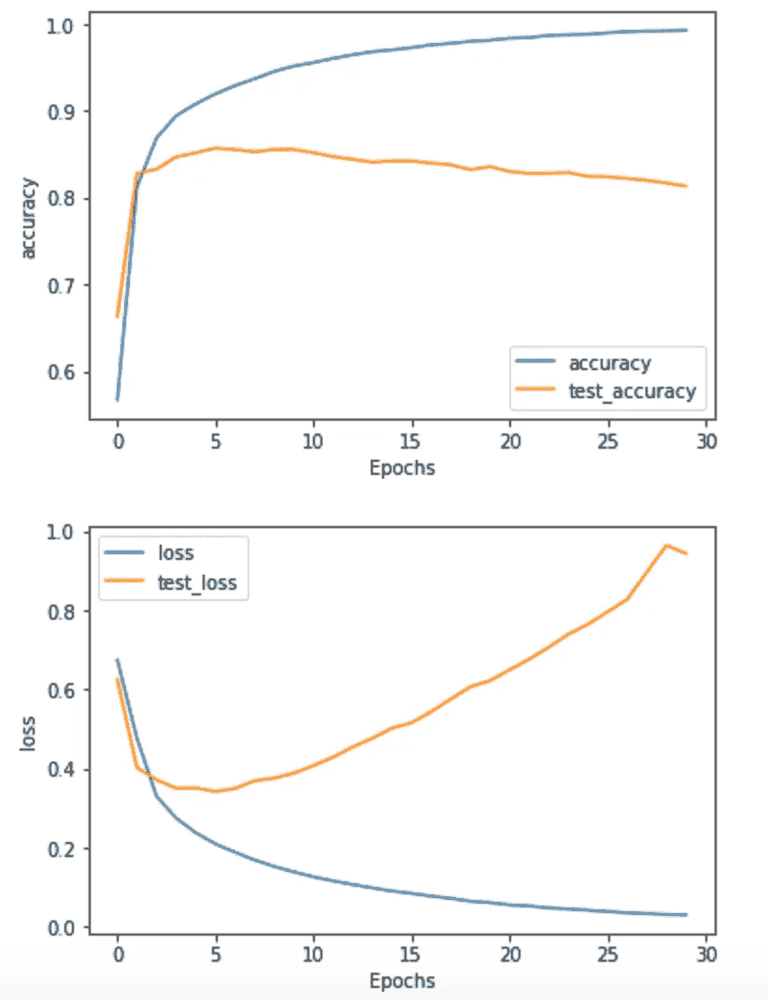

# 张量流:20 分钟内发现讽刺

> 原文：<https://towardsdatascience.com/tensorflow-sarcasm-detection-in-20-mins-b549311b9e91?source=collection_archive---------26----------------------->

## 从头开始在 TensorFlow 中构建您的第一个 NLP 模型


Joshua Hoehne 在 [Unsplash](https://unsplash.com/s/photos/dictionary?utm_source=unsplash&utm_medium=referral&utm_content=creditCopyText) 上拍摄的照片

这是 TensorFlow 中的一个快速自然语言处理(NLP)教程。NLP 是人工智能的一个子领域，涉及通过计算机理解、解释和操纵人类语言。TensorFlow 是 Google 的开源机器学习库。本教程假设对 Python 有中级了解，对机器学习有基本了解，要求 Python 3 配 TensorFlow 2.x，本教程结束后，你将能够训练自己的挖苦检测模型。

我们想建立一个神经网络[分类器](https://en.wikipedia.org/wiki/Statistical_classification)来检测文本中的讽刺。为此，我们将使用[‘rish abh Misra 的新闻标题数据集中的讽刺’](https://rishabhmisra.github.io/publications/)。以下代码解析数据集-

```
# Importing required libraries
import json
import tensorflow as tf
import requests
import numpy as np
import pandas as pd
from tensorflow.keras.preprocessing.text import Tokenizer
from tensorflow.keras.preprocessing.sequence import pad_sequences# Get the dataset
srcsm_json = requests.get('[https://storage.googleapis.com/laurencemoroney-blog.appspot.com/sarcasm.json'](https://storage.googleapis.com/laurencemoroney-blog.appspot.com/sarcasm.json'))# Inspecting the data, print 450 characters
print(srcsm_json.text[0:450])>>> [
>>> {"article_link": "https://www.huffingtonpost.com/entry/versace- >>> black-code_us_5861fbefe4b0de3a08f600d5", "headline": "former 
>>> versace store clerk sues over secret 'black code' for minority >>> shoppers", "is_sarcastic": 0},
>>> {"article_link": "https://www.huffingtonpost.com/entry/roseanne- >>> revival-review_us_5ab3a497e4b054d118e04365", "headline": "the >>>'roseanne' revival catches up to our thorny political mood, for >>> better and worse", "is_sarcastic": 0},# Separate the json into sentences and labels
sentences = []
labels = []for item in srcsm_json.json():
    sentences.append(item['headline'])
    labels.append(item['is_sarcastic'])print(pd.DataFrame({'sentence' : sentences[0:10], 'label':labels[0:10]}))>>>                                            sentence  label
>>> 0  former versace store clerk sues over secret 'b...      0
>>> 1  the 'roseanne' revival catches up to our thorn...      0
>>> 2  mom starting to fear son's web series closest ...      1
>>> 3  boehner just wants wife to listen, not come up...      1
>>> 4  j.k. rowling wishes snape happy birthday in th...      0
>>> 5                        advancing the world's women      0
>>> 6     the fascinating case for eating lab-grown meat      0
>>> 7  this ceo will send your kids to school, if you...      0
>>> 8  top snake handler leaves sinking huckabee camp...      1
>>> 9  friday's morning email: inside trump's presser...      0
```

我们有了句子的初始数据集和相应的标签 1 或 0，表明该句子是否是讽刺性的。讽刺分类器将使用句子作为输入，并预测标签。在我们开始训练分类器之前，我们需要以计算机可以处理的方式来表示输入数据，即句子。

这是通过标记化和排序的结合来实现的。标记化是一项将字符串分割成多个部分(称为标记)的任务，同时丢弃某些字符，如标点符号。标记化为每个唯一的单词分配一个数字。排序建立在标记化的基础上，将句子表示为一系列数字。

在实践中，我们的分类器可能会遇到它在训练数据中没有见过的单词，在这种情况下，分类器将完全忽略这些单词，从而导致一些信息丢失。为了最大限度地减少信息损失，在标记化过程中，我们分配一个标记来表示所有看不见的(词汇之外的)单词。对于处理可变长度句子的神经网络，我们使用填充。在填充中，我们设置了句子的最大允许长度，所有短于最大长度的句子将被填充以匹配最大长度。相反，所有超过最大长度的句子将被截断以匹配最大长度。以下代码执行标记化和排序-

```
# Splitting the dataset into Train and Test
training_size = round(len(sentences) * .75)training_sentences = sentences[0:training_size]
testing_sentences = sentences[training_size:]
training_labels = labels[0:training_size]
testing_labels = labels[training_size:]# Setting tokenizer properties
vocab_size = 10000
oov_tok = "<oov>"# Fit the tokenizer on Training data
tokenizer = Tokenizer(num_words=vocab_size, oov_token=oov_tok)
tokenizer.fit_on_texts(training_sentences)word_index = tokenizer.word_index# Setting the padding properties
max_length = 100
trunc_type='post'
padding_type='post'# Creating padded sequences from train and test data
training_sequences = tokenizer.texts_to_sequences(training_sentences)
training_padded = pad_sequences(training_sequences, maxlen=max_length, padding=padding_type, truncating=trunc_type)testing_sequences = tokenizer.texts_to_sequences(testing_sentences)
testing_padded = pad_sequences(testing_sequences, maxlen=max_length, padding=padding_type, truncating=trunc_type)
```

在这个阶段，我们准备根据我们的数据训练一个神经网络，我们有代表句子的数字序列。为了确定序列中的某些内容是否具有讽刺意味，我们使用了嵌入的概念。假设我们用向量来表示单词，比如单词‘good’用(1，0)来表示，与 good 相反的单词‘bad’用(-1，0)来表示。表示积极意义的词将接近(1，0)，而表示消极意义的词将接近(-1，0)。如果我们将这个框架扩展到多个维度，一个句子可以由句子中单词的向量之和来表示。当神经网络分类器学习检测讽刺时，它在这些多维度中学习方向。讽刺的句子会有很强的讽刺方向的成分，其他的句子会有很强的不讽刺方向的成分。随着我们用更多数据训练神经网络分类器，这些方向可能会改变。当我们有一个经过充分训练的神经网络分类器时，它可以对句子中所有单词的向量求和，并预测句子是否是讽刺性的。

最终的神经网络由学习每个单词方向的顶层嵌入组成，下一层是将向量相加的全局平均池，下一层是深度神经网络，最后一层是返回句子讽刺的概率的 sigmoid 层。以下代码训练神经网络-

```
# Setting the model parameters
embedding_dim = 16model = tf.keras.Sequential([
    tf.keras.layers.Embedding(vocab_size, embedding_dim, input_length=max_length),
    tf.keras.layers.GlobalAveragePooling1D(),
    tf.keras.layers.Dense(24, activation='relu'),
    tf.keras.layers.Dense(1, activation='sigmoid')
])model.compile(loss='binary_crossentropy',optimizer='adam',metrics=['accuracy'])model.summary()>>> Model: "sequential_4"
>>> ________________________________________________________________
>>> Layer (type)                 Output Shape              Param #   
>>> ================================================================
>>> embedding_4 (Embedding)      (None, 100, 16)           160000    
>>> ________________________________________________________________
>>> global_average_pooling1d_4 ( (None, 16)                0         
>>> ________________________________________________________________
>>> dense_8 (Dense)              (None, 24)                408       
>>> ________________________________________________________________
>>> dense_9 (Dense)              (None, 1)                 25        
>>> ================================================================
>>> Total params: 160,433
>>> Trainable params: 160,433
>>> Non-trainable params: 0
>>> ________________________________________________________________ # Converting the lists to numpy arrays for Tensorflow 2.x
training_padded = np.array(training_padded)
training_labels = np.array(training_labels)
testing_padded = np.array(testing_padded)
testing_labels = np.array(testing_labels)# Training the model
num_epochs = 30history = model.fit(training_padded, training_labels, epochs=num_epochs, validation_data=(testing_padded, testing_labels), verbose=2)>>> Train on 20032 samples, validate on 6677 samples
>>> Epoch 1/30
>>> 20032/20032 - 2s - loss: 0.6742 - accuracy: 0.5669 - val_loss: >>> 0.6247 - val_accuracy: 0.6629
>>> Epoch 2/30
>>> 20032/20032 - 1s - loss: 0.4758 - accuracy: 0.8121 - val_loss:  >>> 0.4018 - val_accuracy: 0.8278
>>> Epoch 3/30
>>> 20032/20032 - 1s - loss: 0.3293 - accuracy: 0.8686 - val_loss: >>> 0.3708 - val_accuracy: 0.8327
>>> ...
>>> ...
>>> Epoch 29/30
>>> 20032/20032 - 1s - loss: 0.0310 - accuracy: 0.9920 - val_loss: >>> 0.9636 - val_accuracy: 0.8167
>>> Epoch 30/30
>>> 20032/20032 - 1s - loss: 0.0297 - accuracy: 0.9925 - val_loss: >>> 0.9431 - val_accuracy: 0.8131
```

神经网络能够在训练数据集上实现 99%的准确度，在测试数据集上实现 81%的准确度。



让我们通过使用该模型预测两个新句子来进行最后的健全性检查。

```
sentence = ["Coworkers At Bathroom Sink Locked In Tense Standoff Over Who Going To Wash Hands Longer", 
            "Spiking U.S. coronavirus cases could force rationing decisions similar to those made in Italy, China."]
sequences = tokenizer.texts_to_sequences(sentence)
padded = pad_sequences(sequences, maxlen=max_length, padding=padding_type, truncating=trunc_type)
print(model.predict(padded))>>>[[0.99985754]
>>> [0.0037319 ]]
```

该模型预测,“浴室洗手池的同事在谁洗手时间更长的问题上陷入紧张对峙”的概率非常高(几乎为 1 %),而“美国冠状病毒病例激增可能迫使类似意大利和中国做出的配给决定”的概率非常低(几乎为 0 ),这是讽刺。我们可以得出结论，我们的模型正在按预期工作。

本教程基于 YouTube 上 TensorFlow 的“[自然语言处理(NLP 零到英雄)](https://www.youtube.com/watch?v=fNxaJsNG3-s)”系列。这个教程的 Jupyter 笔记本可以在[这里](https://github.com/aadityaubhat/medium_articles/blob/master/sarcasm_detection/sarcasm_detection.ipynb)找到。

如果你觉得我们的工作有帮助，请考虑引用

```
@article{aadityaubhat2020sarcasm-detection,
  title={TensorFlow: Sarcasm Detection in 20 mins},
  author={Bhat, Aaditya},
  journal={Towards Data Science},
  year={2020},
  url={[https://towardsdatascience.com/create-geo-image-dataset-in-20-minutes-4c893c60b9e6](/tensorflow-sarcasm-detection-in-20-mins-b549311b9e91)}
}
```