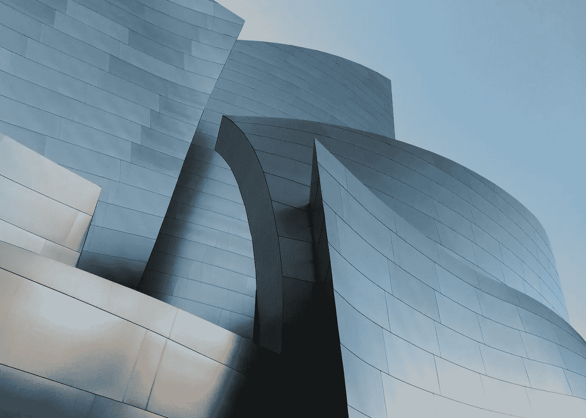
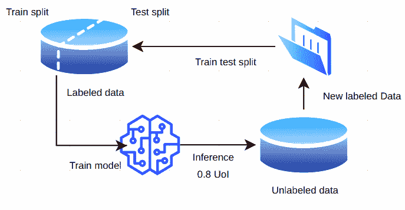
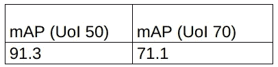
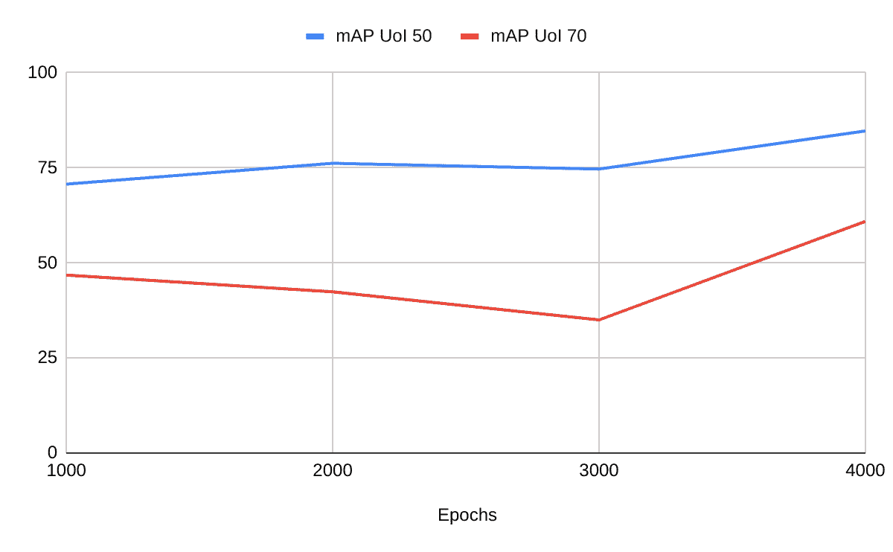
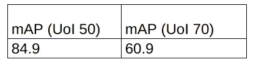
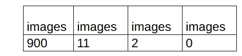
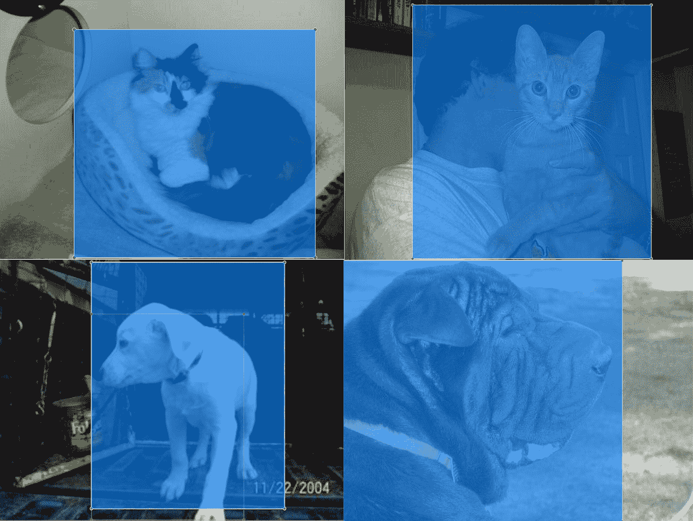
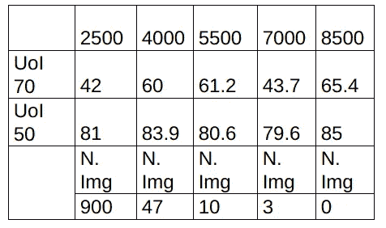

# 张量流半监督对象检测体系结构

> 原文：<https://towardsdatascience.com/tensorflow-semi-supervised-object-detection-architecture-757b9c88f270?source=collection_archive---------41----------------------->

## 测试整体模型性能时自动标记图像的简单方法。

托拜厄斯·凯勒在 [Unsplash](https://unsplash.com/s/photos/architecture?utm_source=unsplash&utm_medium=referral&utm_content=creditCopyText) 上的照片

目标检测是当今最流行和最常用的计算机视觉方法之一，其目的不仅在于以与最常见的分类问题相同的方式确定是否在图像中找到目标，还在于指出这些感兴趣的目标的位置，这是在多个目标可能同时出现在图像中的情况下的必要方法。

这种方法的挑战之一是创建数据集，一旦需要手动设置图像中所有对象的位置，在大量的观察中花费大量的时间来这样做。

> 这一过程效率低、成本高、耗时长，主要表现在一些需要在每幅图像中标注几十个物体或者需要专门知识的问题上。

基于此，我创建了 TensorFlow 半监督对象检测架构(TSODA)来交互式地训练对象检测模型，并使用它来基于置信度阈值水平自动标记新图像，将它们聚合到后期的训练过程中。

在本文中，我将向您展示在您的对象检测项目中重现这种方法的必要步骤。有了它，您将能够在测量模型性能的同时自动在图像中创建标签！

# 目录:

1.  **措达如何工作**
2.  **示例应用**
3.  **实施**
4.  **结果**
5.  **结论**

# TSODA 的工作原理

工作类似于任何其他半监督方法，其中使用标记和未标记的数据进行训练，不像最常见的监督方法。

使用手动完成的强标记数据训练初始模型，从这些数据中学习一些特征，然后在未标记数据中创建推断，以将这些新标记的图像聚集到新的训练过程中。

整个想法可以用下图来说明:

(字体:作者)

这个操作一直进行到达到停止标准，或者是执行的次数，或者是没有剩余的未标记数据。

正如我们在模式中看到的，最初配置了 80%的置信度阈值。一旦新图像将被用于新的训练过程，这是一个重要的参数，并且如果不正确地标记，可能产生不期望的噪声，破坏模型性能。

TSODA 的目的是介绍一种简单快速的方法，在你的目标检测项目中使用半监督学习。

# 示例应用程序

为了举例说明这种方法并测试是否一切正常，我们对 Asirra 数据集的 1，100 幅图像进行了随机抽样，每类样本占 50%。

这些图像被手动标记，以便稍后进行比较，你可以在 Kaggle 上下载相同的数据[。](https://www.kaggle.com/alvarole/asirra-cats-vs-dogs-object-detection-dataset)

我使用单次多盒探测器(SSD)作为对象检测架构，Inception 作为基础网络，而不是像在[原始论文](https://arxiv.org/pdf/1512.02325.pdf)中的 VGG 16。

SSD 和 Inception 在训练速度和准确性之间有很好的权衡，所以我认为这是一个很好的起点，主要是因为在每次迭代中，TSODA 需要保存训练模型的检查点，推断新的图像并加载模型以再次训练它，所以更快的训练有利于更多地迭代并将这些图像聚合到学习中。

## 测试性能

为了测试 TSODA 的性能，只提供了每个类别的 100 个标记图像来分成训练和测试，同时让 900 个图像作为未标记的，模拟只花很少时间来创建标记数据集的情况。将获得的结果与用所有手动标记的图像训练的模型进行比较。

数据被随机分成 80%的图像用于训练，20%用于测试。

# 履行

顾名思义，整个架构是使用 TensorFlow 环境完成的，在 2.x 版本中。

这个新的 TF 版本还不完全兼容对象检测，有些部分很难适应，但在接下来的几个月里，这将是所有项目中默认的和更多使用的 TF 版本，这就是为什么我认为调整代码以使用它是重要的。

为了创建 TSODA，新的脚本和文件夹被添加到 TF Model Garden repository 的一个分支中，这样你就可以很容易地克隆和运行你的半监督项目，除了为那些使用 TF 的人提供一个熟悉的结构之外。

你可以克隆我的[库](https://github.com/AlvaroCavalcante/tf-models)来轻松地遵循这些步骤或者修改你的 TF 模型库。

这项工作是在*models/research/object _ detection、*中完成的，在这里您会找到以下文件夹和文件:

*   ***inference _ from _ model . py*:**该文件将被执行以使用模型来推断新的图像。
*   ***generate _ XML . py****和****generate _ TF record . py***:都将用于创建训练和测试 TF 记录，用于对象检测模型的训练(这些脚本改编自 [*浣熊数据集*](https://github.com/datitran/raccoon_dataset) )。**
*   *****test_images*** 和 ***train_images*** 文件夹:有将要使用的 JPG 图像和 XML 文件。**
*   *****未标记 _ 图像*** 和 ***标记 _ 图像*** 文件夹:分别包含所有未标记的图像和算法自动标记的图像，这些图像将被分为训练和测试文件夹以保持比例。**

**在 utils 文件夹中，我们还有一些东西:**

*   *****generate _ xml . py***:该脚本负责获取模型推理并生成一个新的 XML，该 XML 将存储在*label _ images*文件夹中。**
*   *****visualization _ utils . py*:**这个文件在代码上也有一些修改，用来捕捉模型推断，并传递给“generateXml”类。**

**就是这样，这就是你需要在你的存储库中拥有的一切！**

## **准备环境**

**运行这个项目你不需要**任何东西！？****

> **训练过程是在一个谷歌 Colab 笔记本电脑，所以它的快速和简单的训练你的模型，你真的只需要用你的图像替换我的图像，并选择另一个基本模型，如果你和。**

**将[原始 Colab 笔记本](https://drive.google.com/file/d/1srnHOXFv779IGT0lKKGbTn8J-5dGSAX_/view?usp=sharing)复制到您的 Google Drive 并执行它。**

**如果你真的想在你的机器上运行 TSODA，在 Jupiter notebook 的开始你会看到安装要求，只要按照它做，但不要忘记也安装 TF 2.x，我建议创建一个虚拟环境。**

## **理解代码**

*****推理 _ 自 _ 模型. py*** 负责加载在训练中创建的*保存 _ 模型. pb* 并使用它在未标记图像中进行新的推理。大部分代码是从 *colab_tutorials* 文件夹中的**object _ detection _ tutorial . ipynb**获得的。**

**如果您不想使用 Colab 进行训练，您需要替换文件开头的路径。**

**该文件中的另一个重要方法是 ***partition_data*** ，它负责将推断的图像(将在*标签 _ 图像*文件夹中)分割成训练和测试，以保持相同的比率。**

**您可能想做的一个更改是分流比，在我的例子中，我选择了 80/20 的比例，但如果您想要不同的东西，您可以在方法参数中设置它。**

****visualization_utils.py** 是边界框被绘制到图像中的地方，因此我们使用它来获取框的位置、类名、文件名，并将其传递到我们的 XML 生成器中。下面的代码展示了这个过程的大部分:**

**如果在图像中检测到一个比指定可信度更高的框，则生成 XML。**

**所有信息到达 **generate_xml.py** 中，xml 是使用 ElementTree 创建的。**

**在代码中，有一些注释可以帮助你理解一切是如何工作的。**

# **结果**

**为了评估模型性能，使用了平均精度(mAP)，如果您对其工作原理有疑问，请查看[。](https://medium.com/@jonathan_hui/map-mean-average-precision-for-object-detection-45c121a31173)**

**第一个测试是通过 4000 个时期训练一个模型，使用所有强烈标记的图像。**

**训练持续大约 21 分钟，结果如表 1 所示。**

****

**表 2:使用正确标记的所有图像进行训练和测试的地图。(字体:作者)**

**正如预期的那样，该模型获得了高地图，主要是在较低的 UoI 率。**

**第二个测试是使用相同的配置完成的，但是 TSODA 只考虑了 100 个带标签的图像。在每次迭代中，该模型由 1000 个时期训练，然后用于推断和创建新的标记图像。结果如图 2 所示。**

****

**TSODA 中的模型收敛(font: Author)**

**整个训练过程用了三十八分钟，比上一次多了十七分钟左右，模型达到了更差的最终图，如表 2 所示:**

****

**第一次测试的最终地图。(字体:作者)**

**如表 3 所示，大多数图像在第一次迭代中被成功注释，在训练中被聚集。这可能意味着最小置信度阈值不够高，因为在前一千次迭代中，模型还没有正确收敛，可能会创建错误的注释。**

****

**迭代后剩余的未标记图像的数量(font: Author)。**

**TSODA 需要更多的时间和历元来提高模型性能并接近原始方法。发生这种情况的原因是，一旦模型需要学习如何概括新模式，在训练集中添加新图像会导致 mAP 丢失，如图 2 所示，其中 mAP 随着新图像的加入而减少，然后在模型学习新特征时再次开始增加。**

**在图 3 中，有一些图像自动注释的例子。值得注意的是，有些标签没有被很好地标记出来，但是这足以保证给模型提供更多的信息。**

****

**自动注释图像的示例。正如所见，如果由人来做，标签可能更适合对象。**

**考虑到不同的历元增量行为以及更高的置信度阈值，执行了一些新的实验。结果如表 4 所示:**

****

**使用第二种配置的结果！(字体:作者)**

**将置信度阈值设置为 90%可确保在预测中获得正确标签的几率更高，这是模型收敛的一个重要因素。虽然在初始迭代中对 2，500 个时期进行训练，而不是在第一次迭代中只对 1，000 个时期进行训练，因为第一次迭代是大多数图像被标记的地方，所以模型需要学习更多的特征，并且能够击败更高的置信度。在第一次迭代之后，随后的迭代增加 1，500 个历元，直到限制为 8，500 个。这些新配置改善了最终结果。**

**根据感兴趣对象的种类及其复杂性，TSODA 的性能可能会有所不同。如果通过更多的时期进行训练或者设置更高的置信度阈值，结果可以得到改善，缺点是增加了训练时间。此外，通过迭代的历元增量必须根据问题而改变，以基于未标记图像的数量和阈值来控制模型收敛。**

> **然而，这是一个很好的选择，一旦训练时间比需要人的手动标记时间更便宜，TSODA 的构建方式是，只需少量修改，就可以从头开始训练一个全新的大规模模型。**

**自动创建的标签也可以在一些图像中手动调整，这可以提高整体性能，并且比手动创建所有标签更快。**

# **结论**

**所提出的 TSODA 可以在为未标记图像创建新标记方面取得令人满意的结果，达到与强标记训练方法类似的结果，但需要相当少的人力。该解决方案还适用于任何其他 CNN 检测器架构，实施简单快速，有助于数据集创建过程，同时测量物体检测器的整体性能。**

# **参考**

**关于这个半监督项目的更多细节和背景，请看我的[预印本](https://www.researchgate.net/publication/343167804_Semi-supervised_approach_to_auto-label_images_in_object_detection)。**