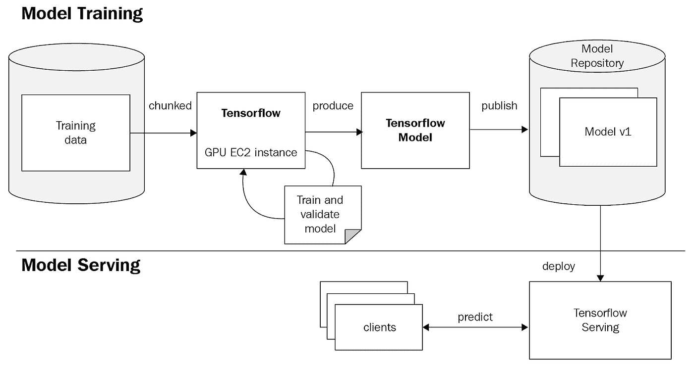

# Tensorflow 与 Docker 一起使用

> 原文：<https://towardsdatascience.com/tensorflow-serving-with-docker-9b9d87f89f71?source=collection_archive---------9----------------------->

## 张量流框架

## 如何将 ML 模型部署到生产中？


约瑟夫·巴里恩托斯在 [Unsplash](https://unsplash.com?utm_source=medium&utm_medium=referral) 上拍摄的照片

本文将指导您如何构建和训练一个简单的 CNN 模型，然后使用这个训练好的模型作为 Tensorflow 服务的端点。无论您是业余爱好者、ML 工程师、数据科学家还是 DevOps 人员，我相信在本文结束时您将能够部署 ML 模型。

# Tensorflow 服务的背景

Tensorflow Serving 是谷歌为生产机器学习系统设计的 API，谷歌和许多大型科技公司广泛使用这种 API。它使得用相同的服务器架构和 API 部署您的模型变得容易。它最适用于张量流模型，但我猜它也可以扩展到其他类型的模型。



图片取自 [Packt](https://static.packt-cdn.com/products/9781789139495/graphics/d5853eb7-9d7e-465d-aad2-a69916761ecb.png)

上图简要展示了从构建模型到使用 Tensorflow 服务将模型提供给端点的整个过程。为大多数类型的模型提供服务的最佳选择可能是在服务器上运行集中式模型，任何类型的设备(可能是桌面设备、移动设备或嵌入式设备)都可以从该服务器进行请求。然后服务器会为你做推理并返回预测。根据该预测，您可以将其呈现给任何设备。这种架构的一个很大的优点是，假设您有几个客户端访问集中在一个服务器上的端点。每个人都可以访问相同的模型版本，并可以无缝地享受更新的版本，而且通过添加负载平衡器，针对大量请求的扩展变得很容易。如果您将模型部署在每台客户机上，这将变得很困难，因此管理版本和发布新的更新变得很有挑战性。

> 现在让我们进入**工作模式**。

我们将训练一个神经网络模型来对服装上的图像进行分类(即 mnist 时尚数据集)，保存训练好的基于 TensorFlow 的模型，并用 Tensorflow 服务它。虽然，更多的焦点将集中在服务模型部分。

*您将在下面的 Git 资源库中找到所有代码。*[***Star this repository***](https://github.com/vjgpt/Tensorflow-Series/tree/master/tensorflow-serving)***关注我在 Medium，*** *我将在未来几周发布更多关于 Tensorflow 算法、ML 模型管道的更新，以及与 AWS 和 Azure 等云服务集成的示例。*

> 如果你在 Google Collab 中运行这些代码，那就很容易了。

[](https://github.com/vjgpt/Tensorflow-Series/tree/master/tensorflow-serving) [## VJ GPT/tensor flow-系列

### 此时您不能执行该操作。您已使用另一个标签页或窗口登录。您已在另一个选项卡中注销，或者…

github.com](https://github.com/vjgpt/Tensorflow-Series/tree/master/tensorflow-serving) 

```
import sys
# Confirm that we're using Python 3
assert sys.version_info.major is 3, 'Oops, not running Python 3.'import tensorflow as tf
from tensorflow import keras
import numpy as np
import os
import subprocess
```

在将数据输入模型之前对数据进行预处理。

```
# Model Version
VERSION = '00000123' fashion_mnist = keras.datasets.fashion_mnist
(train_images, train_labels), (test_images, test_labels) = fashion_mnist.load_data()# scale the values to 0.0 to 1.0
train_images = train_images / 255.0
test_images = test_images / 255.0# reshape for feeding into the model
train_images = train_images.reshape(train_images.shape[0], 28, 28, 1)
test_images = test_images.reshape(test_images.shape[0], 28, 28, 1) print('\ntrain_images.shape: {}, of {}'.format(train_images.shape, train_images.dtype))
print('test_images.shape: {}, of {}'.format(test_images.shape, test_images.dtype))
```

基于时尚 MNIST 数据构建和训练 CNN 模型

```
model = keras.Sequential([
keras.layers.Conv2D(input_shape=(28,28,1), filters=8, kernel_size=3,
strides=2, activation='relu', name='Conv1'),
keras.layers.Flatten(),
keras.layers.Dense(10, activation=tf.nn.softmax, name='Softmax')
])
model.summary()epochs = 15model.compile(optimizer='adam',
loss='sparse_categorical_crossentropy',
metrics=['accuracy'])
model.fit(train_images, train_labels, epochs=epochs) test_loss, test_acc = model.evaluate(test_images, test_labels)
print('\nTest accuracy: {}'.format(test_acc))
```

以 TensorFlow protobuf 格式保存训练好的模型。

```
saved_model_path = model.save(f"./tmp/{VERSION}", save_format='tf')
```

## 使用 SavedModel CLI 检查模型

SavedModel CLI 帮助您检查您的模型并检查模型的`SignatureDef's`。它为您提供了模型训练所依据的输入张量数据类型和形状的详细信息。因此，您必须以相同的格式向模型提供输入，并获得由`SignatureDef's`定义的输出。

```
import subprocesssubprocess.run([f"saved_model_cli show --dir ./tmp/{VERSION}/ --all"],shell=True)# Zipping the model as model.tar.gz
subprocess.run([f"tar cvfz model.tar.gz tmp/{VERSION}/"],shell=True)
```

我们将在本地机器上提供模型，所以我们需要压缩的模型文件和 JSON 文件，它们将被输入到模型中。
下载压缩的模型文件，这样您就可以在本地机器上部署它(假设您已经在 Google Collab 中运行了全部代码)。

```
from google.colab import filesfiles.download('model.tar.gz')
```

创建一个 JSON 文件，该文件将包含模型所需的输入`SignatureDef's`，然后将被传递到模型端点。

```
import json# Wrap bitstring in JSON
data = json.dumps({"signature_name": "serving_default", "instances": test_images[0:3].tolist()})json_file = open('predict.json', 'w')
json_file.write(data)
json_file.close()files.download('predict.json')
```

# 设置 Docker 环境

从官方网站[安装 Docker](https://docs.docker.com/install/)。

下载的快速链接:

*   macOS 的 Docker
*   [适用于 Windows 10 Pro 或更高版本的 Docker](https://docs.docker.com/docker-for-windows/install/)

让我们从最新的 Tensorflow 服务图像开始

```
docker pull tensorflow/serving
```

使用部署在 REST API 端点上的模型运行服务映像。

```
docker run -p 8501:8501 --mount type=bind,source=/path/to/the/unzipped/model/tmp/,target=/models/fashion_mnist -e MODEL_NAME=fashion_mnist -t tensorflow/serving
```

现在，您的 docker 容器正在运行 Tensorflow 服务模型服务器，绑定 REST API 端口 8501，并将模型从我们的主机映射到容器中预期的位置。还传递了一个环境变量，这对查询我们的模型很重要。

您可以使用预测 API 查询模型

```
curl -d ‘{"signature_name": "serving_default", "instances": [[[[0.0], [0.0]…………….[0.0]]]]}’ -X POST http://localhost:8501/v1/models/fashion_mnist:predict
```

或者您可以在本地机器上运行下面的脚本来获得预测

太棒了，现在您的模型不会在您的本地系统中丢失，但是您可以将您的模型部署到生产中，以便人们可以使用它。

您已经使用本地系统中的 Tensorflow 服务成功创建了一个端点。我将会发布更多的博客来运行相同的和其他几种类型的云服务模式。

如果这对你有帮助，就发微博，让人们部署他们的模型，因为这有点复杂，是机器学习生命周期的关键部分。

[***Star this repository***](https://github.com/vjgpt/Tensorflow-Series/tree/master/tensorflow-serving)***关注我的 Medium，*** *我将在未来几周发布更多关于 Tensorflow 算法、ML 模型管道的更新，以及与 AWS 和 Azure 等云服务集成的示例。*

[](https://github.com/vjgpt) [## vjgpt -概述

### 在 GitHub 上注册你自己的个人资料，这是托管代码、管理项目和构建软件的最佳地方…

github.com](https://github.com/vjgpt) [](https://twitter.com/vj_guptaaa) [## 维杰·古普塔

### Vijay Gupta 的最新推文(@vj_guptaaa)。机器学习运营工程师。我主要谈论#技术…

twitter.com](https://twitter.com/vj_guptaaa) 

> 参考

[https://www.tensorflow.org/guide/keras/save_and_serialize](https://www.tensorflow.org/guide/keras/save_and_serialize)

[https://www . tensor flow . org/tutorials/distribute/save _ and _ load](https://www.tensorflow.org/tutorials/distribute/save_and_load)

[https://AWS . Amazon . com/blogs/machine-learning/deploy-trained-keras-or-tensor flow-models-using-Amazon-sage maker/](https://aws.amazon.com/blogs/machine-learning/deploy-trained-keras-or-tensorflow-models-using-amazon-sagemaker/)

[https://www.tensorflow.org/tfx/serving/api_rest](https://www.tensorflow.org/tfx/serving/api_rest)

[https://stack overflow . com/questions/40427435/extract-images-from-idx 3-ubyte-file-or-gzip-via-python](https://stackoverflow.com/questions/40427435/extract-images-from-idx3-ubyte-file-or-gzip-via-python)

[https://github.com/zalandoresearch/fashion-mnist](https://github.com/zalandoresearch/fashion-mnist)