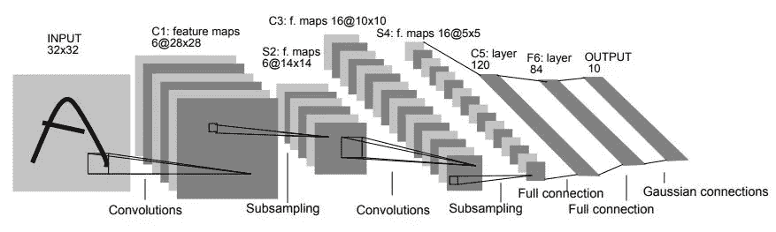

# TensorFlow vs PyTorch —卷积神经网络(CNN)

> 原文：<https://towardsdatascience.com/tensorflow-vs-pytorch-convolutional-neural-networks-cnn-dd9ca6ddafce?source=collection_archive---------16----------------------->

## CNN 在 TensorFlow 和 PyTorch 中对一个著名数据集的实现及结果比较

在我之前的[文章](/tensorflow-vs-pytorch-linear-regression-e07781a83525)中，我已经给出了一个 ***简单线性回归*** 在 ***TensorFlow*** 和 ***PyTorch*** 框架中的实现，并比较了它们的结果。在本文中，我们将使用两种框架在一个非常著名的时尚 MNIST 数据集上完成卷积神经网络(CNN)的应用，并比较结果。

# 起源—

让我们简要了解一下框架及其历史。首先， *PyTorch* 是基于 Torch 库的开源机器学习库。PyTorch 最初是由脸书的人工智能研究实验室(FAIR)开发的。它是免费的开源软件。

另一方面， *TensorFlow* 由*谷歌大脑*团队开发，用于谷歌内部研究目的。它广泛用于机器学习应用，如神经网络。它也是免费的开源软件。

为了了解哪种框架更有效、更简单，我们将使用这两种框架构建一个 ConvNet，并对它们进行比较。对于张量流，我们将使用 Keras 库。

## 问题—

为了比较这两个框架，我们将使用著名的[时尚-MNIST](https://github.com/zalandoresearch/fashion-mnist) 数据集。它是由 60，000 个样本的训练集和 10，000 个样本的测试集组成的 Zalando 文章图像的数据集。每个例子是一个 28×28 的灰度图像，与来自 10 个类别的标签相关联，例如衬衫、包、凉鞋、外套、运动鞋等。我们将使用两种框架构建一个具有 LeNet 通用架构的 CNN 网络，并比较它们的结果。

# 步骤 1:导入库

第一步，我们将导入 TensorFlow 和 PyTorch 框架所需的库。

导入库

# 步骤 2:获取和拆分数据集

下一步，我们将获得时尚 MNIST 数据集。由于它是一个非常常见的数据集，两个框架都预加载了一些功能，使我们能够下载并使用数据集。

## PyTorch

在 PyTorch 中，内置模块用于加载数据集。由于我们需要张量形式的数据，通过使用`torchvision.transforms.ToTensor()`将数据转换成张量，并将其赋给变量`transforms.` ，然后使用`torchvision.datasets`下载数据。数据相应地被分成训练数据集和测试数据集。

## 张量流

另一方面，与 PyTorch 版本相比，使用 TensorFlow 从 keras 库中获取数据更加简单。数据集从`keras.datasets`加载，并相应地分成训练图像和测试图像。

# 步骤 3:加载数据

在这一步中，我们将把数据加载到训练集和测试集中。此外，我们还将查看图像在两个框架中是如何存储的。

## PyTorch


在 PyTorch 中，图像存储在范围 0-1 中，因此图像以黑白显示。使用`DataLoader`功能将图像加载到 train_loader 和 test_loader 中。此外，还会打印图像的标签。

## 张量流


另一方面，TensorFlow 存储 0–255 范围内的图像，因此同一图像中存在颜色渐变。TensorFlow 加载数据的方法更简单。

# 步骤 4:构建模型

在这一步，我们将建立 CNN 模型。为此，我们将构建标准的 LeNet-5 架构，这是一个非常简单的架构，建于 1998 年。下面给出的是 LeNet-5 的架构。



([来源](https://engmrk.com/lenet-5-a-classic-cnn-architecture/))

## PyTorch

在这里，我们使用 PyTorch 框架构建 LeNet-5 架构。它具有 2 个卷积层，每个卷积层之后是平均池层、2 个全连接层和具有 10 个类别的最终输出分类器层，因为最终输出具有 10 个类别的时尚项目。

在这种情况下，通过创建一个特殊的类“NeuralNet”来构建模型，其中我们必须使用 __init__ 方法来定义网络/模型的每一层。将此函数***‘forward’***调用很重要，因为这将覆盖`nn.Module`中的基本 forward 函数，并允许所有`nn.Module`功能正常工作。

## 张量流

另一方面，在 TensorFlow 中构建相同的模型不需要创建类，即使我们使用了`Sequential()`方法。我们发现，使用 TensorFlow 框架构建相同的模型比直接在 PyTorch 框架中构建相同的模型要简单明了得多。

# 步骤 5:可视化模型

在这一步中，我们将编译上一步中构建的模型，并设置优化器和损失函数。为此，在两个框架中，我们将使用 ***Adam*** 优化器和 ***分类交叉熵*** 损失函数，因为数据集中有 2 个以上的类。

## PyTorch

在 PyTotch 中，我们首先创建一个在最后一步中构建的' *NeuralNet* '模型的实例作为`modelpy`。然后，我们将优化器和损失函数分配给相应的变量。然后我们通过打印`modelpy`来可视化模型。

## 张量流

另一方面，在 TensorFlow 框架中，我们使用了`compile()` 函数，在该函数中，我们将如上所述定义优化器和损失函数。然后我们使用`summary()`来查看上面构建的 LeNet-5 架构的层。

# 步骤 6:训练模型

在这一步中，我们根据训练集中的数据部署为训练而构建的模型。对于这两个框架，我们将为 30 个时期*训练模型，并查看结果。*

## *PyTorch*

*对于 PyTorch，我们必须单独计算所有步骤，包括损失函数、优化器、反向传播和更新循环 的 ***中的每一步。****

## *张量流*

*在 TensorFlow 中，时尚 MNIST 是一个二维数组，我们必须将训练数据集整形为张量，并将标签从整数转换为二进制类矩阵。使用`fit()`函数对模型进行训练，该函数由定义的历元数组成。*

# *第七步:比较结果*

*在最后一步，我们将比较使用测试集上的框架构建的两个模型的结果。*

## *PyTorch*

*在 PyTorch 中，输出预测由`outputs = modelpy(images)`预测。然后计算并显示测试集的准确度。*

## *张量流*

*在 TensorFlow 中，`predict()`函数用于预测测试数据集中图像的类别，并计算和显示准确度。*

# *结果*

*测试集由 1000 幅图像组成，基于 PyTorch 和 TensorFlow 框架构建的模型用于预测测试集图像的类别。*

```
*>>Test Accuracy of the model on the 10000 test images: **89%** with PyTorch>>Test Accuracy of the model on the 10000 test images: **91.34%** with TensorFlow*
```

*从结果中我们看到 TensorFlow 模型的测试集准确率为 ***91.34%*** ，比 PyTorch 模型的 ***89%*** 略高。*

# *结论*

*从上面的比较中，我们能够理解使用当今深度学习中使用的两个最流行的框架来构建 CNN 模型。*

*在我看来，如果你是一个初学者，完全不知道使用哪个框架，我建议你从 TensorFlow 框架开始，因为它更简单，更容易理解。另一方面，PyTorch 更快、更动态，但需要对 Python API 有一点了解。*

*我附上了我的 GitHub 库，你可以在那里找到比较的完整代码。*

*[](https://github.com/mk-gurucharan/TensorFlow-vs-PyTorch-CNN) [## MK-gurucharan/tensor flow-vs-py torch-CNN

### GitHub 是超过 5000 万开发人员的家园，他们一起工作来托管和审查代码、管理项目和构建…

github.com](https://github.com/mk-gurucharan/TensorFlow-vs-PyTorch-CNN) 

请查看我以前的文章，在这篇文章中，我给出了构建简单线性回归模型的两种框架的比较。

[](/tensorflow-vs-pytorch-linear-regression-e07781a83525) [## TensorFlow 与 PyTorch —线性回归

### TensorFlow 和 PyTorch 框架中线性回归的实现及其结果的比较

towardsdatascience.com](/tensorflow-vs-pytorch-linear-regression-e07781a83525) 

我真的希望我能够很好地比较今天深度学习中使用的两个最流行的框架。在我的下一篇文章中与大家见面。到那时，快乐的机器学习！*