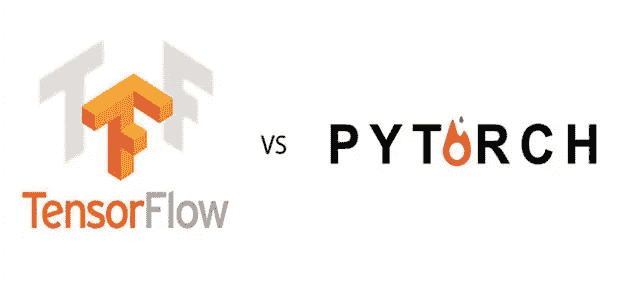

# TensorFlow 与 PyTorch —线性回归

> 原文：<https://towardsdatascience.com/tensorflow-vs-pytorch-linear-regression-e07781a83525?source=collection_archive---------21----------------------->

## TensorFlow 和 PyTorch 框架中线性回归的实现及其结果的比较

如果你是深度学习和神经网络的新手，那么你一定遇到过术语“ **TensorFlow** ”和“ **PyTorch** ”。这是在数据科学领域使用的两个流行的深度学习框架。

在本练习中，我将向您展示使用两种框架实现最简单的 ***神经网络*** ( ***线性回归*** )并比较它们的结果。

## 起源-

*PyTorch* 是基于 Torch 库的开源机器学习库。PyTorch 最初是由脸书的人工智能研究实验室(FAIR)开发的。这是一个免费的开源软件。

另一方面， *TensorFlow* 由*谷歌大脑*团队开发，用于谷歌内部研究目的。它广泛用于机器学习应用，如神经网络。它也是一个免费的开源软件。



TensorFlow vs PyTorch(图片来自[来源](https://medium.com/@UdacityINDIA/tensorflow-vs-pytorch-79e7a23f48c5)

比较两个框架最有效的方法是同时使用它们并分析它们的结果来解决同一个问题。在本练习中，我们将使用 ***TensorFlow*** 和 ***PyTorch*** 框架执行 ***线性回归*** ，并比较它们的结果。

## 问题-

在这个练习中，我们将使用一个非常简单的例子。这里给我们一个数字数组， **x= [-1.0，0.0，1.0，2.0，3.0，4.0]** 和 **y= [-3.0，-1.0，1.0，3.0，5.0，7.0]** 。这里用到的公式是 **y = 2*x -1** ，这是一个线性回归。

```
x= [-1.0, 0.0, 1.0, 2.0, 3.0, 4.0]
y= [-3.0, -1.0, 1.0, 3.0, 5.0, 7.0]y = 2*x -1
```

在使用这两个框架训练线性回归模型时，我们将为 x=10 输入一个新值，并查看模型对 y 的预测。

## 张量流框架-

首先，我们将通过张量流框架。

张量流—线性回归

这是使用 ***keras*** 库用 TensorFlow 执行线性回归的代码。让我们仔细检查上面程序中的每个代码块。

第一步，我们将*导入*库。

```
import tensorflow as tf
import numpy as np
from tensorflow import keras
```

在下一步中，我们使用*序列、*设计我们的模型，它是层的线性堆栈。在这个模型中，我们只使用了一层(神经元)。

```
model = tf.keras.Sequential([keras.layers.Dense(units=1, input_shape=[1])])
```

第二步，我们定义我们的*优化器*和*损失*函数来训练我们的神经网络模型。在此，我们使用随机梯度下降( ***SDG*** )优化器和均方误差( ***MSE*** )作为我们的损失函数。

```
model.compile(optimizer='sgd', loss='mean_squared_error')
```

这一步之后，我们用两个变量"***【xs】***"和" ***ys*** "初始化我们的数字。

```
xs = np.array([-1.0,  0.0, 1.0, 2.0, 3.0, 4.0], dtype=float)
ys = np.array([-3.0, -1.0, 1.0, 3.0, 5.0, 7.0], dtype=float)
```

在最后一步，我们用变量“xs”和“ys”来拟合我们的模型。我们用 ***500 个历元*** 训练模型。

```
model.fit(xs, ys, epochs=500)>>Epoch 500/500
1/1 [==============================] - 0s 1ms/step - loss: 5.1584e-05
```

在这最后一步，我们预测新的 ***xs = 10*** 的值。根据公式，y=2*x-1，对于 xs=10，我们得到一个值 ***19*** 。现在让我们看看我们的模型使用 TensorFlow 框架预测创造了什么价值。

```
print(model.predict([10.0]))>>[[**18.979048**]]
```

我们看到，使用 TensorFlow 框架设计的线性回归模型，我们得到了接近 19 的值。

## PyTorch 框架

现在让我们看看使用 PyTorch 框架设计的线性回归模型。

PyTorch —线性回归

与 TensorFlow 模型相比，线性回归的 PyTorch 应用确实*大*且*复杂*。让我们分析模型的每一步。

第一步，我们*导入*设计线性回归模型所需的库。

```
import torch
from torch.autograd import Variable
```

在下一步中，我们将初始化与 TensorFlow 模型中定义的“***【xs】***”和“ ***ys*** ”相同的值。对于 PyTorch 应用程序，我们使用适当的函数将列表转换为张量**。**

```
**xs = [[-1.0],  [0.0], [1.0], [2.0], [3.0], [4.0]]
ys = [[-3.0], [-1.0], [1.0], [3.0], [5.0], [7.0]]
xs = Variable(torch.Tensor(xs))
ys = Variable(torch.Tensor(ys))**
```

**在这之后，我们定义一个类' **LinearRegressionModel** '，我们将使用它来定义我们的模型。由于这是一个具有 1 个输入和 1 个输出的简单线性回归，我们使用输入和输出维度都等于 1 的线性模型。最后，我们使用上面定义的类创建一个“ ***模型*** ”。**

```
****class** **LinearRegressionModel**(torch.nn.Module): 

    **def** __init__(self): 
        super(LinearRegressionModel, self).__init__() 
        self.linear = torch.nn.Linear(1, 1)  *# One in and one out* 

    **def** forward(self, x): 
        y_pred = self.linear(x) 
        **return** y_pred 

model = LinearRegressionModel()**
```

**接下来，我们选择优化器和损失标准。我们选择了与 TensorFlow 应用程序相同的函数，即优化器的 ***SDG*** 函数和损失函数的 ***MSE*** 。此外，我们任意地将*学习率*固定为 0.01。**

```
**criterion = torch.nn.MSELoss(size_average = **False**) 
optimizer = torch.optim.SGD(model.parameters(), lr = 0.01)**
```

**我们现在到达我们的训练步骤。在这一阶段，我们为 ***500*** 迭代执行三项任务，因为我们将历元值设置为 500。**

1.  **通过传递数据并预测每个 xs 的 ys 值，执行*正向传递*。**
2.  **使用 MSE 损失函数计算*损失*。**
3.  **将所有梯度重置为 0，执行*反向传播*，最终更新权重。**

```
****for** epoch **in** range(500): 

    *# Forward pass: Compute predicted y by passing* 
    *# x to the model* 
    pred_y = model(xs) 

    *# Compute and print loss* 
    loss = criterion(pred_y, ys) 

    *# Zero gradients, perform a backward pass,* 
    *# and update the weights.* 
    optimizer.zero_grad() 
    loss.backward() 
    optimizer.step() 
    print('epoch **{}**, loss **{}**'.format(epoch, loss.item()))>>epoch 499, loss 5.151434834260726e-13**
```

**最后，我们使用这个模型预测新的 xs=10 的值。如前所述，我们必须得到一个接近 19 的值。现在让我们看看 PyTorch 模型的输出。**

```
**new_var = Variable(torch.Tensor([[10.0]])) 
pred_y = model(new_var) 
print(model(new_var).item())>>**18.999998092651367****
```

**我们看到使用 PyTorch 框架构建的线性回归模型也给出了接近 19 的值。**

## **比较-**

**在可视化从 TensorFlow 和 PyTorch 模型获得的结果时，我们看到 TensorFlow 模型给我们的结果是 ***18.979048*** ，而 PyTorch 模型给我们的结果是***18.998092651367*。****

*****张量流模型— 18.979048*****

*****PyTorch 型号—18.99998092651367*****

**可以清楚地看到，使用 PyTorch 框架构建的非常简单的神经网络比使用 TensorFlow 框架构建的模型具有更高的精确度。然而，PyTorch 模型本质上更复杂，初学者很难理解。**

**如果你对深度学习和神经网络完全陌生，我会建议你们从 TensorFlow 框架开始，然后在获得前者的经验后再转向 PyTorch 框架。**

**我附上了代码的详细版本。ipynb ),供您参考。**

**[](https://github.com/mk-gurucharan/TensorFlow-vs-PyTorch-Linear-Regression-/) [## MK-gurucharan/tensor flow-vs-py torch-线性回归-

### 这个库包含使用 TensorFlow 对 Python 中的数组执行线性回归的基本代码…

github.com](https://github.com/mk-gurucharan/TensorFlow-vs-PyTorch-Linear-Regression-/) 

我希望我能够使用今天在深度学习中使用的两个最流行的框架来解释和演示简单神经网络(线性回归模型)的实现。到那时，快乐的机器学习！**